# 如何使用金恩钱包—第一部分

> 原文：<https://medium.com/coinmonks/how-to-use-the-enjin-wallet-part-i-fc728681a5e3?source=collection_archive---------2----------------------->

金恩钱包是一款面向加密货币用户的多币种移动钱包。它向其钱包用户提供各种有吸引力的特征和服务。在本文中，我们将解释如何创建、导入和监视钱包。

金恩钱包由金恩私人有限公司于 2018 年 1 月推出。该钱包旨在提供高水平的安全性以及对多种数字货币的支持。

## **关于金恩**

іѕ金恩是全球 lаrgеѕt оnlіnе gаmіng 社区平台之一，拥有超过 1800 万注册游戏玩家。该平台于 2009 年启动。它支持 250，000 个游戏社区，涵盖数千款游戏，每月全球浏览量达 6000 万次。它允许用户创建可以在多个游戏中使用的数字收藏品。用户可以在金恩市场交易这些收藏品。

## **支持的加密货币**

*   以太坊
*   比特币(BTC)
*   莱特币
*   金恩硬币(ENJ)
*   ERC20
*   ERC721
*   ERC1155 代币
*   ERC223 令牌，因为 ERC20 令牌向后兼容。

## **Enjіn 钱包 sесurіtу**

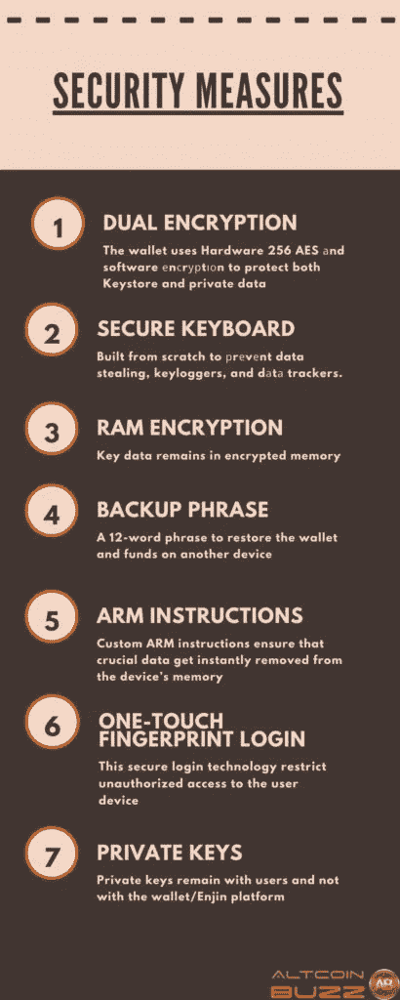

## **金恩钱包功能**

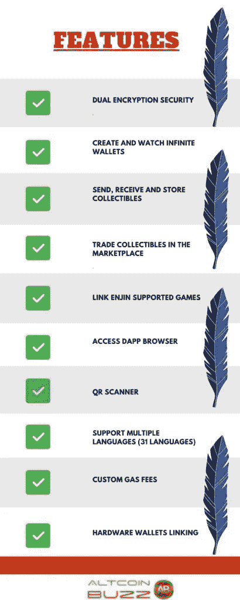

## **安装指南(手机钱包)**

用户可以从谷歌 Play 商店(Android)下载金恩钱包移动应用程序。

下载钱包的官网链接是[这里是](https://enjin.io/wallet)。

**重要提示:** *从谷歌 Play 商店下载任何移动钱包应用程序时，建议您检查应用程序下载次数、评论和评级状态。这样，您可以保护自己免受互联网上各种钓鱼应用程序的攻击。*

安装后，会出现一个弹出窗口，让您执行与 wallet 安装相关的三个不同活动。

*   创建钱包
*   导入钱包
*   小心钱包

如果您是新用户，请选择**创建钱包**。

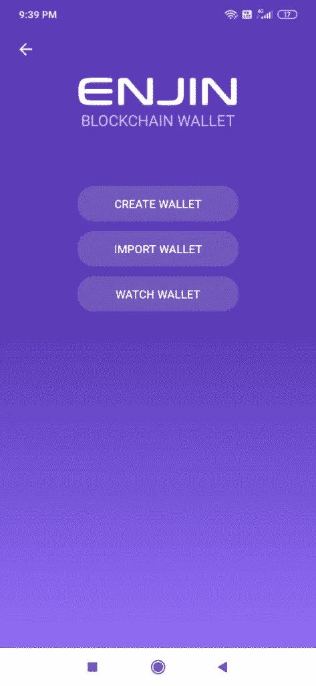

它会要求你设置一个钱包密码，并会给你一个硬币列表，让你从中选择你想保留/观看的硬币。

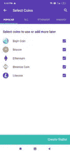

密码设置后，应用程序将显示一个 12 个字的关键短语，您需要安全地存储它。最后一步，app 会要求你验证一些关键短语，让你使用钱包。

钱包登录页面将如下所示。

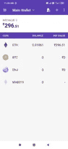

## **钱包地址(以太坊地址)**

要查看您钱包的以太坊地址，您需要选择 ETH 令牌或 ENJ 令牌，然后点击**接收资金**图标。它会告诉你地址。

重要提示: *金恩硬币(ENJ)是基于以太坊的，所以它们共享同一个地址。*

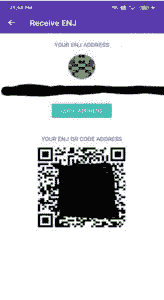

你可以在金恩钱包里找到很多功能。让我们逐一讨论。

## **添加联系人**

此选项允许您保存联系信息，即用户的公共地址及其姓名。这个功能很好，因为当你想转移硬币时，你不需要一次又一次地复制地址。

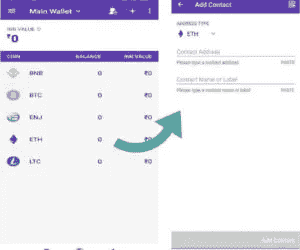

## **添加硬币**

此选项允许您将任何代币/自定义代币添加到现有的钱包硬币列表中。

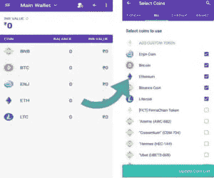

## **创建钱包**

此选项允许您创建/设置钱包。不要被**这个名字搞糊涂了，创造一个钱包**。金恩钱包允许您在一个应用程序中设置多个钱包。如果你打算系统地组织你的投资组合，这个特性会很有帮助。通过创建多个钱包，您可以将资金分成不同的部分，即储蓄、交易和其他部分。此外，所有这些不同的帐户都可以通过一个应用程序访问。

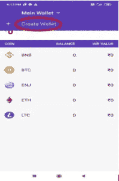

## **导入钱包**

“导入钱包”选项允许您导入不同类型的钱包以及硬件钱包。这些功能也是独一无二的，因为通过将硬件钱包嵌入到您的金恩钱包中，您可以轻松查看硬件钱包余额以及 Ledger、Trezor 和其他硬件钱包等设备的交易。

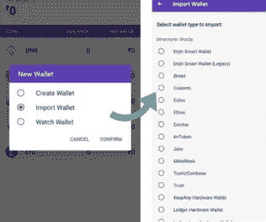

## **手表钱包**

使用这个选项，您可以跟踪任何 BTC，联邦理工学院，BNC，或 LTC 地址，并观察他们的所有交易实时。

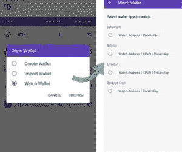

在本系列的第 2 部分，我们将继续深入探索金恩钱包。我们将探索收藏品、扫描 QR、交换、市场、dApp 浏览器、链接应用和设置等功能。

**资源:** [金恩白皮书](https://cdn.enjin.io/downloads/whitepapers/enjin-coin/en.pdf)

**阅读更多:** [如何使用信托钱包——第二部分](/coinmonks/how-to-use-trust-wallet-part-ii-68fde550c69)

***注:*** *本帖首发* [*此处*](https://www.altcoinbuzz.io/bitcoin-and-crypto-guide/how-to-use-the-enjin-wallet-part-i/) *上*[***altcoinbuzz . io***](http://www.altcoinbuzz.io/)*。*

**通过我的推荐加入**

[Crypto.com](https://binance.com/en/register?ref=E8PCD3AF)——[币安](https://platinum.crypto.com/r/sut3pd9bzn)

跟我来

**👉** [推特](https://twitter.com/rumadas123)

**👉** [Linkedin](https://www.linkedin.com/in/ruma-das-a1439320/)