# 如何使用前沿钱包

> 原文：<https://medium.com/coinmonks/how-to-use-the-frontier-wallet-34bd644f957a?source=collection_archive---------3----------------------->

## Frontier 是一款简单安全的钱包，允许用户通过一个移动应用程序访问多个钱包，而无需交出您的私钥。

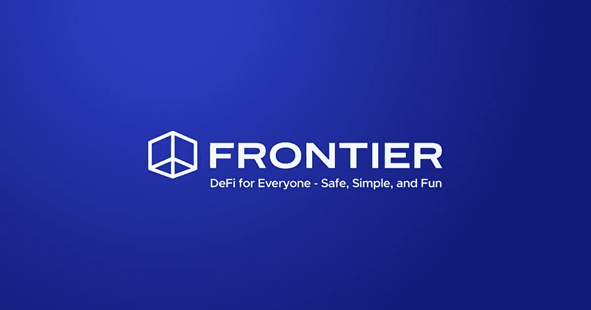

Frontier 是一个非托管的统一钱包，允许用户通过一个移动应用程序跨 Defi 协议跟踪、查看和管理他们的资产和贷款头寸。

它本身支持多种移动钱包应用程序，如 Trust Wallet、MetaMask Mobile、Fortmatic 和比特币基地钱包。

目前，它支持以下协议:

*   [马克尔道](https://makerdao.com/en/)
*   [复合金融](https://compound.finance/)
*   [Uniswap](https://uniswap.org/)
*   [频段协议](https://bandprotocol.com/)
*   [合成酶](https://www.synthetix.io/)
*   [卡瓦](https://www.kava.io/)
*   [dYdX](https://dydx.exchange/)
*   [诺网](https://www.nuo.network/)

钱包支持手机智能 Defi 通知，提醒用户:

*   每一笔进出交易
*   DEX 交易警报
*   与智能合同的交互
*   反清算警报
*   稳定费用变化

钱包还支持许多其他代表用户的通知。

它还允许用户将他们的令牌与不同的可用验证器绑定，并从中获得奖励。

**安装指南(手机钱包)**

用户可以从谷歌 Play 商店(Android)下载 Frontier wallet 移动应用程序。

**重要提示:** *从谷歌 Play 商店下载任何移动钱包应用程序时，建议您随时查看应用程序下载次数、评论和评级状态。这样，您可以保护自己免受互联网上各种钓鱼应用程序的攻击。*

安装后，将出现一个弹出窗口，让您执行与 wallet 安装相关的三个不同活动。

*   观察和管理
*   导入钱包
*   创建一个多硬币钱包

## **创建钱包**

如果您是新用户，请选择**创建多硬币钱包**。

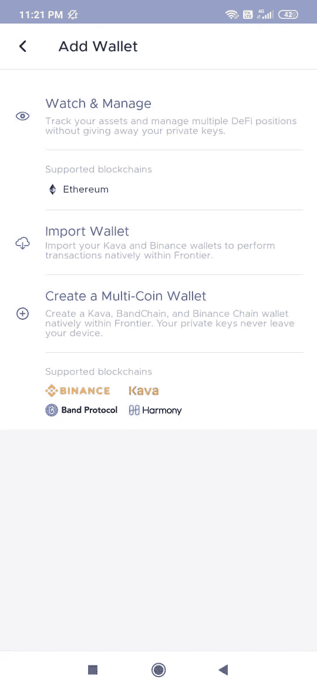

它会要求您设置钱包密码。pin 码设置后，应用程序将显示一个 12 个字的关键短语，您需要安全地存储它。最后一步，应用程序会要求你验证一些关键短语，然后让你使用钱包。

钱包登录页面将如下所示。

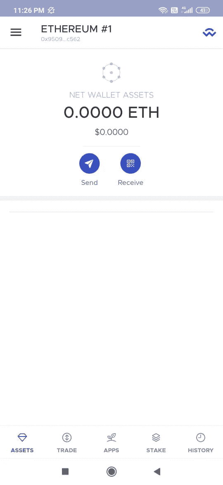

## **导入钱包**

“导入钱包”选项允许您导入不同类型的钱包，如以太坊、卡瓦、币安、乐队、和谐和埃尔隆德。

用户需要提供他们想要导入的 12 个字的备份短语、密钥库、私钥或钱包地址。提供正确的详细信息，您的钱包将被导入。

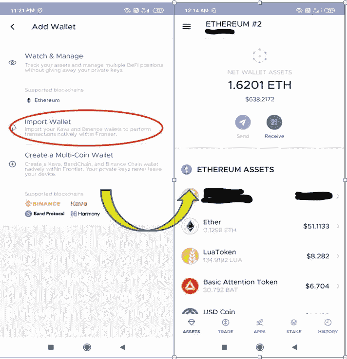

**重要提示:**如果您通过提供地址进行导入，钱包将以只读模式创建。因此，您将无法使用该设置进行交易。

钱包登录页面包含关于各种代币的详细信息，即用户持有的资产。

## **手表&管理钱包**

“监视和管理钱包”选项允许您跟踪您的资产，而无需共享您的私钥。

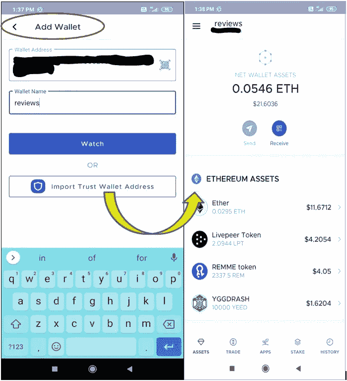

## **换钱包**

“更改钱包”选项卡允许您在钱包应用程序中从一个帐户切换到另一个帐户。您可以查看和选择可用的帐户，并使其成为主要钱包或删除它，如果你想要的。

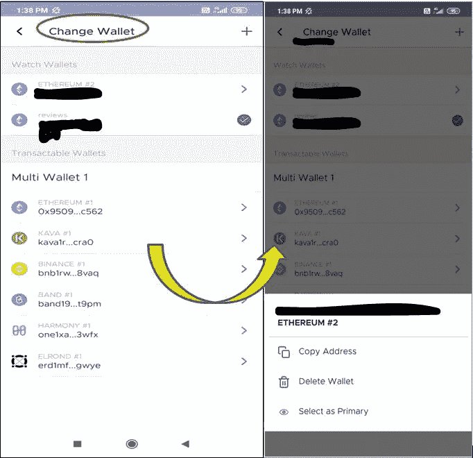

## **发送**

发送选项允许您向另一个帐户发送令牌。输入收件人的地址以及令牌类型和值。

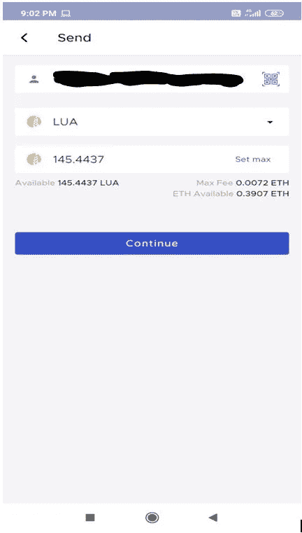

**接收**

通过此选项，您可以共享您的公共地址和二维码来接收令牌。

Frontier Wallet 允许您通过 Twitter、Telegram、Whatsapp 等许多社交平台分享您的地址。

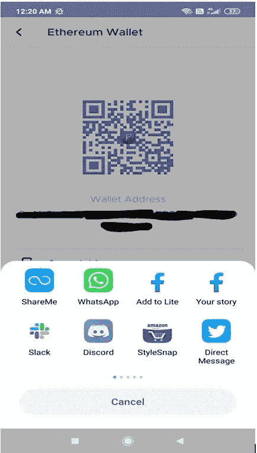

## **贸易**

用户可以通过该标签进行代币交易。目前，该平台支持 ETH、USDC 和 USDT 作为基础货币，每种基础货币都有大量代币支持，允许您购买/出售代币。

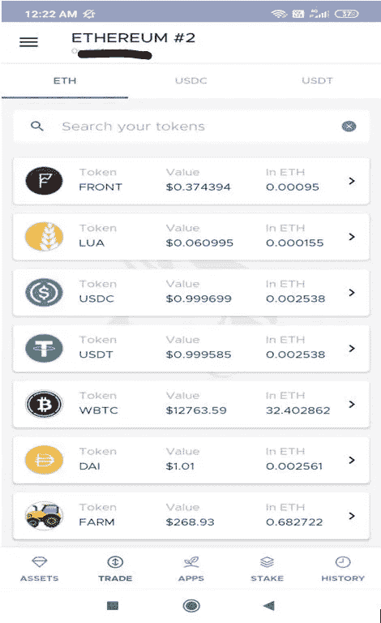

## **购买**

您可以在这里购买代币，首先，选择基础货币选项卡，然后选择您想要购买的代币。

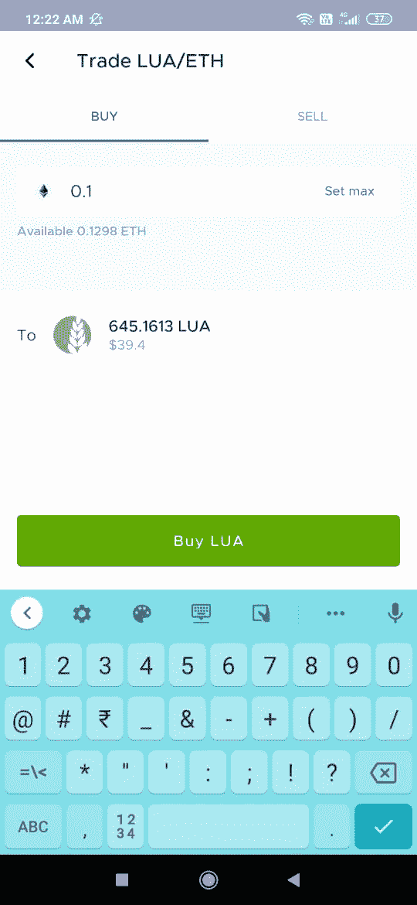

## **出售**

你也可以卖掉你的代币。首先，选择“基础货币”选项卡，然后选择您要出售的代币。

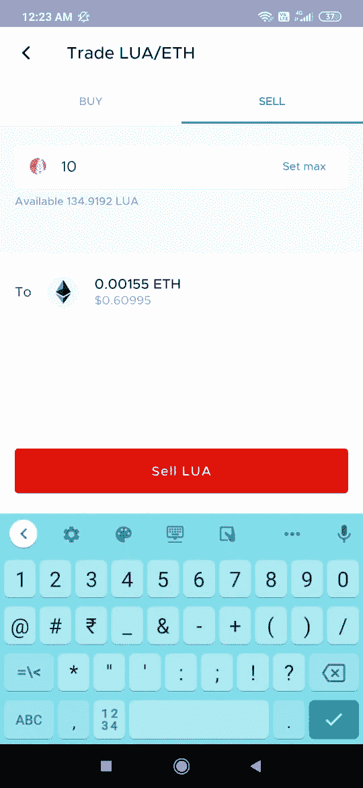

## **应用程序**

Frontier 钱包，原生集成了[向往。金融](https://yearn.finance/)，帮助用户在 [AAVE](https://aave.com/) 、[复利](https://compound.finance/)、 [DDEX](https://ddex.io/) 、 [dY/dX](https://dydx.exchange/) 等领先 Defi 协议中获得高借贷利率。

这个平台支持多个稳定的硬币，如戴，，，，sUSD 和其他几个硬币。

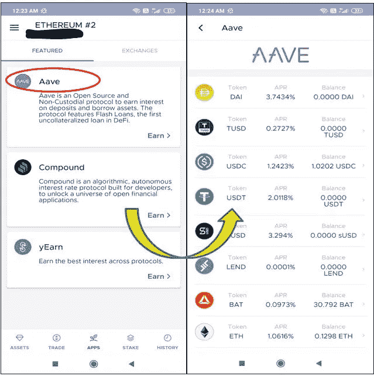

用户可以选择任何可用的代币进行存款，并从中赚取利息。

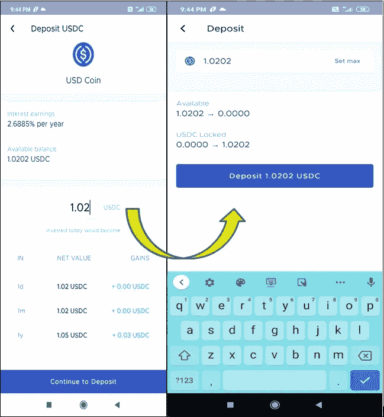

## **桩子**

用户可以下注代币并从中赚取利息。钱包目前支持赌注 Matic 硬币，并由七个 [Matic](https://matic.network/) 验证器节点支持。

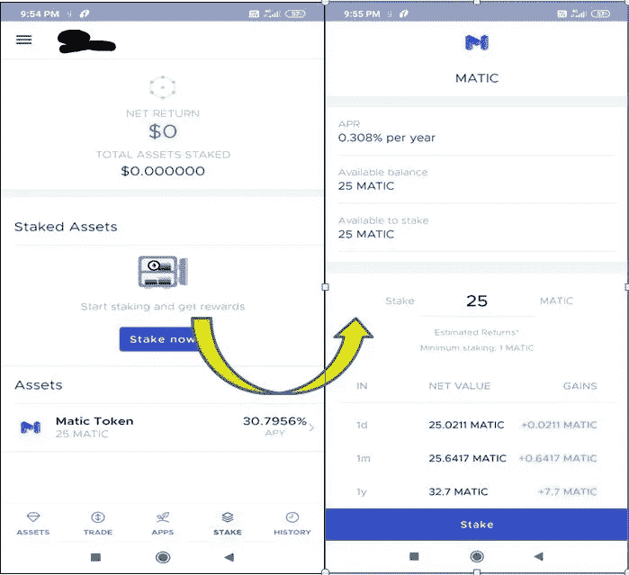

**设置**

“设置”选项卡包含支持论坛链接、安全性和法律政策详细信息。

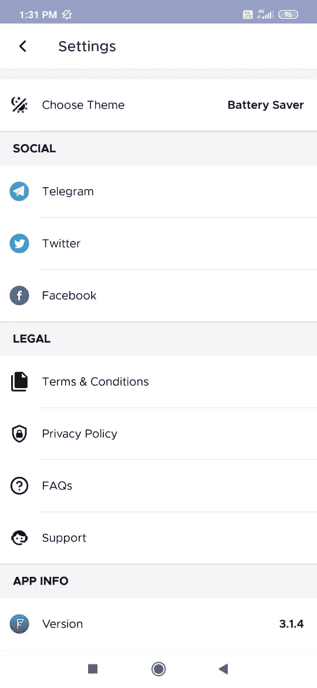

## **历史**

该选项卡包含用户所做交易的详细信息。

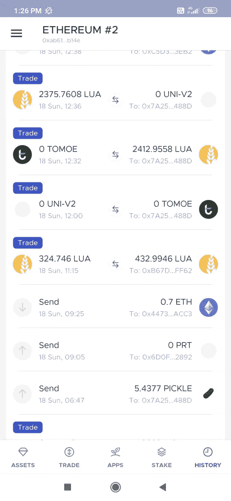

## **结论**

Frontier 是一款多功能钱包，用户界面简单。它为 Defi 用户提供了一个一站式平台，让他们可以从一个协议跳到另一个高利率协议，同时跟踪他们的投资组合。这是非常重要的，特别是对于新的加密用户来说，可以轻松识别低风险的金融产品。

***注:*** *本帖首发* [*此处*](https://www.altcoinbuzz.io/bitcoin-and-crypto-guide/how-to-use-the-frontier-wallet/) *上*[***altcoinbuzz . io***](http://www.altcoinbuzz.io/)*。*

**通过我的推荐加入**

[Crypto.com](https://binance.com/en/register?ref=E8PCD3AF)——[币安](https://platinum.crypto.com/r/sut3pd9bzn)

跟我来吧

**👉** [推特](https://twitter.com/rumadas123)

**👉** [领英](https://www.linkedin.com/in/ruma-das-a1439320/)

**披露—包括附属链接**

 [## 最佳免费加密交易机器人——前 16 名比特币交易机器人[2021]

### 2021 年币安、比特币基地、库币和其他密码交易所的最佳密码交易机器人。四进制，位间隙…

medium.com](/coinmonks/crypto-trading-bot-c2ffce8acb2a)