# 如何使用 MetaMask 以太坊手机钱包

> 原文：<https://medium.com/coinmonks/how-to-use-the-metamask-ethereum-mobile-wallet-e2d3e383213d?source=collection_archive---------0----------------------->

MetaMask 是一个浏览器插件，被用作以太坊钱包。在本文中，我们将解释如何创建和导入 MetaMask 移动钱包，以及使用移动钱包可以实现的不同功能/活动。

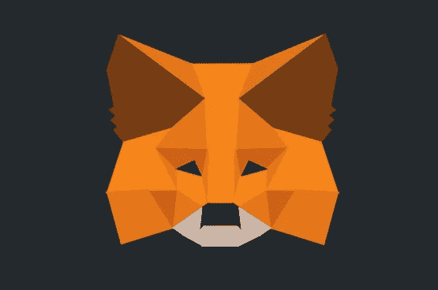

MetaMask 是最著名的浏览器扩展，允许用户存储以太坊和其他 ERC20 令牌，并运行 dApps，而无需作为以太坊节点加入以太坊网络。

2020 年 9 月 3 日，MetaMask 针对 iOS 和 Android 用户推出了一款[手机钱包应用](https://twitter.com/metamask_io/status/1301582662113525761)。

MetaMask 移动用户可以发送和接收数字资产。它们还可以存储不可替换的令牌(NFT)。移动钱包最吸引人的功能之一是同步选项，它允许桌面扩展用户通过扫描二维码将他们的移动钱包与桌面钱包同步。

## **安装指南(安卓手机)**

用户可以从谷歌 Play 商店(Android)下载 [MetaMask](https://metamask.io/) 移动钱包应用程序。

安装后，会出现一个弹出窗口，让您执行与 wallet 安装相关的三个不同活动。

*   创建新钱包
*   使用种子短语导入
*   与元掩码扩展同步

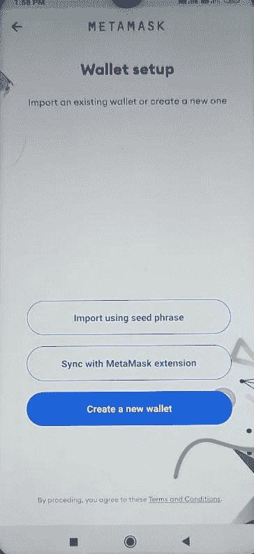

## **创建新钱包**

如果您是新用户，选择**创建新钱包**。

它会要求设置钱包密码。密码设置后，应用程序将显示一个 12 个字的关键短语，您需要安全地存储它。在最后一步，应用程序会要求你验证关键短语，并让你使用钱包。

钱包登录页面将如下所示。

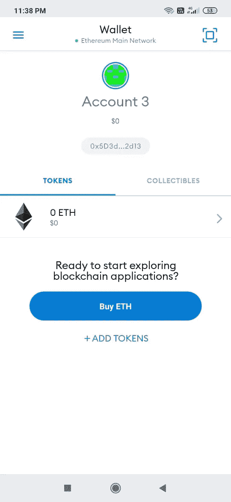

## **导入钱包**

“导入钱包”选项允许您将现有钱包导入新设备。MetaMask 为您提供了通过提供私钥或扫描二维码来导入钱包的选项。提供正确的详细信息，您的钱包将被导入。

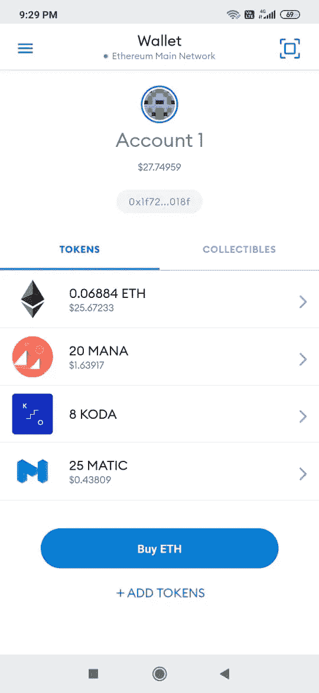

钱包登录页面包含用户持有的各种令牌的详细信息。

## **与元掩码扩展同步**

此功能允许您将桌面扩展帐户导入到此设备。

要将分机与手机连接，请按照以下步骤操作:

1.  在桌面上打开扩展
2.  转到设置->高级
3.  点击与手机同步
4.  扫描二维码开始同步

**注意:**将桌面浏览器扩展与移动钱包同步将删除您现有的所有移动钱包帐户。

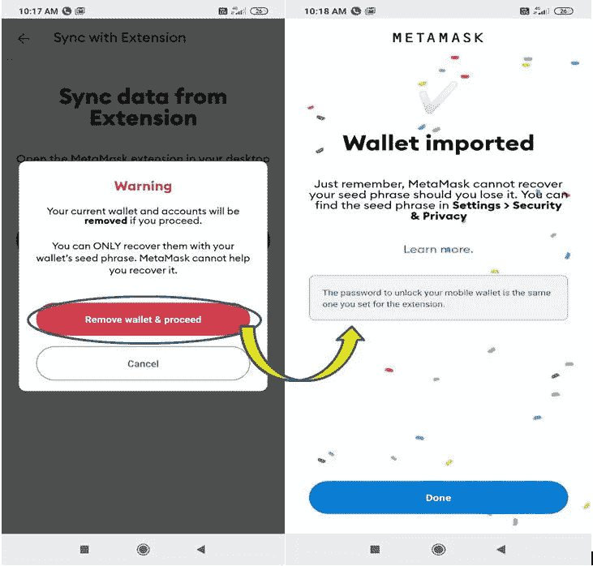

## **发送**

发送选项允许您向另一个帐户发送令牌。输入收件人地址以及令牌类型和值。

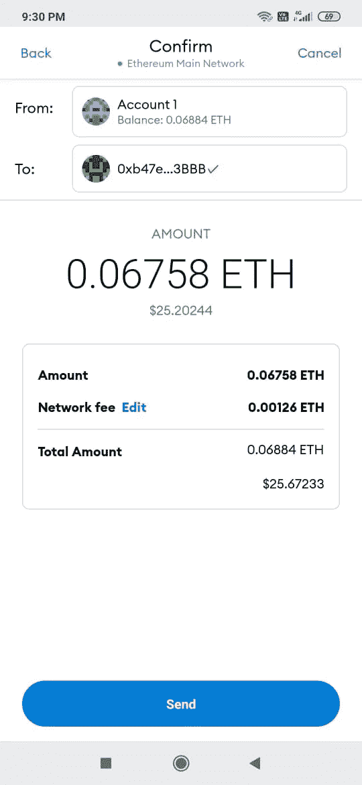

## **接收**

通过此选项，您可以共享您的公共地址和二维码来接收令牌。

MetaMask 允许你通过 Twitter、Telegram、Whatsapp 等许多社交平台分享你的地址。

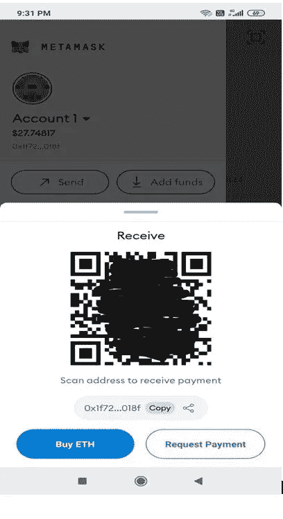

## **添加令牌**

此选项允许您向现有钱包添加任何令牌/自定义令牌。要添加自定义令牌，请通过提供令牌的合同地址进行搜索。

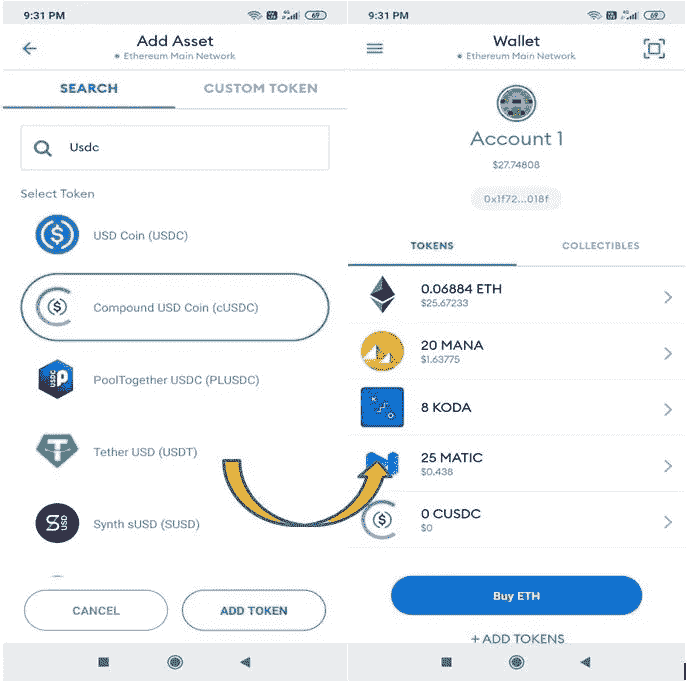

## **收藏品**

此选项卡包含用户持有的不同收藏品(ERC-721 代币)的详细信息。使用 MetaMask 移动钱包，您可以发送、接收和添加收藏品。

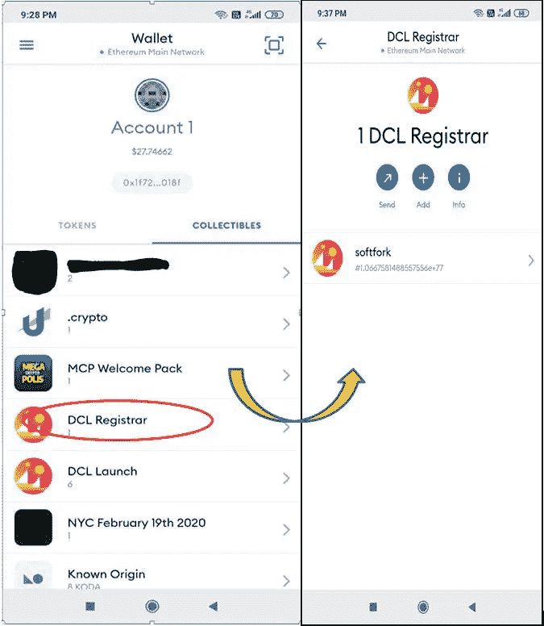

## **浏览器**

该选项允许您与平台支持的不同的分散式应用程序进行交互。如果你浏览 dApp 浏览器，你可以很容易地看到大量的应用程序，它们被分为七个不同的主要部分:

*   挑战
*   交换
*   艺术和收藏品
*   获取加密
*   市场
*   社会的
*   开发者工具

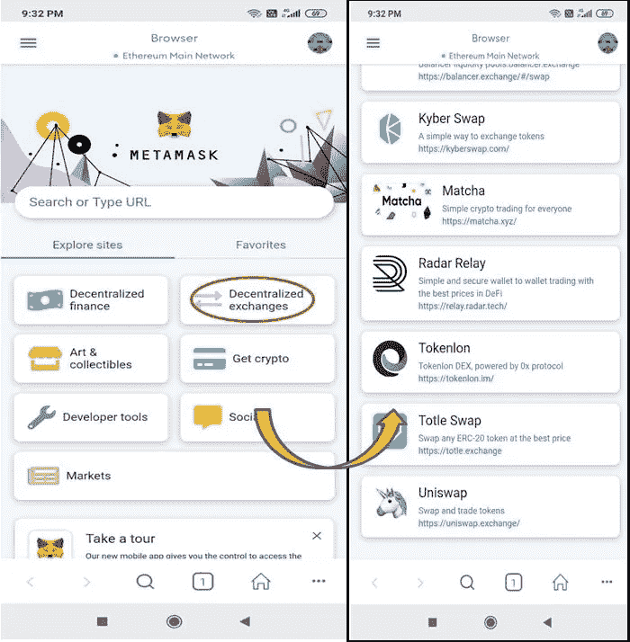

## **交易历史**

该选项卡包含用户所做交易的详细信息。

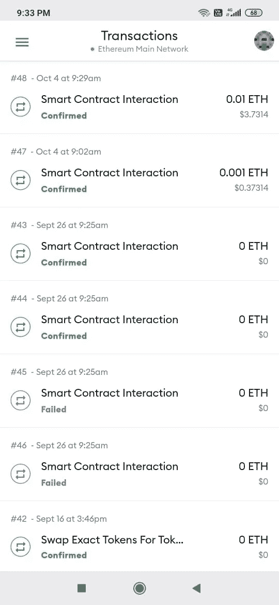

## **设置**

**设置**选项卡允许您进行各种设置和管理相关的工作，如管理钱包和联系人、[私钥](/coinmonks/a-guide-on-private-keys-254a95cf3037)、种子短语、隐私设置、语言和货币偏好、自定义网络设置、walletconnect 等等。

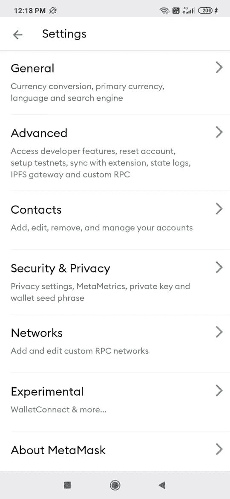

## **与 Uniswap 连接**

MetaMask 移动钱包允许用户通过 walletconnect 连接 Uniswap 和其他 dApps。

按照以下步骤连接到 Uniswap:

导航至分散式交易所。

转到移动钱包应用程序中的浏览器选项卡，选择分散交换。

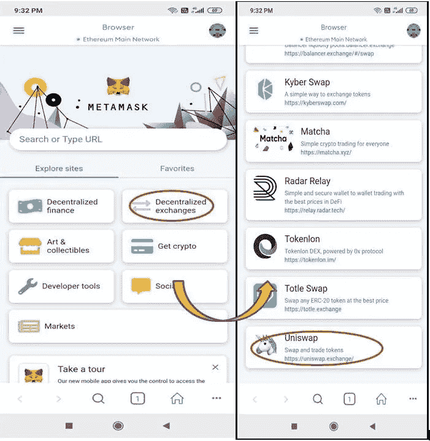

选择 Uniswap

将打开 Uniswap 登录页面。

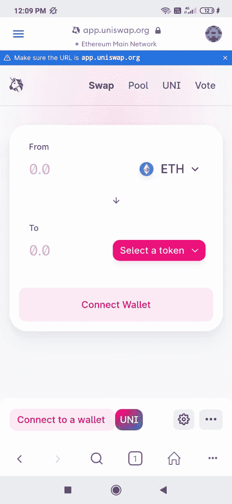

连接你的钱包。

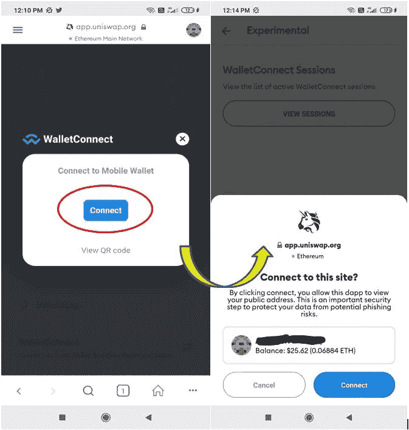

Walletconnect 是用 Uniswap 完成的。现在，您可以在 Uniswap 平台上执行任何操作。

平台操作(swap)

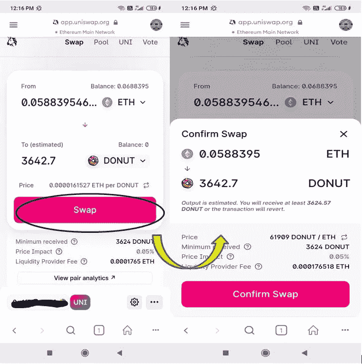

如果您对交易参数感到满意，请单击确认交换。之后，交易将被提交。

## **结论**

毫无疑问，MetaMask 是目前区块链市场上最著名的以太坊钱包。手机钱包应用的推出是迈向大规模应用的最大一步。现在，您无需台式机/笔记本电脑即可访问该应用程序。移动应用程序将增加平台的可访问性，并将使用户的交易体验更简单。

**阅读更多:** [如何使用信托钱包——第二部分](/coinmonks/how-to-use-trust-wallet-part-ii-68fde550c69)

***注:*** *本帖首发* [*此处*](https://www.altcoinbuzz.io/bitcoin-and-crypto-guide/how-to-use-the-metamask-ethereum-mobile-wallet/) *上*[***altcoinbuzz . io***](http://www.altcoinbuzz.io/)*。*

使用我的推荐加入

[Crypto.com](https://binance.com/en/register?ref=E8PCD3AF)——[币安](https://platinum.crypto.com/r/sut3pd9bzn)

跟我来

**👉** [推特](https://twitter.com/rumadas123)

**👉**[**Linkedin**](https://www.linkedin.com/in/ruma-das-a1439320/)