# 如何使用信任钱包-第一部分

> 原文：<https://medium.com/coinmonks/how-to-use-trust-wallet-part-i-7f5771f1d25e?source=collection_archive---------1----------------------->

## *Trust Wallet 是一款手机钱包应用，支持以太坊和 ERC20/ERC223 令牌。在本文中，我们将详细介绍如何使用该平台及其吸引人的特性。*

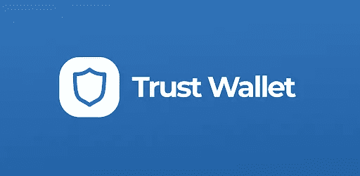

[Trust Wallet](https://trustwallet.com/) 是一款开源的移动钱包应用，允许你发送、接收和存储加密货币。它有一个内置的 Web3 浏览器，允许用户直接从 Trust Wallet 应用程序中浏览 dapp。Trust Wallet 通过与 Kyber Network 的合作，提供了一个内置的分散式交易所。

公司成立于 2017 年，后于 2018 年 7 月 31 日被[币安](https://www.binance.com/en)收购。该应用程序适用于 Android 和 iOS 设备。

**关键亮点**

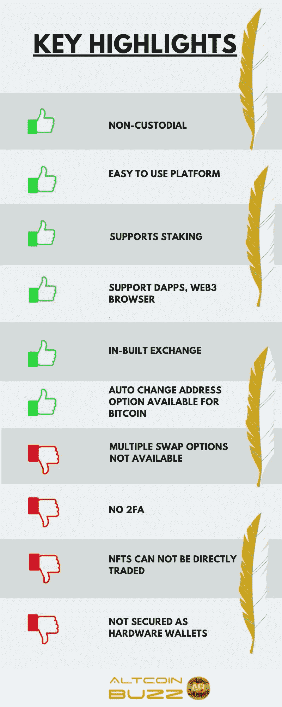

**安装指南(手机版)**

从[谷歌 Play 商店](https://play.google.com/store/apps/details?id=com.wallet.crypto.trustapp&referrer=utm_source%3Dwebsite)下载应用程序。

应用程序启动页面如下所示。它将为您提供两个钱包设置选项。

1.  创建新钱包
2.  已经有钱包了

如果您是新用户，选择**选项 1** 。

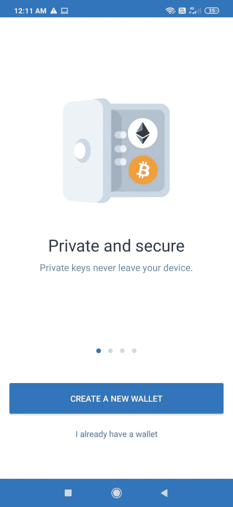

钱包应用程序现在将显示您需要安全存储的 12 个字的备份短语。

应用程序会要求您验证密钥短语，验证通过后，钱包设置就完成了。你现在可以使用钱包了。

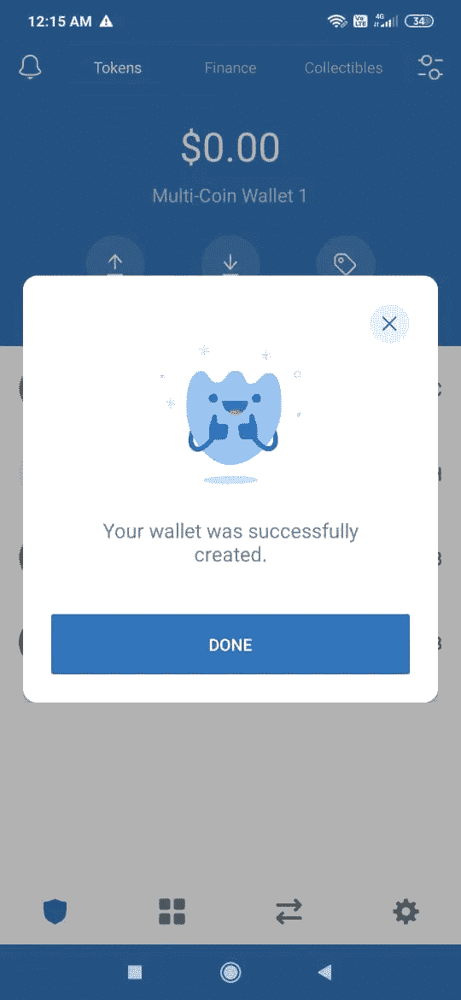

**导入钱包**

如果您已经有一个钱包，并希望将其导入新设备，请选择此选项。

您可以通过选择应用程序启动时的第二个选项或转到:

**设置- >钱包**然后点击( **+** )标志。见下面截图。

您可以导入不同类型的钱包，并且可以在同一个应用程序中保存多个钱包。

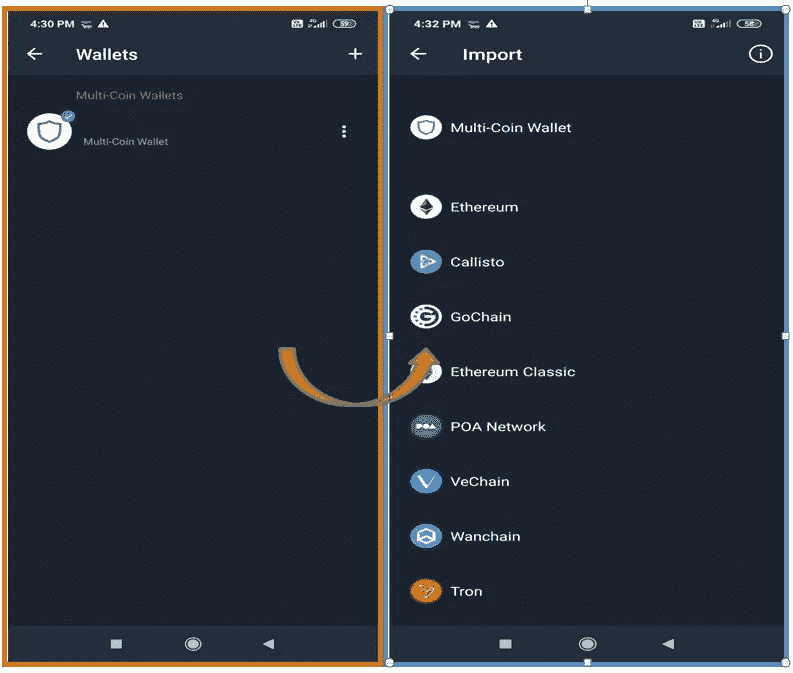

选择所需的钱包类型。应用程序将要求您提供 12 个单词的备份短语。提供正确的详细信息，钱包将被成功导入。

登录页面包含您拥有的代币的详细信息，即您的投资组合。

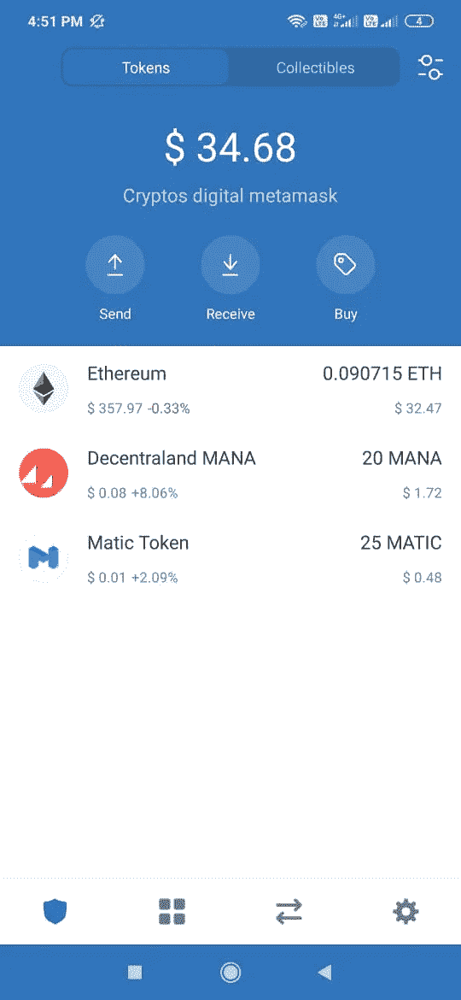

*   **送**

如果您想要将一些令牌转移给用户，请选择此选项。它会问你一些关于交易的细节，比如收款人的地址和转账金额。填写详细信息并继续。

它还提供了扫描 QR 码以检索收件人地址的功能。

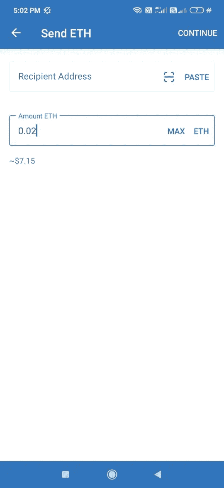

*   **接收**

您可以与其他用户共享您的公共地址和二维码来接收令牌。

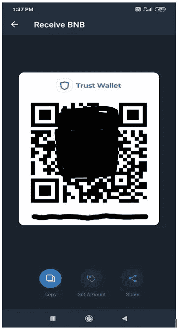

*   **购买**

“购买”选项卡将允许您选择和购买几个代币。购买工具由第三方提供商 [MoonPay](https://www.moonpay.com/) 提供支持。如果你是 MoonPay 平台的新用户，它会询问你的详细信息并验证你的身份。

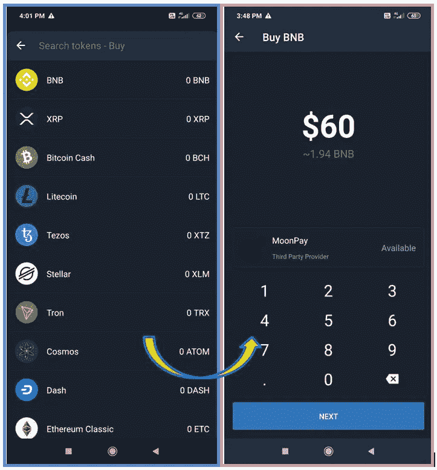

**金融**

信任钱包允许您下注代币。“财务”选项卡包含有关从各种代币赌注收到的年度回报的详细信息。

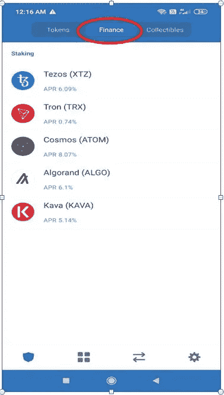

**收藏品**

此选项卡列出了用户持有的不同 NFT 收藏品。

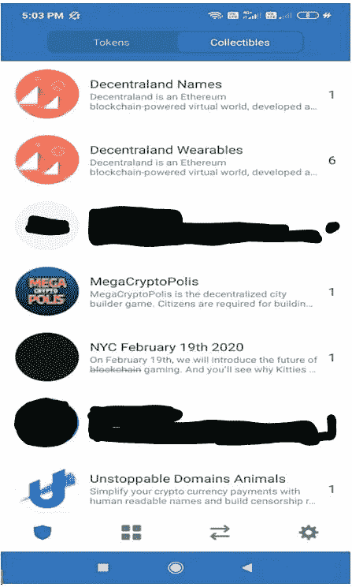

**浏览器**

Trust Wallet 支持全功能的 web3 浏览器，用户可以使用它来访问一系列不同的 dApps、Defi、智能链、游戏、交易等。

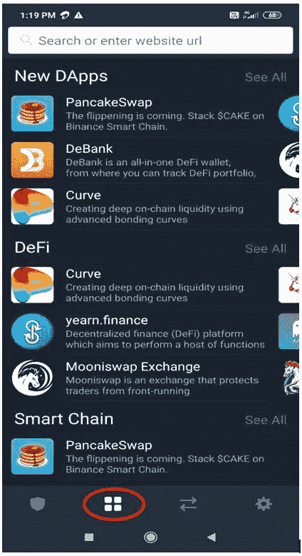

我们将在下一篇文章中介绍 Trust Wallet 应用程序的其余特性。

**资源:**信托钱包官方[网站](https://trustwallet.com/)

**阅读更多:** [保险丝网络概述(FUSE)](/coinmonks/an-overview-of-the-fuse-network-fuse-679c1ff3422d)

***注:*** *本帖首发* [*这里*](https://www.altcoinbuzz.io/bitcoin-and-crypto-guide/how-to-use-trust-wallet-part-i/) *上*[***altcoinbuzz . io***](http://www.altcoinbuzz.io/)*。*

**通过我的推荐加入**

[Crypto.com](https://binance.com/en/register?ref=E8PCD3AF)——[币安](https://platinum.crypto.com/r/sut3pd9bzn)

**跟我来**

**👉** [推特](https://twitter.com/rumadas123)

**👉**[**Linkedin**](https://www.linkedin.com/in/ruma-das-a1439320/)