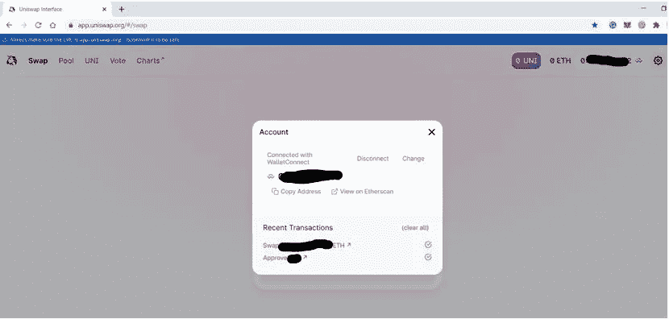

# 如何使用信任钱包-第二部分

> 原文：<https://medium.com/coinmonks/how-to-use-trust-wallet-part-ii-68fde550c69?source=collection_archive---------6----------------------->

*Trust Wallet 是一款手机钱包应用，支持以太坊和 ERC20/ERC223 令牌。在本文中，我们将解释交换、设置和 WalletConnect 特性等功能。*

在我们上一篇关于信任钱包的文章([第一部分](https://ruma-das.medium.com/how-to-use-trust-wallet-part-i-7f5771f1d25e))中，我们已经解释了如何创建钱包、导入钱包以及信任钱包中的一些功能。在本文中，我们将重点关注该平台提供的其余特性。

**互换**

您可以使用交换功能将一个令牌转换为另一个令牌。您只需要填写输入输出令牌对和输入令牌值。它将显示交换后您将获得的代币数量。

**交换**

“兑换”选项卡允许您购买/出售代币。它还显示买入(黄色标记)和卖出(红色标记)汇率。

底部区域包含交易相关的详细信息，如任何未结订单、订单历史、交易历史等。

**设置**

您可以在设置选项卡中进行与帐户设置相关的更改，如外观、命名钱包等。

1.  **钱包**

「公事包」选项可让您重新命名公事包的名称、汇入公事包、建立新的公事包，以及删除公事包。你也可以在这里看到你的出口账户公钥的各种硬币和备份短语。

1.  **邀请朋友**

你可以邀请你的朋友，只要你的朋友购买价值$50+的密码，你们两人就可以获得 125 台币的奖励。只需点击邀请好友标签，你就可以通过 WhatsApp、Telegram、Twitter 等分享你的推荐链接。

1.  **偏好设置**

此选项卡将帮助您更改钱包默认货币选择和 dApp 浏览器设置(启用/禁用、清除缓存)。

1.  **WalletConnect**

如果你认为 WalletConnect 是某种钱包，那你就错了。它不是一个应用程序，也不能在区块链上运行。相反，它是一个开放的协议，允许通过扫描二维码将桌面 dApps 连接到移动钱包。

信任钱包支持 WalletConnect 功能，因此允许钱包用户连接到 dApps 并执行交易。该过程支持端到端加密，而不会暴露任何关键信息([私钥](https://www.altcoinbuzz.io/reviews/crypto-education/a-guide-on-private-keys/))。用户将在其移动设备上收到签署交易请求的通知。

按照以下步骤使用 WalletConnect 选项:

我们试图通过 WalletConnect 连接 Uniswap 网站。

参观 Uniswap [网站](https://app.uniswap.org/#/swap)。

现在点击**连接到钱包**选项。它会给你一个选项列表供你选择。

选择 **WalletConnect。**会出现一个二维码。现在用 Trust Wallet app 中的 WalletConnect 选项扫描这个二维码。

申请需要你的批准。见上面截图。

一旦您批准，信任钱包应用程序将显示一条成功的连接设置消息。

并且类似的设置消息将显示在桌面应用中。

现在，您的钱包已连接，您可以从手机访问 Uniswap。

**社交场合**

[网站](https://trustwallet.com/)

[推特](https://twitter.com/trustwalletapp)

[电报](https://t.me/trust_announcements)

[Github](https://github.com/trustwallet)

[脸书](https://www.facebook.com/trustwalletapp)

[Reddit](https://www.reddit.com/r/trustapp/)

**结论**

信任钱包有一个简单但功能强大的界面。该应用速度快，易于导航。与币安的合作伙伴关系带来了信任，并增加了 exchange 使用的可及性。它还有一个 ERC-721 收藏品的标签。然而，与金恩钱包不同，它不提供多种互换选择。

**资源:**信托钱包官方[网站](https://trustwallet.com/)

**阅读更多:** [保险丝网络概述(FUSE)](/coinmonks/an-overview-of-the-fuse-network-fuse-679c1ff3422d)

***注:*** *本帖首发* [*此处*](https://www.altcoinbuzz.io/bitcoin-and-crypto-guide/how-to-use-trust-wallet-part-ii/) *上*[***altcoinbuzz . io***](http://www.altcoinbuzz.io/)*。*

**通过我的推荐加入**

Crypto.com[币安](https://binance.com/en/register?ref=E8PCD3AF)——

跟我来

**👉** [推特](https://twitter.com/rumadas123)

**👉** [Linkedin](https://www.linkedin.com/in/ruma-das-a1439320/)