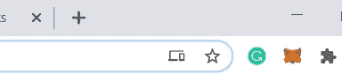
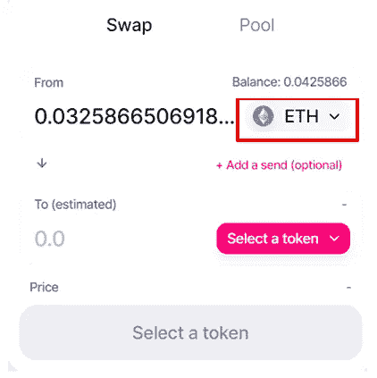

# 如何使用 Uniswap

> 原文：<https://medium.com/coinmonks/how-to-use-uniswap-885bddbc04ed?source=collection_archive---------0----------------------->

Uniswap 为分散交易所提供了急需的推动力。整个加密货币交易生态系统由集中式交易所统治，其中许多交易所提供高流动性和出色的进出匝道平台。嗯，Uniswap 的推出，至少解决了流动性高度分散的问题。

**什么是 Uniswap？**

Uniswap 是一个基于以太坊的**完全去中心化**协议，它通过一个简单的形式化等式提供**自动化流动性**。它建立在**不可升级智能合约**的系统之上。任何人都可以创造新市场，并因此获得回报。它是抵制审查的。

**好处:**

不断增长的流动性

对流动性提供者的奖励

在同一生态系统中交易和持有，并保持分散化(Metamask 与 Uniswap 集成)

【Uniswap 是如何工作的？

资料来源:Uniswap.org

**智能合约:** Uniswap 交易对由后端的单个智能合约运行。每一份智能合约都管理着一个流动性池。

**流动性池:**流动性提供者可以为任意两个 ERC-20 创建配对合同。他们存入等值的基础 ERC-20 代币以换取池代币。

**流动性代币:** Uniswap 向流动性提供者的地址铸造被称为*流动性代币*的特殊代币。这与流动性提供者对资金池的贡献成比例。流动性提供者烧掉这些代币，以交易者支付的费用形式获得激励。他们可以在任何时候赎回任何 ERC 20 资产。

**做市:**对是自动做市商。唯一的条件是需要保留“常数乘积”公式。

**交易:**在 Uniswap 中交易被对换取代。用户指定他想要的输入令牌和输出令牌。他还指定输入令牌的数量。Uniswap 计算用户将收到的输出令牌数量。只需点击一下，就可以进行交换。

费用:交易者为所有交易支付 0.30%的费用。这笔钱被分割了

83.3%(交易额的 0.25%)流向流动性提供者

16.6%(交易额的 0.05%)将用于协议

**如何使用 Uniswap**

安装元掩码(Web 3 钱包)。你可以把它作为谷歌浏览器的扩展来安装。所有的交易都将通过这个分散的钱包进行。

进入[网站](https://uniswap.org/)

点击启动应用程序

您将直接进入交换/池页面。

选择您要使用的 Uniswap 版本。首选版本 2。我们将在以后的文章中讨论这两者的区别。

使用“连接到钱包”将元掩码钱包连接到 Uniswap

元掩码与 Uniswap 连接

在掉期交易中，如果您正在交易，请选择输入令牌

选择输出令牌

我选择了 MATIC

交换和输出令牌将在您的元掩码钱包。

**如果是资金池，**添加流动性

选择要放入池中的令牌。

谢谢，它简单、安全，而且真正去中心化了。

**结论**

我认为，联合国信息系统应用方案将大大推进分散交流的事业。它解决了交易/交换的大问题，而无需从分散的钱包中转移资金。这就是未来。