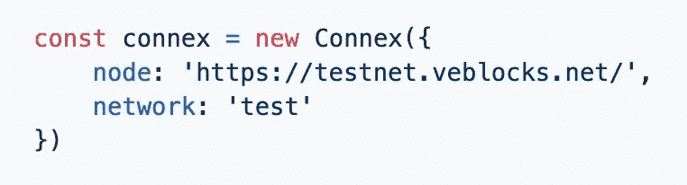

# 如何在所有浏览器上使用 VeChain 作为只读后端

> 原文：<https://medium.com/coinmonks/how-to-use-vechain-as-a-read-only-backend-on-all-browsers-4c1016787e51?source=collection_archive---------2----------------------->

在我的文章[“如何从 web 与 VeChain-Smart-Contract 交互”](https://ifavo.medium.com/how-to-interact-with-a-vechain-smart-contract-from-the-web-a61296aafa7d)中，我们构建了一个 Web 应用程序，它只支持 VeChain-Sync-Browser 从智能合同中读取和写入数据。

这是一个很大的限制，确实阻止了互联网上的每个人都可以免费使用这个应用程序。现在不应该要求任何人安装特定的软件。的…