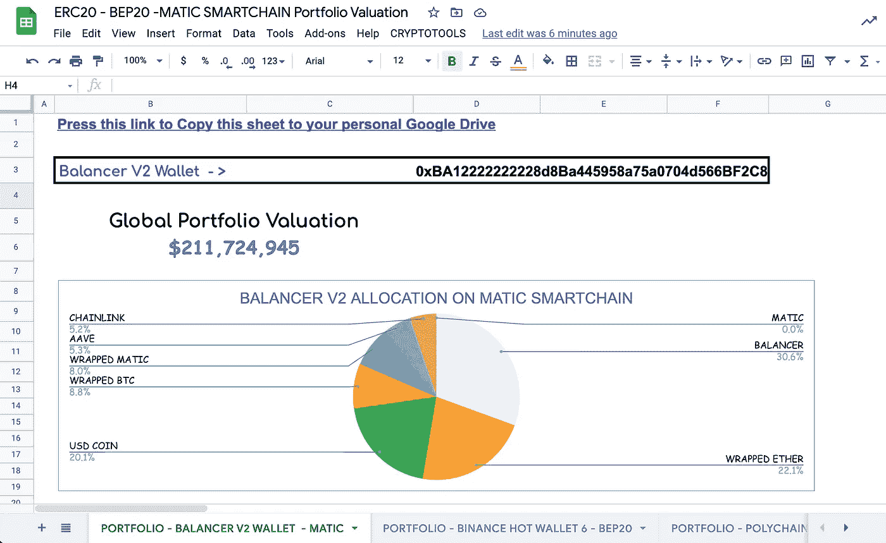
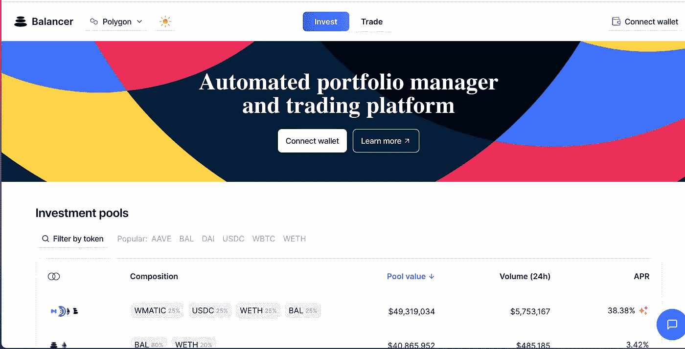
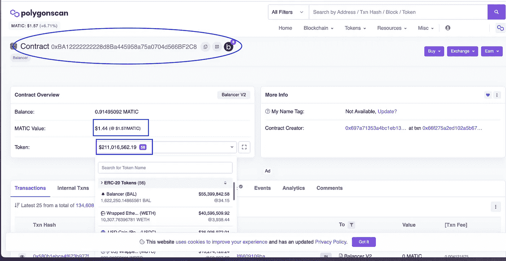
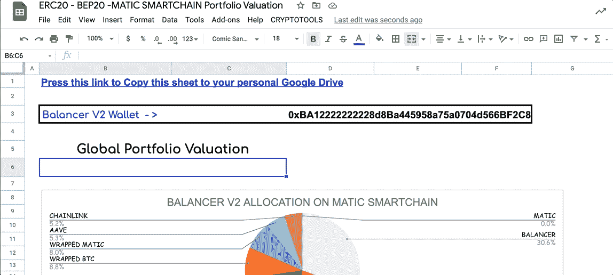
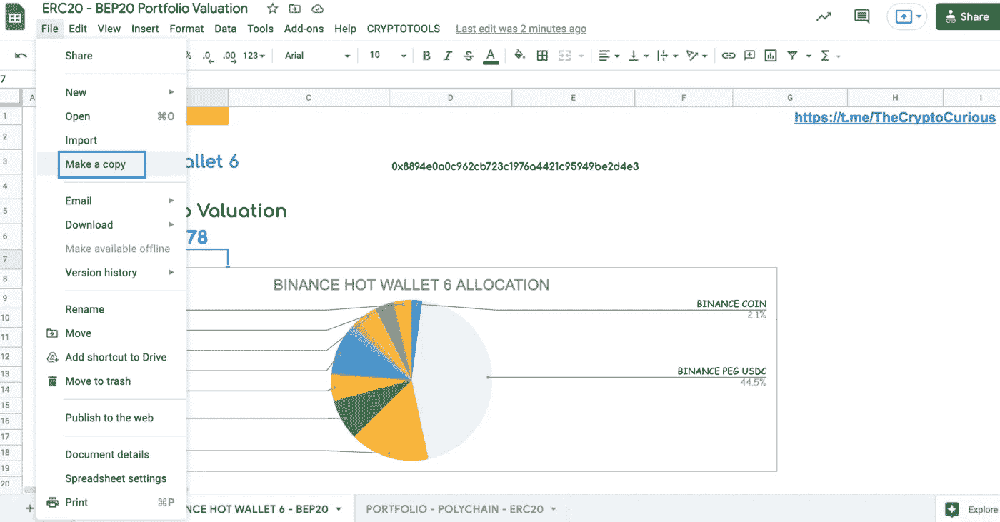
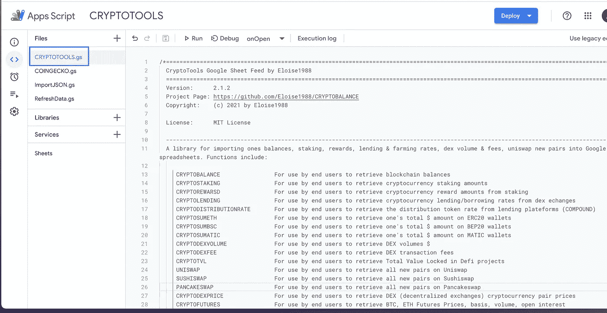
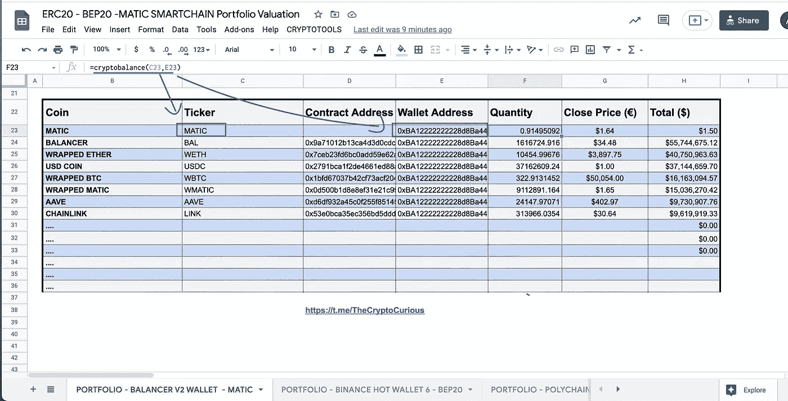
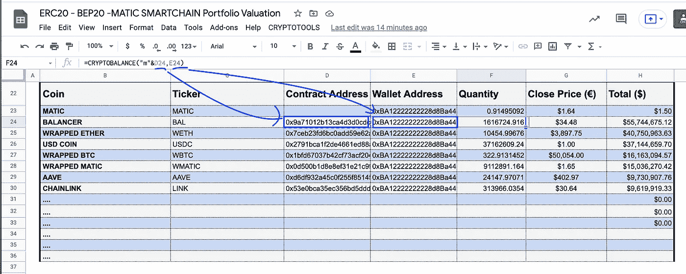

# 如何在谷歌床单价值平衡器 V2 Matic 智能链钱包？

> 原文：<https://medium.com/coinmonks/how-to-value-balancer-v2-matic-smart-chain-wallet-in-google-sheets-fb2934f231c?source=collection_archive---------1----------------------->

简单的谷歌表单技巧来评估你的数字资产。复制该工作表并使其成为您自己的工作表。

> [*试用:现场样张*](https://docs.google.com/spreadsheets/d/1DaR4yKrDuJ6LkgpwbA5aqpXmwtKUmHrQ_uVPdPA2-cE/edit?usp=sharing)

# 什么是多边形(MATIC)？

"P [olygon](https://academy.binance.com/en/articles/what-is-polygon-matic) 旨在通过提供一个框架来创建与以太坊兼容的扩展解决方案，从而使未来更接近现实。他们的股份证明 [sidechain](https://academy.binance.com/en/articles/blockchain-scalability-sidechains-and-payment-channels) 已经引起了比特币和加密货币社区的一些兴趣。

不过，你可能听说过 Polygon Network，这是一款[Proof stage(PoS)](https://academy.binance.com/en/articles/proof-of-stake-explained)side chain，也是 Polygon 生态系统中的第一款实时产品之一。侧链本质上是连接到另一个区块链的平行链。

侧链可以提供几个好处——最显著的是，增加交易吞吐量和降低费用。如果你使用过多边形网络，你会知道它比以太坊快得多，而且成本非常低。即便如此，对于这种性能还是要做出一些取舍。

但是作为 Polygon 的用户你能做什么呢？不出所料，类似的东西你可以在以太坊，但更便宜，更快。一些最受欢迎的 DeFi dapps 已经部署在上面，比如 [Aave](https://academy.binance.com/en/articles/what-is-aave) 、1inch、 [Curve](https://academy.binance.com/en/articles/what-is-curve-finance-in-defi) 和 [Sushi](https://academy.binance.com/en/articles/your-guide-to-sushiswap) 。但是上面也有一些其他地方没有的原生应用，比如 QuickSwap 和 Slingshot。"

# 在 Matic SmartChain 钱包上获取美元余额

我创建了 CRYPTOSUMATIC 函数来直接获取任何 matic smartchain 地址上的美元总额。当您在同一个地址持有许多不同的硬币时，使用此功能比一次查看一个硬币更容易。

语法:***(地址，【可选刷新属性】)***

****第一个参数:*** *存放密码的区块链公共钱包。* ***第 2 个参数*** *一个可选的固定单元格用于自动刷新数据，此参数**

***举例** : [平衡器 V2](https://polygon.balancer.fi/#/) 估价*

*我们以平衡器 V2 钱包[(0 xba 1222222228 D8 ba 445958 a75a 0704d 566 bf2c 8)](https://polygonscan.com/address/0xba12222222228d8ba445958a75a0704d566bf2c8)为例。*

# *平衡器是什么？*

**

*[https://polygon.balancer.fi/#/](https://polygon.balancer.fi/#/)*

*[天平](https://www.kraken.com/learn/what-is-balancer-bal)是一个运行在[以太坊](https://www.kraken.com/learn/what-is-ethereum-eth)上的软件，它试图激励一个分布式计算机网络来运营一个交易所，在那里用户可以买卖任何[加密货币](https://www.kraken.com/learn/what-is-cryptocurrency)。*

*Balancer 是一种新兴的[分散金融](https://www.kraken.com/learn/what-is-decentralized-finance-defi) (DeFi)协议，它使用加密资产的组合来提供这项服务，使交易不需要像交易所这样的金融中介。*

*将 Balancer 视为一种指数基金可能会有所帮助，用户可以根据其投资组合中的加密货币创建基金。这些基金被称为平衡池，任何希望向池中提供流动性的用户只需将资产存入其中即可。*

*向平衡器池提供流动性的用户随后会赚取一部分交易费，支付给网络以使用他们的资金，并获得一种名为 BAL 的定制加密货币。"*

*这是 Polygonscan 上的平衡器 V2 钱包:*

**

*[https://polygonscan.com/address/0xba12222222228d8ba445958a75a0704d566bf2c8](https://polygonscan.com/address/0xba12222222228d8ba445958a75a0704d566bf2c8)*

*计算平衡器 V2 的总投资组合金额，并通过[多边形扫描](https://polygonscan.com/address/0xba12222222228d8ba445958a75a0704d566bf2c8)进行验证。*

*ALTCOIN 美元总额+ MATIC 美元总额= **$212 MIO***

*CRYPTOSUMATIC 公式将获得指定钱包的美元净值。在工作表中，为了检索该金额，您需要输入以下公式:*= CRYPTOSUMATIC("*0x ba 122222228 D8 ba 445958 a75a 0704d 566 bf2c 8 "*)**

**

> *[*试用:活样张*](https://docs.google.com/spreadsheets/d/1DaR4yKrDuJ6LkgpwbA5aqpXmwtKUmHrQ_uVPdPA2-cE/edit?usp=sharing)*

*以下是如何让这个公式在你的私人谷歌表单中发挥作用的方法*

# *代码设置:*

*您有两种选择来访问代码:*

*1-很简单，您复制一份模板表。当你这样做时，它会自动保存一个新的模板和代码。*

**

*[https://docs.google.com/spreadsheets/d/1DaR4yKrDuJ6LkgpwbA5aqpXmwtKUmHrQ_uVPdPA2-cE/copy](https://docs.google.com/spreadsheets/d/1DaR4yKrDuJ6LkgpwbA5aqpXmwtKUmHrQ_uVPdPA2-cE/copy)*

*2 —您需要将以下代码复制/粘贴到您希望使用的 Google Sheet 的应用程序脚本中。*

**

*Tools -Script Editor*

# *[此处有代码](https://raw.githubusercontent.com/Eloise1988/CRYPTOBALANCE/master/CRYPTOTOOLS_V2.gs)*

*更多细节可在以下介质中找到*

* [## Google Sheet 开源加密工具设置

### 目标:向用户展示如何在 Google Sheet 中轻松访问定制的内置 CryptoTools 公式:

medium.com](/the-cryptocurious/google-sheet-open-source-cryptotools-set-up-9420e3940a8a) 

对于那些对从每种加密货币中检索单个余额感兴趣的人，可以使用下面的函数。

# 密码平衡功能

在媒体[如何在 Google Sheets](/coinmonks/how-to-value-your-stocks-crypto-portfolio-in-google-sheets-22bb7b42c39d) 上评估你的股票&加密组合中，我解释了如何在一个**自动智能链地址**上取回每一枚硬币。如果你使用了**加密平衡**功能，你将不得不添加超过 100 种加密货币(马提克、韦瑟、WBTC、AAVE 等)..)以获得全部美元余额。没有了 ***隐漆树*** 的方法就变得很倒胃口，而且相当长。

出于示例的目的，如果您希望从平衡器 V2 地址检索自动平衡，您需要以这种方式使用 CRYPTOBALANCE 函数:

=CRYPTOBALANCE('MATIC '，' 0xba 122222228 d8ba 445958 a75a 0704d 566 bf2c 8 ')

在除 MATIC 之外的 polygon smartchain 上，可以直接使用合同地址而不是 ticker 来调用 ticker。例如在模板表中，为了得到余额，我们按如下方式调用函数:

= crypto balance('**m**0x9a 71012 b 13 ca 4d 0 CDC 72 a 177 df 3 ef 03 b 0 e 76 a 3 '，' 0x ba 1222222228 D8 ba 445958 a75a 0704d 566 bf2c 8 ')

=CRYPTOBALANCE(“**m**0x9a71012b13ca4d3d0cdc72a177df3ef03b0e76a3”,”0xBA12222222228d8Ba445958a75a0704d566BF2C8")

**您必须在合同地址前放置一个“m ”,以便向该功能发出信号，表明您正在多边形智能链上寻找平衡。**

所有细节都写在介质里。此外，如果您希望获得加密货币的价格，以便单独评估您的所有头寸，您可以使用中定义的 COINGECKO 函数

 [## Google Sheets 和 Excel 中的 CoinGecko 价格、交易量和市值

### 对于任何希望从 CoinGecko 中自动提取数据的人。

medium.com](/the-cryptocurious/coingecko-prices-volumes-market-caps-in-google-sheets-and-excel-a1a3ee201cb8) 

# 结论:

这个媒介向你展示了如何从一个多边形智能链钱包中检索**谷歌工作表**中的**美元总估值**。公式看起来像:
**=CRYPTOSUMATIC(多边形钱包)**

> *= CRYPTOSUMATIC("*0x ba 12222222228 D8 ba 445958 a75a 0704d 566 bf2c 8 "*)* [*谷歌工作表示例此处*](https://docs.google.com/spreadsheets/d/1DaR4yKrDuJ6LkgpwbA5aqpXmwtKUmHrQ_uVPdPA2-cE/edit?usp=sharing)

如果你在 ERC20 和 BEP20 上寻找相同的东西，请在这里查看[如何获得一个 ERC20 地址的总金额](/coinmonks/how-to-value-your-ethereum-portfolio-using-google-sheets-5947ce5c057a)和[如何获得一个 BEP20 地址的总金额](/coinmonks/how-to-value-your-crypto-on-a-binance-smart-chain-bep20-wallet-in-google-sheets-663fd3116198)。

*这是正在进行的工作。当我创建 CRYPTOTOOLS 时，我希望有一种私人的灵活方式来分析区块链的波动，评估我所做的交易，寻找套利机会，并在 Google Sheets 中计算统计数据。后来朋友们感兴趣了，我就把它变得更有效率，把床单公开给大家。我希望你能从我的工作中受益。对于希望直接连接到我的 API 的开发人员，您可以在这里* [*API 文档*](https://app.swaggerhub.com/apis-docs/Eloise1988/Crypto-Tools) *进行连接。*

如果你发现错误，请不要犹豫让我知道。非常欢迎反馈。一个 [*电报聊天*](https://t.me/TheCryptoCurious) *也可供支持。如果这个项目为你增加了任何价值，或者正在你的谷歌表单上寻找个性化编码，请不要犹豫，留下你的信息。*

非常感谢你花时间阅读这篇文章。

在这个充满挑战的时代，照顾好你自己和你的家人！

> 加入 [Coinmonks 电报频道](https://t.me/coincodecap)，了解加密交易和投资

## 另外，阅读

*   [Bookmap 评论](https://blog.coincodecap.com/bookmap-review-2021-best-trading-software) | [美国 5 大最佳加密交易所](https://blog.coincodecap.com/crypto-exchange-usa)
*   [如何在 FTX 交易所交易期货](https://blog.coincodecap.com/ftx-futures-trading) | [OKEx vs 币安](https://blog.coincodecap.com/okex-vs-binance)
*   [CoinLoan 评论](https://blog.coincodecap.com/coinloan-review) | [YouHodler 评论](/coinmonks/youhodler-4-easy-ways-to-make-money-98969b9689f2) | [BlockFi 评论](https://blog.coincodecap.com/blockfi-review)
*   [CoinFLEX 评论](https://blog.coincodecap.com/coinflex-review) | [AEX 交易所评论](https://blog.coincodecap.com/aex-exchange-review) | [UPbit 评论](https://blog.coincodecap.com/upbit-review)
*   [AscendEx 保证金交易](https://blog.coincodecap.com/ascendex-margin-trading) | [Bitfinex 赌注](https://blog.coincodecap.com/bitfinex-staking) | [bitFlyer 审核](https://blog.coincodecap.com/bitflyer-review)
*   [AscendEx Staking](https://blog.coincodecap.com/ascendex-staking)|[Bot Ocean Review](https://blog.coincodecap.com/bot-ocean-review)|[最佳比特币钱包](https://blog.coincodecap.com/bitcoin-wallets-india)
*   [Bitget 回顾](https://blog.coincodecap.com/bitget-review)|[Gemini vs block fi](https://blog.coincodecap.com/gemini-vs-blockfi)|[OKEx 期货交易](https://blog.coincodecap.com/okex-futures-trading)
*   [霍比审核](https://blog.coincodecap.com/huobi-review) | [OKEx 保证金交易](https://blog.coincodecap.com/okex-margin-trading) | [期货交易](https://blog.coincodecap.com/futures-trading)
*   [麻雀交换评论](https://blog.coincodecap.com/sparrow-exchange-review) | [纳什交换评论](https://blog.coincodecap.com/nash-exchange-review)
*   最好的[加密税务软件](/coinmonks/best-crypto-tax-tool-for-my-money-72d4b430816b) | [硬币追踪评论](/coinmonks/cointracking-review-a-reliable-cryptocurrency-tax-software-5114e3eb5737)
*   [Stackedinvest 评论](https://blog.coincodecap.com/stackedinvest-review) | [北海巨妖评论](/coinmonks/kraken-review-6165fc1056ac) | [期货交易机器人](/coinmonks/futures-trading-bots-5a282ccee3f5)
*   最佳[加密借贷平台](/coinmonks/top-5-crypto-lending-platforms-in-2020-that-you-need-to-know-a1b675cec3fa) | [杠杆令牌](/coinmonks/leveraged-token-3f5257808b22) | [Stormgain 评论](https://blog.coincodecap.com/stormgain-review)
*   最佳[加密制图工具](/coinmonks/what-are-the-best-charting-platforms-for-cryptocurrency-trading-85aade584d80) | [最佳加密交易所](/coinmonks/crypto-exchange-dd2f9d6f3769) | [专家评论](https://blog.coincodecap.com/probit-review)
*   [比特币基地僵尸程序](/coinmonks/coinbase-bots-ac6359e897f3) | [AscendEX 审查](/coinmonks/ascendex-review-53e829cf75fa) | [OKEx 交易僵尸程序](/coinmonks/okex-trading-bots-234920f61e60)
*   [如何在印度购买比特币？](/coinmonks/buy-bitcoin-in-india-feb50ddfef94) | [瓦济克斯评论](/coinmonks/wazirx-review-5c811b074f5b) | [俱吠罗评论](/coinmonks/coinswitch-kuber-review-1a8dc5c7a739)
*   [CryptoHopper 替代品](/coinmonks/cryptohopper-alternatives-d67287b16d27) | [HitBTC 审查](/coinmonks/hitbtc-review-c5143c5d53c2) | [Kucoin 交易机器人](/coinmonks/kucoin-trading-bot-automate-your-trades-8cf0ca2138e0)
*   [WazirX vs coin dcx vs bit bns](/coinmonks/wazirx-vs-coindcx-vs-bitbns-149f4f19a2f1)|[block fi vs coin loan vs Nexo](/coinmonks/blockfi-vs-coinloan-vs-nexo-cb624635230d)
*   [本地比特币审核](/coinmonks/localbitcoins-review-6cc001c6ed56) | [加密货币储蓄账户](https://blog.coincodecap.com/cryptocurrency-savings-accounts)
*   [比特币基地评审](/coinmonks/coinbase-review-6ef4e0f56064) | [德里比特评审](/coinmonks/deribit-review-options-fees-apis-and-testnet-2ca16c4bbdb2) | [FTX 评审](/coinmonks/ftx-crypto-exchange-review-53664ac1198f) | [StealthEX 评审](/coinmonks/stealthex-review-396c67309988)
*   [n ave 零点回顾](/coinmonks/ngrave-zero-review-c465cf8307fc) | [Phemex 回顾](/coinmonks/phemex-review-4cfba0b49e28) | [PrimeXBT 回顾](/coinmonks/primexbt-review-88e0815be858)
*   最佳[区块链分析](https://bitquery.io/blog/best-blockchain-analysis-tools-and-software)工具| [赚比特币](/coinmonks/earn-bitcoin-6e8bd3c592d9) | [Swapzone 回顾](/coinmonks/swapzone-review-crypto-exchange-data-aggregator-e0ad78e55ed7)
*   [加密套利](/coinmonks/crypto-arbitrage-guide-how-to-make-money-as-a-beginner-62bfe5c868f6)指南| [如何做空比特币](/coinmonks/how-to-short-bitcoin-568a2d0b4ae5) | [Bybit vs 币安](https://blog.coincodecap.com/bybit-binance-moonxbt)
*   [币安交易机器人](/coinmonks/binance-trading-bots-d0d57bb62c4c) | [OKEx 审查](/coinmonks/okex-review-6b369304110f) | [阿塔尼审查](https://blog.coincodecap.com/atani-review)
*   [最佳加密交易信号电报](/coinmonks/best-crypto-signals-telegram-5785cdbc4b2b) | [MoonXBT 评论](/coinmonks/moonxbt-review-6e4ab26d037)
*   [Godex.io 审核](/coinmonks/godex-io-review-7366086519fb) | [邀请审核](/coinmonks/invity-review-70f3030c0502) | [BitForex 审核](https://blog.coincodecap.com/bitforex-review)
*   [火币交易机器人](https://blog.coincodecap.com/huobi-trading-bot) | [如何购买 ADA](https://blog.coincodecap.com/buy-ada-cardano) | [Geco？一次审查](https://blog.coincodecap.com/geco-one-review)
*   [币安 vs Bitstamp](https://blog.coincodecap.com/binance-vs-bitstamp) | [Bitpanda vs 比特币基地 vs Coinsbit](https://blog.coincodecap.com/bitpanda-coinbase-coinsbit)
*   [如何购买瑞波(XRP)](https://blog.coincodecap.com/buy-ripple-india) | [非洲最好的加密交易所](https://blog.coincodecap.com/crypto-exchange-africa)
*   [非洲最佳加密交易所](https://blog.coincodecap.com/crypto-exchange-africa) | [Hoo 交易所评论](https://blog.coincodecap.com/hoo-exchange-review)
*   [eToro vs robin hood](https://blog.coincodecap.com/etoro-robinhood)|[MoonXBT vs by bit vs Bityard](https://blog.coincodecap.com/bybit-bityard-moonxbt)
*   [有哪些交易信号？](https://blog.coincodecap.com/trading-signal) | [比特斯坦普 vs 比特币基地](https://blog.coincodecap.com/bitstamp-coinbase)
*   [ProfitFarmers 点评](https://blog.coincodecap.com/profitfarmers-review) | [如何使用 Cornix 交易机器人](https://blog.coincodecap.com/cornix-trading-bot)
*   [如何在势不可挡的域名上购买域名？](https://blog.coincodecap.com/buy-domain-on-unstoppable-domains)
*   [印度的秘密税](https://blog.coincodecap.com/crypto-tax-india) | [altFINS 审查](https://blog.coincodecap.com/altfins-review) | [Prokey 审查](/coinmonks/prokey-review-26611173c13c)*