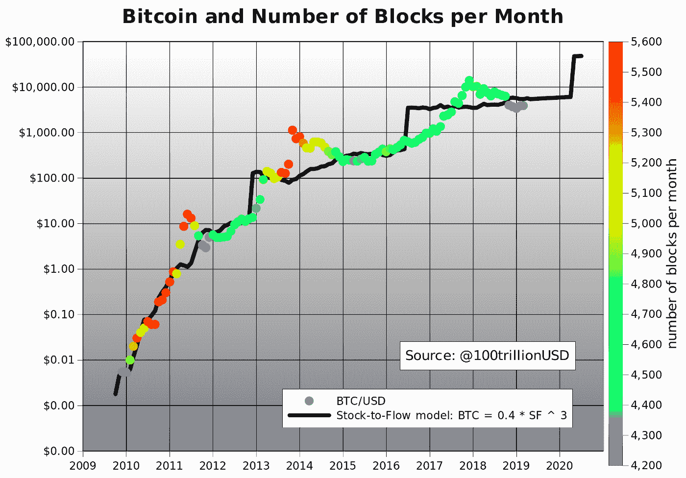
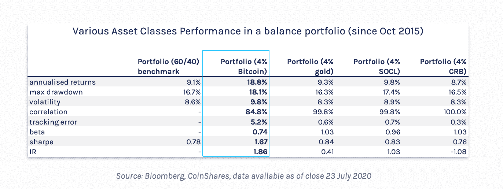
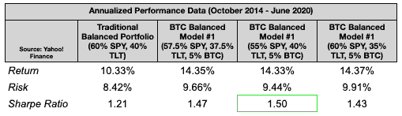

# 如何给如今的比特币估值

> 原文：<https://medium.com/coinmonks/how-to-value-bitcoin-today-d0827baa7f2b?source=collection_archive---------2----------------------->

[https://nbx.com](https://nbx.com)

自 2009 年推出以来，比特币一直让全球金融市场感到兴奋和困惑。

从一开始，其价值的最初案例就是数字稀缺的发明。如果你不熟悉这个概念，可以考虑像美元、欧元或挪威克朗这样的法定货币。

这些货币的供给是如何受到限制的？

简而言之，设定的任何限额都由各自的监管机构(即中央银行)控制。这意味着对于法定货币来说，不存在限制，因为理论上它们的供应量可以随时改变。

事实上，比特币的供应受到其代码的限制，而不是中央权威机构的突发奇想，这就是数字稀缺性。只有 2100 万个比特币会存在，没有人能改变这一点。正因如此，比特币的支持者或“多头”一致认为，随着更多比特币被购买，其价格将不可避免地上涨，并最终维持在越来越高的水平。与此同时，随着时间的推移，通过所谓的“集体奖励”发行的新比特币会越来越少。

一般来说，[街区奖励](https://nbxsupport.zendesk.com/hc/en-us/articles/360048400232-What-is-Bitcoin-mining-and-Proof-of-Work-)是给予第一个“解决街区”的比特币矿工的奖励反过来，解决一个区块指的是第一个验证一组交易是合法的，因此应该存储在比特币的分布式数据库中，这被称为区块链。这个名字来源于这样一个事实，即数据库将自己表现为一系列带时间戳的事务，称为“块”

每个区块都是通过[开采过程](https://nbxsupport.zendesk.com/hc/en-us/articles/360048400232-What-is-Bitcoin-mining-and-Proof-of-Work-)添加的，从表面上看，这是确保交易能够并且应该由上述相关方进行的过程。虽然这听起来非常类似于通过银行“清算”交易的过程，但 mining 的独特之处在于它将清算或结算过程与铸造过程结合成一种“数字淘金热”。

每个矿工都要比赛成为第一个解决一个街区的人，最后，每个街区只有一个人能胜出。作为回报，他们将获得 6.25 比特币的集体奖励，这也是自比特币诞生以来，新比特币发行的唯一方式。

最重要的是，无论是挖掘过程还是比特币的发行机制(区块奖励)都不能被任何人改变。因此，他们的代码被认为是不可变的。

这些因素永远颠覆了稀缺的概念，导致比特币开创了“数字稀缺”的概念。

利用数字稀缺性的核心概念，构建了比特币具有真实、可观价值的第一个案例，然后我们可以用它来研究比特币的其他价值主张。

**比特币成为“数字黄金”的理由**

以下案例有助于说明比特币如何被视为“数字黄金”，既通过其数字稀缺性和发行的周期性削减，也通过其作为储备资产的历史投资表现，这是大多数投资者使用黄金的原因。

**股票流向模型**

或许理解数字稀缺性与比特币价值之间关系的最简单的视角是股票-流量模型，这是由匿名比特币分析师 Plan B 推广的。下面，你可以看到一个在图表上该模型实际情况的例子。

(Source: Plan B: “[Modeling Bitcoin Value with Scarcity](/@100trillionUSD/modeling-bitcoins-value-with-scarcity-91fa0fc03e25)”)

正如你在上面看到的，[的存量-流量模型](/@100trillionUSD/modeling-bitcoins-value-with-scarcity-91fa0fc03e25)假设比特币的价格会随着每月的块数而持续上涨。如果你把股票想象成“当前可用的比特币”，把流量想象成“比特币发行”，那么就很容易理解模型是如何得出这个结论的。

本质上，在如上的初始形式中，它考虑了比特币的 10 年市场数据(2009 年 12 月-2019 年 2 月)，并为其附加了一个存量-流量比率。

参与其中的分析师 PlanB 随后将所有这些数据代入一个线性回归模型，试图预测比特币未来的价格。总而言之，结果并不完美，但没有一个模型是完美的。尽管如此，S2F 线(黑线)与比特币实际价格走势(彩色虚线)的接近程度表明，总体而言，该模型与历史数据的相关性相当准确。

在定量的层面上，PlanB 指出，它的准确性是由所谓的“幂律关系”的存在所支持的，这是指两条线几乎成一条直线。这种关系指向 95%的相关性的事实可以被认为是迄今为止，随着比特币的稀缺性随着时间的推移而增加，股票-流量模型是跟踪比特币价格增长的最准确的模型。

由于不变地(永远地)增加稀缺性是比特币的货币政策，因此我们可以将这一点和上述内容作为比特币相对于黄金(数字黄金)而言是一种改进的价值储存手段的基础。

**展望未来:比特币作为一种多样化工具**

除了股票到流量模型为比特币作为价值储存手段的地位提供了强有力的理由，还有大量证据表明，与黄金一样，比特币是几乎任何一种投资组合的强大多样化工具。

世界领先的加密货币研究公司之一 CoinShares 上个月发布了一份报告，该报告绘制了 2015 年 10 月[至 2020 年 7 月](https://coinshares.com/assets/resources/Research/a-little-bitcoin/-en--report---a-little-bitcoin-goes-a-long-way.pdf)期间 4%比特币的投资组合的表现，并与同期传统的 60%股票、40%债券和其他投资组合的表现进行了比较。

他们选择了 4%的比特币，因为他们设定了一个基准，即根据其风险预算(其整体风险潜力)，将传统上已经加权的投资组合(60/40 股票/债券)增加 120 个基点。

他们的发现对比特币的价值主张意义重大。

与传统投资组合相比，传统投资组合实现了 [9.1%](https://coinshares.com/assets/resources/Research/a-little-bitcoin/-en--report---a-little-bitcoin-goes-a-long-way.pdf) 的年回报率和 [8.6%](https://coinshares.com/assets/resources/Research/a-little-bitcoin/-en--report---a-little-bitcoin-goes-a-long-way.pdf) 的波动性，而 [4%](https://coinshares.com/assets/resources/Research/a-little-bitcoin/-en--report---a-little-bitcoin-goes-a-long-way.pdf) 比特币投资组合实现了 [18.8%](https://coinshares.com/assets/resources/Research/a-little-bitcoin/-en--report---a-little-bitcoin-goes-a-long-way.pdf) 的年回报率和 9.8%的波动性。所有这些，你可以在下表中看到图解，这是来自他们的报告的[。](https://coinshares.com/assets/resources/Research/a-little-bitcoin/-en--report---a-little-bitcoin-goes-a-long-way.pdf)

这表明，比特币不仅可能是一种很好的价值储存手段，如上所述，而且还是一种强大的多样化手段，特别是如果你将它的表现与黄金进行比较，以及它的夏普比率基本上是列出的其他任何东西的两倍这一事实。

如果你不知道，夏普比率是一个众所周知的衡量“风险调整后的回报”或考虑波动性等风险后的真实回报的指标。一般来说，夏普比率越高，投资组合的效率越高，回报也越高。

考虑到这一点，CoinShares 的研究发现，只有 4%比特币的投资组合的 T2 夏普比率为 1.67，而传统投资组合的 T4 夏普比率为 0.78。

现在，比特币作为分散投资者的真正影响似乎很明显，因为从 2015 年到 2020 年，与总风险相比，比特币的投资组合效率提高了一倍以上。

**求阿尔法近期研究:比特币能否对冲全球市场波动？**

由于以上仅代表一个小组的研究，我们进行了深潜，发现另一个知名研究小组 SeekingAlpha 今年也进行了类似的研究。利用 2014 年 10 月至 2020 年 6 月的市场数据[，他们首先将比特币单独的表现与股票和债券的表现进行了比较，并使用知名的 ETF(交易所交易基金)作为后两者的指数(即](https://seekingalpha.com/article/4357312-bitcoin-portfolio-diversifier)[间谍](https://finance.yahoo.com/quote/SPY/)和 [TLT](https://www.ishares.com/us/products/239454/ishares-20-year-treasury-bond-etf) )。

他们发现，“在风险调整的基础上，比特币一直是比其他资产类别(2014 年至 2020 年的股票和债券)更强的投资。”在这里，我们有理由问:这是否也意味着比特币也可以对冲股票和债券市场的崩盘？

在他们的研究中，SeekingAlpha 的分析师还得出结论，在同一时期，比特币与债券市场呈负相关。从表面上看，这意味着当债券下跌时，比特币会在一定程度上上涨，尽管需要注意的是，要想对冲“完美”，它需要有 100%的负相关性(-1)。由于 SeekingAlpha 的研究发现比特币与债券的负相关性仅为-0.08 或-8%，因此不符合这一模型。

即便如此，8%也不是一个可以拒绝的数字。考虑到这一点，我们可以构建一个既包括债券又包括比特币的高效投资组合。然而，在考虑这可能是什么样子之前，重要的是要考虑 SeekingAlpha 将股票与比特币进行比较的结果。

从 2014 年到 2020 年，他们发现比特币与股票的“适度正”相关性为 [0.23](https://seekingalpha.com/article/4357312-bitcoin-portfolio-diversifier) 或 23%。尽管这看起来很低，但它[从历史上表明了](https://www.researchgate.net/post/Correlation_coefficient_and_statistical_significance)两个变量之间的统计显著关系，或者在这种情况下，资产。

使用这个数字，可以说，一般来说，如果股票上涨，比特币很有可能上涨，反之亦然。这在今年 3 月的实践中可以看到，由于世界正处于灾难之中，比特币[因股市崩盘而暴跌 50%](https://www.cnbc.com/2020/03/13/bitcoin-loses-half-of-its-value-in-two-day-plunge.html) 。

尽管如此，由于这个数字只有 23%，记住这种事件不会总是发生是很重要的。事实上，大多数时候，数据显示比特币不会直接随着股票移动。

如果以上任何一条看起来令人困惑，那是因为它确实如此。

如果将 SeekingAlpha 在同一项研究中的回溯测试投资组合(基于过去数据的投资组合)的结果考虑在内，那么就有可能更清楚地了解所有这些相关性在实践中的影响。

使用 2014 年至 2020 年的历史数据，SeekingAlpha 的团队构建了[四个不同的投资组合](https://seekingalpha.com/article/4357312-bitcoin-portfolio-diversifier)，一个没有比特币，三个有 5%的比特币，但股票和债券数量不同，具体细节你可以在下面看到。

([来自 SeekingAlpha](https://seekingalpha.com/article/4357312-bitcoin-portfolio-diversifier) 的数据——用于教育目的)

在这里，显而易见的是，在研究的 5 年多时间里，任何包含比特币的投资组合都产生了更高的回报。此外，当使用 55%的股票和 40%的债券时，夏普比率最高，这表明投资组合在风险与回报方面处于相当有效的状态。此外，如果一种资产(如比特币)产生的夏普比率比基本上所有其他选项都高，那么根据所研究的时间，可以说它是最有效的分散投资工具。

这反过来又证实了 [CoinShares 的](https://coinshares.com/assets/resources/Research/a-little-bitcoin/-en--report---a-little-bitcoin-goes-a-long-way.pdf)和 [SeekingAlpha 的](https://seekingalpha.com/article/4357312-bitcoin-portfolio-diversifier)结论，这两个结论似乎表明了同样的结论，并且在一定程度上，比特币确实作为价值和“数字黄金”的储存手段

然而，问题依然存在:比特币作为对冲工具的地位如何，更大程度上是在全球范围内？

**将比特币的价值主张更进一步:Real Vision 的案例**

然而，如果比特币既能成为强大的分散工具，又能有效对冲全球经济崩溃，那会怎样？

特别是从 2019 年到 2020 年，Real Vision 投资集团的 Raoul Pal 似乎已经采取了这一立场。在深入了解 Pal 对比特币的具体立场之前，了解一下他的背景很重要。Pal 在高盛和其他类似对冲基金的公司工作了几年，之后他开始自己创业，并以“全球宏观”投资者的身份出名。

一般来说，这里指的是进行宏观投资的人，这涉及跟踪各种全球趋势，并试图预测它们可能如何影响某些资产和商品类别以及整个市场的表现。

这意味着宏观投资者专注于大局，Pal 和其他人认为比特币符合大局的原因是因为它的去中心化性质以及在各种全球事件中作为价值储存手段(数字黄金)的长期表现。

在 Pal 最近发布给 Real Vision 成员的宏观报告中，他说他的长期目标是将他的“流动”资产组合转变为 75%的加密资产。

然而，这并不是什么新鲜事。

至少从去年开始，帕尔一直直言不讳地说比特币是他的“伟大想法”，或者是他投入大部分精力的投资，因为他相信比特币确实是一种全球衰退对冲(全球宏观对冲)，或者是一种在全球经济衰退发生和其他一切下跌时可以保护投资者的资产。

他对这一信念的关键推理是，由于比特币的货币政策是如何运作的(因为它的数字稀缺性)，它是对依赖于基于法令的货币政策的传统金融市场的有效押注。

在斯蒂芬·利维拉的播客中，他总结了这一观点，他说，大规模印钞应该在世界范围内继续，因此，“任何了解黄金的人都可以理解比特币的价值主张”，宏观投资策略和比特币正在成为一体。除此之外，他补充说，他认为比特币的增长在很大程度上，但不仅仅是“[零售驱动的](https://stephanlivera.com/episode/203/)”，指出 30 多岁或更年轻的投资者更容易理解数字世界及其投资机会，如比特币。

将这一点与机构投资者甚至银行对比特币日益增长的信心结合在一起，正如通过[保罗·都铎·琼斯](https://www.cnbc.com/2020/05/11/paul-tudor-jones-calls-bitcoin-a-great-speculation-says-he-has-almost-2percent-of-his-assets-in-it.html)、[微观策略](https://www.coindesk.com/microstrategy-buys-more-bitcoin)以及无数其他案例(如[银河数码](https://stephanlivera.com/episode/203/)在比特币上的表现)所展示的那样，你就会理解 Pal 将比特币作为对冲工具的理由。

在你将整个战略建立在上述基础上之前，有必要记住，Pal 的想法还没有经过实践的检验，这是他乐于承认并指望的事实。因此，要想知道比特币能否保护世界免受经济衰退的影响，唯一的方法就是看它是否会发生。

因为 Pal 是比特币价值的一个真正有趣的案例，我们 NBX 计划随着时间的推移对其进行更多的分析。

从这些案例中可以得出什么结论？

这些例子告诉我们，比特币是“数字黄金”，因此是一种价值储存手段，也是一种多样化手段。此外，特别是通过 SeekingAlpha 的研究和 RealVision(Raoul Pal)的分析中提供的例子，似乎很明显，随着时间的推移，比特币可能成为抵御全球市场波动的强大对冲工具，因此成为任何宏观驱动(全球事件驱动)投资组合的关键部分。

利用所有这些结论，你可以开始制定自己的比特币交易/投资策略，同时记住，上述案例并不是比特币唯一的价值主张，每个案例都有自己的风险。

**本文讨论的案例有哪些风险**？

尽管 Pal 宏观案例的风险已经得到了解决，但 Plan B 的存量-流量模型、CoinShares 的研究和 SeekingAlpha 的分析的风险仍有待提及。关于库存-流量模型，主要的风险是，像任何试图预测未来价格的模型一样，它永远不会是精确的。相反，它应该被看作是一个技术分析指标

如果你知道技术分析，那么你知道它涉及到使用蜡烛图和其他措施来试图找出一项资产最有可能的未来价格变动。从历史上看，当许多指标一起使用时，TA 处于最佳状态，因为这表明分析师已经从所有可能的角度考虑了资产的未来走势。

考虑到这些想法，你就有了如何在实践中应用库存-流程模型的基础。

就 CoinShares 和 SeekingAlpha 的研究而言，风险甚至更大。由于两者都使用了历史数据，他们的结论不应该仅仅作为未来表现的可靠指标。

相反，接近他们的最佳方式可能是将他们的数据纳入你自己的比特币估值模型，以及 S2F 模型和宏观经济事件(可能的衰退等)等其他指标。).如果一个模型符合所有这三个领域，那么有理由假设它在评估比特币时会比不考虑一个或多个模型的模型更有效。

总而言之，无论你做出什么决定，最好把这次讨论作为你理解比特币价值的起点。随着时间的推移，你可以期待我们 NBX 的更多内容，探索比特币的其他估值模型。如果你对此感兴趣，可以看看我们的知识库和博客。

挪威大宗交易(NBX)是一个开拓性、前瞻性和面向客户的挪威加密货币交易、托管和支付系统。在 nbx.com[与我们交易](https://nbx.com/?utm_source=medium_nbx&utm_medium=link)，在[推特](https://twitter.com/nbxcom)或[脸书](https://www.facebook.com/nbxcom/)上关注我们📲✔️

*免责声明:所提供的内容不构成财务建议。*