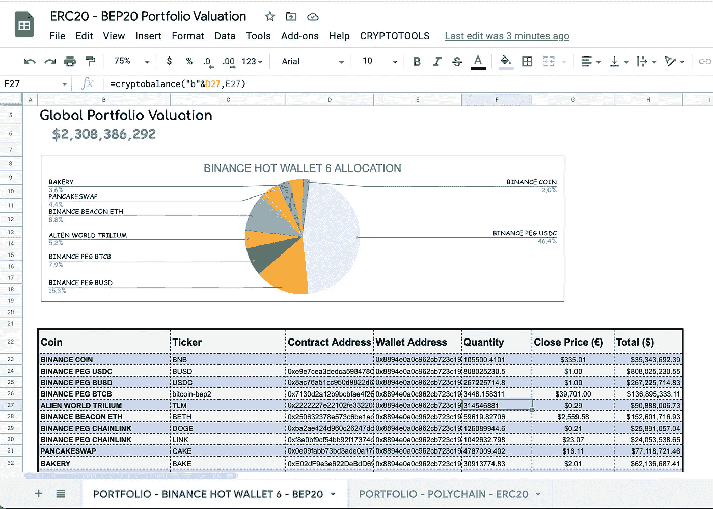
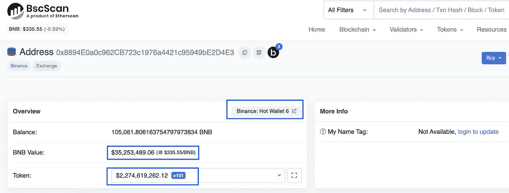
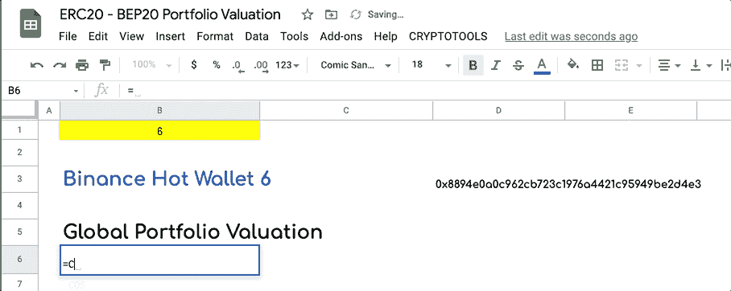
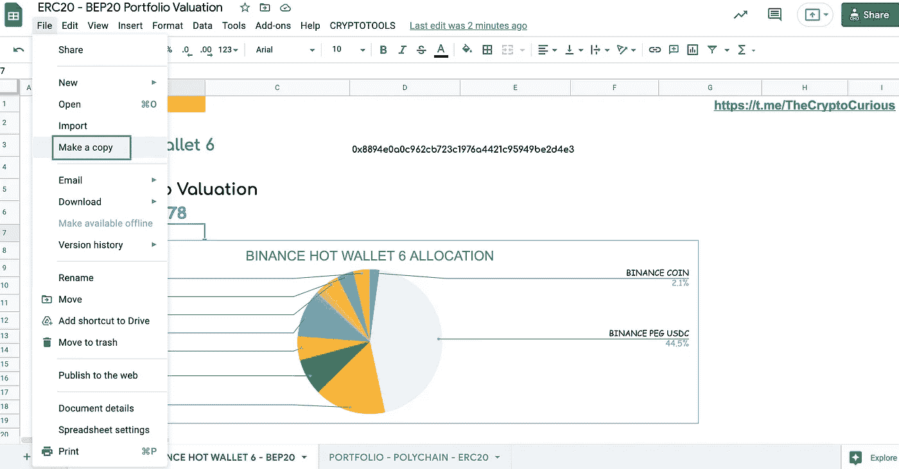
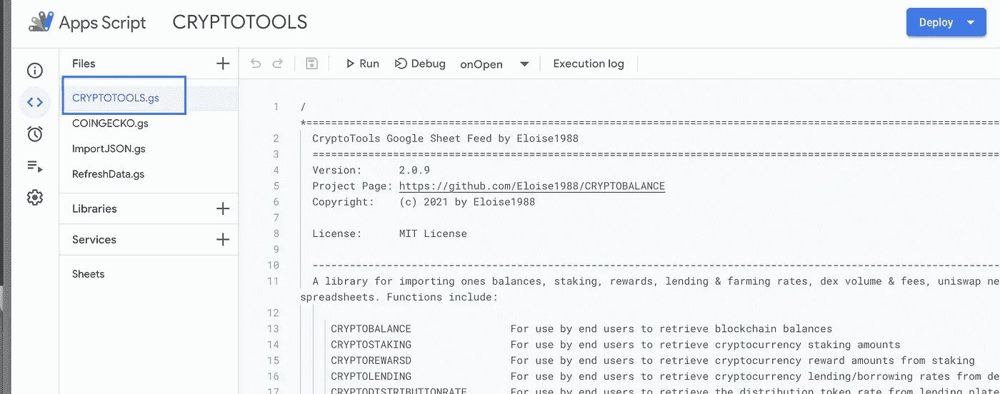
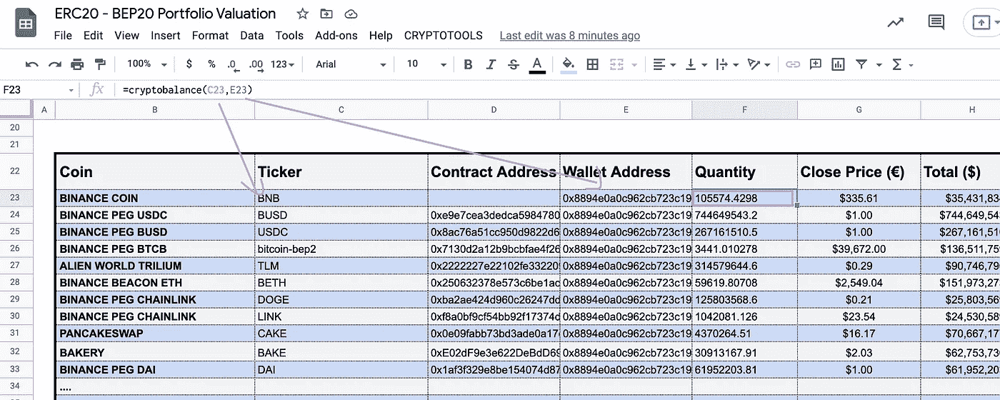
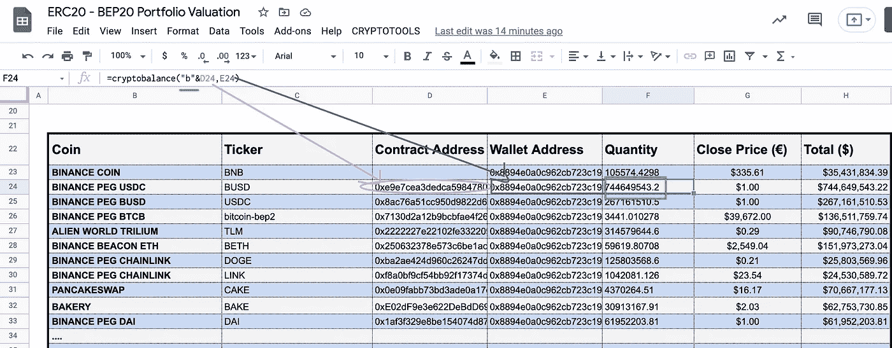

# 如何评估你在币安智能链上的加密技术 Google Sheets 中的 BEP20 钱包？

> 原文：<https://medium.com/coinmonks/how-to-value-your-crypto-on-a-binance-smart-chain-bep20-wallet-in-google-sheets-663fd3116198?source=collection_archive---------1----------------------->

简单的谷歌表单技巧来评估你的数字资产。复制该工作表并使其成为您自己的工作表。

> [*试用:现场样张*](https://docs.google.com/spreadsheets/d/1DaR4yKrDuJ6LkgpwbA5aqpXmwtKUmHrQ_uVPdPA2-cE/edit?usp=sharing)

Image : Portfolio Valuation Example using Google Sheets

起初，当我创建 CRYPTOTOOLS 时，我想用**这种私人的灵活方式来分析鲸鱼在区块链的动向，评估我所做的交易，寻找套利机会，并在谷歌工作表中计算统计数据**。后来朋友们感兴趣了，我就把它变得更有效率，把床单公开给大家。我希望你能从我的工作中受益。对于希望直接连接到我的 API 的开发者来说，你可以在这里做 [API 文档](https://app.swaggerhub.com/apis-docs/Eloise1988/Crypto-Tools)。

我已经写了一个关于任何人如何自动检索股票[加密货币价格、来自区块链公共地址的加密余额、来自不同借贷平台的借贷和农业利率，以及来自区块链股份证明](/coinmonks/how-to-value-your-stocks-crypto-portfolio-in-google-sheets-22bb7b42c39d)的堆叠和奖励的媒体[。我还写了一篇关于如何获取一个 ERC20 地址的总金额的文章。](/coinmonks/how-to-value-your-stocks-crypto-portfolio-in-google-sheets-22bb7b42c39d)

最近，我的用户要求他们在一个公式中得到一个 BEP20 地址(币安智能链地址)的总金额。

# CRYPTOSUMBSC 函数

我创建了 CRYPTOSUMBSC 函数来直接获取任何 [BEP20](https://academy.binance.com/en/glossary/bep-20) 地址上的美元总额。当您在同一个地址持有许多不同的硬币时，使用此功能比一次查看一个硬币更容易。

语法: ***CRYPTOSUMBSC* (地址，[可选刷新属性])**

***第一个参数:*** *存放密码的公共区块链地址。* ***第二个参数*** *一个可选的固定单元格用于自动刷新数据，此参数*

**举例**:币安热钱包 6 BEP20 估值

我们就以币安热钱包 6 BEP20 地址([0x 8894 E0 a0c 962 CB 723 c 1976 a 4421 c 95949 be 2d 4 e 3](https://bscscan.com/address/0x8894e0a0c962cb723c1976a4421c95949be2d4e3))为例。

[https://bscscan.com/address/0x8894e0a0c962cb723c1976a4421c95949be2d4e3](https://bscscan.com/address/0x8894e0a0c962cb723c1976a4421c95949be2d4e3)

计算币安 Hot Wallet 6 的投资组合总金额，并通过 Ethersan 进行验证。

总替代币美元金额+ BNB 美元金额= **$2，335，968，714**

在 Google Sheet 中，为了检索该金额，您需要输入以下公式:

> *= CRYPTOSUMBSC("*0x 8894 E0 a0c 962 CB 723 c 1976 a 4421 c 95949 be 2d 4 e 3*"*

> [*试用:现场样张*](https://docs.google.com/spreadsheets/d/1DaR4yKrDuJ6LkgpwbA5aqpXmwtKUmHrQ_uVPdPA2-cE/edit?usp=sharing)

以下是如何让这个公式在你的私人谷歌表单中发挥作用的方法

# 代码设置:

您有两种选择来访问代码:

1-很简单，您复制一份模板表。当你这样做时，它会自动保存一个新的模板和代码。

[https://docs.google.com/spreadsheets/d/19aZM9IVdexcvb5U4gnC4TKOotgtkgxcEjGzMGv6OxyU/copy](https://docs.google.com/spreadsheets/d/1DaR4yKrDuJ6LkgpwbA5aqpXmwtKUmHrQ_uVPdPA2-cE/copy)

2 —您需要将以下代码复制/粘贴到您希望使用的 Google Sheet 的应用程序脚本中。

Tools -Script Editor

# [此处有代码](https://raw.githubusercontent.com/Eloise1988/CRYPTOBALANCE/master/CRYPTOTOOLS_V2.gs)

更多细节可在以下介质中找到

 [## Google Sheet 开源加密工具设置

### 目标:向用户展示如何在 Google Sheet 中轻松访问定制的内置 CryptoTools 公式:

medium.com](/the-cryptocurious/google-sheet-open-source-cryptotools-set-up-9420e3940a8a) 

对于那些对检索 BEP20 钱包中每种加密货币的余额感兴趣的人，可以使用下面的函数。

# 密码平衡功能

在 medium [如何在 Google Sheets](/coinmonks/how-to-value-your-stocks-crypto-portfolio-in-google-sheets-22bb7b42c39d) 上给你的股票&加密组合估值中，我解释了如何在 bep20 公共地址上找回每一枚硬币。如果您使用了加密余额功能，您将不得不添加超过个加密货币(BNB、BUSD、USDC、BTCB 等)..)以获得全部美元余额。如果没有 *CRYPTOSUMBSC* 方法，它会变得令人不快且相当长。

出于示例的目的，如果您希望从币安 Hot Wallet 6 地址检索 BNB 余额，您需要以这种方式使用 CRYPTOBALANCE 函数:

=CRYPTOBALANCE('BNB '，' 0x 8894 E0 a0c 962 CB 723 c 1976 a 4421 c 95949 be 2d 4 e 3 ')

对于除 BNB 以外的 BEP20，必须直接使用合同地址而不是 ticker 来呼叫 ticker。例如在模板表中，为了得到 BUSD 金额，我们按如下方式调用函数:

= crypto balance('**b**0x e 9 e 7 ce a3 dedca 5984780 bafc 599 BD 69 add 087d 56 '，' 0x 8894 E0 a0c 962 CB 723 c 1976 a 4421 c 95949 be 2d 4 e 3 ')

=CRYPTOBALANCE(‘**b**0xe9e7cea3dedca5984780bafc599bd69add087d56’,’0x8894e0a0c962cb723c1976a4421c95949be2d4e3’)

您必须在合同地址前加一个“b ”,以便向职能部门表明您正在寻找币安智能链上的天平

所有细节都写在介质里。此外，如果您希望获得加密货币的价格，以便单独评估您的所有头寸，您可以使用中定义的 COINGECKO 函数

 [## Google Sheets 和 Excel 中的 CoinGecko 价格、交易量和市值

### 对于任何希望从 CoinGecko 中自动提取数据的人。

medium.com](/the-cryptocurious/coingecko-prices-volumes-market-caps-in-google-sheets-and-excel-a1a3ee201cb8) 

# 结论:

这个媒介向你展示了如何使用一个 **BEP20** 地址在 **Google Sheet** 中检索**美元总估值**。公式看起来像:
**=CRYPTOSUMBSC(BEP20 地址)**

> *= CRYPTOSUMBSC("*0x 8894 E0 a0c 962 CB 723 c 1976 a 4421 c 95949 be 2d 4 e 3*"*
> 
> [*谷歌工作表示例此处*](https://docs.google.com/spreadsheets/d/1DaR4yKrDuJ6LkgpwbA5aqpXmwtKUmHrQ_uVPdPA2-cE/edit?usp=sharing)

# 提神的

值被缓存 10 分钟。我的服务器每两分钟更新一次价格，但是为了优化 Google Sheets 上的 API 调用，数据以 10 分钟的时间表刷新。这就是为什么你会注意到价格上的小滞后。它可以直接在代码中修改。

*这是正在进行的工作。如果你发现错误，请不要犹豫让我知道。非常欢迎反馈。一个* [*电报聊天*](https://t.me/TheCryptoCurious) *也可供支持。如果这个项目为你增加了任何价值，或者正在你的谷歌表单上寻找个性化编码，请不要犹豫，留下你的信息。*

非常感谢你花时间阅读这篇文章。

在这个充满挑战的时代，照顾好你自己和你的家人！

## 也阅读

 [## 加密交易机器人——最佳免费加密交易机器人

### 2021 年币安、比特币基地、库币和其他密码交易所的最佳密码交易机器人。四进制，位间隙…

medium.com](/coinmonks/crypto-trading-bot-c2ffce8acb2a)  [## 2021 年 9 大最佳加密借贷平台

### 当谈到加密货币贷款时，大量因素等同于良好的收入状况。此外，借款的一部分…

blog.coincodecap.com](https://blog.coincodecap.com/crypto-lending)