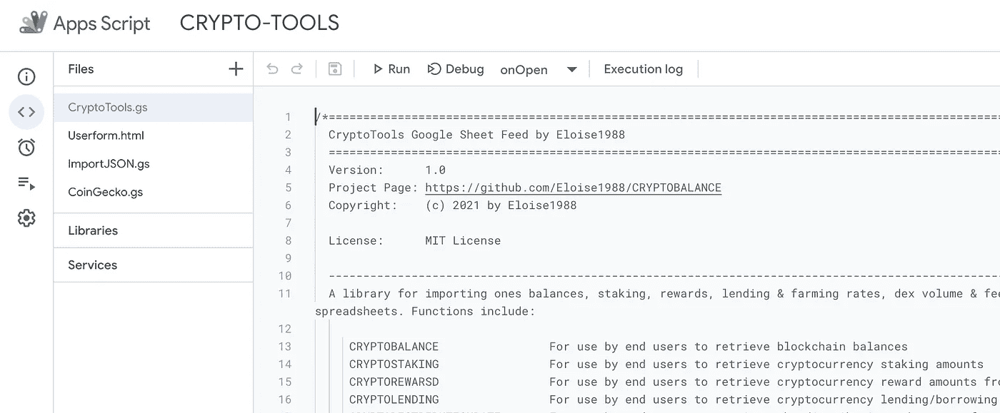

# 如何使用 Google Sheets 对你的以太坊投资组合进行估值？

> 原文：<https://medium.com/coinmonks/how-to-value-your-ethereum-portfolio-using-google-sheets-5947ce5c057a?source=collection_archive---------1----------------------->

简单的谷歌表单技巧来评估你的数字资产。复制该工作表并使其成为您自己的工作表。

> [试用:现场样张](https://docs.google.com/spreadsheets/d/1DaR4yKrDuJ6LkgpwbA5aqpXmwtKUmHrQ_uVPdPA2-cE/edit?usp=sharing)

Image : Portfolio Valuation Example using Google Sheets

起初，当我创建 CRYPTOTOOLS 时，我想用**这种私人的灵活方式来分析鲸鱼在区块链的动向，评估我所做的交易，寻找套利机会，并在谷歌工作表中计算统计数据**。后来朋友们感兴趣了，我就把它变得更有效率，把床单公开给大家。我希望你能从我的工作中受益。对于希望直接连接到我的 API 的开发人员，你可以在这里 [API 文档](https://app.swaggerhub.com/apis-docs/Eloise1988/Crypto-Tools)这样做。

我已经写了一个关于任何人如何自动检索股票&加密货币价格、来自区块链公共地址的加密余额、来自不同借贷平台的借贷和农业利率以及来自区块链股权证明的堆叠和奖励的媒体[。](/coinmonks/how-to-value-your-stocks-crypto-portfolio-in-google-sheets-22bb7b42c39d)

最近，我的用户要求他们用一个公式得到一个 ERC20 地址的总金额。

# 密码求和函数

我创建了 CRYPTOSUMETH 函数来直接获取任何 [ERC20](https://www.investopedia.com/news/what-erc20-and-what-does-it-mean-ethereum/) 地址上的美元总额。当您在同一个地址持有许多不同的硬币时，使用此功能比一次查看一个硬币更容易。

语法:***(地址，[可选刷新属性])***

****第一个参数:*** *存放密码的公共区块链地址。* ***第 2 个参数*** *一个可选的固定单元格用于自动刷新数据，此参数**

***举例**:多链资本 ERC20 估值*

*我们将以这个 poly chain Capital ERC 20([0x BCD 5000 F5 c 522856 e 710 C5 d 274 bb 672 B2 F2 eef BF](https://ethplorer.io/address/0xbcd5000f5c522856e710c5d274bb672b2f2eefbf))为例。*

**

*Source: [https://ethplorer.io/address/0xbcd5000f5c522856e710c5d274bb672b2f2eefbf](https://ethplorer.io/address/0xbcd5000f5c522856e710c5d274bb672b2f2eefbf)*

**

*Source: [https://etherscan.io/address/0xbcd5000f5c522856e710c5d274bb672b2f2eefbf](https://etherscan.io/address/0xbcd5000f5c522856e710c5d274bb672b2f2eefbf)*

*计算 Polychain Capital 的投资组合总额，并通过 Ethersan 和 Ethplorer 进行验证。*

*ERC20 美元总额+ ETH 美元总额= 5440 万美元*

*在 Google Sheet 中，为了检索该金额，您需要输入以下公式:*

> *= CRYPTOSUMETH(" 0x BCD 5000 F5 c 522856 e 710 C5 d 274 bb 672 B2 F2 eef BF ")*

**

*I used a second parameter in the formula which helps for automatic refresh. Each time the value in cell B1 is modified, it will automatically refresh the valuation. You can change the 6 into 5, it will then refresh.*

> *[试用:现场样张](https://docs.google.com/spreadsheets/d/1DaR4yKrDuJ6LkgpwbA5aqpXmwtKUmHrQ_uVPdPA2-cE/edit?usp=sharing)*

*以下是如何让这个公式在你的私人谷歌表单中发挥作用的方法*

# *代码设置:*

*您有两种选择来访问代码:*

*1-很简单，您复制一份模板表。当你这样做时，它会自动保存一个新的模板和代码。*

**

*[https://docs.google.com/spreadsheets/d/1DaR4yKrDuJ6LkgpwbA5aqpXmwtKUmHrQ_uVPdPA2-cE/edit?usp=sharing](https://docs.google.com/spreadsheets/d/1DaR4yKrDuJ6LkgpwbA5aqpXmwtKUmHrQ_uVPdPA2-cE/edit?usp=sharing)*

*2 —您需要将以下代码复制/粘贴到您希望使用的 Google Sheet 的应用程序脚本中。*

**

*Tools -Script Editor*

## *[此处有代码](https://raw.githubusercontent.com/Eloise1988/CRYPTOBALANCE/master/CRYPTOTOOLS_V2.gs)*

*更多细节可在以下介质中找到*

* [## Google Sheet 开源加密工具设置

### 目标:向用户展示如何在 Google Sheet 中轻松访问定制的内置 CryptoTools 公式:

medium.com](/the-cryptocurious/google-sheet-open-source-cryptotools-set-up-9420e3940a8a) 

对于那些对检索 ERC20 钱包中每种加密货币的余额感兴趣的人，可以使用以下函数。

# 密码平衡功能

在媒体[如何在 Google Sheets](/coinmonks/how-to-value-your-stocks-crypto-portfolio-in-google-sheets-22bb7b42c39d) 上给你的股票&加密组合估值中，我解释了如何在 ERC20 上找回每一枚硬币。如果您使用了加密余额功能，您将必须添加所有 86 种加密货币(瑞士法郎，YFI，踢，EBK 等..)以便获得整个美元余额。如果没有这种方法，它会变得令人不快而且很长。

出于示例的目的，如果您希望从 Polychain Capital 地址中检索 ETH 余额，您需要以这种方式使用 CRYPTOBALANCE 函数:

=CRYPTOBALANCE('ETH '，' 0x BCD 5000 f5c 522856 e 710 C5 d 274 bb 672 B2 F2 eef BF '，$A$1)

在 ticker 方面有重复的一些 ERC20 可以直接使用契约地址而不是 ticker 来调用。例如，在模板表中，为了获得 KICK TOKEN 金额，我们按以下方式调用函数:

= crypto balance(' 0x c 12d 1c 73 ee 7 DC 3615 ba 4 e 37 E4 abfdbddfa 38907 e '，' 0x BCD 5000 F5 c 522856 e 710 C5 d 274 bb 672 B2 F2 eef BF '，$A$1)

Kick Token Contract Address : 0xc12d1c73ee7dc3615ba4e37e4abfdbddfa38907e

所有细节都写在介质里。此外，如果您希望获得加密货币的价格，以便单独评估您的所有头寸，您可以使用 Google Sheets 中的 [CoinGecko 价格、交易量、市值中定义的 COINGECKO 函数。](/the-cryptocurious/coingecko-prices-volumes-market-caps-in-google-sheets-and-excel-a1a3ee201cb8)

# 结论:

这个媒介向您展示了如何使用一个 **ERC20** 地址在 **Google Sheet** 中检索**美元总估值**。公式如下:
**=CRYPTOSUMETH(ERC20 地址)**

= CRYPTOSUMETH(" 0x BCD 5000 F5 c 522856 e 710 C5 d 274 bb 672 B2 F2 eef BF ")

> [*谷歌工作表示例此处*](https://docs.google.com/spreadsheets/d/1DaR4yKrDuJ6LkgpwbA5aqpXmwtKUmHrQ_uVPdPA2-cE/edit?usp=sharing)

## 提神的

值被缓存 10 分钟。我的服务器每两分钟更新一次价格，但是为了优化 Google Sheets 上的 API 调用，数据以 10 分钟的时间表刷新。这就是为什么你会注意到价格上的小滞后。它可以直接在代码中修改。* 

**这是正在进行的工作。如果你发现错误，请不要犹豫让我知道。非常欢迎反馈。一个* [*电报聊天*](https://t.me/TheCryptoCurious) *也可供支持。如果这个项目为你增加了任何价值，或者正在你的谷歌表单上寻找个性化编码，请不要犹豫，留下你的信息。**

*非常感谢您花时间阅读本文。*

*在这个充满挑战的时代，照顾好你自己&你的家人！*

> *加入 coin monks[Telegram group](https://t.me/joinchat/Trz8jaxd6xEsBI4p)学习加密交易和投资*

## *另外，阅读*

*   *[什么是融资融券交易](https://blog.coincodecap.com/margin-trading)*
*   *最好的[密码交易机器人](/coinmonks/crypto-trading-bot-c2ffce8acb2a) | [网格交易](https://blog.coincodecap.com/grid-trading)*
*   *[3 商业评论](/coinmonks/3commas-review-an-excellent-crypto-trading-bot-2020-1313a58bec92) | [Pionex 评论](/coinmonks/pionex-review-exchange-with-crypto-trading-bot-1e459d0191ea) | [Coinrule 评论](/coinmonks/coinrule-review-2021-a-beginner-friendly-crypto-trading-bot-daf0504848ba)*
*   *[AAX 交易所评论](/coinmonks/aax-exchange-review-2021-67c5ea09330c) | [德里比特评论](/coinmonks/deribit-review-options-fees-apis-and-testnet-2ca16c4bbdb2) | [FTX 交易所评论](/coinmonks/ftx-crypto-exchange-review-53664ac1198f)*
*   *[n rave ZERO Review](/coinmonks/ngrave-zero-review-c465cf8307fc)|[phe MEX Review](/coinmonks/phemex-review-4cfba0b49e28)|[PrimeXBT Review](/coinmonks/primexbt-review-88e0815be858)*
*   *[Bybit 交易所评论](/coinmonks/bybit-exchange-review-dbd570019b71) | [Bityard 评论](/coinmonks/bityard-review-7d104239be35) | [CoinSpot 评论](https://blog.coincodecap.com/coinspot-review)*
*   *[3 commas vs crypto hopper](/coinmonks/3commas-vs-pionex-vs-cryptohopper-best-crypto-bot-6a98d2baa203)|[赚取加密利息](/coinmonks/earn-crypto-interest-b10b810fdda3)*
*   *最好的比特币[硬件钱包](/coinmonks/the-best-cryptocurrency-hardware-wallets-of-2020-e28b1c124069?source=friends_link&sk=324dd9ff8556ab578d71e7ad7658ad7c) | [BitBox02 回顾](/coinmonks/bitbox02-review-your-swiss-bitcoin-hardware-wallet-c36c88fff29)*
*   *[莱杰 vs n rave](/coinmonks/ledger-vs-ngrave-zero-7e40f0c1d694)|[莱杰 nano s vs x](/coinmonks/ledger-nano-s-vs-x-battery-hardware-price-storage-59a6663fe3b0) | [币安评论](/coinmonks/binance-review-ee10d3bf3b6e)*
*   *[加密复制交易平台](/coinmonks/top-10-crypto-copy-trading-platforms-for-beginners-d0c37c7d698c) | [Coinmama 评论](/coinmonks/coinmama-review-ace5641bde6e)*
*   *[CoinLoan 评论](/coinmonks/coinloan-review-18128b9badc4) | [YouHodler 评论](/coinmonks/youhodler-4-easy-ways-to-make-money-98969b9689f2) | [BlockFi 评论](/coinmonks/blockfi-review-53096053c097)*
*   *最好的[加密税务软件](/coinmonks/best-crypto-tax-tool-for-my-money-72d4b430816b) | [硬币追踪评论](/coinmonks/cointracking-review-a-reliable-cryptocurrency-tax-software-5114e3eb5737)*
*   *最佳[加密借贷平台](/coinmonks/top-5-crypto-lending-platforms-in-2020-that-you-need-to-know-a1b675cec3fa) | [杠杆令牌](/coinmonks/leveraged-token-3f5257808b22)*
*   *[block fi vs Celsius](/coinmonks/blockfi-vs-celsius-vs-hodlnaut-8a1cc8c26630)|[Hodlnaut Review](/coinmonks/hodlnaut-review-best-way-to-hodl-is-to-earn-interest-on-your-bitcoin-6658a8c19edf)*
*   *[Bitsgap 评审](/coinmonks/bitsgap-review-a-crypto-trading-bot-that-makes-easy-money-a5d88a336df2) | [Quadency 评审](/coinmonks/quadency-review-a-crypto-trading-automation-platform-3068eaa374e1) | [Bitbns 评审](/coinmonks/bitbns-review-38256a07e161)*
*   *[埃利帕尔泰坦评论](/coinmonks/ellipal-titan-review-85e9071dd029) | [赛克斯斯通评论](/coinmonks/secux-stone-hardware-wallet-review-15-discount-coupon-2020-7577032faa6e)*
*   *[本地比特币评论](/coinmonks/localbitcoins-review-6cc001c6ed56) | [加密货币储蓄账户](https://blog.coincodecap.com/cryptocurrency-savings-accounts)*
*   *最佳[区块链分析](https://bitquery.io/blog/best-blockchain-analysis-tools-and-software)工具| [赚比特币](/coinmonks/earn-bitcoin-6e8bd3c592d9)*
*   *[加密套利](/coinmonks/crypto-arbitrage-guide-how-to-make-money-as-a-beginner-62bfe5c868f6)指南| [如何做空比特币](/coinmonks/how-to-short-bitcoin-568a2d0b4ae5)*
*   *最佳[加密制图工具](/coinmonks/what-are-the-best-charting-platforms-for-cryptocurrency-trading-85aade584d80) | [最佳加密交易所](/coinmonks/crypto-exchange-dd2f9d6f3769)*
*   *[如何在印度购买比特币？](/coinmonks/buy-bitcoin-in-india-feb50ddfef94) | [瓦济克斯审查](/coinmonks/wazirx-review-5c811b074f5b)*
*   *[印度比特币交易所](/coinmonks/bitcoin-exchange-in-india-7f1fe79715c9) | [比特币储蓄账户](/coinmonks/bitcoin-savings-account-e65b13f92451)*
*   *[CoinDCX 评论](/coinmonks/coindcx-review-8444db3621a2) | [加密保证金交易交易所](https://blog.coincodecap.com/crypto-margin-trading-exchanges)*