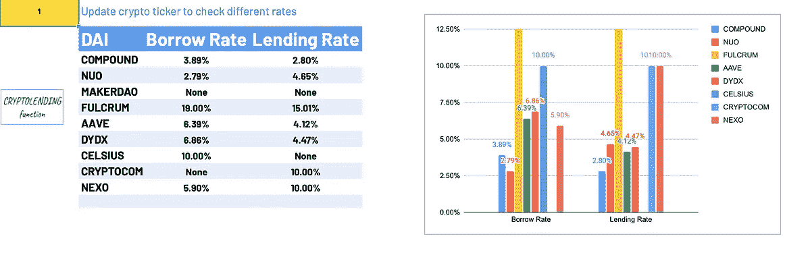
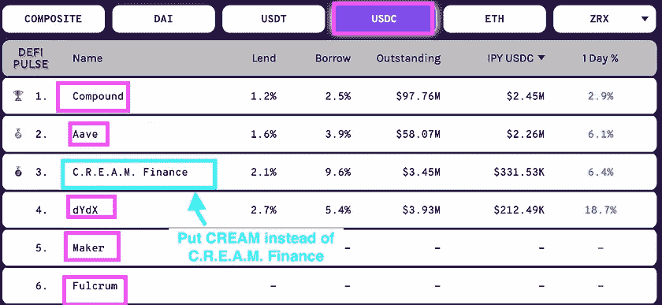

# 如何在 Google Sheets 上评估你的股票和加密投资组合

> 原文：<https://medium.com/coinmonks/how-to-value-your-stocks-crypto-portfolio-in-google-sheets-22bb7b42c39d?source=collection_archive---------0----------------------->

简单的谷歌资产负债表工具来评估你的加密和股票资产。复制该工作表并使其成为您自己的工作表。

> 试用:[现场样张](https://docs.google.com/spreadsheets/d/19aZM9IVdexcvb5U4gnC4TKOotgtkgxcEjGzMGv6OxyU/edit?usp=sharing)


Image : Portfolio Valuation Example using Google Sheets, Duplicate and Make it your own

起初，当我创建 CRYPTOTOOLS 时，我想用**这种私人的灵活方式来分析鲸鱼在区块链的动向，评估我所做的交易，寻找套利机会，并在谷歌工作表中计算统计数据**。后来朋友们感兴趣了，我就把它做得更有效率，把代码公开给大家。我希望你能从我的工作中受益。对于希望直接连接到我的 API 的开发人员，请告诉我。我将做必要的工作来创建一个 [API 文档](https://app.swaggerhub.com/apis-docs/Eloise1988/Crypto-Tools)。本文的目的是展示任何人如何自动检索股票&加密货币价格、来自公共区块链地址的加密余额、来自不同借贷平台的[借贷](https://www.coindesk.com/crypto-investment-research/crypto-lending-101)和[农业](https://www.coindesk.com/defi-yield-farming-comp-token-explained)利率，以及来自[股权证明【区块链】](https://en.wikipedia.org/wiki/Proof_of_stake)的[堆叠](https://help.coinbase.com/en/coinbase/trading-and-funding/other/staking-on-coinbase#:~:text=Staking%20is%20the%20process%20of,transactions%20and%20earn%20Staking%20rewards.)和奖励。


Custom Built-In Crypto Functions in Google Sheets

这些是我自己创建的自定义内置函数。您可以在任何 Google Sheets 中使用和复制代码。复制下面的 [**开源 Google Sheet**](https://docs.google.com/spreadsheets/d/11RyWEPetyB-l-WLYHZGy1Nx-PXZ3ZmY2Ej64UyZ8Ha0/edit?usp=sharing) 并使之成为你自己的。或者去 Github repo，把下面的代码[**CryptoTools**](https://raw.githubusercontent.com/Eloise1988/CRYPTOBALANCE/master/CRYPTOTOOLS_V2.gs)+[**GeckoPrices**](https://raw.githubusercontent.com/Eloise1988/COINGECKO/master/CoinGeckoV2.gs)上传到你在 Google Sheets 的脚本编辑器里。在这个媒介的最后，我引用了一篇“如何在 Google Sheets 中上传 javascript 代码”。


You can edit the template, just make sure you don’t override it and destroy the formulas. If you want to make the sheet your own, you will need to go in Files and make a copy or click on the blue link.

我将描述每个功能，以及它们的用途和使用方法。为了让用户更容易熟悉公式，我创建了一个用于测试的 Google 工作表模板:

用于实践学习的谷歌模板。

出于隐私考虑，如果您想创建自己的表单，请单击蓝色的复制链接，它将创建一个表单的副本，并将其保存到您的 Google Drive 帐户。

# 如何给你的加密货币估值？

**获取 CoinGecko 加密货币价格**

[Coingecko](https://www.coingecko.com/en) 和 [CoinMarketCap](https://coinmarketcap.com/) 一样，是一个实时加密货币价格提供商。


[https://www.coingecko.com/en](https://www.coingecko.com/en)

GECKOPRICE **自定义内置**函数将 [CoinGecko 的加密货币价格](https://www.coingecko.com/en)导入到 Google 电子表格中。 [**代码**](https://raw.githubusercontent.com/Eloise1988/COINGECKO/master/CoinGeckoV2.gs) 完全开源，直接连接 CoinGecko 提供的 API。对于那些对获得 Excel 的 VBA 代码感兴趣的人来说， [**这里就是**](https://raw.githubusercontent.com/Eloise1988/COINGECKO/master/CoinGecko.bas) 。

价格馈送在单元格中接收。默认情况下，数据被转换成一个浮点数，所以看起来更像一个普通的价格提要。


**壁虎功能**

语法: **GECKOPRICE(股票代码，货币，[可选刷新属性])**

示例: **GECKOPRICE("BTC "，"美元")**

***第一个参数:*** *您要从中获取价格的加密货币股票，例如 BTC。* ***第二参数:*** *法定货币 ex:美元、欧元、GPB 等……****第三参数*** *一个可选的固定单元格，用于自动刷新数据，此参数*


CoinGecko Google Sheet Formula GECKOPRICE


Left Panel Getting Ethereum’s price in Euros-> =GECKOPRICE(“ETH”,”EUR”) — Right Panel Bitcoin’s price in Dollars -> =GECKOPRICE(“BTC”,”USD”)

> 试用:实时[样本表](https://docs.google.com/spreadsheets/d/19aZM9IVdexcvb5U4gnC4TKOotgtkgxcEjGzMGv6OxyU/edit?usp=sharing)，转到表名组合示例

有关 CoinGecko 所有公式的更多信息，请参考下面的[介质](/the-cryptocurious/coingecko-prices-volumes-market-caps-in-google-sheets-and-excel-a1a3ee201cb8)。

# **如何用 GOOGLEFINANCE 函数对股票价格进行估值？**

[GOOGLEFINANCE 功能](https://support.google.com/docs/answer/3093281?hl=en)允许你将实时金融和货币市场数据直接导入 Google Sheets。除了使您能够跟踪当前的股票和股份信息之外，它还可以用于检索历史证券数据。

[该函数](https://blog.sheetgo.com/google-sheets-formulas/googlefinance-formula-google-sheets/)从 Google Finance web 应用程序导入数据，该应用程序提供每日股票价格、货币和金融市场新闻以及其他市场趋势信息。像所有其他谷歌应用程序一样，可以从谷歌菜单访问谷歌金融，或者只需在谷歌上搜索一只股票，这将显示与该股票相关的谷歌金融信息。

语法: **GOOGLEFINANCE(ticker，[attribute])**


https://finance.yahoo.com/quote/AAPL/

在左边的例子中，我展示了如何获取苹果的股票价格(“AAPL”:股票代码)。

**=GOOGLEFINANCE("AAPL")**

# **如何从加密货币区块链地址中检索余额？**

## 密码平衡功能

CRYPTOBALANCE 功能将帮助您从一个公开的区块链地址实时获得任何人的钱包余额。它目前持有**100 多种区块链和 1000 多种加密货币**。

语法:***CRYPTOBALANC*E(ticker，address，[可选刷新属性])**

***第一个参数:*** *您要从中获取价格的加密货币股票，例如 BTC。* ***第二个参数:*** *存放密码的公共区块链地址。* ***第 3 个参数*** *一个可选的固定单元格用于自动刷新数据，此参数*


Verify the balance from CRYPTOBALANCE with what you get on Blockchain.com

**举例**币安 BTC 冷钱包余额:

**=CRYPTOBALANCE("BTC "，" 34xp 4 vrocgjym 3 xr 7 ycvpfhocnxv 4 twseo "，$A$1)**


=CRYPTOBALANCE(“BTC”,“34xp4vRoCGJym3xR7yCVPFHoCNxv4Twseo”, $A$1) (Old screenshot from Aug 2019)

> 试用:实时[样本表](https://docs.google.com/spreadsheets/d/19aZM9IVdexcvb5U4gnC4TKOotgtkgxcEjGzMGv6OxyU/edit?usp=sharing)，转到表名组合示例

你可以检查所有可用的加密货币

> [ERC20-BEP20](https://raw.githubusercontent.com/Eloise1988/CRYPTOBALANCE/master/COINS/ALL_ERC20_BEP20.md)

>[其他区块链](https://raw.githubusercontent.com/Eloise1988/CRYPTOBALANCE/master/COINS/ALL_COINS.md)

>[押硬币](https://raw.githubusercontent.com/Eloise1988/CRYPTOBALANCE/master/COINS/STAKING.md)

>[奖励币](https://raw.githubusercontent.com/Eloise1988/CRYPTOBALANCE/master/COINS/REWARDS.md)

如果你想使用新的加密货币，请不要犹豫，在 https://t.me/TheCryptoCurious[告诉我。如果你想了解更多关于密码平衡的细节，](https://t.me/TheCryptoCurious)[你可以在这里找到我发表的第一篇关于函数](/the-cryptocurious/pull-crypto-wallet-balance-directly-on-google-sheets-ca4805613c0e)的文章。

## **来自 ERC20 合同地址的余额**

**unis WAP 余额示例:**

**合同地址:**0x1f 9840 a 85 D5 af 5 BF 1d 1762 f 925 bdaddc 4201 f 984
**持有人地址**:[0xe 3953 d9 d 317 b 834592 ab 58 ab 2c 7 a6 ad 22 b 54075d](https://etherscan.io/token/0x1f9840a85d5af5bf1d1762f925bdaddc4201f984?a=0xe3953d9d317b834592ab58ab2c7a6ad22b54075d)


**= CRYPTOBALANCE("**0x 1f 9840 a 85 D5 af 5 BF 1d 1762 f 925 bdaddc 4201 f 984**"，"**0x e 3953 d9 d 317 b 834592 ab 58 ab 2c 7 a6 ad 22 b 54075d**"**


## BEP20 合同地址的余额

[**BEP-20**](https://academy.binance.com/en/glossary/bep-20) 是币安智能链上的[令牌](https://academy.binance.com/en/glossary/token)标准，扩展了 [ERC-20](https://academy.binance.com/en/articles/an-introduction-to-erc-20-tokens)

**示例 Pancakeswap 余额:合同地址:**0x 0e 09 fabb 73 BD 3 ade 0 a 17e cc 321 FD 13 a 19 e 81 ce 82
**持有人地址**:[0x 000000000000000000000000000000 dead](https://bscscan.com/token/0x0e09fabb73bd3ade0a17ecc321fd13a19e81ce82?a=0x000000000000000000000000000000000000dead)

要使 BEP20 合同地址有效，您需要在前面加上一个 **b，如下所示。它将向算法表明，你正在币安智能链上寻找平衡。**

**= CRYPTOBALANCE(" b**0x 0e 09 fabb 73 BD 3 ade 0 a 17 ECC 321 FD 13 a 19 e 81 ce 82**"，"**0x 000000000000000000000000000000000000000004**"】**


## 其他特殊情况

在其他访问 matic、avax、fantom、moonriver 智能链上的余额时，您可以使用以下规则:

```
............................  Special Cases ................  =CRYPTOBALANCE("ERC20 contract address","ERC20 holder address") =CRYPTOBALANCE("b"+ "BEP20 contract address","holder address") =CRYPTOBALANCE("m"+ "MATIC contract address", "holder address") =CRYPTOBALANCE("a"+ "AVAX contract address", "holder address") =CRYPTOBALANCE("f"+ "FANTOM contract address", "holder address") =CRYPTOBALANCE("movr"+ "MOONRIVER contract address", "holder address")

 =CRYPTOBALANCE("TEZOS contract address","holder address") =CRYPTOBALANCE("SOLANA contract address","holder address")
```

## 密码求和函数

我创建了 CRYPTOSUMETH 函数来直接获取任何 [ERC20](https://www.investopedia.com/news/what-erc20-and-what-does-it-mean-ethereum/) 地址上的美元总额。当您在同一个地址持有许多不同的硬币时，使用此功能比一次查看一个硬币更容易。

语法:***(地址，【可选刷新属性】)***

****第一个参数:*** *存放密码的公共区块链地址。* ***第二个参数*** *一个可选的固定单元格用于自动刷新数据，此参数**

**

*Total USD amount [https://ethplorer.io/address/0xbaa12224fc95be819df67f63d3f981542e275cb2](https://ethplorer.io/address/0xbaa12224fc95be819df67f63d3f981542e275cb2)*

**

*Total ERC20 USD Amount + ETH USD Amount = $57'690,13*

*如果您使用了加密余额功能，您必须添加所有 72 种加密货币(MKR、SNT、TKN、OMG 等..)以便获得整个美元余额。如果没有这种方法，它将会是令人讨厌的和相当长的时间。我在几个小时的差异内拍摄了所有这些截图，这就是为什么您会注意到下面 CRYPTOSUMETH 函数上的美元金额差异:*

****

*=CRYPTOSUMETH(“0xbaa12224fc95be819df67f63d3f981542e275cb2”)*

*[有关更多实时示例，请访问工作表名称投资组合示例。](https://docs.google.com/spreadsheets/d/11RyWEPetyB-l-WLYHZGy1Nx-PXZ3ZmY2Ej64UyZ8Ha0/edit?usp=sharing)*

# *如何从借贷平台获取借贷利率和养殖收益率？*

## *2021 年 1 月更新:加密养殖“已弃用”*

*如果你想在借贷平台上套利，CRYPTOLENDING & CRYPTOFARMING 功能将会对你有用。或者，如果你需要记录或计算你从[借贷](https://www.coindesk.com/crypto-investment-research/crypto-lending-101) / [种植](https://www.coindesk.com/defi-yield-farming-comp-token-explained)加密货币中获得的加密货币金额。*

**

*Image : Import directly in your Google Sheets yield farming rates and DeFi lending rates*

***密码借贷功能***

*我创建了 **CRYPTOLENDING 函数**来返回不同**借贷平台**的加密货币借贷利率。以下是一些平台和硬币的列表，你可以检索利率:*

> *[***马克尔道***](https://mkr.tools/)***——***[***复合***](https://compound.finance/)***——***[***DYD***](https://dydx.exchange/)*X—*[***NUO***](https://nuo.network/)***——****

**您可以通过以下公式获得**借贷 APR(年化利率)**:**

***语法:* ***CRYPTOLENDING(平台，跑马灯，侧面*，【可选刷新属性】)****

**我为任何希望获得费率的人开放源代码。APR 贷款/借款利率直接取自[coin market ca](https://interest.coinmarketcap.com/)p&[defi pulse](https://defipulse.com/defi-lending)。**

**下图显示了 DefiPulse 的比率。如果你想得到 USDC 的复利贷款利率，公式是**

****CRYPTOLENDING("复合"、" USDC "、" APR_LEND")****

********

**LENDING RATE EXAMPLE SHEET**

**如果你想得到 USDC 在 C . r . e . a . m . Finance 上的借款利率，公式是 CRYPTOLENDING(“奶油”、“USDC”、“APR_BORROW”)。有关此功能的更多信息，请参考下面的[中间文章](/the-cryptocurious/arbitrage-get-realtime-lending-rates-from-defi-platforms-dee24830ee85)或转到[贷款利率示例表](https://docs.google.com/spreadsheets/d/11RyWEPetyB-l-WLYHZGy1Nx-PXZ3ZmY2Ej64UyZ8Ha0/edit?usp=sharing)。**

****隐耕功能****

**收益农业，也被称为[流动性](https://academy.binance.com/en/articles/liquidity-explained)开采，是一种通过持有加密货币产生回报的方式。简单来说就是锁定加密货币，获得奖励。**

****高产养殖平台****

****

**CryptoTools Template Sheet DEFI LENDING — YIELD FARMING**

*   **[复合金融](https://academy.binance.com/en/articles/what-is-yield-farming-in-decentralized-finance-defi#compound-finance)**
*   **[马克尔道](https://academy.binance.com/en/articles/what-is-yield-farming-in-decentralized-finance-defi#makerdao)**
*   **[合成酶](https://academy.binance.com/en/articles/what-is-yield-farming-in-decentralized-finance-defi#synthetix)**
*   **[Aave](https://academy.binance.com/en/articles/what-is-yield-farming-in-decentralized-finance-defi#aave)**
*   **[Uniswap](https://academy.binance.com/en/articles/what-is-yield-farming-in-decentralized-finance-defi#uniswap)**
*   **[曲线金融](https://academy.binance.com/en/articles/what-is-yield-farming-in-decentralized-finance-defi#curve-finance)**
*   **[平衡器](https://academy.binance.com/en/articles/what-is-yield-farming-in-decentralized-finance-defi#balancer)**
*   **[向往.金融](https://academy.binance.com/en/articles/what-is-yield-farming-in-decentralized-finance-defi#yearn-finance)**

***语法:* ***【密码农业】(项目名称，股票代码，期间*，【可选刷新属性】)****

****

**[https://coinmarketcap.com/yield-farming/](https://coinmarketcap.com/yield-farming/)**

**上图显示了一些可用的项目名称和代号。如需完整列表，请访问 https://coinmarketcap.com/yield-farming/或联系我。有 4 个不同的周期，每天“D”，每周“W”，每月“M”和每年“Y”。**

**如何检索寿司上的 DAI-ETH 的每周农业产量？**

**解决方案:**隐农("寿司"、"戴-ETH "、" W")****

# ****赌注&来自赌注证明的奖励** e 区块链**

**[押注加密货币](https://cryptotips.eu/en/knowledge-base/what-is-cryptocurrency-staking/#:~:text=Staking%20cryptocurrency%20means%20that%20you,passive%20income%20by%20holding%20coins.)意味着你持有[加密货币](https://cryptotips.eu/en/knowledge-base/what-is-cryptocurrency/)来验证交易和支持网络。作为持有密码和强化网络的交换，你将获得奖励。你也可以称之为兴趣。通过下注，你可以通过持有硬币获得被动收入。**

**CRYPTOSTAKING 和 CRYPTOREWARDS 是我创建的两个功能，目的是获得赌注的金额以及赌注的回报。这两个功能显示在名为[赌注—奖励— TEZOS 示例的表格中。](https://docs.google.com/spreadsheets/d/11RyWEPetyB-l-WLYHZGy1Nx-PXZ3ZmY2Ej64UyZ8Ha0/edit?usp=sharing)**

****

**Tezos example of the use of the Staking & Reward function on Google Sheets**

**有关这两个功能的更多信息，请参考以下媒体文章中的[。](/the-cryptocurious/staking-balances-rewards-on-pos-tokens-tezos-cosmos-nano-eos-6353dcc1553f)**

# **未来发展卓越**

**为了增加隐私，也为了习惯用 excel 工作的人，我在 **Excel** 上创建了一个测试版。截至目前，它只适用于微软。如果你熟悉 VBA，你可以自己检查一下，从 Github 这里下载代码:**

*   **[](https://raw.githubusercontent.com/Eloise1988/COINGECKO/master/CoinGecko.bas)**
*   ****[**密码工具**](https://raw.githubusercontent.com/Eloise1988/CRYPTOBALANCE/master/Cryptotools_MSFT.bas)****

****这些代码版本是非常初步。如果您需要帮助和个性化，或者想要直接接收 excel 文件，请随时通过[电报聊天](https://t.me/TheCryptoCurious)联系我或在评论中留言。****

# ****Github 开源设置****

****如果你想了解更多关于如何将 javascript 代码直接集成到你的谷歌表单中的信息，请参考下面的 [**媒体文章**](/the-cryptocurious/google-sheet-open-source-cryptotools-set-up-9420e3940a8a) 。****

# ****结论****

****您现在应该能够:****

****a.**价值加密货币**和股票价格****

****b.**从加密货币区块链地址检索余额******

****c.从贷款平台获得贷款利率和农业产量****

****d.**从区块链的赌注凭证中获得赌注和奖励******

****简单的谷歌资产评估技巧**，无需依赖第三方应用**。复制该工作表并使其成为您自己的工作表。****

> ****[访问现场样张](https://docs.google.com/spreadsheets/d/19aZM9IVdexcvb5U4gnC4TKOotgtkgxcEjGzMGv6OxyU/edit?usp=sharing)****

> ****这是正在进行的工作。如果你发现错误，请不要犹豫让我知道。非常欢迎反馈。一个[电报聊天](https://t.me/TheCryptoCurious)也可用于支持。如果这个项目为你增加了任何价值，或者正在你的谷歌表单上寻找个性化编码，请不要犹豫，留下你的信息。感谢您的阅读。****

## ****另外，阅读****

*   ****[密码电报信号](http://Top 4 Telegram Channels for Crypto Traders) | [密码交易机器人](/coinmonks/crypto-trading-bot-c2ffce8acb2a)****
*   ****[复制交易](/coinmonks/top-10-crypto-copy-trading-platforms-for-beginners-d0c37c7d698c) | [加密税务软件](/coinmonks/crypto-tax-software-ed4b4810e338)****
*   ****[网格交易](https://coincodecap.com/grid-trading) | [加密硬件钱包](/coinmonks/the-best-cryptocurrency-hardware-wallets-of-2020-e28b1c124069)****
*   ****[印度的加密交易所](/coinmonks/crypto-exchange-dd2f9d6f3769) | [印度的加密应用](/coinmonks/buy-bitcoin-in-india-feb50ddfef94)****
*   ****开发人员的最佳加密 API****
*   ****最佳[加密贷款平台](/coinmonks/top-5-crypto-lending-platforms-in-2020-that-you-need-to-know-a1b675cec3fa)****
*   ****杠杆代币的终极指南****
*   ****[比特币基地僵尸程序](/coinmonks/coinbase-bots-ac6359e897f3) | [AscendEX 审查](/coinmonks/ascendex-review-53e829cf75fa) | [OKEx 交易僵尸程序](/coinmonks/okex-trading-bots-234920f61e60)****
*   ****[如何在印度购买比特币？](/coinmonks/buy-bitcoin-in-india-feb50ddfef94) | [瓦济克斯审查](/coinmonks/wazirx-review-5c811b074f5b)****
*   ****[加密交易机器人](/coinmonks/crypto-trading-bot-c2ffce8acb2a) | [Probit 审查](https://coincodecap.com/probit-review)****
*   ****[隐翅虫替代品](/coinmonks/cryptohopper-alternatives-d67287b16d27) | [HitBTC 审查](/coinmonks/hitbtc-review-c5143c5d53c2)****
*   ****[CBET 点评](https://coincodecap.com/cbet-casino-review) | [库币 vs 比特币基地](https://coincodecap.com/kucoin-vs-coinbase)****