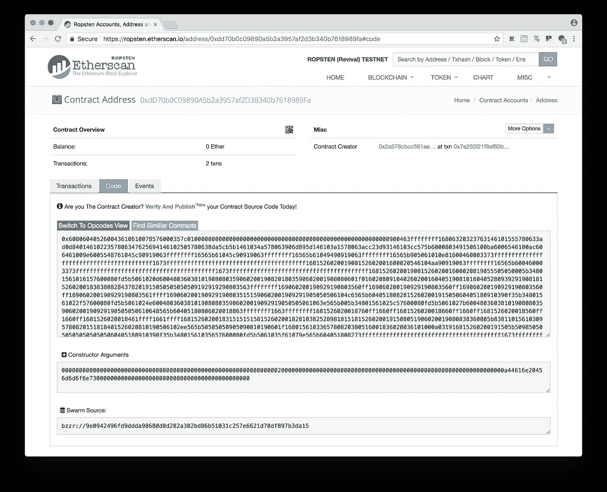
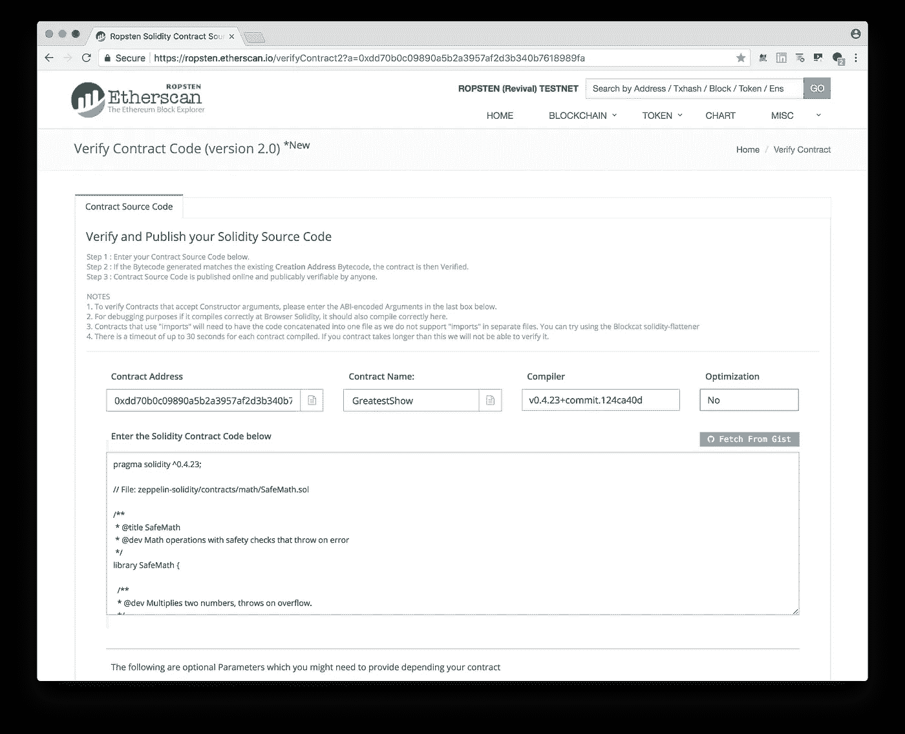
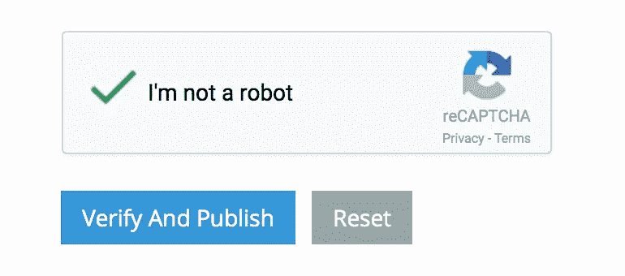
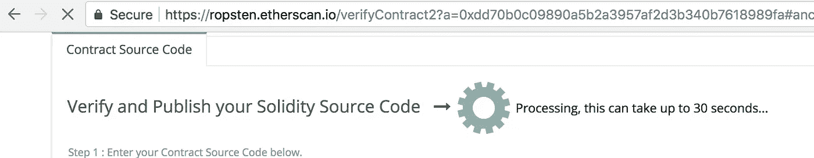
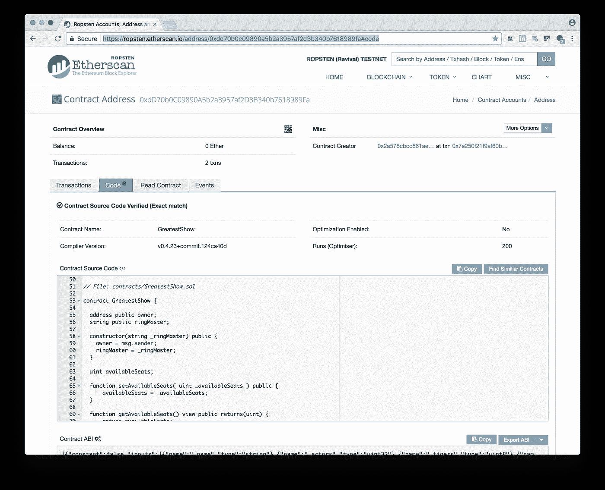

# 如何在 Etherscan 上验证和发布

> 原文：<https://medium.com/coinmonks/how-to-verify-and-publish-on-etherscan-52cf25312945?source=collection_archive---------2----------------------->

# how to guidl(4/n)系列—验证您的智能合同代码

> 当你将代码部署到公共、开放、抗全球审查的以太坊区块链时，你在期待你的智能合约所提供的功能和服务将被全世界的参与者所使用。因此，做一个区块链社区的好管家，帮助你的用户相信代码会做你声称它会做的事情是很重要的。


Auditors and critics play an important role in the Blockchain world to ensure the code works as intended.

我们将使用在[# how to guidl::Deploy](/coinmonks/complete-walkthrough-deploy-a-smart-contract-to-development-ropsten-and-mainnet-howtobuidl-a7d1a89fa75a)文章中引用的项目。

> [发现并回顾最佳区块链软件](https://coincodecap.com)

做好区块链原理的管家主要有两种方式:
1。使用开源库——可以跟踪新的开发&共享
2。验证智能合同代码—允许人们在使用之前验证代码

> 不要相信，但要核实。这就是咒语。

当你希望某人使用你写的智能合同时，无论是为了资金转移还是数据存储，你都希望他们对可能产生重大影响的交易进行数字签名。在你把这种期望强加给你的合同的用户之前，你应该把相同的源代码上传到 Etherscan，这样你至少给用户一个机会来审计代码，以*独立地验证*将要执行的代码实际上*做了你所说的事情。*

> 经过验证的代码应该是一种期望，而不是渴望。

例如，如果预期向合同发送特定数量乙醚的用户将被分配给给定汇率的相应价值的代币或票证，则他们应该能够通过直观地检查代码中的逻辑来看出合同的作者没有说谎。此外，对代码的独立审计可以发现关键的*漏洞*，这些漏洞将导致人们损失资金，或者企业遭受严重的资金损失，这将使任何投资或购买任何公用事业令牌/票证对智能合同的所有其他参与者来说都是无用的。

[*部署*智能契约](/coinmonks/complete-walkthrough-deploy-a-smart-contract-to-development-ropsten-and-mainnet-howtobuidl-a7d1a89fa75a)的行为仅仅是上传契约的**字节码**，这是以太坊虚拟机(EVM)需要的全部，但这是**不是人类可读的代码。**验证代码是您的智能合约的*扁平*可靠性代码。这意味着，如果你的契约继承自另一个契约或者使用类似于`SafeMath`的东西作为*库，*那么这些代码也应该包含在上传的代码中。

## 验证和发布 Solidity 源代码的步骤

1.  输入您的合同来源代码。
2.  如果生成的字节码与现有的创建地址字节码匹配，那么就验证契约。
3.  合同源代码是公开的，任何人都可以公开验证。

在部署您的智能合同之后，正如我们在`ComeOneComeAll` [项目](https://github.com/emmonspired/ComeOneComeAll)中为`GreatestShow`所做的那样，您可以立即访问 Etherscan，并在其部署的[地址](https://ropsten.etherscan.io/address/0xdd70b0c09890a5b2a3957af2d3b340b7618989fa)查看合同。如您所见，**代码**标签显示了一串随机出现的十六进制数字，以 0x60806 开始……这是已部署的`GreatestShow`的实际`byteCode`，也是创建合同的构造函数参数。再说一次，这对 EVM 来说没问题，但是我们需要帮助那些想看代码的人。

点击 ***验证发布*** 链接。



*提示:查看一下* [*新的 Beta 源代码契约验证器*](https://ropsten.etherscan.io/verifyContract2?a=0xdd70b0c09890a5b2a3957af2d3b340b7618989fa) *，它支持用于验证 Truffle 部署契约的“运行”选项。如果你的合同使用了库并且验证失败，你也可以尝试使用 beta 源代码验证器。*

> https://ropsten.etherscan.io/verifyContract2?a=这里

您应该在**验证合同代码(版本 2.0)*新**屏幕上。

键入*合同名称*，在我们的例子中是`GreatestShow`，以及我们部署时使用的编译器版本。将*优化*设为“否”。如果您不记得您使用的是什么版本，请在项目的命令行中键入`truffle version`。输出如下所示:

```
Truffle v4.1.7 (core: 4.1.7)
Solidity v0.4.23 (solc-js)
```

所以我们会为*编译器*选择 v 0 . 4 . 23+提交版本



Contract Name, Compiler version and flattened Solidity Contract code are required.

我们将安装一个工具来帮助我们生成扁平的可靠性代码。

> 这个工具帮助你在 [Etherscan](https://etherscan.io/) 上验证用 Truffle 开发的合同，或者在 [Remix](https://remix.ethereum.org/) 上调试它们，通过以正确的顺序合并你的文件和它们的依赖关系。

```
npm install --save-dev truffle-flattener
```

接下来，我们将使用 [truffle-flattener](https://www.npmjs.com/package/truffle-flattener) 工具构建一个文本文件。

```
truffle-flattener ./contracts/GreatestShow.sol > ./GreatestShowFlattened.sol
```

在苹果电脑上，你可以使用`pbcopy`工具将文本复制到剪贴板。

```
pbcopy < GreatestShowFlattened.sol
```



然后，返回到 Etherscan 验证窗口并粘贴它。单击“我不是机器人”reCaptcha。接下来你会看到一个齿轮旋转的动画 gif。



Etherscan Verification of Solidity Source Code is considered a Smart Contract Best Practice.

Tada！成功验证后，您就大功告成了。只要在这个验证步骤中编译和测试的字节码与先前上传的字节码匹配，您就会知道您的**契约源代码已经过验证(精确匹配)**。如果不匹配，就不验证。即使修改一行代码来欺骗用户也很容易被发现。现在你可以自豪地将用户和潜在的新客户发送到你发布的&验证过的[代码](https://ropsten.etherscan.io/address/0xdd70b0c09890a5b2a3957af2d3b340b7618989fa#code)和 Github [项目](https://github.com/emmonspired/ComeOneComeAll)供他们阅读。

值得称赞。你刚刚在开源和加密社区获得了分数。



*丹·埃蒙斯(Dan Emmons)是* [*埃蒙斯皮雷有限责任公司*](http://www.emmonspired.com/) *的所有者，a* [*认证比特币专业人士*](http://cryptoconsortium.org/lookup/6f0d14) *，认证以太坊开发者，全栈开发者，加密货币项目顾问。他还是一个名为*[*# ByteSizeBlockchain*](https://www.youtube.com/watch?v=SVBZ7mdgGcA)*的 Youtube 频道和 iTunes 播客的创作者。*

> 加入 Coinmonks [电报频道](https://t.me/coincodecap)和 [Youtube 频道](https://www.youtube.com/c/coinmonks/videos)获取每日[加密新闻](http://coincodecap.com/)

## 另外，阅读

*   [复制交易](/coinmonks/top-10-crypto-copy-trading-platforms-for-beginners-d0c37c7d698c) | [加密税务软件](/coinmonks/crypto-tax-software-ed4b4810e338)
*   [网格交易](https://coincodecap.com/grid-trading) | [加密硬件钱包](/coinmonks/the-best-cryptocurrency-hardware-wallets-of-2020-e28b1c124069)
*   [密码电报信号](http://Top 4 Telegram Channels for Crypto Traders) | [密码交易机器人](/coinmonks/crypto-trading-bot-c2ffce8acb2a)
*   [Pionex 双投](https://coincodecap.com/pionex-dual-investment) | [AdvCash 审核](https://coincodecap.com/advcash-review) | [光宗耀祖审核](https://coincodecap.com/uphold-review)
*   [面向开发者的 8 个最佳加密货币 API](https://coincodecap.com/best-cryptocurrency-apis)
*   [支持卡审核](https://coincodecap.com/uphold-card-review) | [信任钱包 vs 元掩码](https://coincodecap.com/trust-wallet-vs-metamask)
*   [赢取注册奖金——10 大最佳加密平台](https://coincodecap.com/earn-sign-up-bonus)
*   [最佳加密交易所](/coinmonks/crypto-exchange-dd2f9d6f3769) | [印度最佳加密交易所](/coinmonks/bitcoin-exchange-in-india-7f1fe79715c9)
*   [面向开发人员的最佳加密 API](/coinmonks/best-crypto-apis-for-developers-5efe3a597a9f)
*   最佳[密码借贷平台](/coinmonks/top-5-crypto-lending-platforms-in-2020-that-you-need-to-know-a1b675cec3fa)
*   [杠杆代币](/coinmonks/leveraged-token-3f5257808b22)终极指南