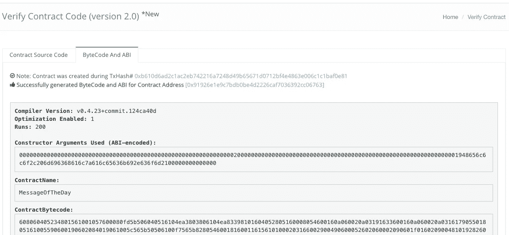

# 如何在 Etherscan 上验证智能合约？

> 原文：<https://medium.com/coinmonks/how-to-verify-smart-contract-on-etherscan-b9a79cb8793a?source=collection_archive---------1----------------------->

为什么要验证您的智能合同？看情况。这主要取决于您的用例。它总是归结为透明。如果我对 ICOs 感兴趣，我会希望确保令牌和众筹合同代码执行白皮书(或者，呃…，视频)中描述的密码经济学。在 GitHub 上开源代码是一个好主意，但是不能保证库中的代码与运行在链上的代码有一点相似。毕竟这是一份合同，所以给其他各方一个熟悉他们将要“签署”的条件的机会是有好处的。验证源代码，即使不是每个人都有阅读它的编程技能。

对于指向智能合约的地址，可以获取它们的代码。

```
web3.eth.getCode("0xd49d7704b72b373f7c7adc14623511e25ecc4a2d");
```

因为这给了你十六进制表示的二进制代码，所以试图理解契约在做什么是不可行的。

以太扫描是非常受欢迎的(如果不是最受欢迎的)区块链探险家。很多人使用以太扫描来了解更多关于以太坊区块链的交易或特定地址。除了探索能力之外，它还提供多种服务。其中之一是确认特定地址下的二进制数据是指定源代码(您可以读取和分析)的编译结果。

# 示例项目

更有趣的是，我们的示例项目将有一个构造函数，它接受一个参数并扩展来自 [zeppelin-solidity](https://github.com/OpenZeppelin/zeppelin-solidity) 的 Ownable 契约。这些简单的元素将展示您在尝试独自验证合同时可能会遇到的一些挑战。

```
pragma solidity 0.4.23;import "zeppelin-solidity/contracts/ownership/Ownable.sol";contract MessageOfTheDay is Ownable {
    string public message; constructor(string _message) public {
        message = _message;
    } function setMessage(string _message)
        public
        onlyOwner
        returns (bool)
    {
        message = _message;
        return true;
    }
}
```

完整的源代码可以在 [GitHub](https://github.com/MichalZalecki/verify-on-etherscan) 上获得。您可以克隆它，部署它，并尝试按照我的步骤在 Etherscan 上确认您的实例。

```
$ ./node_modules/.bin/truffle migrate --network kovanUsing network 'kovan'.Running migration: 1_initial_migration.js
  Replacing Migrations...
  ... 0x1124628216610c4683fe4a81107dd9a34a2532a44e2a39f6e8cf7918517be8d8
  Migrations: 0x16a49d6fe6831760e5208590435d911e7a462560
Saving successful migration to network...
  ... 0xf1c727123800989592d55c988aacc62b928b0ad36fc44c6bff97cce43f6a49cb
Saving artifacts...
Running migration: 2_message_of_the_day.js
  Deploying MessageOfTheDay...
  ... 0xb610d6ad2c1ac2eb742216a7248d49b65671d0712bf4e4863e006c1c1baf0e81
  MessageOfTheDay: 0x91926e1e9c7bdb0be4d2226caf7036392cc06763
Saving successful migration to network...
  ... 0x065eece5dc0fc260bca4e71589c575b9f43ca5a69336738b6f4c7f4e91c4897a
Saving artifacts...
```

了解更多关于部署的信息:[使用 Truffle 部署智能合约](https://michalzalecki.com/deploying-smart-contracts-with-truffle/)

# 准备

在开始之前，我们需要准备 ABI 编码的构造函数参数。您可以通过使用 web3 对值进行编码来实现。更快的方法是使用[abi.hashex.org](https://abi.hashex.org/)或者直接从创建合同的[事务](https://kovan.etherscan.io/tx/0xb610d6ad2c1ac2eb742216a7248d49b65671d0712bf4e4863e006c1c1baf0e81)输出中读取它们。

单个字符串参数的 ABI 编码表示形式:

```
0000000000000000000000000000000000000000000000000000000000000020000000000000000000000000000000000000000000000000000000000000001948656c6c6f2c206d696368616c7a616c65636b692e636f6d2100000000000000
```

我们必须准备一个包含合同全部源代码的文件，这样它就没有导入语句。让我们安装松露压扁器。

```
npm install -D truffle-flattener./node_modules/.bin/truffle-flattener \ ./contracts/MessageOfTheDay.sol > flattened.sol
```

您现在可以查看 flattened.sol 并找到 Ownable.sol 契约的源代码来代替 import 语句。

# 确认

要开始该过程，请转到[以太网扫描验证合同代码](https://etherscan.io/verifyContract2)页面。确保使用您部署了合同和 2.0 版本的网络(URL 中带有 verifyContract2)。

1.  粘贴合同地址
2.  输入合同的名称
3.  选择用于编译项目的编译器版本。您可以通过运行`truffle version`来检查它
4.  根据您的项目设置来设置优化。记住也要设置正确的运行次数
5.  粘贴展平的源代码
6.  粘贴 ABI 编码的构造函数参数
7.  单击“验证并发布”



That’s it, you have successfully verified your smart contract!

*原载于 2018 年 4 月 28 日 michalzalecki.com**的* [*。*](https://michalzalecki.com/how-to-verify-smart-contract-on-etherscan/)