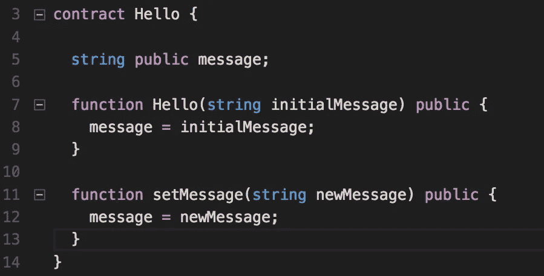
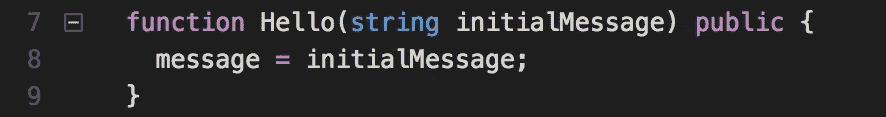
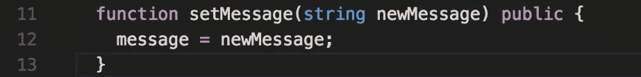
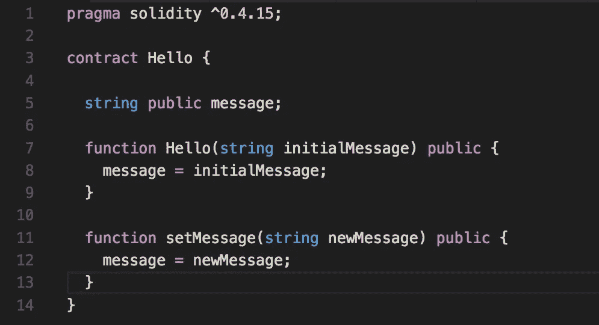

# 如何:编写简单的智能协定

> 原文：<https://medium.com/coinmonks/how-to-write-a-simple-smart-contract-25f6d3c1d6db?source=collection_archive---------0----------------------->

我们将使用 Solidity 编程语言编写一个简单的智能契约，在下面的文章中，我们将测试它并将其部署到一个测试网络中。

Solidity 语法荧光笔不是必须的，但是可以让代码看起来更漂亮，所以如果你想要的话，就去拿一个吧。( [Atom](https://atom.io/packages/language-ethereum) ， [VsCode](https://github.com/juanfranblanco/vscode-solidity) ， [Sublime](https://packagecontrol.io/packages/Ethereum) ， [VIM](https://github.com/tomlion/vim-solidity) ， [Webstorm](https://plugins.jetbrains.com/plugin/9475-intellij-solidity) )

首先，我们将初始化一个节点项目。如果您还没有安装节点，请安装。如果你需要方向，去国家预防机制网站。

安装节点后…

在您的终端中，导航到您想要放置项目的目录，并创建一个名为`hello`的新项目。导航到`hello`并输入`npm init`。回答提示(或者简单地按几次 return ),直到创建了节点项目。创建一个名为`contracts`的文件夹。

在`contracts`文件夹中，创建一个名为`hello.sol`的文件(`.sol`是 Solidity 文件扩展名)。在文件的顶部，声明你想要使用的 Solidity 版本。我们声明版本，以便编译器知道如何执行。

附:在这篇文章的底部有这个[智能合同](https://blog.coincodecap.com/tag/smart-contact/)的可复制/粘贴版本。


version 0.4.21 now supported

现在我们写合同。



simple smart contract

我们将在以后的文章中更深入地探讨语法。同时，这里有一些关于可靠性语言的事情需要记住:

合同以大写首字母声明。它们就像是 Ruby、Java 和 Python 中的 T21 类。Solidity 是一种静态或强类型语言。在这些语言中，变量类型在编译时检查，而不是在运行时检查(动态类型)。例如，如果一个变量被声明为一个字符串，然后我们试图将它作为一个整数传递，就会产生一个错误。

以下是该智能合约的一些特定内容:


storage variable

当我们在契约的代码块中声明变量`message`时，我们也指定它是一个公共可见的变量，并且它的类型是`string`。

`message`是一个`storage`变量(也是一个状态变量)，这意味着它定义了契约的状态，并且只能通过`.send`函数调用来改变(我们将在以后的文章中讨论`.send`和`.call`方法之间的区别)。它还有一个自动生成的 getter 方法(如果您熟悉 Ruby，这类似于`attr_reader`)。



constructor function

如果一个契约有一个构造函数(就像我们的一样— `Hello`)，它的名字将与契约本身的名字相匹配。每次部署协定的实例时，都会自动调用构造函数。每个协定只允许一个构造函数。



just a cool function that changes the content of the message

`setMessage`功能将允许用户改变`message` 的初始值。`setMessage`函数和构造函数都有`public`可见性。这意味着一旦契约被部署，任何人都可以调用该函数，而不仅仅是契约的所有者。

恭喜你。你写了一个[智能合约](https://blog.coincodecap.com/tag/smart-contact/)！



tiny beautiful smart contract

接下来，学习[如何:使用 Node.js 编译 Solidity 智能契约](/@morganfogarty/how-to-compile-a-solidity-smart-contract-using-node-js-51ea7c6bf440)

最新 Solidity 版本的可复制/粘贴代码:

```
pragma solidity ^0.4.21;contract Hello {
    string public message; function Hello(string initialMessage) public {
        message = initialMessage;
    } function setMessage(string newMessage) public {
        message = newMessage;
    }
}
```

> 加入 Coinmonks [电报频道](https://t.me/coincodecap)和 [Youtube 频道](https://www.youtube.com/c/coinmonks/videos)获取每日[加密新闻](http://coincodecap.com/)

## 另外，阅读

*   [复制交易](/coinmonks/top-10-crypto-copy-trading-platforms-for-beginners-d0c37c7d698c) | [加密税务软件](/coinmonks/crypto-tax-software-ed4b4810e338)
*   [网格交易](https://coincodecap.com/grid-trading) | [加密硬件钱包](/coinmonks/the-best-cryptocurrency-hardware-wallets-of-2020-e28b1c124069)
*   [密码电报信号](http://Top 4 Telegram Channels for Crypto Traders) | [密码交易机器人](/coinmonks/crypto-trading-bot-c2ffce8acb2a)
*   [Pionex 双投](https://coincodecap.com/pionex-dual-investment) | [AdvCash 审核](https://coincodecap.com/advcash-review) | [光宗耀祖审核](https://coincodecap.com/uphold-review)
*   [面向开发者的 8 个最佳加密货币 API](https://coincodecap.com/best-cryptocurrency-apis)
*   [支持卡审核](https://coincodecap.com/uphold-card-review) | [信任钱包 vs 元掩码](https://coincodecap.com/trust-wallet-vs-metamask)
*   [赢取注册奖金——10 大最佳加密平台](https://coincodecap.com/earn-sign-up-bonus)
*   [最佳加密交易所](/coinmonks/crypto-exchange-dd2f9d6f3769) | [印度最佳加密交易所](/coinmonks/bitcoin-exchange-in-india-7f1fe79715c9)
*   开发人员的最佳加密 API
*   最佳[密码借贷平台](/coinmonks/top-5-crypto-lending-platforms-in-2020-that-you-need-to-know-a1b675cec3fa)
*   杠杆代币的终极指南