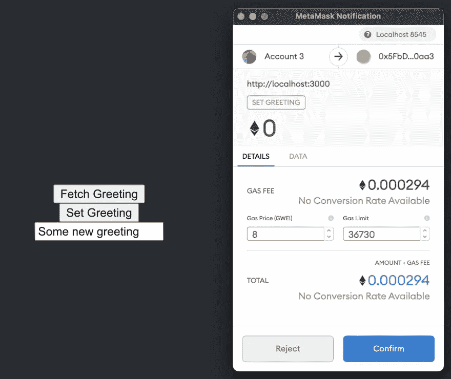

# 如何为 react dapp 编写可升级的 Solidity 智能合约

> 原文：<https://medium.com/coinmonks/how-to-write-an-upgradeable-solidity-smart-contract-for-a-react-dapp-ebb570f86cce?source=collection_archive---------2----------------------->


智能合约是在区块链上编写和发布的一组代码(通常在单个文件中)。当您在浏览器中使用分散式应用程序(d app)时，该应用程序会通过智能合约与区块链进行交互。关于智能合约，有两点需要了解:

*   发布的每个智能合约都是公开的(代码可以被任何人查阅)，并且有唯一的公开地址。因此，每个想要与智能合约交互的应用程序都将使用这个唯一的地址。
*   本质上，为了用户的安全，在一个地址发布的代码不能被更新。这是区块链的特性:不变性。

由于智能合约是不可变的，并且智能合约地址的改变将需要使用该合约的所有应用程序的代码的改变，如果开发人员注意到错误或安全问题，他/她如何更新已发布的代码？

答案是通过**可升级智能合同**:帮助你升级一个`Contract1`到`Contract2`，保持它的状态(数据&平衡)和之前的地址相同。

有许多方法可以实现这个目标，但是在本教程中，我们将选择成熟且易于使用的 [openzeppelin 升级](https://github.com/OpenZeppelin/openzeppelin-contracts-upgradeable)库。

你将通过这篇文章了解到:

*   如何启动 react dapp，编写和部署经典(不可升级)合同
*   如何将您的合同更新为可升级
*   如何部署可升级合同
*   如何升级已部署的可升级合同
*   如何为可升级契约编写测试

# 启动我们的反应 dapp

Nader Dabit 的博客文章很好地完成了这一部分，所以我们将跟随它。

## 先决条件

1.  安装在本地计算机上的 Node.js
2.  [MetaMask](https://metamask.io/) 浏览器中安装的 Chrome 扩展

对于本指南，您不需要拥有任何以太坊，因为我们将在整个教程中使用测试网络上的假以太。

首先，我们将创建一个新的 React 应用程序:

```
npx create-react-app react-dapp
```

接下来，进入新目录，使用 **NPM** 或**纱线**安装`[ethers.js](https://docs.ethers.io/v5/)`和`[hardhat](https://github.com/nomiclabs/hardhat)`:

```
npm install ethers hardhat @nomiclabs/hardhat-waffle ethereum-waffle chai @nomiclabs/hardhat-ethers
```

## 安装和配置以太坊开发环境

接下来，用 Hardhat 初始化一个新的以太坊开发环境:

```
npx hardhat? What do you want to do? Create a sample project
? Hardhat project root: <Choose default path>
```

现在，您应该可以在根目录中看到为您创建的以下工件:

**hardhat.config.js** —您的整个 hardhat 设置(即您的配置、插件和自定义任务)都包含在这个文件中。
**脚本** —包含名为 **sample-script.js** 的脚本的文件夹，该脚本将在执行
**测试**时部署您的智能合约—包含示例测试脚本
**合约**的文件夹—包含示例 Solidity 智能合约的文件夹

由于[一个元掩码配置问题](https://hardhat.org/metamask-issue.html)，我们需要将我们的安全帽配置上的链 ID 更新为 **1337** 。我们还需要为我们编译的契约更新[工件](https://hardhat.org/guides/compile-contracts.html#artifacts)的位置，使其位于 React 应用程序的 **src** 目录中。

要进行这些更新，打开 **hardhat.config.js** 并更新`module.exports`如下所示:

```
module.exports = {
  solidity: "0.8.4",
  paths: {
    artifacts: './src/artifacts',
  },
  networks: {
    hardhat: {
      chainId: 1337
    }
  }
};
```

## 我们的智能合同

接下来，让我们看看 **contracts/Greeter.sol** 上提供给我们的合同示例:

```
//SPDX-License-Identifier: MIT
pragma solidity ^0.8.0;import "hardhat/console.sol"; contract Greeter {
  string greeting; constructor(string memory _greeting) {
    console.log("Deploying a Greeter with greeting:", _greeting);
    greeting = _greeting;
  } function greet() public view returns (string memory) {
    return greeting;
  } function setGreeting(string memory _greeting) public {
    console.log("Changing greeting from '%s' to '%s'", greeting, _greeting);
    greeting = _greeting;
  }
}
```

这是一个非常基本的智能合约。部署时，它设置一个问候变量并公开一个函数(`greet`)，可以调用该函数返回问候。

它还公开了一个允许用户更新问候语的功能(`setGreeting`)。当部署到以太坊区块链时，用户可以使用这些方法进行交互。

## 区块链以太坊的阅读和写作

与智能合约交互有两种方式，读或写/交易。在我们的合同中，`greet`可以认为是阅读，`setGreeting`可以认为是写作/事务性的。

当写入或初始化一个交易时，您必须为要写入区块链的交易付费。要做到这一点，你需要支付[汽油](https://www.investopedia.com/terms/g/gas-ethereum.asp#:~:text=What%20Is%20Gas%20(Ethereum)%3F,on%20the%20Ethereum%20blockchain%20platform)，这是在以太坊区块链成功进行交易和执行合同所需的费用或价格。

只要你只是从区块链中读取数据，而不改变或更新任何东西，你就不需要进行交易，这样做也没有任何代价。然后你调用的功能只由你连接的节点执行，所以你不需要付任何煤气费，读取也是免费的。

在我们的 React 应用程序中，我们与智能合约交互的方式是使用由 hardhat 根据合约创建的`ethers.js`库、合约地址和 [ABI](https://docs.soliditylang.org/en/v0.5.3/abi-spec.html) 的组合。

什么是 ABI？ABI 代表应用程序二进制接口。您可以将其视为客户端应用程序和以太坊区块链之间的接口，您将要与之交互的智能合约部署在以太坊中。

ABI 通常由像 HardHat 这样的开发框架从 Solidity smart contracts 编译而来。你也可以在 [Etherscan](https://etherscan.io/) 上找到智能合约的 ABI

## 编纂 ABI

现在，我们已经学习了基本的智能合同，并知道 ABI 是什么，让我们为我们的项目编译一个 ABI。

为此，请转到命令行并运行以下命令:

```
npx hardhat compile
```

现在，您应该在 **src** 目录中看到一个名为**工件**的新文件夹。**工件/合同/Greeter.json** 文件包含作为属性之一的 ABI。当我们需要使用 ABI 时，我们可以从 JavaScript 文件中导入它:

```
import Greeter from './artifacts/contracts/Greeter.sol/Greeter.json'
```

我们可以这样引用 ABI:

```
console.log("Greeter ABI: ", Greeter.abi)
```

> *请注意，Ethers.js 还支持* [*人类可读 ABIs*](https://blog.ricmoo.com/human-readable-contract-abis-in-ethers-js-141902f4d917) *，但在本教程中不会深入讨论。*

## 部署和使用本地网络/区块链

接下来，让我们将智能合约部署到本地区块链，以便进行测试。

要部署到本地网络，首先需要启动本地测试节点。为此，请打开 CLI 并运行以下命令:

```
npx hardhat node
```

当我们运行这个命令时，您应该会看到一个地址和私钥列表。


这是为我们创建的 20 个测试帐户和地址，我们可以使用它们来部署和测试我们的智能合同。每个账户还装了一万个假乙醚。稍后，我们将学习如何将测试帐户导入 MetaMask，以便我们可以使用它。

接下来，我们需要将合同部署到测试网络。首先将**脚本/sample-script.js** 的名称更新为**脚本/deploy.js** 。

现在，我们可以运行部署脚本，并为希望部署到本地网络的 CLI 提供一个标记:

```
npx hardhat run scripts/deploy.js --network localhost
```

一旦这个脚本被执行，智能契约应该被部署到本地测试网络，然后我们应该能够开始与它进行交互。

> *部署合同时，它使用了我们启动本地网络时创建的第一个帐户。*

如果您查看 CLI 的输出，您应该能够看到如下内容:

```
Greeter deployed to: 0x9fE46736679d2D9a65F0992F2272dE9f3c7fa6e0
```

这个地址是我们将在客户端应用程序中用来与智能合约对话的地址。保持该地址可用，因为我们将需要在从客户端应用程序连接到它时使用它。

要将交易发送到智能合约，我们需要使用运行`npx hardhat node`时创建的帐户之一连接 MetaMask 钱包。在 CLI 注销的合同列表中，您应该会看到一个**帐号**和一个**私钥**:

```
➜  react-dapp git:(main) npx hardhat node
Started HTTP and WebSocket JSON-RPC server at http://127.0.0.1:8545/Accounts
========
Account #0: 0xf39fd6e51aad88f6f4ce6ab8827279cfffb92266 (10000 ETH)
Private Key: 0xac0974bec39a17e36ba4a6b4d238ff944bacb478cbed5efcae784d7bf4f2ff80...
```

我们可以将这个帐号导入 MetaMask，以便开始使用那里的一些假 Eth。为此，首先打开元掩码，并将网络更新为 Localhost 8545:


接下来，在 MetaMask 中点击账户菜单中的**导入账户**:


复制然后粘贴 CLI 注销的**私钥**之一，并点击**导入**。帐户导入后，您应该会看到帐户中的 Eth:


现在我们已经部署了一个智能合约，并且有一个帐户可以使用，我们可以开始从 React 应用程序与它进行交互。

## 连接 React 客户端

在本教程中，我们不会担心用 CSS 构建一个漂亮的用户界面，我们会 100%关注核心功能，让你启动并运行。从那里，你可以把它拿走，如果你愿意，可以把它弄得好看些。

话虽如此，让我们回顾一下我们希望 React 应用程序实现的两个目标:

1.  从智能合约中获取`greeting`的当前值
2.  允许用户更新`greeting`的值

了解了这些事情之后，我们该如何完成呢？为了实现这一目标，我们需要做以下事情:

1.  创建一个输入字段和一些本地状态来管理输入的值(更新`greeting`
2.  允许应用程序连接到用户的元掩码帐户以签署交易
3.  创建读取和写入智能合同的函数

为此，打开`src/App.js`，用下面的代码更新它，将`greeterAddress`的值设置为智能契约的地址。：

```
import './App.css';
import { useState } from 'react';
import { ethers } from 'ethers'
import Greeter from './artifacts/contracts/Greeter.sol/Greeter.json'// Update with the contract address logged out to the CLI when it was deployed 
const greeterAddress = "your-contract-address"function App() {
  // store greeting in local state
  const [greeting, setGreetingValue] = useState() // request access to the user's MetaMask account
  async function requestAccount() {
    await window.ethereum.request({ method: 'eth_requestAccounts' });
  } // call the smart contract, read the current greeting value
  async function fetchGreeting() {
    if (typeof window.ethereum !== 'undefined') {
      const provider = new ethers.providers.Web3Provider(window.ethereum)
      const contract = new ethers.Contract(greeterAddress, Greeter.abi, provider)
      try {
        const data = await contract.greet()
        console.log('data: ', data)
      } catch (err) {
        console.log("Error: ", err)
      }
    }    
  } // call the smart contract, send an update
  async function setGreeting() {
    if (!greeting) return
    if (typeof window.ethereum !== 'undefined') {
      await requestAccount()
      const provider = new ethers.providers.Web3Provider(window.ethereum);
      const signer = provider.getSigner()
      const contract = new ethers.Contract(greeterAddress, Greeter.abi, signer)
      const transaction = await contract.setGreeting(greeting)
      await transaction.wait()
      fetchGreeting()
    }
  } return (
    <div className="App">
      <header className="App-header">
        <button onClick={fetchGreeting}>Fetch Greeting</button>
        <button onClick={setGreeting}>Set Greeting</button>
        <input onChange={e => setGreetingValue(e.target.value)} placeholder="Set greeting" />
      </header>
    </div>
  );
}export default App;
```

要进行测试，请启动 React 服务器:

```
npm start
```

当应用程序加载时，您应该能够获取当前的问候并将其注销到控制台。你也应该能够通过用你的 MetaMask 钱包签合同和花费假乙醚来更新问候。



# 将合同更新为可升级

正如本教程开头所述，我们将使用需要安装的 [OpenZeppelin 升级](https://github.com/OpenZeppelin/openzeppelin-contracts-upgradeable)库:

```
$ npm install --save-dev @openzeppelin/hardhat-upgrades
```

并在您的`hardhat.config.js`中注册插件。为此，您只需要在`hardhat.config.js`文件的顶部添加下面一行。

```
require('@openzeppelin/hardhat-upgrades');
```

除了它们的*构造器*之外，你可以在不做任何修改的情况下使用你的 Solidity 契约。由于 OpenZeppelin 使用的基于代理的可升级性系统的要求，在可升级契约中不能使用构造函数。如果您想了解更多信息，请参见此处的。

相反，我们的合同需要

*   继承 OpenZeppelin 提供的`Initializable`基地契约
*   拥有一个带有`intializer`修饰符的`initialize`函数，而不是一个构造函数

因此，我们需要将我们的`Greeter.sol`文件改为如下

```
//SPDX-License-Identifier: Unlicense
pragma solidity ^0.8.4;import "hardhat/console.sol";
import "@openzeppelin/contracts-upgradeable/proxy/utils/Initializable.sol";contract Greeter is Initializable {
    string private greeting;function initialize(string memory _greeting) public initializer {
        console.log("Deploying a Greeter with greeting:", _greeting);
        greeting = _greeting;
    }function greet() public view returns (string memory) {
        console.log("Fetching greeting");
        return greeting;
    }function setGreeting(string memory _greeting) public {
        console.log("New Changing greeting from '%s' to '%s'", greeting, _greeting);
        greeting = _greeting;
    }
}
```

然后，您需要将部署脚本更新为以下内容

```
const { ethers, upgrades } = require("hardhat");async function main() {// We get the contract to deploy
  const Greeter = await ethers.getContractFactory("Greeter");
  const greeter = await upgrades.deployProxy(Greeter,["Hello, Hardhat!"]); await greeter.deployed();
  console.log("Greeter deployed to:", greeter.address);
}// We recommend this pattern to be able to use async/await everywhere
// and properly handle errors.
main()
  .then(() => process.exit(0))
  .catch((error) => {
    console.error(error);
    process.exit(1);
  });
```

现在，我们编译更新的智能合同:

```
npx hardhat compile
```

然后，我们可以运行部署脚本来部署到我们的本地网络:

```
npx hardhat run scripts/deploy.js --network localhost
```

一旦这个脚本被执行，新的可升级智能合同应该被部署，然后我们应该能够开始与它进行交互。

如果您查看 CLI 的输出，您应该能够看到如下内容:

```
Greeter deployed to: 0x9fE46736679d2D9a65F0992F2272dE9f3c7fa6e0
```

记得用这个新地址更新 **src/App.js** 文件中的`greeterAdrress`变量。然后，您应该能够从 dapp 与契约进行交互。

# 升级已部署的可升级合同

现在，我们将修改我们的智能合约并在区块链上升级它，这样我们的 dapp 将与新编写的智能合约的代码进行交互，而无需我们更改 dapp 代码中的智能合约地址。

让我们通过改变初始化中的行为来修改契约代码

```
//SPDX-License-Identifier: Unlicense
pragma solidity ^0.8.4;import "hardhat/console.sol";
import "@openzeppelin/contracts-upgradeable/proxy/utils/Initializable.sol";contract Greeter is Initializable {
    string private greeting;function initialize(string memory _greeting) public initializer {
        console.log("Deploying an **Upgrade of** Greeter with greeting:", _greeting);
        greeting = _greeting;
    }function greet() public view returns (string memory) {
        console.log("Fetching **Upgraded of** greeting");
        return greeting;
    }function setGreeting(string memory _greeting) public {
        console.log("Changing **Upgraded of** greeting from '%s' to '%s'", greeting, _greeting);
        greeting = _greeting;
    }
}
```

然后我们编译更新后的文件:

```
npx hardhat compile
```

现在，我们需要编写一个升级脚本，它将在与旧版本相同的地址部署新版本的合同。

我们只需创建一个包含以下内容的文件 **scripts/upgrade.js**

```
const { ethers, upgrades } = require("hardhat");async function main() {
  const Greeter = await ethers.getContractFactory("Greeter");
  const greeter = await upgrades.upgradeProxy("your-upgradeable-contract-address", Greeter);
  console.log("Greeter upgraded to:", greeter.address);
}// We recommend this pattern to be able to use async/await everywhere
// and properly handle errors.
main()
  .then(() => process.exit(0))
  .catch((error) => {
    console.error(error);
    process.exit(1);
  });
```

其中字符串`your-upgradeable-contract-address`应该被替换为已部署的可升级契约的地址。

现在我们可以升级合同了

```
npx hardhat run scripts/upgrade.js --network localhost
```

# 为我们的可升级合同编写测试

在我们的项目主文件夹中，有一个名为`test/`的子文件夹，在其中您会发现一个名为`sample-test.js`的样本测试文件，其内容如下:

```
const { expect } = require("chai");
const { ethers } = require("hardhat");describe("Greeter", function () {
  it("Should return the new greeting once it's changed", async function () {
    const Greeter = await ethers.getContractFactory("Greeter");
    const greeter = await Greeter.deploy("Hello, world!");
    await greeter.deployed();expect(await greeter.greet()).to.equal("Hello, world!");const setGreetingTx = await greeter.setGreeting("Hola, mundo!");// wait until the transaction is mined
    await setGreetingTx.wait();expect(await greeter.greet()).to.equal("Hola, mundo!");
  });
});
```

我们只需要对这个常规测试文件做一件事情:我们如何部署我们的智能契约。

对于普通契约，我们使用智能契约实例的`deploy()`函数来部署契约。这个`deploy()`函数使用契约的构造函数。如果你还记得的话，你会注意到在 Openzeppelin 中，可升级的智能契约没有构造函数，而是有一个初始化函数。

要处理它，你只需要改变路线

```
const greeter = await Greeter.deploy("Hello, world!");
```

到…里面

```
const greeter = await upgrades.deployProxy(Greeter,["Hello, world!"]);
```

我们的测试文件已经准备好了。要启动测试，您只需执行以下操作:

```
npx hardhat test
```

您将得到以下结果:


# 我们到了！

您刚刚完成了一个编写 dapp 的端到端示例，该 dapp 与 solidity 中的可升级智能合约进行交互。你正走在构建坚实可靠的项目的正确道路上。

如果你有问题，请在下面的评论区提出。

花

你可以在推特上写我:[布鲁姆韦尔加](http://twitter.com/BloomVerga)

BSC & ETH 钱包:0xd6e 4948 B3 a 098075052 df 419 a 06 BDD 4036 a9 BD 6d