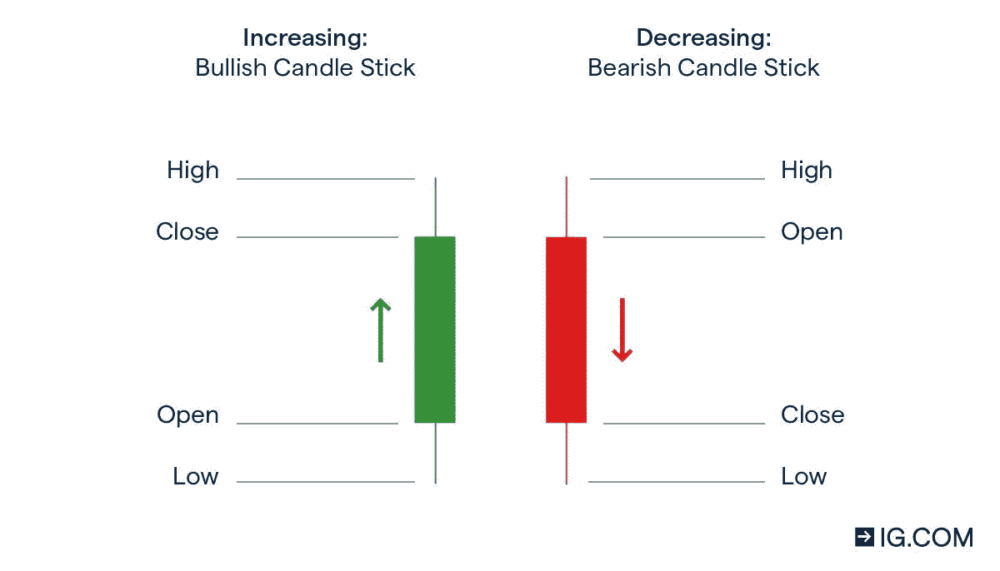
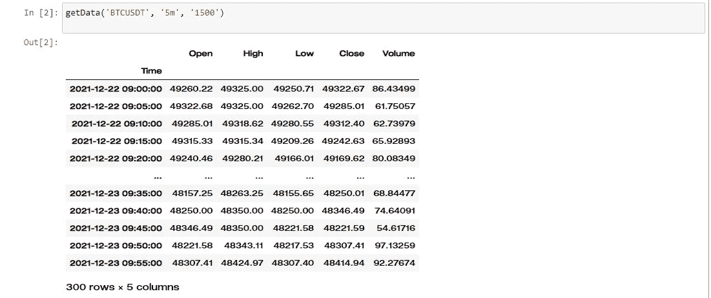
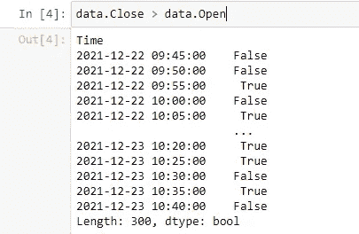
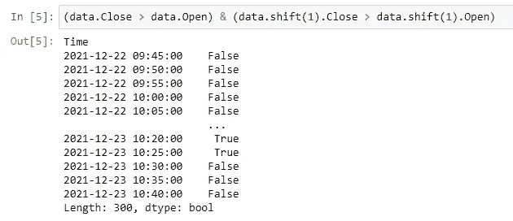
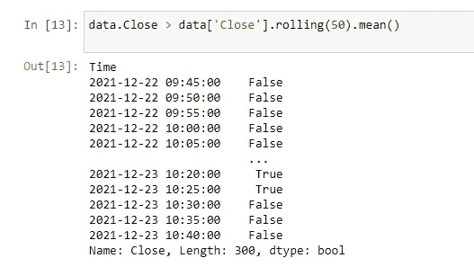
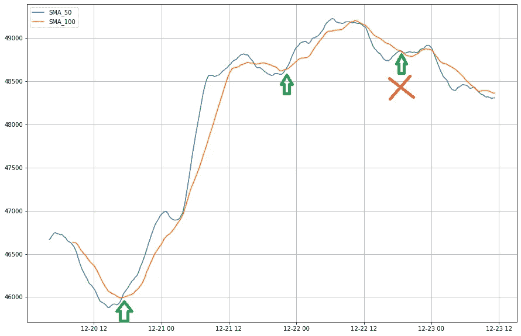

# 如何用 Python 写自定义指标？

> 原文：<https://medium.com/coinmonks/how-to-write-custom-indicators-in-python-bdd2faa4b94f?source=collection_archive---------1----------------------->


Photo from [**IStockPhoto**](https://www.istockphoto.com/fr/photo/graphiques-de-trading-sur-un-%C3%A9cran-gm1317587887-404971545)

# 什么是指标？

> 指标是用来衡量当前状况以及预测金融或经济趋势的统计数据。在投资领域，指标通常是指从价格、交易量或给定证券的未平仓权益中得出的技术图表模式。

# 几个热门指标 **s :**

*   移动平均线
*   指数移动平均线
*   随机振荡器
*   移动平均收敛发散(MACD)
*   布林线
*   相对强度指数
*   斐波那契回撤
*   市云

在本文中，我将向您展示使用 python 中的 pandas 库创建指标的最简单方法。

**这里列出了起飞前你应该熟悉的关键词**😊**。**

```
**OHLC** = Open Candle, High Candle, Low Candle, Close Candle
**Open Time** = The time it takes for the candle to open. **Close Time** = The remaining time for an open candle to be closed. **SMA_50** = Average price from the last 50 candles calculated as an unweighted mean of the previous 50 closing candles.
**Down Shadow** = distance between Min(Open,Close) and Low. 
**High Shadow** = distance between Max(Open,Close) and High. 
**Green Candle** = if Close > Open,the candle turns green.
**Red Candle** = if Close < Open,the candle turns red. **Long Position** = Create Buy request. 
**Short Position** = Create Sell Request.
**Change(Length)** = Distance between the previous candle’s close Length and the current candle’s close.
**Back Test** = Test your indicator by looking at the previous candlestick. **Interval** = the time period between the opening and closing of candle.
```



Photo from [OTO](https://www.oto-7.xyz/)

# 准备和安装要求:

让我们从使用 PyPI 安装需求包开始:

```
pip install python-binance
pip install pandas
```

**如果您使用 conda，请使用以下代码。**

```
conda install pandas
conda install python-binance
```

首先，你必须从币安或另一个加密货币交易所检索数据。我使用币安 API 来获取数据。在这个脚本中，我们从 API 获取数据，然后在类和对象中对其进行优化:

在第 1 到 4 行中，**所需的库**已经被导入。在第 5 行，已经为一个请求创建了一个客户机对象。然后在 **getData** 函数中，我们传递了它的所有参数，包括符号、区间和 lookhead。



result of getData

正如你在上面看到的，我们收到了一个数据帧，包含从 1500 分钟前到现在的 5 分钟时间范围(间隔)内的(时间、开盘价、收盘价、最高价、最低价和成交量)。

# 条目宽容逻辑:

本文中的宽恕检查:

```
1.If the color of the current candle is green,we enter the Long Position state(Basic).
2.If the color of current candle is green and the color of the previous candle is also green,we enter the Long Position state (Basic).
3.If the Change of 15 previous Candles is grater than +1% we enter Long Position state(Medium).
4.If the price is grater than the SMA_50 ,we enter Long state(Medium).
5.If SMA_50 crosses SMA_100 and has multiple Down Shadows(Advanced).
```

# 在代码中实现宽恕逻辑:

1.  如果当前蜡烛的颜色等于绿色，则输入多头头寸:



Result of these entries

2.如果当前蜡烛的颜色等于绿色，而前一根蜡烛是绿色，则输入多头头寸:



Result of these entries

3.如果当前蜡烛线的变化超过前 15 根蜡烛线的 1%,输入多头头寸:


Result of these entries

4.如果价格超过 SMA_50，输入多头头寸:



Result of these entries

5.如果 MA_50 穿越 MA_100 且有多个下影线:


Result of these entries

# 检查结果:



check final strategy result in figure

*从上图可以看出，每次****SMA-50****穿越****SMA-100****时价格都会上涨。*

# 重要的是要记住:

> 如果单独使用，策略通常不会成功。你需要分析很多策略，从中挑选出最好的。通过同时使用选择的策略，你可能会得到更好的结果。

# 资源:

[](https://pandas.pydata.org/) [## 熊猫

### pandas 是一个快速、强大、灵活且易于使用的开源数据分析和操作工具，构建于…

pandas.pydata.org](https://pandas.pydata.org/) [](https://github.com/sammchardy/python-binance) [## GitHub-sammchardy/python-币安:用于自动化的币安交换 API python 实现…

### 2021 年 9 月 27 日更新这是币安交易所 REST API v3 的非官方 Python 包装器。我绝不是…

github.com](https://github.com/sammchardy/python-binance) [](https://matplotlib.org/) [## Matplotlib

### 大量第三方软件包扩展并构建在 Matplotlib 功能之上，包括几个更高级的…

matplotlib.org](https://matplotlib.org/) [](https://www.investopedia.com/) [## 投资媒体

### Investopedia 是世界'网上金融内容的主要来源，从市场新闻到退休…

www.investopedia.com](https://www.investopedia.com/) 

> 加入 Coinmonks [电报频道](https://t.me/coincodecap)和 [Youtube 频道](https://www.youtube.com/c/coinmonks/videos)了解加密交易和投资

## 也阅读

[](/coinmonks/leveraged-token-3f5257808b22) [## 杠杆代币[多头代币]终极指南

### 杠杆化令牌是具有杠杆化风险敞口的 ERC20 令牌，不考虑保证金、要求、管理…

medium.com](/coinmonks/leveraged-token-3f5257808b22) [](https://blog.coincodecap.com/crypto-exchange) [## 最佳加密交易所| 2021 年十大加密货币交易所

### 编辑描述

blog.coincodecap.com](https://blog.coincodecap.com/crypto-exchange) [](https://blog.coincodecap.com/best-swap-platforms) [## 2021 年最佳加密交换平台| CoinCodeCap

### 编辑描述

blog.coincodecap.com](https://blog.coincodecap.com/best-swap-platforms) [](/coinmonks/top-5-crypto-lending-platforms-in-2020-that-you-need-to-know-a1b675cec3fa) [## 2021 年最佳加密借贷平台| 6 大比特币借贷平台

### 获得比特币和其他加密货币的最佳贷款利率

medium.com](/coinmonks/top-5-crypto-lending-platforms-in-2020-that-you-need-to-know-a1b675cec3fa) [](/coinmonks/the-best-cryptocurrency-hardware-wallets-of-2020-e28b1c124069) [## 2021 年 6 大最佳硬件钱包|顶级加密硬件钱包[更新]

### 最好的加密货币硬件钱包是绝对必要的。我们将在 NGRAVE、Ledger Nano X 和…

medium.com](/coinmonks/the-best-cryptocurrency-hardware-wallets-of-2020-e28b1c124069) [](/coinmonks/crypto-trading-bot-c2ffce8acb2a) [## 2021 年最佳免费加密交易机器人

### 2021 年币安、比特币基地、库币和其他密码交易所的最佳密码交易机器人。四进制，位间隙…

medium.com](/coinmonks/crypto-trading-bot-c2ffce8acb2a) [](/coinmonks/best-crypto-signals-telegram-5785cdbc4b2b) [## 最佳 4 个加密交易信号电报通道

### 这是乏味的找到正确的加密交易信号提供商。因此，在本文中，我们将讨论最好的…

medium.com](/coinmonks/best-crypto-signals-telegram-5785cdbc4b2b) [](https://blog.coincodecap.com/bitsgap-review) [## 获取信号、交易机器人和套利

### 编辑描述

blog.coincodecap.com](https://blog.coincodecap.com/bitsgap-review)