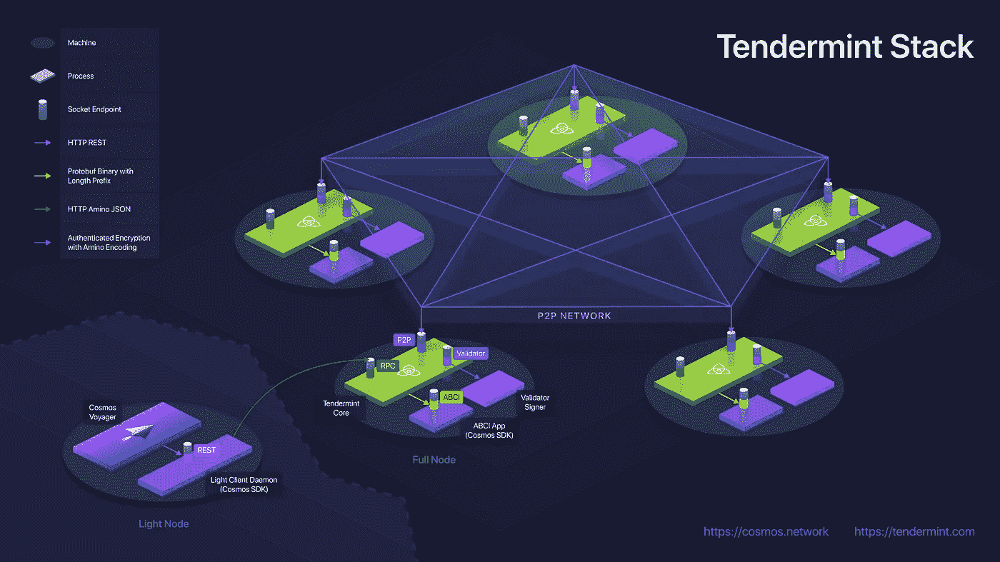
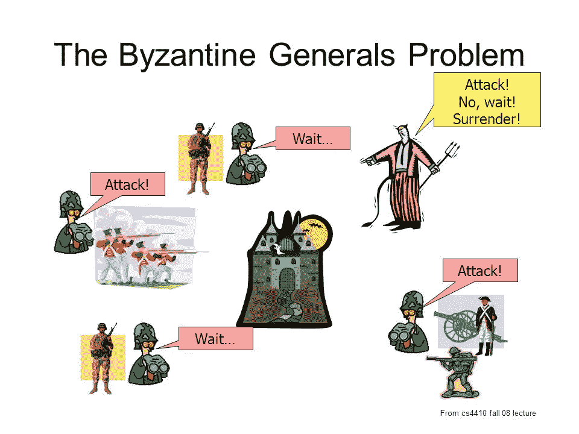
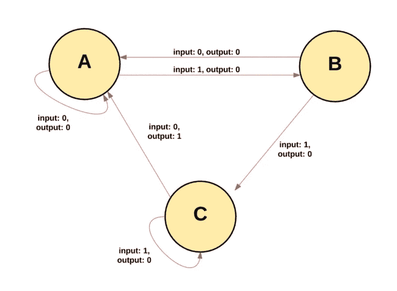
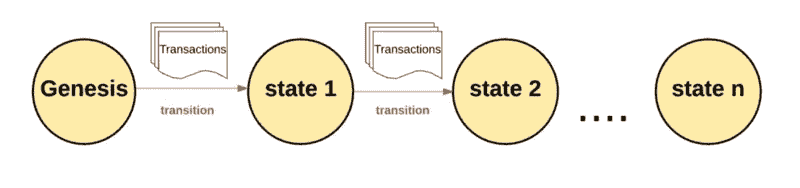
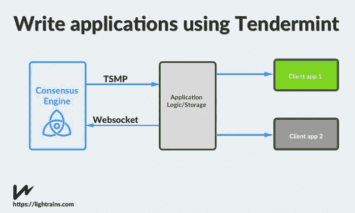
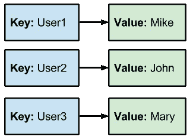
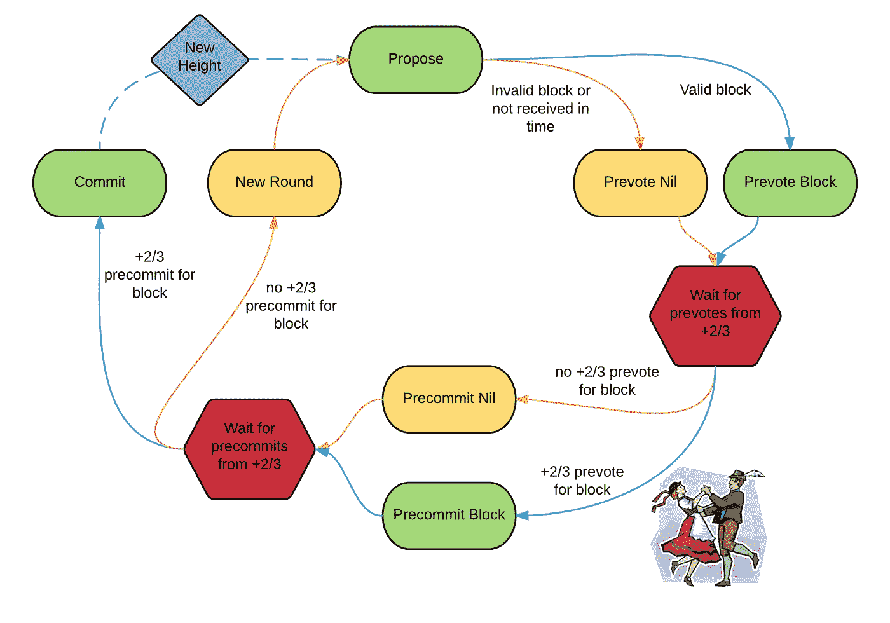

# 如何使用 Python 或任何其他语言编写 Tendermint 应用程序。

> 原文：<https://medium.com/coinmonks/how-to-write-tendermint-applications-using-python-d8dde304e339?source=collection_archive---------2----------------------->

source tendermint.com

> 拜占庭容错状态机复制。或者简称区块链。

这是你打开 Tendermint 网站首先看到的东西。很可能你已经知道什么是区块链，它是驱动比特币、以太坊和其他你听说过的去中心化硬币的技术。基本前提是，人们可以用去中心化的方式来做应用，你可以用任何你喜欢的编程语言来写。也许你很困惑，所以让我们倒回去一点。

嫩薄荷速度极快。不像其他人，你可以在一秒钟内发送数千笔交易。此外，你也可以用它来建立私人区块链。

拜占庭容错状态复制机——一个很大的词，没有意义，除非你擅长分散式系统。我们把这个词拆了吧。

**拜占庭容错**

用[来解释拜占庭将军的问题](https://web.archive.org/web/20170205142845/http://lamport.azurewebsites.net/pubs/byz.pdf)更好。

Need to remove traitor generals.

> 这种情况可以抽象地表述为，拜占庭军队的一群将军带着他们的部队在一个敌人的城市周围扎营。仅通过信使交流，将军们必须就共同的作战计划达成一致。然而，他们中的一个或多个可能是试图迷惑其他人的叛徒。问题是找到一种算法来确保忠诚的将军们会达成一致。这表明，仅使用口头消息，当且仅当超过三分之二的将军是忠诚的时，这个问题是可解决的；所以一个叛徒可以迷惑两个忠诚的将军。有了不可伪造的书面信息，任何数量的将军和可能的叛徒都可以解决这个问题。

如果一个系统即使在某些参与者退出或敌对的情况下仍能继续运行，则称该系统为 BFT。关于共识算法，拜占庭容错通常意味着算法保证收敛，或者能够达成共识，即使存在敌对节点或者如果节点从网络中掉出等。在这个意义上，BFT 是一个共识算法的属性，而不是算法本身。
这个想法是，对于一个分散在世界各地的政党系统来说，它们彼此之间要有一个共同的协议或共识。老实说，这需要三分之二的人。

难的部分结束了，现在让我们看第二部分。

[**状态机复制**](https://en.wikipedia.org/wiki/State_machine_replication)

在计算机科学中，*状态机*指的是读取一系列输入，并基于这些输入转换到新状态的东西。

对于 Tendermint 的状态机，我们从“起源状态”开始。这类似于网络上发生任何交易之前的一张白纸。当事务被执行时，这个起源状态转换到某个最终状态。在任何时间点，该最终状态代表嫩薄荷的当前状态。

程序员定义应该容忍故障的初始状态和该状态上的一组允许的转换，并且系统确保每个复制品以相同的状态开始，并且每个复制品以相同的顺序进行相同的状态转换。这是状态机复制。

或者我们可以称它为区块链。现在让我们进入事情的细节。

# 使用 Tendermint 编写应用程序

> Tendermint 可以复制用任何编程语言编写的确定性状态机。

TSMP is called ABCI now

这很好，考虑到如果你想为以太坊做一个应用，你最终会学习固体。跟我赤条条的，有点棘手。

## 从安装 Tendermint 开始

 [## 快速入门|招标文件

### Tendermint 核心文件。

tendermint.com](https://tendermint.com/docs/introduction/quick-start.html#install) 

让我们首先运行一个预构建的应用程序，然后了解如何使它成为我们自己的。我们将使用一个名为 kvstore 的应用程序。这是一个简单的应用程序，它将接受一个“键”和一个“值”并存储它。以便以后在搜索“键”时可以获得该值。非常简单的数据库应用程序。

## 运行预构建的 kvstore

Tendermint 团队已经在应用程序中构建了 kvstore 示例。
你最好边走边打这些部分，这就是为什么我没有打输出。

让我们来分解一下使用命令‘tender mint node’启动应用程序的过程。tendermint 应用程序在本地计算机的端口 26657 上运行。转到该端口查看应用程序运行是否顺畅。你有这么多方法可以使用。

## 使用 abci-cli 的 KVStore

为什么我们不用另一种方式来完成同样的任务呢，你不需要总是输入 curl 命令。Tendermint 有一个名为 abci-console 的工具，它允许您轻松地向 Tendermint 应用程序发送请求。

ABCI 是应用程序区块链接口的缩写，它将应用程序与区块链连接起来。

abci 控制台允许人们轻松发送交易。现在让我们看看我们在 abci-console 中使用的向 Tendermint 发送事务的方法。

我们使用 deliver_tx 发送一个事务，这是在我们的机器中更新状态的部分。我们提交该事务来存储该事务，这是状态增加链式存储块的高度的地方。之后，我们从 Tendermint 节点查询它，这基本上是在状态中查找给定键的值。

让我们总结一下。

> 您交付一个事务，然后提交该事务，然后可以查询该事务。

现在，让我们来看看如何让 KV Store 应用程序如您所愿。
如果你注意到我使用了 home 标志，那是为了确保 genesis 令牌在名为 node 的文件夹中。

# 让我们编写我们的应用程序

我将用 Python 编写一个应用程序，这是一种非常简单的语言，我想即使你不懂，你也能听懂。如果你想看的话，完整的代码在这里。

我将使用[py-abci](https://github.com/davebryson/py-abci)模块，它是 python 中 abci 的包装器。我不打算重新发明轮子。

我们将从创建 Tendermint 节点的状态开始。我将添加一个 DB，即 MemoryDB，一个定义状态大小的大小，一个定义块高度的高度，以及一个应用程序的 apphash。

## 交付 _ 发送

如果您还记得上面例子中的 deliver_tx，我们将键和值对发送到 Tendermint 节点。并且这个键和值被存储在 DB 中，并且状态被更新。

数据输入以字节为单位。因此，我们使用' = '分割字符串，并保存键和值对。我们设置的尺寸变量将会增加。

既然事务已经提交，我们需要保存状态，为此我们使用 commit。

## 犯罪

在提交期间，我们需要返回一个 apphash，表示链中状态的变化。我将创建一个大小为 apphash 的大端记法。链条的高度增加了，我们在拯救国家。

既然我们已经更新了状态，我们需要确保应用程序正常工作。因此，让我们提出一个问题。

## 询问

这个问题似乎很直接。您检查该值是否在 DB 中，并返回它。

**就是这样**。HURRRRRRAAAAAAAAAAAAYYYYYYYY。

我们负责提交事务，然后进行提交和查询。

我们可以确保的一件事是，如果事务是坏的，我们可以忽略它，不让它进入区块链的内存池。为此，我们可以使用 check_tx 方法，但是对于这个用例来说，这是不必要的。

现在，请检查整个代码，或者用您最喜欢的编程语言自己编写其余的代码。

现在有其他方法，如 broadcast_tx_sync 或 broadcast_tx_asyc，它们比 commit 更快。您可以根据用例来使用它。请阅读文档了解更多信息。

如果你想看的话，围棋中还有一个例子。

## 笔记

启动 tendermint 节点后，运行 python 代码来运行应用程序。然后，您应该能够像上面的 kvstore 示例一样发送请求。

tendermint 节点运行在端口 26657，abci 运行在端口 26658。

# 结论

…唷！你坚持到了最后。我希望？

我知道这篇文章里有很多东西需要消化。如果你需要多次阅读才能完全理解发生了什么，那完全没问题。我亲自多次阅读了代码库的各个部分，并在深入研究之前编写了应用程序。

尽管如此，我希望这个概述对您有所帮助。如果你发现任何错误，我希望你写一封私信或者直接贴在评论里。我全都看过了，我保证。

记住，我也是人(是的，这是真的)，我也会犯错。我花时间写这篇文章是为了社区的利益，而且是免费的。因此，请在您的反馈中表现出建设性，不要进行不必要的抨击。☺️

*感谢您的阅读。如果你喜欢这篇文章，就给它鼓掌👏。*

如果你喜欢这篇文章，请考虑给我买一杯 https://www.buymeacoffee.com/gautham 咖啡。

*如果你想聊天，在 https://twitter.com/gauthamzzz*[*DM 我*](https://twitter.com/gauthamzzz) *。*

*我是阿拉哈巴德印度信息技术学院的硕士研究生，目前是墨西拿大学的研究实习生。我的网站*[【http://gauthamzz.com】T21](http://gauthamzz.com/)*。*

## 资源

[1][https://www . Reddit . com/r/crypto technology/comments/8782 MB/what _ is _ the _ difference _ between _ normal _ Byzantine/](https://www.reddit.com/r/CryptoTechnology/comments/8782mb/what_is_the_difference_between_normal_byzantine/)

[2][https://web . archive . org/web/20170205142845/http://lamport . azure websites . net/pubs/byz . pdf](https://web.archive.org/web/20170205142845/http://lamport.azurewebsites.net/pubs/byz.pdf)

[3][http://hacking distributed . com/2013/12/26/introducing-replicant/](http://hackingdistributed.com/2013/12/26/introducing-replicant/)

我正在做一个客户反馈追踪器访问[https://www.featuremonkey.com/](https://www.featuremonkey.com/)，它是 [canny](https://www.featuremonkey.com/alternatives/canny) 、 [hellonext](https://www.featuremonkey.com/alternatives/hellonext/) 、 [uservoice](https://www.featuremonkey.com/alternatives/uservoice/) 的一个很好的替代品，可用于[功能请求追踪](https://www.featuremonkey.com/features/feature-request-tracking/)、[内部反馈](https://www.featuremonkey.com/features/internal-feedback/)、[公共路线图](https://www.featuremonkey.com/features/public-roadmap/)等

 [## [4]以太坊到底是如何运作的？

MyInspirationtowritethist](/@preethikasireddy/how-does-ethereum-work-anyway-22d1df506369) 

> [直接在您的收件箱中获得最佳软件交易](https://coincodecap.com/?utm_source=coinmonks)