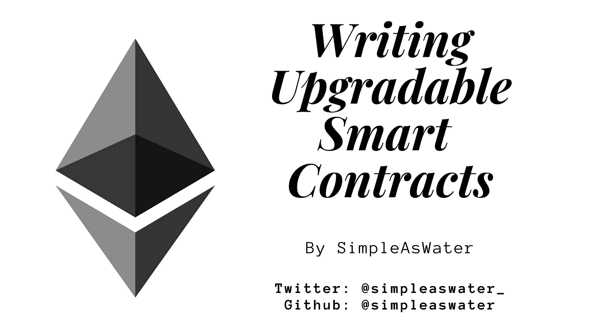

# 如何编写可升级的智能合同(智能合同版本控制)

> 原文：<https://medium.com/coinmonks/how-to-write-upgradable-smart-contracts-smart-contract-versioning-a50b9958aaf2?source=collection_archive---------1----------------------->

## 可升级智能合约如何与使用 OpenZeppelin 升级 CLI 和库的实际示例一起工作

