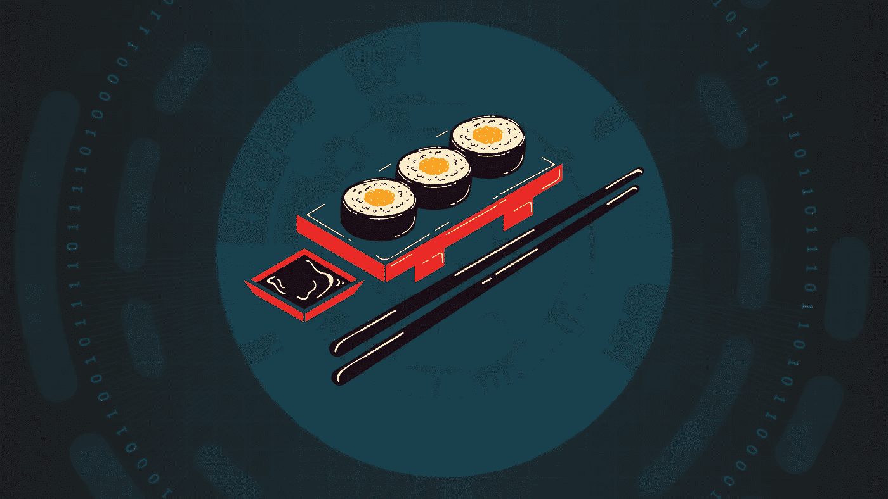
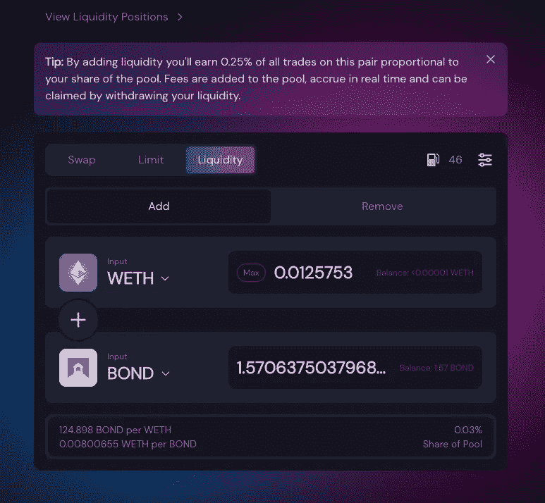
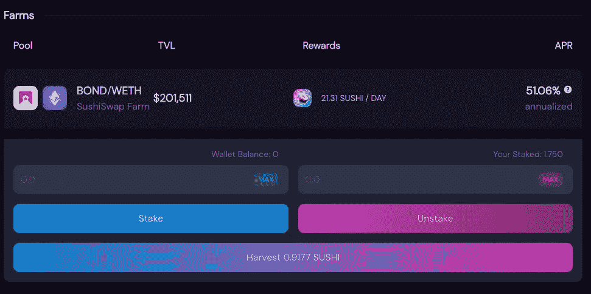

# 如何在湿地上种植庄稼

> 原文：<https://medium.com/coinmonks/how-to-yield-farming-on-sushiswap-a5ecb9341066?source=collection_archive---------1----------------------->

## 在最大的分散式交易所之一赢取奖励

**免责声明:**这不是投资建议。秘密投资可能有风险。不要投资你输不起的东西。我根据自己的经验和研究为这个领域的初学者写了这个指南。

# SushiSwap 是什么？

SushiSwap 是一个分散式交易所(DEX)和自动化做市商。这意味着没有管理交易的中央机构，而是通过智能合约(区块链的数学运算和过程)来进行交易。该平台由社区驱动，有自己的治理结构，使其完全去中心化。它支持一系列基于以太坊的区块链，如 Polygon、以太坊 mainnet 等等。SushiSwap 有 4 个主要产品分支，通过其流动性池运营，使其成为一个成熟的 Defi 平台:

1.  **一个分散的交易所(SushiSwap)。**在这里，您可以将一个加密货币令牌换成另一个。
2.  **一个分散的借贷市场(喀什借贷)。**它允许你借或借代币。
3.  **屈服文书。**这些允许你通过下注一对代币来为交易所提供流动性，赚取交易所的本地寿司代币作为奖励。
4.  **SushiBar 打桩。您可以将寿司代币兑换成 xSushi 来下注，并获得与您在寿司吧中的份额成比例的奖励。**

# 产量农业是如何运作的

开始吧:基本上有两种主要的方法可以让你在 SushiSwap 上获得奖励，而且这两种方法可以互相叠加。SushiSwap 向流动性提供商支付一定数额的费用，使 DeFi 平台能够发挥作用。

1.  SushiSwap 向流动性提供者支付 0.25%的掉期费用。也就是说，如果你在一个流动性池中投资两个代币，比如说 ETH 和 BOND，那么这个流动性池将在其代币对中赚取 0.25%的互换费用。然后，您将获得与您的份额成比例的寿司代币奖励。因此，回报是该令牌对的市场活动以及您在池中的股份大小的函数。
2.  SushiSwap 上所有掉期交易的 0.05%是将寿司代币押在 SushiBar 上的 xSushi 持有者累积的。

你已经可以看到两个收益率叠加的可能性。首先，通过将您的代币在池中以相等的价值下注，为代币对提供流动性。然后你会得到 SLP(寿司流动性池)代币，表明你在池中的份额。用这些来赢取寿司代币奖励。你会看到奖励实时增加，你可以随时收获。在第二个层面上，你可以为 xSushi 下注你的寿司奖励，从而在你的产量农业活动上赚取赌注奖励。

# 高产农业循序渐进指南

这里我将使用债券/WETH 流动性池作为例子。

## 为债券/WETH 池提供流动性

首先去[app.sushi.com](http://app.sushi.com)连接你的钱包。然后转到“pool”选项卡，选择所需的令牌对。您可以在这里选择每枚代币的金额，请注意，您必须存入一对等值的代币。

Example value pair. You can see your share of the pool at the bottom right corner.

## 批准交易。

交易获得批准后，您可以点击“确认供应”。然后，您将收到您的债券/WETH SLP 代币，表明您在债券/WETH 池中的份额。

## 将你的 SLP 代币投入债券/WETH 农场:

单击 farm 选项卡，搜索所需令牌对的场。在这里，您可以下注或不下注您相应的 SLP 代币。首先，您需要批准访问您的 SLP 令牌，然后确认交易。一旦完成，你应该能够看到你的奖励实时增长，在这种情况下，寿司代币。随时可以收获奖励。在这里，每天最多 21.31 个寿司代币将按比例分配给赌注者。

You can see your staked SLP tokens and current rewards. Rewards can be harvested at any time. In this case, a maximum of 21.31 Sushi tokens will be distributed proportionally among the stakers per day.

## 收获奖励并在 SushiBar 下注

一旦你积累了一定数量的寿司代币(因为汽油费，我建议你只收获一定数量的)作为奖励，你就可以在 SushiBar 上下注以赚取额外的收益。

# 乐观的前景

像 SushiSwap 这样的 Defi 平台能够以一种我们在传统金融系统中从未见过的直接方式获得金融工具。在这里，你可以成为快速发展的生态系统的一部分，直接参与，没有任何准入控制或财富障碍。没有银行会因为一些最低投资额或净值要求而阻止你参与市场。你参与社区或参与生态系统治理的程度完全取决于你。你可以从你的加密货币中获得收益。你可能已经把它放在钱包里了，或者 Defi 平台的回报前景如此吸引你，以至于你决定再买一些来投资。不管它是什么，我希望这个指南能驱散你头脑中关于苏珊农场产量的迷雾，给你一个简单易懂的概述。

# 缺点和风险

加密投资虽然有吸引力和回报，但也有内在的风险。我想在这里简单提几件事。第一次汽油费可能会很高，尤其是在以太坊主网上。因此，考虑投资金额和绝对及相对回报，因为高昂的汽油费可能会让你的回报前景黯淡。对于小额投资来说尤其如此。其次，回报率是不稳定的，取决于市场活动。它们可以实时变化，并与令牌的整体吸引力、宣传力度或实用性相关联。此外，奖励是以代币形式支付的，而且波动性很大。你不知道寿司代币或任何其他代币的未来价格，你应该在做出投资决定时考虑这一点。最后，Defi 平台存在风险，因为它们可能会像过去一样受到黑客攻击或攻击。虽然 SushiSwap 是较大的 dex 之一，但仍有被黑客攻击的风险，而且基金没有保险。

我希望这让你对 SushiSwap 提供的可能性有了一个简短的概述。如果我错过了什么，请随时告诉我，或者在 SushiSwap 上分享你自己的故事。

> 加入 Coinmonks [电报频道](https://t.me/coincodecap)和 [Youtube 频道](https://www.youtube.com/c/coinmonks/videos)了解加密交易和投资

## 也阅读

 [## 最佳加密交易所| 2021 年十大加密货币交易所

### ICON _ PLACEHOLDEREstimated 预计阅读时间:28 分钟加密货币交易所的加密交易需要知识…

blog.coincodecap.com](https://blog.coincodecap.com/crypto-exchange)  [## 2021 年 10 大最佳加密贷款平台| CoinCodeCap

### 当谈到加密货币贷款时，大量因素等同于良好的收入状况。此外，借款的一部分…

blog.coincodecap.com](https://blog.coincodecap.com/crypto-lending)  [## 2021 年最佳免费加密交易机器人

### 2021 年币安、比特币基地、库币和其他密码交易所的最佳密码交易机器人。四进制，位间隙…

medium.com](/coinmonks/crypto-trading-bot-c2ffce8acb2a)  [## 最佳 4 个加密交易信号电报通道

### 这是乏味的找到正确的加密交易信号提供商。因此，在本文中，我们将讨论最好的…

medium.com](/coinmonks/best-crypto-signals-telegram-5785cdbc4b2b)  [## BlockFi 评论 2021:利弊和利率| CoinCodeCap

### 今天，我们提出了一个全面的 BlockFi 评论，这是一个成立于 2017 年的加密贷款平台，拥有其…

blog.coincodecap.com](https://blog.coincodecap.com/blockfi-review)  [## 如何在印度购买比特币？2021 年购买比特币的 7 款最佳应用[手机版]

### 如何使用移动应用程序购买比特币印度

medium.com](/coinmonks/buy-bitcoin-in-india-feb50ddfef94)  [## 加密税务软件——五大最佳比特币税务计算器[2021]

### 不管你是刚接触加密还是已经在这个领域呆了一段时间，你都需要交税。

medium.com](/coinmonks/best-crypto-tax-tool-for-my-money-72d4b430816b)  [## 存储比特币的最佳加密硬件钱包[2021] | CoinCodeCap

### 保管您的数字资产很容易，但找到正确的存储方式却是一项繁琐的任务。在线钱包有一个风险…

blog.coincodecap.com](https://blog.coincodecap.com/best-hardware-wallet-bitcoin)