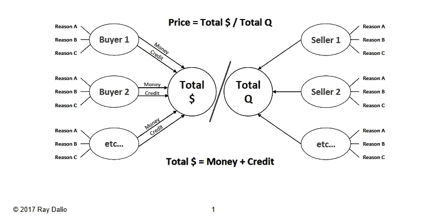
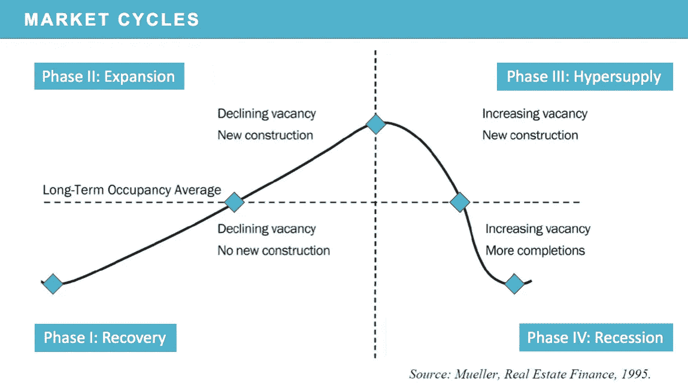
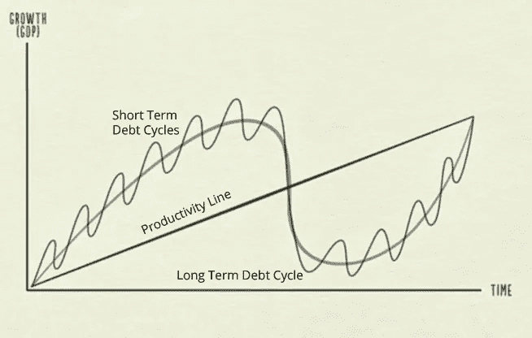

# 资产证券化如何改善经济

> 原文：<https://medium.com/coinmonks/how-tokenizing-assets-can-improve-the-economy-8fd150e27561?source=collection_archive---------4----------------------->

资产证券化给我们带来的经济利益类似于金融机构的部分准备金银行业务。这使得银行可以持有一小部分贷款，为借款人提供更多的流动性。例如，将房地产令牌化可以让房屋价值通过股票变得具有流动性，并在经济中重新使用，而不是保持非流动性和利用不足。这有利于资产所有者，他们现在可以利用这种流动性提高经济生产率，这也增加了在整个经济中流动的累积价值。

经济在最基本的层面上是由实体之间的交易组成的，用现金或信贷交换商品、服务或资产，这最终是由人性驱动的。经济是由存在于所有行业的所有市场的所有交易的积累组成的。

在撰写本文时，美国的住房总存量价值为 31.8 万亿美元。如果一个单独的房子可以被令牌化并作为股票出售，那么仅仅利用美国闲置房屋价值的一小部分就可以刺激经济并创造新的投资机会。立即为更多的借款人和贷款人打开大门，他们可以利用这一价值，推动进一步的经济增长，甚至有助于降低债务水平。

如果你要在公开市场上出售你的房子，你仍然可以保留居住权和管理责任，因为你是持有大部分股份的主要投资者。

**周期低迷和多样化**

通过投资于世界其他地区的其他令牌化资产，您可以降低当地市场波动带来的风险。如果一个市场经历低迷，这是不可避免的，因为房地产市场是周期性的，对你的整体资产组合的影响将被最小化。

**注意事项**

虽然我对这个话题非常乐观，但我也明白突然的破坏性变化会产生意想不到的结果。打个比方，中央银行调整利率决定了借贷成本。如果央行降低利率，人们可以借更多的钱，借更多的债。反过来，物品的成本会增长过快，这就是我们所说的通货膨胀。下图描绘了经济生产率、短期和长期债务周期的总体线性增长。随着价格上涨，收入跟不上，经济收缩是因为需要偿还债务。下图中的短期债务周期代表了这一点。

有鉴于此，如此庞大的住房存量通过象征性的方式突然涌入的流动性的经济影响，可能会对价格产生有趣且可能不良的短期副作用。但这也适用于许多事情，如政府补贴和社会服务。

> [在您的收件箱中直接获得最佳软件交易](https://coincodecap.com/?utm_source=coinmonks)

