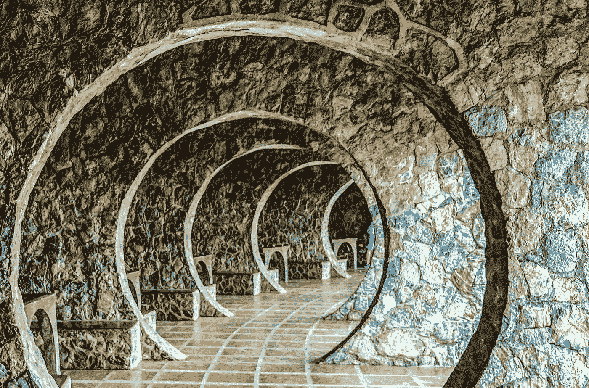

# EtherDelta 的去中心化程度如何？

> 原文：<https://medium.com/coinmonks/how-truly-decentralized-etherdelta-is-880caac9ad26?source=collection_archive---------6----------------------->

## 在最近关于 SEC 收购 EtherDelta 和其他分散化交易所的新闻之后，我们不得不问自己——它们的分散化程度如何？

去中心化是一个广泛的术语，范围从真正的去中心化，以太坊上的智能联系既不能改变也不能停止，到一些笑话去中心化，像 [USDC](https://ylv.io/circle-usdc-technical-overview/) ，合同所有者可以暂停，黑名单和用他们想要的任何东西交换整个合同。

我们将分析 EtherDelta 以太坊源代码，以准确描述 EtherDelta 如何真正去中心化，以及 SEC 和其他执法机构有哪些选项来控制或关闭 EtherDelta。

以太网智能合约出现在[以太网扫描](https://etherscan.io/address/0x8d12a197cb00d4747a1fe03395095ce2a5cc6819#code)上，只有 312 行代码。此外，它还有 SafeMath、Token、StandardToken 和 ReserveToken 等类，这些都是非常标准的实现，我们将完全跳过它们。

主合同名为 EtherDelta，有 170 行代码。给你。完成 170 条线路的分散交换。智能合约的真正力量。合同只定义了一个角色—管理员。管理员可以:

*   更改管理员。
*   更改用户的帐户级别。
*   更改费用帐户。
*   降低制作费。
*   降低佣金。
*   增加回扣费。

正如我们可以管理角色是一个深思熟虑的智能联系人设计的完美例子。这两种管理权限都不允许以任何方式暂停或使整个智能合同不可用。我特别喜欢管理员只能降低费用，而不能增加费用。因为如果他可以，那将是停止交易的最简单的方法，因为没有人可以带着 100%的费用交易。

在 EtherDelta 智能合约中没有定义任何其他角色或后门。它已经超出了我的期望。我认为 EtherDelta 是一个很好的例子，说明了真正的智能契约应该如何设计。势不可挡，真正去中心化。干得好以太三角洲！

换句话说，监管机构不能关闭 EtherDelta，即使他们获得了 admin key。当然，他们可以要求所有的利润，但这不会停止交易。可能会发生的情况是，他们关闭前端网站，人们会因为纯粹的便利而转向其他交易所。

## TL；速度三角形定位法(dead reckoning)

EtherDelta 是真正的去中心化，无法停止。

## 如果这篇文章有帮助，请点击拍手👏按钮下面几下，以示支持！⬇⬇

# 社会的

*   在 [LinkedIn](https://www.linkedin.com/in/ylv-io/) 上与我联系。
*   在 [twitter](https://twitter.com/ylv_io) 上关注我。

# 阅读更多

 [## 如何创建和部署您自己的 EOS 令牌

### 我们将弄清楚什么是 EOS 令牌，以及您如何自己创建和部署它。

hackernoon.com](https://hackernoon.com/how-to-create-and-deploy-your-own-eos-token-1f4c9cc0eca1)  [## 2018 年办 DApp 要花多少钱

### 你认为你的 AWS 或网站的数字海洋账单正在杀死你吗？

hackernoon.com](https://hackernoon.com/how-much-does-it-costs-to-run-dapp-in-2018-87ee11fe1d5d) 

*原载于 2018 年 11 月 13 日* [*ylv.io*](https://ylv.io/how-truly-decentralized-etherdelta-is/) *。*

> [直接在您的收件箱中获得最佳软件交易](https://coincodecap.com/?utm_source=coinmonks)

