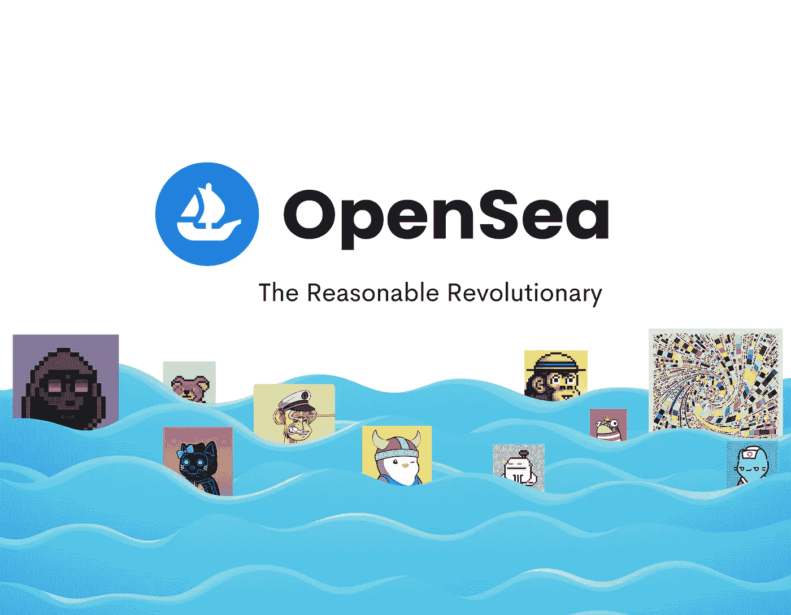
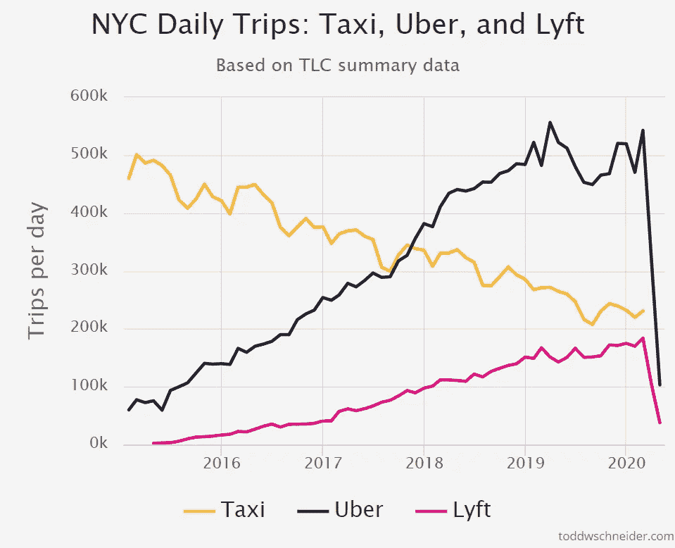
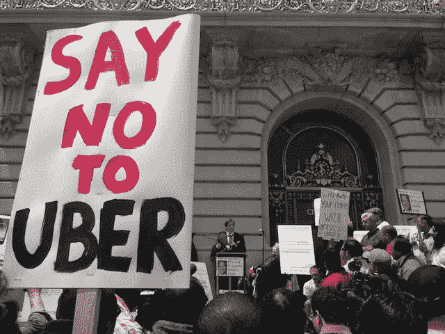
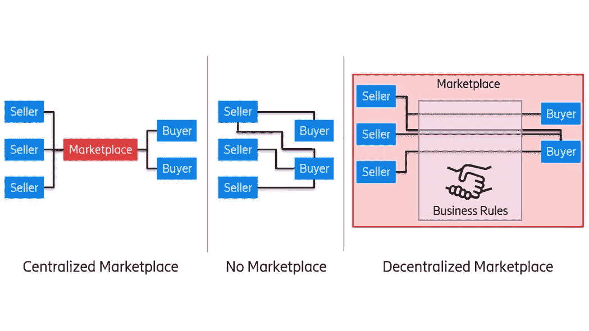
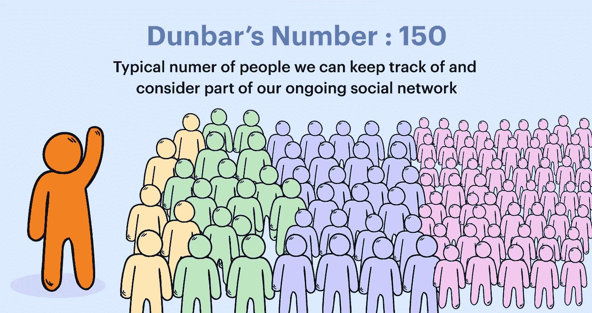

# 优步会如何死去。

> 原文：<https://medium.com/coinmonks/how-uber-will-die-bf40f2391073?source=collection_archive---------4----------------------->

## 分散市场的浪潮正在到来…

共享经济是互联网的伟大发明之一。

大量的市场，使得商品或服务的买家和卖家之间的联系变得前所未有。

例如，在优步来到伦敦之前，著名的黑色出租车服务是出租车司机的唯一选择。

对于一个司机来说，获得黑色出租车执照是一个费力且昂贵的过程。它包括通过一项名为“知识”的测试，平均需要 34 个月才能完成，以及购买一款特定型号的汽车，即哈克尼马车。

想要成为一名优步司机，你只需要一辆车，一张有效的英国驾照和一部联网手机。注册过程不超过一周。

如今，优步人在伦敦的平均旅行费用比乘坐黑色出租车的相同旅程低 40%。

优步扰乱了世界各地的打车服务。

Ride hailing apps such as Uber & Lyft have taken over the Taxi industry. Drop of in 2020 due to the Pandemic.

这些共享经济市场的兴起，使得从出租车服务到酒店预订和食品配送等许多以前效率低下的市场的供需得以满足。

通过利用网络效应，这些新时代的集市在力量和范围上都有所增长。在这样做的过程中，他们通过将信任和流动性输入到不同的领域，允许不相识的个人安全地相互交易，从而为世界带来了巨大的效用。

如今，当在亚马逊市场上买卖东西时，他们不再信任买家或卖家。他们信任亚马逊。

但是也有一些缺点。

共享经济在地理上并非无处不在。这些公司并不是到处都有业务。因此，一些人被禁止使用它们。

瑞典无法访问亚马逊。意大利全国都禁止了优步。
在纽约，用 Airbnb 租房子度假是违法的。

往往是世界上的边缘化和贫困国家被排除在它们的效用之外。非洲没有亚马逊、优步或 AirBnB。

随着科技的发展，不平等也在加剧。

第二，由于规模网络效应的强大力量，这些市场在一定程度上对它们所服务的市场施加了垄断力量。

伴随这种影响而来的是从买卖双方身上榨取比传统市场通常允许的更多价值的倾向。

杰夫·贝索斯有句名言，“你的利润就是我的机会”

亚马逊市场对售出的任何商品收取 15%的费用。
优步向所有司机收取 25%的车费。
AirBnB 每次预订收取高达 20%的费用。

这些市场垄断的外部性也出现在不同的领域。

你有多频繁地在新闻中看到优步，标题与司机权利和乘客安全有关？

这些平台的规模和成功既是礼物也是诅咒。

技术能让共享经济进一步进化吗？

持续的创新能让我们保持共享经济的效用，同时抑制相关公司的垄断外部性吗？

区块链技术可能被视为一个潜在的答案。

Vitalik Buterin 于 2013 年创建的以太坊网络是智能合约发明和使用的先驱。

> 智能合同是一种自动执行的合同，买卖双方之间的协议条款直接写入代码行。守则和其中包含的协议存在于一个分散的区块链网络中

智能合约消除了对中央集权政府向市场注入信任和流动性的依赖。

在这种情况下，买卖双方之间的信任和支付的安全性可以由智能合同来承担。

如今，我们信任亚马逊、优步和 AirBnB 等市场。明天，我们可能会对区块链的智能合约寄予厚望。

基于智能合约的去中心化市场会是什么样子？

买方和卖方将能够从他们的每笔交易中获取最大的效用。在足够大的规模上，他们可以利用大型互联网市场固有的网络效应，但他们不需要在交易费和佣金方面损失价值给一家集中化的公司。

Can we put our trust in a decentralised marketplace — Ericsson Blog

也许我们每个人都将成为我们自己的移动电子商务商店，销售我们每个人都能提供的独特商品和服务。

我们每个人都有能力与陌生人进行安全且无佣金的交易。我们将不再需要亚马逊来寻找合适的买家，也不再需要贝宝来管理支付过程。

从表面上看，这似乎是一个完美的资本主义乌托邦。但是人性在这里会阻碍技术进步。

人类本质上仍然是部落的，我们很难真正信任与我们有直接关系的 150 个人之外的任何人。这一科学真理被称为邓巴数。

公司本质上是我们互相讲述的故事，作为资本主义的一个功能，以克服邓巴数的问题。我们不信任人，而是信任公司。

在公司成立之前，我们别无选择，只能在我们 150 人的圈子内交易。公司的创立让我们的视野扩大到 150 人以上，这反过来又促进了真正全球化的世界经济的发展。

我理解并承认智能合约作为交易媒介的安全性。问题是，我们能否像信任集权公司一样，共同信任区块链的微程序？

我们的人性会允许吗？

我还没有被说服。时间会证明一切。

如果你对这篇文章感兴趣，请登录我的博客，关注区块链技术在商业领域的应用，网址是:

[**【https://dhinil.substack.com/】**](https://dhinil.substack.com/)