# 不可阻挡的域名如何让互联网变得自由

> 原文：<https://medium.com/coinmonks/how-unstoppable-domains-is-setting-the-internet-free-9065a5ef65da?source=collection_archive---------2----------------------->

## 发现不可阻挡的领域，以及该公司如何简化加密支付和供电未经审查的网站。

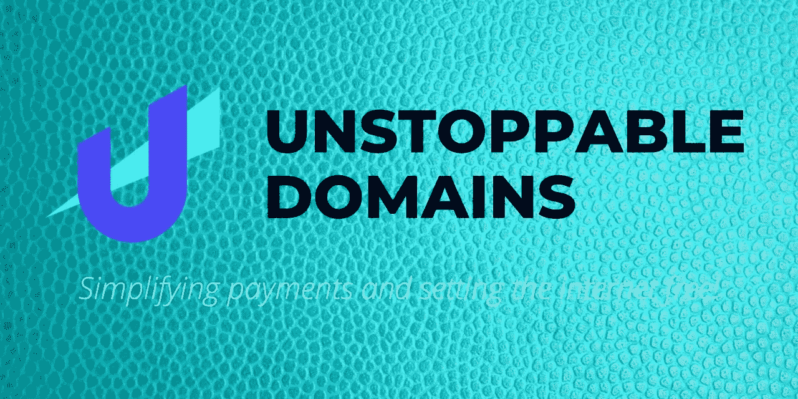

> **给自己弄一个简单的、人类可读的区块链域名，用它你可以接收所有的加密货币，并建立一个抗审查的网站，只有你可以用** [***不可阻挡的域名来建立和关闭。***](https://unstoppabledomains.com/r/CryptoSorted)

**不可阻挡的域名**的使命是*通过使互联网**抵抗审查**和通过**区块链域名大幅简化(加密货币)支付来解放互联网***。

众所周知，今天的互联网过于集中，容易受到审查，用户对内容没有个人选择，因为你只能看到他们希望你看到的内容。

我说的“他们”指的是互联网巨头——你知道他们——以及越来越多的过度限制的政府，他们确实想控制你生活的方方面面。

多亏了区块链技术，几乎所有东西——包括你的钱和信息——现在都可以完全去中心化，像 Unstoppable Domains 这样的公司正在引领这场革命。

# 什么是不可阻挡的域名？

Unstoppable Domains 是一家总部位于旧金山的软件公司，也是区块链域名注册商 T21，他们正在以太坊区块链的基础上构建域名。该公司得到了 Draper Associates 和 Boost VC 的支持，并获得了以太坊基金会和 Zilliqa 基金会的拨款。

该公司由[布拉德·卡姆](https://www.linkedin.com/in/matthew-gould-7877361)(首席执行官)[布雷登·佩泽什基](https://www.linkedin.com/in/braden-pezeshki-5aa477156)(全栈工程师)[布拉德利·卡姆](https://www.linkedin.com/in/bradley-kam-444aa228)(业务发展负责人)[波格丹一世·古西耶夫](https://www.linkedin.com/in/bogdangusiev)(首席技术官)[瑞安·勒](https://www.linkedin.com/in/le-ryan)(工程师)创立，于 2018 年上线。

Unstoppable Domains 的主要目标包括:**简化加密货币支付**和**将互联网从集中控制中解放出来**，以及**通过允许开发者在没有 DNS(域名系统)当局批准的情况下建立**和在互联网上部署分散网站**来打破互联网的等级性质**。

据该团队称，该项目旨在**保护互联网上的言论自由**作为*你的* **。加密域不能被第三方离线——甚至不可阻挡的域也不能。**

目前，该公司已经推出了 2 个不同的顶级域名扩展**。zil** 和**。crypto**——已经申请了近 10 万个域名，2000 多个区块链网站，一个全新的分散网站搜索引擎——blockscan.com——已经推出，而且这个数字每天都在快速增长。

# 不可阻挡的域名是如何工作的

如上所述，Unstoppable Domains 的主要目标是:使用区块链技术，通过去中心化来简化(加密货币)支付和保护互联网上的言论自由。

获得不可阻挡的域名有利于你两个直接的好处:

1.  您可以用您的人类可读域名(如"***【payme . crypto "***)接收多种加密货币(甚至是法币)
2.  你可以用你的不可阻挡的域名建立分散的、抵制审查的网站，没有人能抓住或拿下它。

因此，基本上你所要做的就是接收付款，将你的各种加密货币地址连接到你的不可阻挡的域名。

要接收任何加密货币支付，发送者只需要您的 Unstoppable Domains 域名。

所有发送到您的域名的加密货币支付都将落入您已连接到该域名的相应钱包地址。

因此，实际上你可以用一个简单易记的域名接收比特币(BTC)、以太坊(ETH)、Ripple (ETH)和市场上数千种其他加密货币。

因此，通过提供流畅的用户体验，有效地简化了加密货币支付并鼓励了大规模采用。

> *“这种加密货币支付的新标准通过用一个简单易读的人类名字取代冗长复杂的地址来改善用户体验，”…“用户不仅可以将 50 多个不同的加密地址附加到他们的* **。加密域** *来接收支付，但用户也可以使用同一个域来启动抗审查网站。”~布拉德卡姆。*

# 如何创建您的免费不可阻挡的域名帐户

要购买一个区块链域名，你首先需要有一个不可阻挡的域名账户——很明显，对吗？

下面是一步一步的指南来创建你的不可阻挡的域名帐户，直到购买你的第一个域名。

***走吧……不过先走“急步”***

1.  **第二步:**输入你的电子邮件地址
2.  **第三步:**输入您的首选密码
3.  第四步:搜索你想购买的域名
4.  **第五步:**如果可用，点击添加到购物车。
5.  **第六步:**一旦你将所有选择的域名添加到购物车中，点击 CHECKOUT。
6.  **第七步:**在下一个屏幕上选择您喜欢的支付方式
7.  **第八步:**付款

您的付款将得到相应的处理，所选域名将被存入您的帐户，并可在几分钟或几小时内申请，具体取决于您的付款方式的速度。

恭喜你！你的域名终身属于你。

***现在，走上详细步骤……***

# 如何访问区块链域

区块链域无法通过常规浏览器访问。

您将需要使用镜像服务和其他正在开发的支持浏览器来访问区块链域。

但现在，要访问区块链域名，你可以使用 Unstoppable Domains chrome 扩展、Unstoppable Blockchain 浏览器或 Android 版 Opera 浏览器。

一旦你有以上任何一个，在你的浏览器地址栏输入区块链网站地址，你就能相应地看到网站上的内容。

***想了解更多关于区块链领域的知识？观看不可阻挡的领域团队的这个解释者视频。***

# 如何购买你无法阻挡的域名区块链域名

到现在为止，你一定已经创建了你的免费的不可阻挡的域名帐户。

如果您还没有注册， [**点击此链接，现在就使用您的电子邮件地址和密码注册**](https://href.li/?https://unstoppabledomains.com/r/CryptoSorted) **、**。

好的，很好。

现在让我们继续购买你的第一个区块链域名。

1.  [**点击此处**](https://href.li/?https://unstoppabledomains.com/r/CryptoSorted) **，使用您的电子邮件地址和密码登录您的 Unstoppable Domains 帐户。你应该有如下相同的页面。**

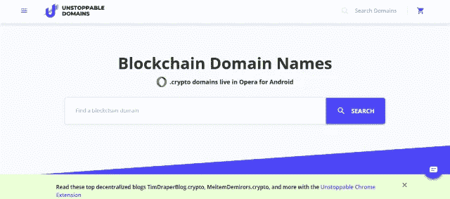

Unstoppable-Domains Login Page

**2。登录后，使用网站上的域名搜索工具搜索您想要购买的域名。**

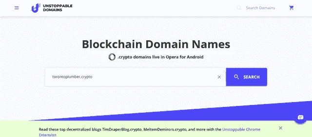

Domain Name Search Tool

**3。如果名称可用，请单击添加到购物车。搜索你想购买的其他域名，并把它们全部添加到购物车中，直到你完成。**

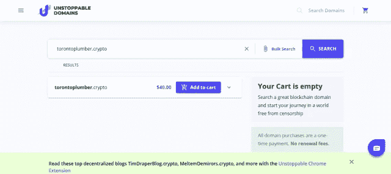

Name Reservation

**4。一旦您将所有选择的域名添加到购物车中，请单击 CHECKOUT。**

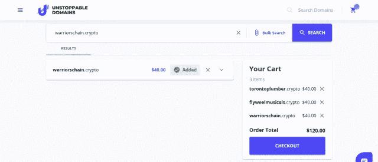

Checkout

**5。在下一个屏幕上，您需要选择您喜欢的付款方式。**

可用选项包括:用卡支付，用贝宝支付，用密码支付，用 Crypto.Com 支付。

出于本教程的目的，我将选择**通过加密支付。并从可用的加密货币列表中点击比特币。**

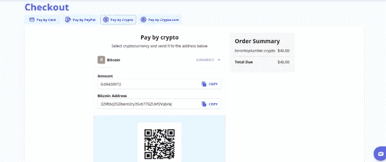

Purchase Your Blockchain Domain with Crypto

将所需的比特币价值发送到显示的钱包地址，以完成支付和购买。

你的区块链域名将在 3 次左右的区块链确认后存入你的账户。

恭喜你，你已经成功购买了你的第一套不可阻挡的区块链域名。

下一步是**要求您购买的区块链域名。**

# 如何认领你的 UD 区块链域名

在为你的域名付费后，你需要把它们放进你的钱包，使它们永久属于你，这个过程就像吃黄油一样简单。

***但是首先，让我们稍微跑题一下…***

你记得你的区块链域名就像你所有的加密资产一样存在于你的钱包里。很好！

现在，声称你的区块链域名意味着从不可阻挡的域名接收到你的钱包。你明白了！

这意味着你的钱包必须连接到你的不可阻挡的域名账户(别担心，你不会给他们你的私人密钥)。

因此，在继续申请您购买的域名之前，请遵循下面的简单指南，将您的钱包连接到您的 Unstoppable Domains 帐户。

下面的链接包括如何连接各种支持的钱包，并将由 Unstoppable Domains 团队不断更新。

所以无论你什么时候去那里，它都应该是非常流行的。

**简单指南:** [**如何将你的钱包连接到一个无法阻止的账户**](https://href.li/?https://community.unstoppabledomains.com/t/how-to-connect-your-wallet-to-unstoppable-account/610)

这样一来，让我们继续要求你的区块链域名不可阻挡。

要申请，请单击左上角的菜单按钮，并从下拉菜单项中选择“我的域”。

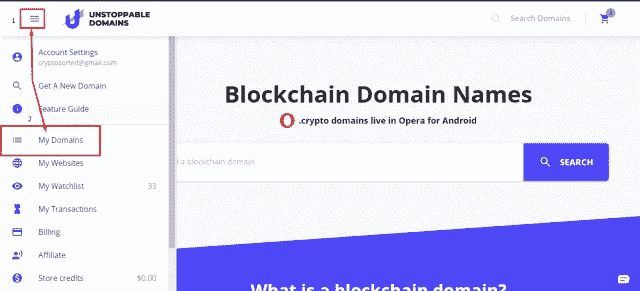

My Domains

下一页将显示您购买的所有域名——包括您已经申请的和未申请的。

选择所有无人认领的域名，然后点击认领。

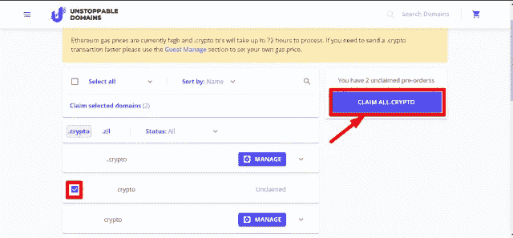

Claim Your Blockchain Domains

在弹出的下一个屏幕上，单击通过电子邮件发送代码，验证将被发送到您注册的电子邮件地址。

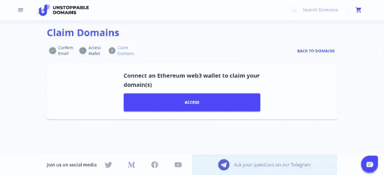

Claim Your Blockchain Domains

去检查你的电子邮件，复制代码，并在下一个屏幕上输入它，以验证它确实是你在做交易。

一旦您输入代码，系统将要求您连接您的以太坊 Web3 钱包。只需点击访问。

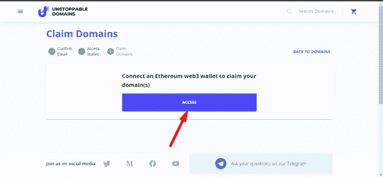

Claim Your Blockchain Domains

如果你按照上面的 [***指南***](https://href.li/?https://community.unstoppabledomains.com/t/how-to-connect-your-wallet-to-unstoppable-account/610) *正确连接你的钱包，你就不会有任何问题。*

在下一个屏幕上，检查我理解并点击确认按钮，你就完成了。

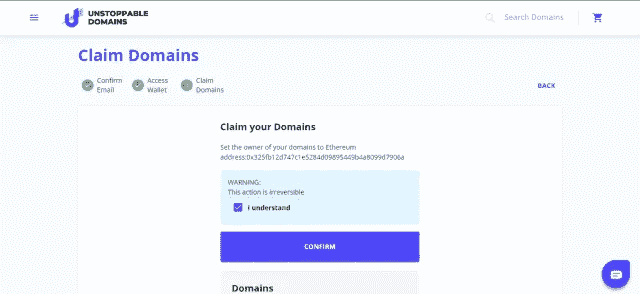

Claim Your Blockchain Domains

**恭喜你，你做到了！**

现在，单击查看域返回到您的域列表，并查看您的声明域的状态。

一旦被认领，你的域名将终身属于你。甚至不可阻挡的域名或任何人都不能把它们拿走，因为它们在你的钱包里，由你的私钥保护着。

然而，如果你把你的私人密钥给任何人，他们就可以访问你的域名，把它转出去，做任何他们想做的事情。

因此，保持您的私钥非常私人，因为您的域和加密资产是安全的，只有你的私钥。

# 如何连接您的钱包地址区块链域

连接您所有的钱包地址到您的不可阻挡的领域区块链域名是容易的。

首先，你需要登录到你的不可阻挡的域名帐户。

单击右上角的菜单按钮，从下拉菜单项中选择我的域-参见下面的屏幕截图

My Domains

从您购买的各种区块链域名中找到您要将您的钱包地址连接到的域名，然后单击管理。

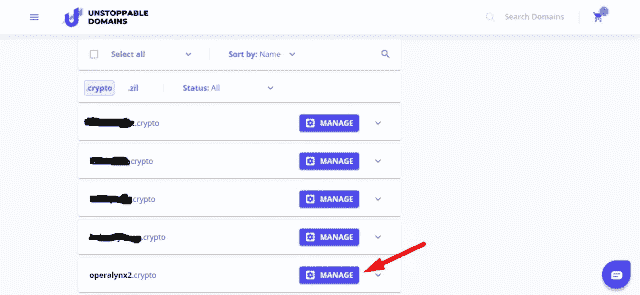

Manage Your Domain

在下一页的“添加加密货币地址”下，相应地填写您的 BTC、瑞士联邦理工学院、ZIL、LTC、XRP 钱包地址。见下面截图。

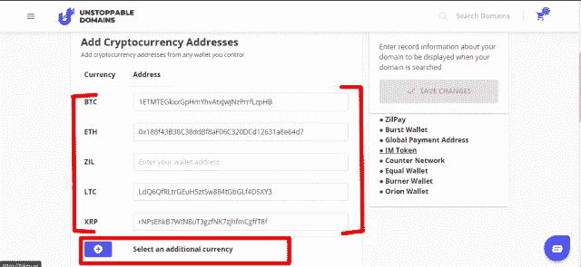

Add Your Wallet Addresses

添加任意数量的钱包地址，完成后单击保存更改。

现在，你可以开始用你的区块链域名接收付款，硬币将直接存入他们各自的钱包地址——很简单！

# 不可阻挡的域的特征区块链域

以下是拥有一个区块链域名的特点和好处，这肯定会让你兴奋不已，并渴望今天就得到你的域名:

1.  **简化支付:**您可以将多达 50 个不同的加密货币钱包地址连接到您的区块链域名，并通过一个简单、易读、易记的地址——您的域名——获得支付。更有趣的是，随着不可阻挡的域名与 PayID 的合作，用户可以很容易地收到同一个区块链域名的菲亚特和加密支付-令人印象深刻。
2.  抵制审查:你不可阻挡的域名区块链域名和网站不会被任何人查封，除了你自己。你的域名和相关网站只存在于你的钱包里，就像你的加密资产一样，没有人--甚至是不可阻挡的域名--可以在没有你的私钥的情况下访问它。没有政府或组织能够控制你选择或不选择在你的网站上显示什么。欢迎来到分散式互联网。我听到你说哈利路亚了吗？哈哈
3.  **一次性付款:**一次性支付你无法阻挡的域名区块链域名，永远拥有它。没有月费或年费。
4.  **轻松迁移:**迁移传统域名是一件麻烦事。但有了区块链域名，这就像把比特币发送到你的另一个钱包或发送短信一样简单。您可以更容易地将域名转让给任何人，而无需与传统域名和网站相关的复杂流程。只需输入收件人的钱包地址，然后点击转账，就可以了。更重要的是，你可以在任何以太坊市场，如 OpenSea，将你的区块链域名作为 NFT(不可替换的令牌)进行交易。
5.  免费网站模板:你不知道如何开始建立你势不可挡的区块链网站，不要担心。Unstoppable Domains 提供了数百个网站模板，您可以根据自己的喜好进行定制，而不必从头开始构建，因此任何人都可以构建一个分散式网站(dweb)。
6.  **备用根:**传统域名需要得到 ICANN(互联网名称与数字地址分配机构)的批准并受其管辖，而不是你的区块链域名。

# 如何赚取不可阻挡的域名

基本上有两种方式赚取不可阻挡的域名:

## 1.加盟计划

你可以通过申请成为代销商来获得势不可挡的域名，你可以从点击你的链接、创建帐户并购买他们的域名的客户那里获得所有购买额的 10%。

你可以推荐给不可阻挡的域名的客户数量是没有限制的——因此你的收入取决于你愿意为推广这个项目付出多少努力。

但是，您需要达到 1500 美元的最低支付限额才能一次性提款。

这意味着在你可以提取你的代销商收入之前，你必须通过你的代销商链接产生至少 15，000 美元的销售额。

更重要的是，用借记卡或信用卡提出的支付请求在被批准之前可能要经过 30 天的审查。

不出所料，试图用伪造的、重复的账户欺骗系统；自我推荐；附带交易和其他“*游戏化”*将使您失去推荐计划的资格。

因此，公平竞争是个好主意。

## 2.畴翻转

不可阻挡的域名的第二个赚钱机会是，你可以购买你认为未来会有需求或对他人有价值的域名，并在区块链点对点市场 OpenSea 出售。

这被称为“域名翻转”，是一个你可以从事的合法生意。我见过一些域名被卖到几十甚至几百甚至几千以太坊(ETH)一个。

最近有人以高达 9 万美元的 ETH 价格出售了域名 **sex.crypto** 。你可以[在这里](https://cointelegraph.com/news/sex-sells-sex-crypto-sells-for-230-eth)阅读这个故事。

如果你擅长挑选伟大的域名，这可能是一个伟大的机会，因为有数以百万计的优质域名尚未购买和索赔。

这场革命还会带来其他一些商业机会。

例如，你可以成为一名专业的区块链网站开发者，为区块链网站建立模板和插件，就像我们有 WordPress 主题和插件等。

只要你能想象，机会是无限的。

# 关于不可阻挡的领域的最终想法

关于去中心化、隐私、审查阻力和个人金融主权的讨论主导了区块链和加密货币领域，而且只会越来越多。

比赛正在进行，Unstoppable Domains 是引领加密货币和区块链技术大规模采用的公司之一，它让普通员工通过发送电子邮件与加密货币进行互动和交易变得简单易行。

现在，任何人都可以拥有并建立一个不受审查的区块链域名和网站，作为他们的加密货币支付地址，以及更多不可阻挡的域名。

**事实上，如果你使用我的链接，你会在第一次购买时获得 10 美元的折扣。**

你势不可挡吗？

非常感谢你花时间把这篇文章读完。如果觉得有帮助，请随意分享，留下一堆掌声。

## 另外，阅读

*   最佳加密交易机器人
*   最好的比特币[硬件钱包](/coinmonks/the-best-cryptocurrency-hardware-wallets-of-2020-e28b1c124069?source=friends_link&sk=324dd9ff8556ab578d71e7ad7658ad7c)
*   [密码本交易平台](/coinmonks/top-10-crypto-copy-trading-platforms-for-beginners-d0c37c7d698c)
*   最好的[加密税务软件](/coinmonks/best-crypto-tax-tool-for-my-money-72d4b430816b)
*   [最佳加密交易平台](/coinmonks/the-best-crypto-trading-platforms-in-2020-the-definitive-guide-updated-c72f8b874555)
*   [unis WAP 最佳钱包](/coinmonks/best-wallets-to-use-uniswap-e91a6385d9e8)
*   最佳[加密贷款平台](/coinmonks/top-5-crypto-lending-platforms-in-2020-that-you-need-to-know-a1b675cec3fa)
*   [block fi vs Celsius](/coinmonks/blockfi-vs-celsius-vs-hodlnaut-8a1cc8c26630)vs Hodlnaut
*   [莱杰 vs 特雷佐](/coinmonks/ledger-vs-trezor-best-hardware-wallet-to-secure-cryptocurrency-22c7a3fd391e)
*   [顶级 DeFi 项目](/coinmonks/defi-future-10-promising-projects-in-the-defi-world-ff2b697ab006)
*   Bitsgap 评论——一个轻松赚钱的加密交易机器人
*   为专业人士设计的加密交易机器人
*   [3commas Review](https://blog.coincodecap.com/3commas-review-an-excellent-crypto-trading-bot) |一款优秀的密码交易机器人
*   [3Commas vs Cryptohopper](/coinmonks/cryptohopper-vs-3commas-vs-shrimpy-a2c16095b8fe)
*   Bitmex 的[保证金交易指南](/coinmonks/the-idiots-guide-to-margin-trading-on-bitmex-dbbd7742c6fc?source=friends_link&sk=7bfa99d2a181142510c8442c8ddb0786)
*   [加密摇摆交易的权威指南](/coinmonks/the-definitive-guide-to-crypto-swing-trading-7e4af6496d4d?source=friends_link&sk=70448050bd9323b42f63bfc0bb1e60d1)
*   [Bitmex 高级保证金交易指南](/coinmonks/bitmex-advanced-margin-trading-guide-2270c195ce25?source=friends_link&sk=1d986cca731f5084b9a2db4a4bc4a7ad)
*   [面向开发人员的最佳加密 API](/coinmonks/best-crypto-apis-for-developers-5efe3a597a9f)
*   [加密套利](/coinmonks/crypto-arbitrage-guide-how-to-make-money-as-a-beginner-62bfe5c868f6)指南:新手如何赚钱
*   顶级[比特币节点](https://blog.coincodecap.com/bitcoin-node-solutions)提供商
*   最佳[加密制图工具](/coinmonks/what-are-the-best-charting-platforms-for-cryptocurrency-trading-85aade584d80)
*   了解比特币的[最佳书籍有哪些？](/coinmonks/what-are-the-best-books-to-learn-bitcoin-409aeb9aff4b)

> [直接在您的收件箱中获得最佳软件交易](https://coincodecap.com?utm_source=coinmonks)

*原载于 2020 年 7 月 9 日*[*https://cryptosered . info*](https://cryptosorted.info/unstoppable-domains-enabling-simplified-crypto-payments-and-a-free-internet/)*。*