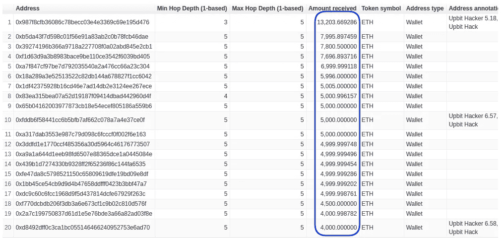

# 黑客如何利用密码交换洗白数百万美元？

> 原文：<https://medium.com/coinmonks/how-upbit-hackers-laundered-millions-using-crypto-exchanges-9b46a8fcb577?source=collection_archive---------5----------------------->

2019 年，黑客在 11 次黑客攻击中窃取了价值 2 . 83 亿美元的加密货币。在这些黑客攻击中，黑客们还成功地瞄准了 [Upbit 交易所](https://sg.upbit.com/)。在本文中，我们将调查 Upbit 黑客，并使用[coin path API](https://bitquery.io/products/coinpath?utm_source=blog&utm_medium=upbit)追踪被盗的加密货币。

# 什么是 Coinpath？

[coin path](https://bitquery.io/products/coinpath?utm_source=blog&utm_medium=upbit)API 为超过 24 个区块链提供[区块链资金流分析](https://blog.bitquery.io/coinpath-blockchain-money-flow-apis)。使用 Coinpath 的 API，您可以监控区块链交易，调查比特币洗钱等加密犯罪，并创建加密取证工具。阅读[开始使用 Coinpath](https://blog.bitquery.io/coinpath-api-get-start) 。

# Upbit Hack

2019 年 11 月 27 日下午 1 点 06 分，韩国加密货币交易所 [Upbit](https://sg.upbit.com/) 观察到一笔大额交易从交易所钱包流出。第二天，Upbit 的团队[通知](https://upbit.com/service_center/notice?id=1085)有安全漏洞，黑客窃取了 342K ETH(大约。4810 万美元)并将资金转移到 [**这个**](https://explorer.bitquery.io/ethereum/address/0xa09871aeadf4994ca12f5c0b6056bbd1d343c029) 地址。

在本文中，我们将通过跟踪黑客在随后几天和几个月中创建的交易来调查 Upbit 被盗的资金。

# 跟踪资金外流

犯罪分子经常使用多个中间钱包和其他服务来清洗被盗的加密货币。换句话说，在将资金转换为法定货币或其他加密货币之前，他们创建了多层交易以使追踪变得困难。这个过程叫做分层，每一层代表一个细分市场。

一次**跳跃**指的是资金从源头到目的地所经过的环节(钱包组)的数量。

Hops explained

[Coinpath](https://bitquery.io/products/coinpath?utm_source=blog&utm_medium=upbit) 技术有助于通过多跳追踪资金，以发现资金的来源或目的地。

现在，让我们追踪 Upbit 黑客地址五次跳跃的资金流出。如下图所示，黑客向未知地址转移了大量 ETH。如果您注意到，许多地址通过多次交易，经过 3-5 次跳跃，收到了类似数量的 ETH(例如 5000 ETH)。很有可能，这些地址属于黑客。

Upbit hackers money outflow over 5 hops

让我们深入研究一下，将跳数增加到 10。注意，在后端，Coinpath 正在处理成千上万的事务来提供这些结果。

如你所见，经过 10 次跳跃，一些已知的交换开始出现。例如，币安交易所的一个钱包通过 10 次以上的多次交易收到了 59，833 个 ETH。(你可以从[这里](https://blog.bitquery.io/wp-content/uploads/2020/07/upbit_hacker_10_hops_5000_results.csv)下载 10 跳的前 5000 个结果。)

Upbit hackers money outflow over 10 hops

# 使用 Coinpath 跟踪资金

Coinpath 还提供了一个`Paths API`，使用它你可以得到从一个源到目的地的所有中间交易。例如，让我们看看黑客是如何将被盗资金转移到 Bity.com 的。

Bity received 541 ETH from hackers

正如你所看到的，Bity.com，一个加密交换服务，收到了来自黑客地址的超过 7 跳的 541 ETH。然而，黑客创建了多个中间钱包，并分发资金，使其不可追踪。

> *Upbit 黑客的初始钱包→ 6 个中级钱包→Bity 的钱包(第 7 跳)*

利用 Path 的 API 数据，我们创建了下图，以直观显示资金在到达 Bity.com 之前是如何通过中间钱包转移的。你可以从[这里](https://blog.bitquery.io/wp-content/uploads/2020/07/upbit_hacker_bity_wallet_path_7_hops.json)下载这些数据。

Graph view of hackers laundering funds to Bity.com (created using [Gephi](https://gephi.org/))

此外，我们还可以获得黑客发送到 bity.com 的交易。通知、日期和交易金额。所有交易都在 45 分钟内发送到 Bity，它们都在 60 ETH 左右。你可以从[这里](https://blog.bitquery.io/wp-content/uploads/2020/07/upbit_hacker_transactions_sent_to_bity_on_7_hops.csv)下载这些数据。

Transactions received by Bity from upbit hackers’ address

# 大多数 Upbit 基金最终都在交易所上市

然而，当我们检查 12 跳时，我们发现黑客向 Bity 发送了 3,661 ETH。此外，黑客还将大部分资金发送到著名的加密交易所。

正如您在下图中所看到的，黑客向币安发送了超过 10 万个 ETH。此外，他们还向 Huobi、Bitmex、北海巨妖和 Liquid exchange 等交易所寄钱。

你可以在这里下载 12 跳[的数据。(前 1000 个结果)](https://blog.bitquery.io/wp-content/uploads/2020/07/Bloxy_bitquery_upbit_hacker_investigation_aggregate_results_12_hops.csv)

Upbit hackers money flow over 12 hops (Top 20 results)

# 使用 Coinpath APIs 调查加密犯罪

我们不知道 Upbit 收回了多少资金。然而，通过对被盗加密货币的实时监控，可以追回大量资金。币安和 Bitmex 等交易所一旦收到可疑钱包的交易，就可以冻结资金。

使用 Coinpath APIs，您可以[实时阻止加密货币洗钱](https://blog.bitquery.io/twitter-hack-tracking-bitcoin-using-coinpath)。点击了解更多关于 Coinpath 用例[的信息。](https://blog.bitquery.io/coinpath-blockchain-money-flow-apis)

## 关于 Coinpath

[coin path](http://bitquery.io/products/coinpath?utm_source=about)API 为超过 24 个区块链提供[区块链资金流分析](https://blog.bitquery.io/coinpath-blockchain-money-flow-apis)。使用 Coinpath 的 API，您可以监控区块链交易，调查比特币洗钱等加密犯罪，并创建加密取证工具。阅读[开始使用 Coinpath](https://blog.bitquery.io/coinpath-api-get-start) 。

如果您对 [Coinpath](http://bitquery.io/products/coinpath?utm_source=blog) 有任何疑问，请通过我们的[电报频道](https://t.me/Bloxy_info)提问，或发邮件至 [hello@bitquery.io](mailto:hello@bitquery.io) 联系我们。此外，请订阅我们下面的时事通讯，我们将为您提供加密货币世界的最新动态。

Coinpath 是一个 Bitquery 产品。 [**Bitquery**](https://bitquery.io?source=blog&utm_medium=about_coinpath) 是一套软件工具，以统一的方式解析、索引、访问、搜索和使用区块链网络上的信息。

*原载于 2020 年 7 月 20 日*[*https://blog . bit query . io*](https://blog.bitquery.io/upbit-hack-crypto-money-laundering)*。*

> [*在您的收件箱中直接获得最佳软件交易*](https://coincodecap.com/?utm_source=coinmonks)

