# 如何在 ZilPay 钱包中使用分类账？

> 原文：<https://medium.com/coinmonks/how-use-ledger-in-zilpay-wallet-9c91e3c2c8d2?source=collection_archive---------0----------------------->

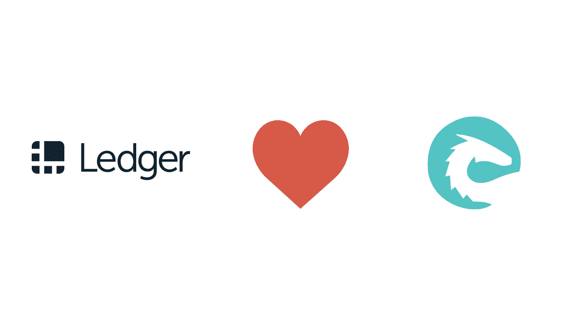

本文向您介绍如何将您自己的 Ledger Nano 硬件钱包连接到 ZilPay。希望这篇文章对你有指导作用！

# 步骤 1:安装 Ledger Nano S 应用

*   使用下面的链接在您的计算机上下载**莱杰 Live**:[https://shop.ledger.com/pages/ledger-live](https://shop.ledger.com/pages/ledger-live)；
*   导航到`Manager`选项卡，在应用程序中搜索 **Zilliqa** 。

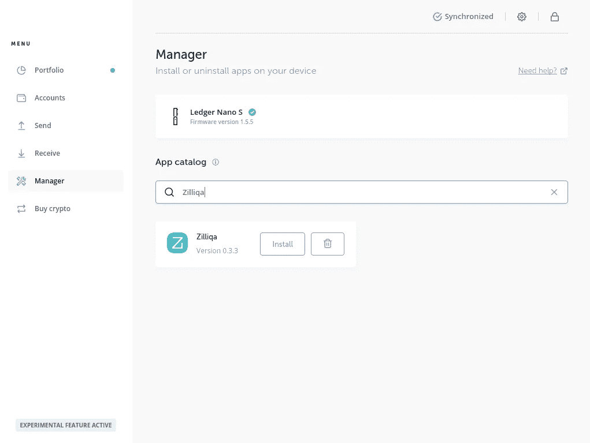

*   安装 Zilliqa 应用程序。

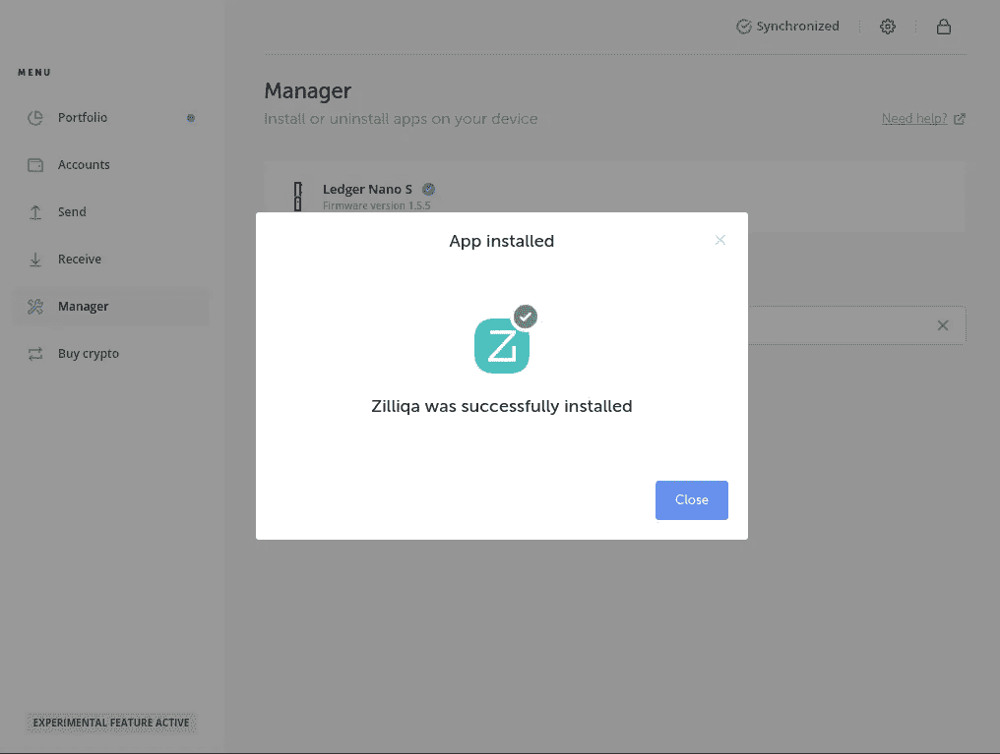

安装应用程序后，您将在设备上看到。

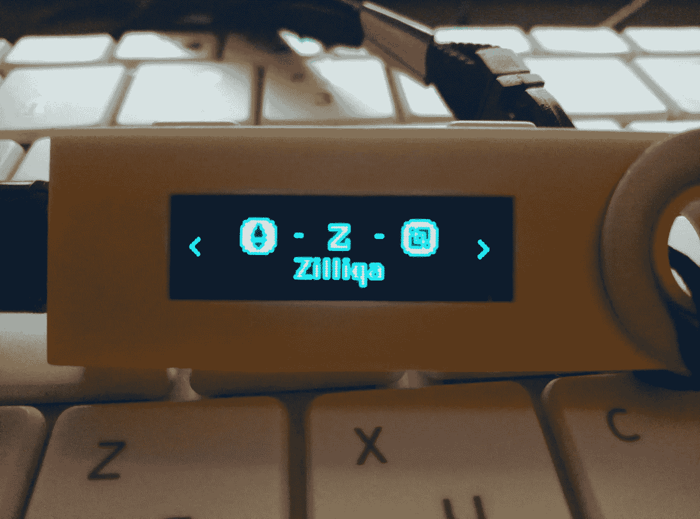

# 步骤 2:通过 Ledger Nano S 访问您的钱包

成功安装 Ledger Nano S app 后，需要在浏览器中安装 ZilPay 钱包。支持 ZilPay:FireFox、Chrome 和 Opera:

*   [火狐](https://addons.mozilla.org/en-GB/firefox/addon/zilpay/)
*   [铬合金](https://chrome.google.com/webstore/detail/zilpay/klnaejjgbibmhlephnhpmaofohgkpgkd?utm_source=chrome-ntp-icon)
*   [戏曲](https://chrome.google.com/webstore/detail/zilpay/klnaejjgbibmhlephnhpmaofohgkpgkd?utm_source=chrome-ntp-icon)

转到客户经理。

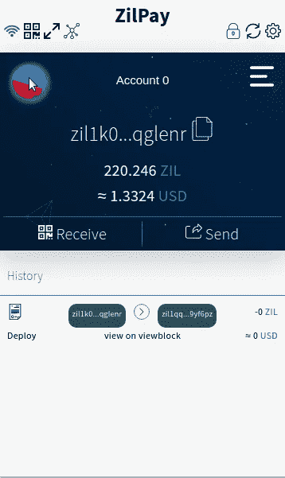

要将 ZilPay 与您的分类帐连接，让我们通过“硬件”来“导入”帐户，并选择“分类帐”作为首选选项。

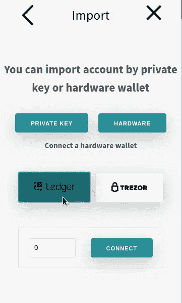

Import page.

键入一个帐户索引(从零开始)，然后单击“连接”按钮。然后会提示您确认在您的 Ledger Nano S 设备上生成公钥。

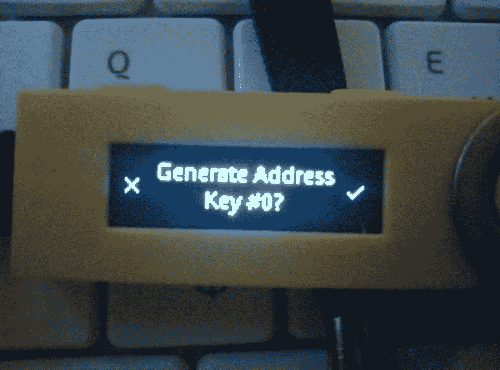

按右键确认，你会在 ZilPay 上看到你导入的钱包地址！

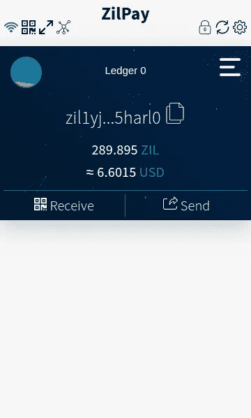

# 步骤 3:通过 Ledger Nano S 在 ZilPay 上发送交易。

让我们到 dApp，你可以移动到 zilpay.xyz:

*   [fungibletoken](https://zilpay.xyz/fungibletoken/) 制造者。
*   [nonfungibletoken](https://zilpay.xyz/nonfungibletoken/) 制造者。
*   用于部署智能合同的 scilla-editor 。
*   [掷骰子](https://zilpay.xyz/roll/)这个游戏是为了掷骰子。

我只是随大流。

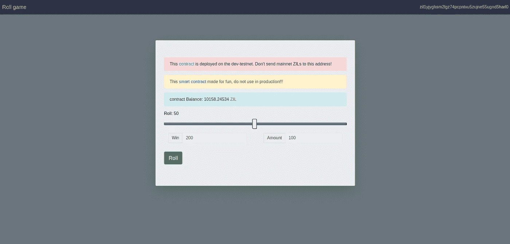

确认交易。

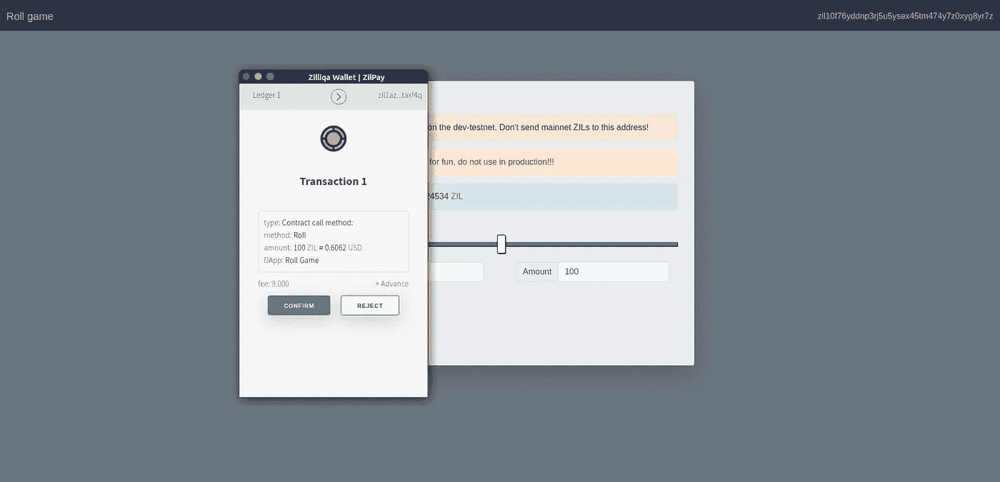

确认交易后，您将看到:

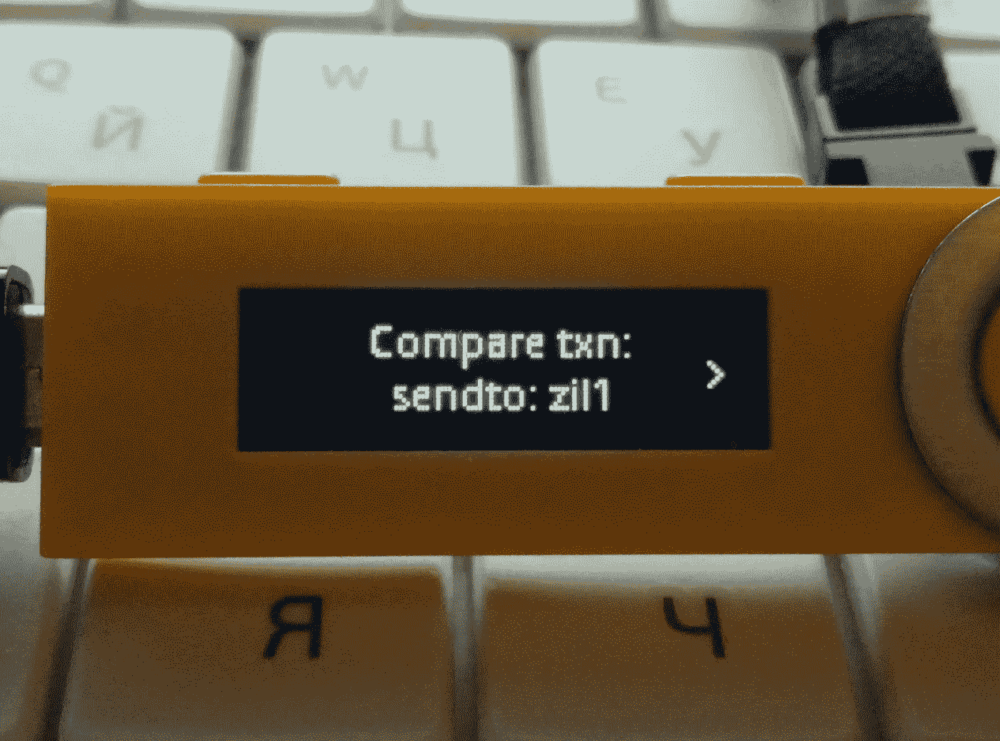

现在，您需要在您的 Ledger nano-s 设备上再次确认。

现在你对 Zilliqa 黑链的交易已经授权并播出，只需等待交易被纳入下一个区块，它就会被确认；

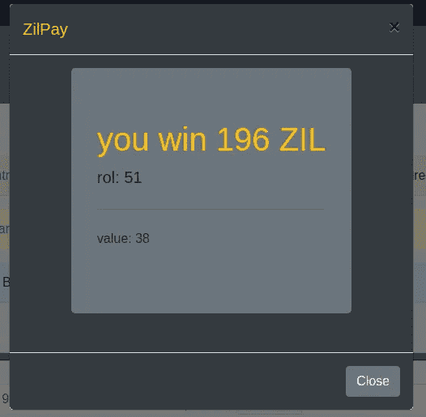

您可以导航至浏览器 [**viewblock.io**](http://viewblock.io/zilliqa) 查看您的交易状态！

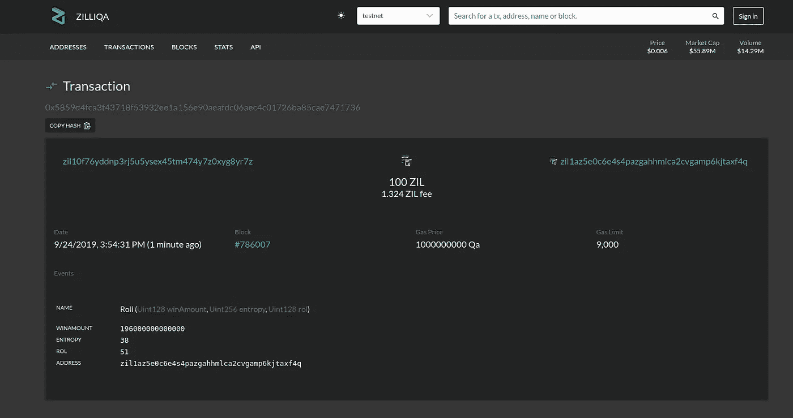

太好了！现在你可以发送和存储你的 ZIL 硬币。这是一个简单的过程来保护您的 ZIL 硬币的帮助下，莱杰纳米 S 设备。

通过这种集成，您将能够通过 Ledger Nano S 设备签署和发送任何支付交易。

*非常感谢所有参与者和社区的支持。*