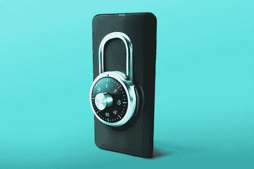

# PoS 区块链的用户如何利用他们的赌注资产实现更高的回报率

> 原文：<https://medium.com/coinmonks/how-users-in-pos-blockchains-can-leverage-their-staked-assets-to-achieve-a-higher-rate-of-returns-4a338d65102?source=collection_archive---------3----------------------->

随着每一种新计算模式的出现，如何最有效地利用它以及它对创新的未来意味着什么都存在很大的不确定性。区块链也不例外。重要的是要认识到，在技术引入的早期阶段，无法完全了解引入新计划和新价值链时所创造的可能性。

区块链生态系统中的一个例子是 [DeFi 协议](/coinmonks/defi-what-it-is-and-isnt-part-1-f7d7e7afee16)。分散融资(DeFi)提供了一个引人注目的价值主张，个人或机构可以轻松快速地获得借贷资本，而不需要可信的中介。与传统金融产品相比，它提供了几个有希望的优势，如透明度、易于访问和审查以及不变性。

建立 DeFi 协议的大部分考虑是利用借贷或加入分散交易所(DEX)的 [AMM 池(T3)并为上市交易对提供](https://cryptopurview.com/decentralized-exchanges-dex-in-2020-gaining-ground/)[流动性](/coinmonks/cex-vs-dex-how-does-uniswap-work-8ff2ef89e558)。用户添加他们的闲置资产(稳定硬币，联邦理工学院，WBTC 等)。)到这些 DeFi 协议中，并由此开始[赚取收益(利息)](/coinmonks/how-to-earn-passive-income-by-lending-bitcoin-ethereum-and-stablecoins-bc69072417a8)。由于大多数 DeFi 开发都是在以太网上进行的，因此，它需要基于 ERC-20 的令牌(资产)来平衡这些金融原语。

到 2020 年，这些闲置的 ERC-20 令牌在 DeFi 协议中的应用将会显著增长。到目前为止，这些 DeFi 智能合同中的协议使用已经锁定了价值 90 亿美元的价值。然而，考虑到仅与 ERC-20 令牌交互的限制，大量的非 ERC20 令牌资本未被利用，尤其是在协议中被下注的赌注证明(PoS)令牌。

# **在利益证明协议中需要利益:**

如果你了解比特币，你可能也熟悉工作证明(PoW) [共识](https://cryptopurview.com/consensus-mechanism-explained-in-layman-language/)和矿工角色的概念。采矿包括解决[复杂的数学难题](https://cryptopurview.com/what-puzzle-bitcoin-miners-actually-solve/)，第一个解决的人赢得在区块链增加一个新区块的权利。这些块包含事务处理，此流程可确保将正确的事务处理记录添加到区块链中，从而保护分布式分类帐。这种机制被称为动力。由于它消耗大量的计算资源，所以这是一个成本很高的过程。

PoS 是 PoW 系统的替代产品。不是消耗资源(电力)，股权证明要求验证者(替代矿工)在钱包中投入固定金额(锁定资本)。验证者不是竞相解谜，而是根据他们下注的金额随机选择，一旦被选中，就提议将一块积木加入区块链。

随着 PoS 协议中验证者生态系统的扩展，竞争也在加剧。因此，为了增加被选中的机会，验证者将他们的股份集中在一起。赌注池允许多个利益相关者(或赌注持有人)联合他们的股份，以增加他们获得整体奖励的机会。

今天，许多区块链协议正在使用 PoS 作为达成共识的基础机制进行开发，如 Cosmos、Harmony、埃尔隆德、Solana 等。截至 2020 年 7 月，PoS 协议总市值的近 50%被锁定用于下注，即超过 140 亿美元，预计到 2023 年将增长 5 倍。

# **挖掘未开发的资本:**

[RAMP DEFI](https://rampdefi.com/) 旨在为那些已经在非 ERC20 平台上下注的用户提供更多的收益农业机会，从而使他们能够最大限度地利用他们的杠杆头寸。它在以下三个阶段创造流动性。

## **第一阶段:将流动资本(非 ERC20 资产)带入以太坊网络，无需托管:**

RAMP DEFI 为每个协议创建了赌注钱包。使用这些钱包，用户可以存入他们的代币，并通过这些钱包中的基础智能合约收到一个 I-OWE-YOU 代币(包装代币),代表 1:1 的赌注金额。智能合同还确保持有 IOU 令牌的地址定期获得赌注奖励。

用户可以通过从智能合约中索回，轻松地将 IOU 令牌兑换为真实令牌。智能合约强制执行这些条件，并消除第三方或团队的干预。

然后，这些借据在本地股权证明网络上被抵押成一枚稳定的硬币。需要贷款的用户可以将他们的借据资产作为抵押，并获得资产价值的 50%。只要抵押品比率(抵押品价值/贷款价值)保持在清偿比率以上，借款人就有时间向流动性池偿还贷款和利息，并提取他们的抵押品。如果抵押品比率低于某个阈值，抵押品将被清算并偿还给贷款人。这种设置确保了贷款人在借款人违约时不会赔钱。

## **第二阶段:将非 ERC20 资产转移到以太坊钱包:**

为了将担保的稳定硬币(USDX)转移到以太坊地址，用户使用网关(或交叉链桥)来创建等效的 ERC-20 稳定硬币 rUSD，然后将其存入用户的 ETH 地址。网关可以被视为一个分散的保管人，它以 1:1 的比例流畅地铸造和刻录非 ERC20 数字资产和 ERC20 资产。

这样，用户在以太网中有效地创造了流动资本。这种流动资本由真实的、有抵押的资产支持，并由分散的管理人管理，以维持俄罗斯卢布对美元的平衡。保管人是相互竞争的个人和组织，他们接受吸收高风险债务的激励。每一次成功的清算，保管人都会得到奖励。

## **第三阶段:用俄罗斯货币兑换 USDT 或 USDC**

一旦用户拥有 rUSD，他们就可以使用 RAMP DEFI 协议轻松快速地访问平台上可用的各种稳定硬币。这通过两步走的方法来管理——参与公开市场借入 eUSD，然后用 eUSD 赎回流动资本。

1.  任何流动性提供者都可以参与注入他们的稳定币(、、戴等)。)在协议的智能合约中。一旦添加，流动性提供者将收到 IOU 令牌 eUSD。eUSD 持有人可以通过从智能合约中索回来轻松兑换流动令牌。
2.  现在，eUSD 和 rUSD 持有人参与平台的公开市场，彼此自由借贷。rUSD 持有者可以借入 eUSD 并提取流动资本。

# **结束语:**

鉴于即将推出的采用 PoS 机制的区块链协议的增加，预计随着这些协议的生态系统和价值的增长，赌注的市值也会增长。今天，这些协议(或桩节点)的总价值是 140 亿美元，如果相信专家的意见，预计到 2023 年将增长到 750 亿美元。

通过 [RAMP DEFI](https://rampdefi.com/) ，验证者可以将本地稳定硬币引入区块链生态系统。另外，在以太坊创造流动资本，使用 DeFi 协议。

**同样，阅读**

*   [顶级 DeFi 项目](/coinmonks/defi-future-10-promising-projects-in-the-defi-world-ff2b697ab006)
*   [unis WAP 最佳钱包](/coinmonks/best-wallets-to-use-uniswap-e91a6385d9e8)