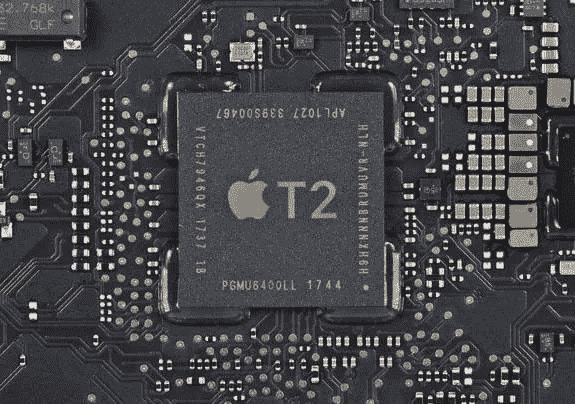

# VivoPay 如何利用 Secure Enclave 和 CryptoKit

> 原文：<https://medium.com/coinmonks/how-vivopay-leveraged-the-secure-enclave-and-cryptokit-8f0adf865f99?source=collection_archive---------2----------------------->



Apple’s T2 Secure Enclave chip in an Intel Mac (the Secure Enclave in iOS devices and Apple Silicon Macs is integrated in Apple’s Axx SoC)

VivoPay 是一个极其安全的加密钱包，利用了现代移动设备和 MAC 电脑中的安全飞地以及苹果新的 CryptoKit 框架。

# 安全飞地

Secure Enclave 是 Android、iPhone、iPad 和 MAC 中的一个芯片，可以保护你的生物统计数据，如 FaceID 和 TouchID。开发人员也可以访问 Secure Enclave，它可以处理少量有用的加密功能:

*   生成私钥(并派生公钥)并存储在安全飞地中生成的私钥(不能存储在安全飞地之外生成的私钥)
*   通过向安全区域发送明文来加密数据(明文)。安全飞地将发回加密数据(密文)
*   通过向安全区域发送密文来解密数据。安全区域将发送回原始的纯文本。
*   通过将数据(散列)发送到安全区域来创建签名。安全区域会发回一个签名
*   通过将数据(散列)和签名发送到 Secure Enclave 来验证签名。安全区域将返回 true 或 false。

那么，让 Secure Enclave 创建一个 Harmony One 私钥就这么简单吗？不完全是。原来安全的 Enclave 芯片(安卓和苹果都有)使用与区块链不同的曲线。这使得在安全的飞地为区块链创造关键配对变得不可能。

此外，因为私钥不能从安全区域导出，所以没有办法备份私钥。如果设备丢失或损坏，私钥将永远丢失。因此，即使这是可能的(这是不可能的),它可能仍然不是一个好主意。

附带说明:如果你真的想的话，可以使用安全飞地从头开始建造一个区块链。早在 2018 年，我就创造了一个用于教育目的的区块链,它就是这么做的。

在 VivoPay 中，我们使用 Secure Enclave 来加密和解密钱包文件，因此钱包文件只能在创建它的设备上使用。这提高了安全性。我们使用苹果的低级安全框架来保证 Enclave 计算的安全。

我们还使用名为 CryptoKit 的高级框架来加密备份文件(如果用户使用默认备份而不是恢复短语)。

# 苹果密码套件

当苹果在 2019 年推出 CryptoKit 时，出现了一些混乱。有些人(还有出版物！)认为这意味着苹果接受了加密货币，CryptoKit 是一个加密货币框架。不幸的是，正如我在推特风暴中解释的那样，情况并非如此。相反，CryptoKit 为 Secure Enclave 的一些基本功能提供了一个高级接口，如创建私钥(与区块链不兼容)和旨在建立 SSL 通信的基本加密和签名。

在 VivoPay 中，我们在默认模式下使用 CryptoKit 对钱包备份文件进行加密(高级模式强制用户[写下恢复短语](/@ronaldmannak/how-we-made-vivopay-crypto-wallet-super-easy-to-use-c5f5faa53b70))。在 [VivoPay 加密源代码](https://github.com/VivoPay/VivoPayEncryption)中，相关文件是 Shared/Encryption/BackupEncryption . swift，加密和解密存储在一个简单的结构中，叫做 backup Encryption，在文件底部的扩展中有一个方便的 CryptoKit 类 SymmetricKey 的 init。

备份加密文件包含三种方法:

*   根据用户选择的密码创建对称密钥
*   使用对称密钥加密钱包
*   使用对称密钥解密钱包

我们使用 256 位密钥进行对称加密，并通过调用 SymmetricKey 便利初始化器来创建一个密钥。因为密码可能短于 256 位(=32 个字节)，所以我们采用密码的 SHA256 哈希，并使用哈希的前 32 个字节作为密钥。

```
**init**(password: String) { **let** hash = SHA256.hash(data: password.data(using: .utf8)!) // Convert the SHA256 to a string. This will be a 64 byte string **let** hashString = hash.map { String(format: "%02hhx", $0) }.joined() // Convert to 32 bytes / 256 bits **let** subString = String(hashString.prefix(32)) // Convert the substring to data **let** keyData = subString.data(using: .utf8)! **self**.init(data: keyData)}
```

一旦创建了密钥，它就可以用于对称加密和解密(在对称密码中)。CryptoKit 提供两种对称密码:高级加密标准(AES)密码和 ChaCha20-Poly1305 密码。ChaChaPoly 针对移动使用进行了优化，因此我们选择在 VivoPay 中使用 ChaChaPoly。

有了 SymmetricKey 便利的 init，加密变得很简单:

```
**func** encrypt(**_** clearText: String, with password: String) **throws** -> Data { **let** key = SymmetricKey(password: password) **let** data = clearText.data(using: .utf8)! **return** **try** ChaChaPoly.seal(data, using: key).combined}
```

解密也是。ChaChaPoly 将加密数据(密文)存储在一个“密封盒”容器中。容器包含密文本身和一个随机数。nonce 是一个自动随机生成的数字，以避免在双方交换数据的情况下出现重复(它与我们的用例无关)。nonce 还使得并行加密和解密数据部分成为可能，这是个好消息，但超出了本文的范围。

```
**func** decrypt(**_** cipherText: Data, with password: String) **throws** -> String? { **let** key = SymmetricKey(password: password) **let** sealedBox = **try** ChaChaPoly.SealedBox(combined: cipherText) **let** decryptedData = **try** ChaChaPoly.open(sealedBox, using: key) **return** String(data: decryptedData, encoding: .utf8)}
```

仅此而已。这就是创建密码加密备份所需的全部代码。

由于对称密钥可以在任何地方使用密码创建，并且不存储在安全区域中，因此任何人都可以在任何设备上使用密码对加密数据进行加密。这正是我们需要的备份，但这不是我们想要的钱包文件本身。

# 苹果的安全框架

与其他钱包相比，在不同设备之间复制钱包文件是不可行的。加密的钱包文件总是与创建该文件的设备相关联。如果您想要在多个设备上使用同一个钱包，您必须使用 iCloud 上的恢复短语或备份文件来恢复钱包。这样 VivoPay 比其他软件钱包更安全。

为了实现这一点，钱包文件必须通过在安全区域中创建和存储的对称密钥或者属于在安全区域中创建和存储的私钥的公钥来加密。不幸的是，CryptoKit 并没有为此提供 API，我们将不得不退回到低级别的安全框架。

步骤类似于 CryptoKit，但是代码更加精细。你会在 [VivoPay 加密源代码](https://github.com/VivoPay/VivoPayEncryption)中找到相关代码:相关文件为 Shared/Encryption/wallet Encryption . swift。

您可能会注意到文件中有一个`import CryptoKit` 语句。这是因为我们使用了 CryptoKit 中的一个快捷方式:`SecureEnclave.isAvailable`

该代码包含一个备用钥匙串，以防设备没有安全区域(如没有 T1 或 T2 芯片的 iPod Touch 或 Macs)

然后，代码设置所有需要的属性(下面的代码中没有显示，但是在[演示项目](https://github.com/VivoPay/VivoPayEncryption)中有)来创建一个私钥。

私钥是用函数`SecKeyCreateRandomKey`生成的，公钥是通过调用`SecKeyCopyPublicKey`从私钥中导出的。注意，公钥对象包含公钥，但是`SecKeyCreateRandomKey`返回的私钥对象不包含私钥。相反，该对象包含对保留在安全区域中的私钥的引用。

```
**fileprivate** **func** createKeys() **throws**  -> (public: SecKey, private: SecKey?) { **var** error: Unmanaged<CFError>? **let** privateKeyAccessControl: SecAccessControlCreateFlags = SecureEnclave.isAvailable ?  [.userPresence, .privateKeyUsage] : [.userPresence] **guard** **let** privateKeyAccess = SecAccessControlCreateWithFlags(kCFAllocatorDefault, kSecAttrAccessibleAfterFirstUnlockThisDeviceOnly, privateKeyAccessControl, &error) **else** {
 **throw** error!.takeRetainedValue() **as** Error
    } **var** privateKeyAttributes: [String: **Any**] = [
        ...
    ] **var** commonKeyAttributes: [String: **Any**] = [
        ...
    ] // Create new private key using attributes defined above **guard** **let** privateKey = SecKeyCreateRandomKey(commonKeyAttributes **as** CFDictionary, &error) **else** {
        **throw** error!.takeRetainedValue() **as** Error
    } // Derive public key **guard** **let** publicKey = SecKeyCopyPublicKey(privateKey) **else** {
        **throw** VivoError.encryption("Error creating public key")
    } **return** (public: publicKey, private: privateKey)}
```

可以用方法`loadKey`检索和恢复对私钥和公钥的引用。LoadKey 创建一个查询，并使用函数`SecItemCopyMatching`将查询发送到安全区域。

```
**fileprivate** **func** loadKey() **throws** -> SecKey? { // Create query
    **var** query: [String: **Any**] = [
        kSecClass **as** String: kSecClassKey,
        kSecAttrApplicationTag **as** String: "vivopaydemo",
        kSecAttrKeyType **as** String: kSecAttrKeyTypeECSECPrimeRandom,
        kSecReturnRef **as** String: **true
    ]** // Use secure enclave if possible
    **if** SecureEnclave.isAvailable {
        query[kSecAttrTokenID **as** String] = kSecAttrTokenIDSecureEnclave
    } // Obtain reference to private key
    **var** key: CFTypeRef?
    **if** SecItemCopyMatching(query **as** CFDictionary, &key) == errSecSuccess {
        **return** (key **as**! SecKey)
    } // No existing key was found
    **return** **nil**}
```

加密如下:

```
**func** encrypt(**_** data: Data) **throws** -> Data { // Verify public key can be used to encrypt
    **guard** SecKeyIsAlgorithmSupported(publicKey, .encrypt, WalletEncryption.encryptionAlgorithm) **else** {
        **throw** VivoError.encryption("Error verifying public key")
    } // Encrypt
    **var** error: Unmanaged<CFError>?
    **guard** **let** cipherText = SecKeyCreateEncryptedData(publicKey, WalletEncryption.encryptionAlgorithm, data **as** CFData, &error) **as** Data? **else** {
        **throw** error!.takeRetainedValue() **as** Error
    } **return** cipherText
}
```

解密也非常简单:

```
**func** decrypt(**_** cipherText: Data) **throws** -> Data { // Verify private key can be used to decrypt
    **guard** **let** privateKey = privateKey, SecKeyIsAlgorithmSupported(privateKey, .decrypt, WalletEncryption.encryptionAlgorithm) **else** {
        **throw** VivoError.encryption("Error fetching private key")
    } // Decrypt data
    **var** error: Unmanaged<CFError>?
    **guard** **let** clearText = SecKeyCreateDecryptedData(privateKey, WalletEncryption.encryptionAlgorithm, cipherText **as** CFData, &error) **as** Data? **else** {
        **throw** error!.takeRetainedValue() **as** Error
    } // Return clear text
    **return** data
}
```

该代码包含一个未使用的`deleteKey`方法，该方法对于试验和调试演示代码很有用。

# 接下来去哪里？

*   阅读[我们如何创建一个超级易用的加密钱包](https://medium.com/p/c5f5faa53b70/edit)
*   阅读[我们如何创造了一个非常安全的加密钱包](/@ronaldmannak/how-we-created-an-insanely-secure-crypto-wallet-617917063a06)
*   阅读 [VivoPay 密钥管理简介](/@ronaldmannak/vivopay-introduction-to-key-management-80e971459d68)
*   了解 VivoPay 的[零知识支付系统](/@ronaldmannak/vivo-pay-a-zero-knowledge-payment-system-727997e4d25f)的未来
*   下载 [VivoPayEncryption 演示 app](https://github.com/VivoPay/VivoPayEncryption) (需要 iOS 14 和 Xcode 12)。
*   注册 [VivoPay 更新](https://vivopay.me)

## 另外，阅读

*   最好的[密码交易机器人](/coinmonks/crypto-trading-bot-c2ffce8acb2a)
*   [密码本交易平台](/coinmonks/top-10-crypto-copy-trading-platforms-for-beginners-d0c37c7d698c)
*   最好的[加密税务软件](/coinmonks/best-crypto-tax-tool-for-my-money-72d4b430816b)
*   [最佳加密交易平台](/coinmonks/the-best-crypto-trading-platforms-in-2020-the-definitive-guide-updated-c72f8b874555)
*   最佳加密贷款平台
*   [最佳区块链分析工具](https://bitquery.io/blog/best-blockchain-analysis-tools-and-software)
*   [加密套利](/coinmonks/crypto-arbitrage-guide-how-to-make-money-as-a-beginner-62bfe5c868f6)指南:新手如何赚钱
*   最佳[加密制图工具](/coinmonks/what-are-the-best-charting-platforms-for-cryptocurrency-trading-85aade584d80)
*   [莱杰 vs 特雷佐](/coinmonks/ledger-vs-trezor-best-hardware-wallet-to-secure-cryptocurrency-22c7a3fd391e)
*   了解比特币最好的[书籍有哪些？](/coinmonks/what-are-the-best-books-to-learn-bitcoin-409aeb9aff4b)
*   [3 商业评论](/coinmonks/3commas-review-an-excellent-crypto-trading-bot-2020-1313a58bec92)
*   [AAX 交易所评论](/coinmonks/aax-exchange-review-2021-67c5ea09330c) |推荐代码、交易费用、利弊
*   [Deribit 审查](/coinmonks/deribit-review-options-fees-apis-and-testnet-2ca16c4bbdb2) |选项、费用、API 和 Testnet
*   [FTX 密码交易所评论](/coinmonks/ftx-crypto-exchange-review-53664ac1198f)
*   [n 零审核](/coinmonks/ngrave-zero-review-c465cf8307fc)
*   [Bybit 交换审查](/coinmonks/bybit-exchange-review-dbd570019b71)
*   [3Commas vs Cryptohopper](/coinmonks/cryptohopper-vs-3commas-vs-shrimpy-a2c16095b8fe)
*   最好的比特币[硬件钱包](/coinmonks/the-best-cryptocurrency-hardware-wallets-of-2020-e28b1c124069?source=friends_link&sk=324dd9ff8556ab578d71e7ad7658ad7c)
*   最佳 [monero 钱包](https://blog.coincodecap.com/best-monero-wallets)
*   [莱杰 nano s vs x](https://blog.coincodecap.com/ledger-nano-s-vs-x)
*   [bits gap vs 3 commas vs quad ency](https://blog.coincodecap.com/bitsgap-3commas-quadency)
*   [莱杰纳米 S vs 特雷佐 one vs 特雷佐 T vs 莱杰纳米 X](https://blog.coincodecap.com/ledger-nano-s-vs-trezor-one-ledger-nano-x-trezor-t)
*   [block fi vs Celsius](/coinmonks/blockfi-vs-celsius-vs-hodlnaut-8a1cc8c26630)vs Hodlnaut
*   Bitsgap 评论——一个轻松赚钱的加密交易机器人
*   为专业人士设计的加密交易机器人
*   [PrimeXBT 审查](/coinmonks/primexbt-review-88e0815be858) |杠杆交易、费用和交易
*   [埃利帕尔泰坦评论](/coinmonks/ellipal-titan-review-85e9071dd029)
*   [SecuX Stone 评论](https://blog.coincodecap.com/secux-stone-hardware-wallet-review)
*   [BlockFi 评论](/coinmonks/blockfi-review-53096053c097) |赚取高达 8.6%的加密利息