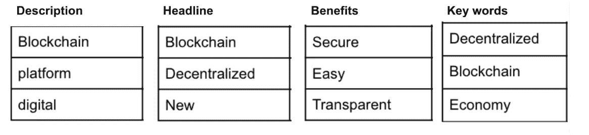
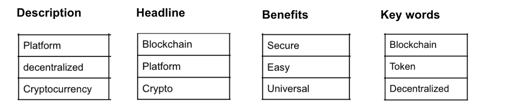
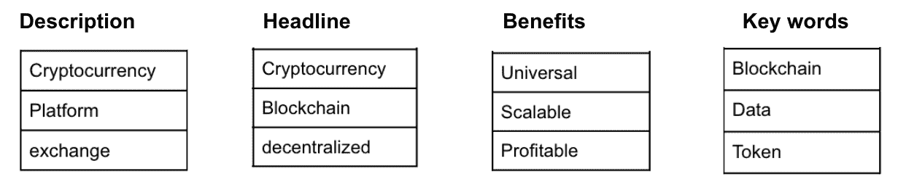

# 区块链工业如何厌倦了“区块链”

> 原文：<https://medium.com/coinmonks/how-we-became-bored-with-blockchain-413a18c6f414?source=collection_archive---------3----------------------->

## 我们从分析 130 家公司如何谈论和写他们的 ico 中学到了什么

市场如何演变很难实时感知。你可以看到一个区块链项目如何在竞争对手的背景下定位自己，但你如何提取整个行业定位的演变？为了回答这个问题，我们的研究团队缩小视野，看看区块链的营销和定位作为一个整体是如何在质疑、审视和成功中发展的。

为了获得加密领域内容和营销的宏观视图，我们分析了三个独立的为期一个月的快照(2017 年 6 月、2018 年 1 月、2018 年 6 月)中的 **130 个成功 ico**。这些快照捕捉了不断发展的市场中的不同点。总体而言，观众对 ico 和区块链的项目从热情转向了厌倦。

**我们是这样做的**

首先，我们查看了提供给 ICO 评级网站的项目描述。然后，我们选取了项目标题、三个关键优势和项目网站上最常用的关键词，以形成 ico 如何定位自己的总体图景。

产品描述一字不差地取自 ICO 列表网站。标题是网站的主要信息，更多的是营销而不是描述。这些好处被提炼为对目标消费者的三个最大优势，最后，通过抓取网站内容中最常用的术语来获取关键词，省略品牌名称和标准术语，如“The”。

**目标**

通过分析 ico 的大量横截面，我们旨在了解一些问题:市场的总体情绪，观众如何感知不同的信息，以及公司认为哪些对标记化项目的未来很重要。

**第一阶段:2017 年 6 月**

June 2017: most popular terms per category

2017 年 6 月，无论是产品还是营销都以**区块链**和**去中心化**为主。最常提到的好处是**安全性**、**透明度**和**易用性**。

尽管是一个特色——一个基金会——而不是大多数项目的焦点，**区块链**无疑是明星。这是最常用的定位工具，也是项目描述和营销标题中最流行的术语。

这表明了两件事:新区块链正在被开发**和**项目正在利用这个词的新奇和恶名在他们的 ICO 营销中产生额外的刺激。

不管怎样，被推销的项目几乎都是更好的建设方式，或者更好的交换和交易信息的方式。他们没有把自己定位为公众可以开箱即用的项目。它们面向加密货币爱好者和区块链开发人员，他们希望创建安全性更高、易用性更好的新项目。2017 年 6 月，区块链仍然是一个面向开发者的行业。

**第二阶段:2018 年 1 月**

到 2018 年 1 月，加密货币市值的高点，营销语言已经转变为适应公众对加密货币作为升值资产的兴趣的上升。

January 2018: most popular terms per category

**平台**已经成为最流行的项目描述术语，而**区块链**仍然在所有营销语言中占据重要地位。

在接下来的 6 个月里，对 ico 和加密令牌的投资浪潮意味着管理和交易令牌已经成为区块链技术的一个真正的有机用例。该平台天生的安全性和透明性非常适合管理有价值的资产。这是第一个以用户为中心的营销的广泛例子，一个单一的目标用例在 ICO 营销的噪音中出现。

在项目描述中使用**加密货币**，在营销标题中使用 **crypto** ，以及将 **token** 作为关键词都证明了这一最新趋势。加密和加密货币作为核心营销阵地的崛起也可以理解为 ICO 项目试图基于新闻的重量和加密世界的全球牛市带来的歇斯底里获得动力。

**第三阶段:2018 年 6 月**

到 2018 年 6 月，整体市场已经严重回调，空头已经坚定地接管了多头。

**区块链**已经从一个项目定位的基石变成了主导关键词。它已经从营销语言转向了更长的技术描述，表明区块链项目的技术细节被用来增加内容的深度，而不是用一个流行词来引起人们对一个项目的兴趣。

June 2018: most popular terms per category

到目前为止，在行业中，以及长期熊市带来的相对平静，ICO 营销的语言更加努力地针对业务用例及实现。列出的最常引用的优势是**普遍性**、**可扩展性**和**盈利性**。

可以发送/执行的交易/传输的数量与业务用例以及使用的可行性直接相关。关于利用区块链的一个关键论点是，一旦它开始被许多人/机构使用，它就会很快达到不可持续的临界点。将**可扩展性**作为核心优势的转变正在解决这一问题，并提出了一条营销信息，即区块链技术不再仅仅是一项创新，而是适合使用。

利用**盈利的**作为一个关键优势也表明了吸引产品用户和 ICO 投资者的趋势。可以通过使用该平台产生收入，而不仅仅是将代币作为升值资产持有，这代表着市场的成熟，也是对主要硬币价格调整的直接反应。

在 ICO 市场的这三个快照中观察到的语言的整体转变可以通过公众对区块链的局限性和好处的更深理解来解释。最初的兴趣集中在形成基础设施的项目上，*将*形成一个新的 Dapps 和产品的加密市场的基础，但还没有能够产生与区块链项目的据称潜力相匹配的主流接受度。

营销基调现在正转向以产品为导向的项目，这些项目具有更有针对性的受众和特定的使用案例，使用基于区块链的技术来形成功能描述，使最终用户利益成为可能。它代表着一个行业仍在寻找正确的声音，将新 ico 定位为可行、有利可图、比当前迭代更有效的产品，而不是仅仅依赖于区块链的创新和宣传以及令牌销售的回报报告。

*您认为区块链项目在未来一年的定位会如何发展？请在下面的评论中告诉我们！*

*   订阅我们的[时事通讯](https://elementgroup.com/blog/)，获取所有专有研究、报告和专栏文章
*   在 Twitter 上关注我们，获取区块链和密码的每日汇总

> [直接在您的收件箱中获得最佳软件交易](https://coincodecap.com/?utm_source=coinmonks)

