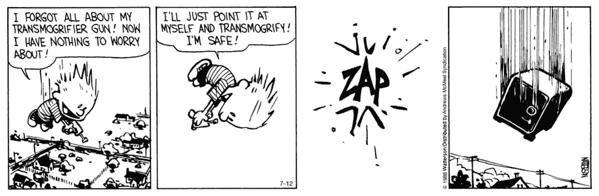
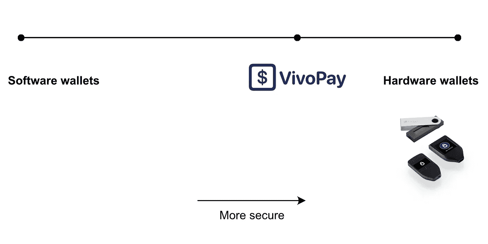
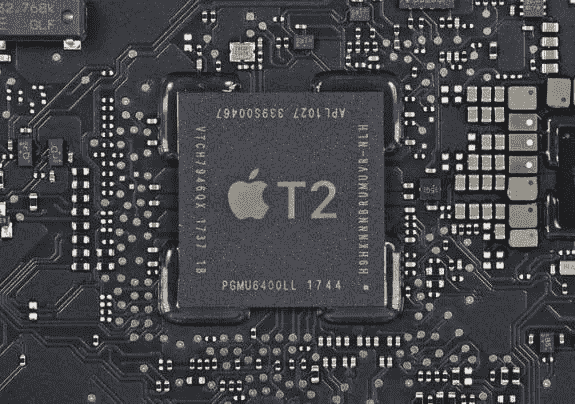

# 我们是如何创造出一个极其安全的加密钱包的

> 原文：<https://medium.com/coinmonks/how-we-created-an-insanely-secure-crypto-wallet-617917063a06?source=collection_archive---------2----------------------->

在设计软件时，要让一个产品既安全又易用，通常会令人惊讶地困难。然而，这正是我们创建 VivoPay 时的想法，vivo pay 是为[和谐一号](https://www.harmony.one)区块链设计的一款新的加密钱包。我们看似矛盾的目标是:

1.  让它成为最安全的软件钱包
2.  让它像 Square Cash 或 Venmo 一样易于使用，即使是首次使用加密的用户也不例外
3.  添加对跨链定义的支持(在稍后阶段)
4.  通过可在钱包内运行的新型智能合约，为区块链带来隐私和可伸缩性(在稍后阶段)

在这篇博文中，我们将讨论我们如何让 Vivo 变得异常安全。

# 硬件与软件钱包

有两种加密钱包:硬件钱包和软件钱包。主要区别在于私钥是在哪里生成和存储的。

像 [Ledger](https://www.ledger.com) 和 [Trezor](https://trezor.io) 这样的硬件钱包通过 USB 连接到 PC 或移动设备。**创建**和**在硬件钱包上存储**私钥，私钥从不通过 USB 传输，并且**从不离开硬件钱包**。相反，交易由硬件钱包签名。PC 或移动设备通过 USB 将交易(的散列)发送到硬件钱包，然后硬件钱包使用私钥对散列进行签名，并将结果发送回 PC 或移动设备。这是个人最安全的钱包选择。

软件钱包和 VivoPay 一样，是在你的电脑或移动设备上运行的应用程序，或者是在浏览器中运行的应用程序。私钥在 PC 或移动设备上生成，并存储在磁盘上的一个文件中。文件用用户必须记住的密码加密。这是可行的，但这不是安全储存大量硬币的最佳解决方案。例如，任何拿到钱包文件的人都可能试图暴力破解密码或 pincode。例如，使用 GPU 可以在五天内破解八个字符的密码，使用僵尸网络可以在几分钟内破解。

我们开始设计一个软件钱包，在安全性方面尽可能接近硬件钱包。以下是我们改进的内容:

1.  我们没有让人类创建易受攻击的密码，而是使用更安全的椭圆曲线加密技术(参见我们的[密钥初级读本，了解椭圆曲线如何比密码更安全](/@ronaldmannak/vivopay-introduction-to-key-management-80e971459d68))。通过删除用户，我们不仅提高了钱包的安全性，还改善了用户体验。
2.  只有创建钱包的设备才能解密钱包文件。将钱包文件复制到另一台机器应该不起作用。
3.  私钥应该只在需要时(签署交易时)才存在于内存中，并在使用后从内存中删除。在所有情况下(例如查看余额)，私钥都不应加载到内存中。

第三个目标只是一个应用程序架构的问题，将磁盘上的数据分成一个非加密的公钥列表和一个单独的加密钱包文件。

为了实现前两个目标，我们使用了移动设备(Android 和 Apple 都有)和 Mac 电脑的一个未被充分利用的功能:Secure Enclave。

# 安全飞地

Secure Enclave 是 Android、iPhone、iPad 和 MAC 中的一个芯片，可以保护你的生物统计数据，如 FaceID 和 TouchID。软件开发人员也可以使用 Secure Enclave 安全地签署和加密数据。安全飞地的关键特征:**在安全飞地上生成的私钥不能离开安全飞地**。如果这个概念听起来和硬件钱包差不多，那是因为确实如此。

The Apple T2 Secure Enclave chip in Intel Macs.

那么，我们可以使用安全飞地来创建一个和谐的私钥吗？不完全是。安全飞地不能为区块链生成私钥(它使用[一条不同的曲线](https://blog.enuma.io/update/2016/11/01/a-tale-of-two-curves-hardware-signing-for-ethereum.html))。此外，由于不可能在 Secure Enclave 中获得私钥，所以您不能备份该密钥。如果设备丢失或损坏，私钥将永远丢失。

(我们听说苹果正在与多家湾区加密公司进行谈判。谁知道呢，也许我们会在未来的某个地方看到一个对区块链友好的安全飞地。)

这就是 VivoPay 使用安全飞地的方式。当用户第一次启动 VivoPay 时，以下事情会按此顺序发生:

1.  VivoPay 将在内存中创建一个带有 Harmony One 私钥的钱包(这是在不使用 Secure Enclave 的情况下完成的)。
2.  然后，Secure Enclave 创建一个唯一的私钥来加密钱包。
3.  加密的钱包保存在磁盘上。
4.  钱包将从内存中删除。

当用户创建一个需要签名的新事务时，会按以下顺序发生以下事情:

1.  加密的钱包从磁盘加载，并由 Secure Enclave 解密。
2.  交易由钱包签名。
3.  钱包将从内存中删除。

如果加密的钱包文件被复制到不同的设备上，它将不能被加密或使用。需要使用恢复短语来恢复钱包。

# 使用 Secure Enclave 的其他钱包

据我们所知，还有另外两个使用 Secure Enclave 的加密钱包:[新钱包](https://www.mewwallet.com)和 [BRD](https://brd.com) 。(如果你知道其他使用 Secure Enclave 的钱包，请在下面留下评论)

三星设备上的新钱包还可以支持三星区块链密钥库，这是一个特殊的安全飞地，*能够生成对区块链友好的密钥对。在 iOS 上，MEW 在两步加密中使用 Secure Enclave:FaceID 解锁 Secure Enclave 中的一把钥匙，这把钥匙再解锁另一把钥匙，这把钥匙再解锁钱包。*

# 接下来去哪里？

*   阅读[我们如何创建一个超级易用的加密钱包](https://medium.com/p/c5f5faa53b70/edit)
*   阅读 [VivoPay 密钥管理简介](/@ronaldmannak/vivopay-introduction-to-key-management-80e971459d68)
*   [阅读 VivoPay 如何利用 Secure Enclave 和 CryptoKit 的技术细节](/@ronaldmannak/how-vivopay-leveraged-the-secure-enclave-and-cryptokit-8f0adf865f99)
*   阅读 vivo pay[零知识支付系统](/@ronaldmannak/vivo-pay-a-zero-knowledge-payment-system-727997e4d25f)的未来
*   下载 [VivoPayEncryption 演示 app](https://github.com/VivoPay/VivoPayEncryption) (需要 iOS 14 和 Xcode 12)。
*   注册 [VivoPay 更新](https://vivopay.me)

感谢校对和反馈:

*   亚历克斯·科马罗夫

## 另外，阅读

*   最好的[密码交易机器人](/coinmonks/crypto-trading-bot-c2ffce8acb2a)
*   [密码本交易平台](/coinmonks/top-10-crypto-copy-trading-platforms-for-beginners-d0c37c7d698c)
*   最好的[加密税务软件](/coinmonks/best-crypto-tax-tool-for-my-money-72d4b430816b)
*   [最佳加密交易平台](/coinmonks/the-best-crypto-trading-platforms-in-2020-the-definitive-guide-updated-c72f8b874555)
*   最佳[加密借贷平台](/coinmonks/top-5-crypto-lending-platforms-in-2020-that-you-need-to-know-a1b675cec3fa)
*   [最佳区块链分析工具](https://bitquery.io/blog/best-blockchain-analysis-tools-and-software)
*   [加密套利](/coinmonks/crypto-arbitrage-guide-how-to-make-money-as-a-beginner-62bfe5c868f6)指南:新手如何赚钱
*   最佳[加密制图工具](/coinmonks/what-are-the-best-charting-platforms-for-cryptocurrency-trading-85aade584d80)
*   [莱杰 vs 特雷佐](/coinmonks/ledger-vs-trezor-best-hardware-wallet-to-secure-cryptocurrency-22c7a3fd391e)
*   了解比特币的[最佳书籍有哪些？](/coinmonks/what-are-the-best-books-to-learn-bitcoin-409aeb9aff4b)
*   [3 商业评论](/coinmonks/3commas-review-an-excellent-crypto-trading-bot-2020-1313a58bec92)
*   [AAX 交易所评论](/coinmonks/aax-exchange-review-2021-67c5ea09330c) |推荐代码、交易费用、利弊
*   [Deribit 审查](/coinmonks/deribit-review-options-fees-apis-and-testnet-2ca16c4bbdb2) |选项、费用、API 和 Testnet
*   [FTX 密码交易所评论](/coinmonks/ftx-crypto-exchange-review-53664ac1198f)
*   [n 零审核](/coinmonks/ngrave-zero-review-c465cf8307fc)
*   [Bybit 交换审查](/coinmonks/bybit-exchange-review-dbd570019b71)
*   3Commas vs Cryptohopper
*   最好的比特币[硬件钱包](/coinmonks/the-best-cryptocurrency-hardware-wallets-of-2020-e28b1c124069?source=friends_link&sk=324dd9ff8556ab578d71e7ad7658ad7c)
*   最佳 [monero 钱包](https://blog.coincodecap.com/best-monero-wallets)
*   [莱杰纳米 s vs x](https://blog.coincodecap.com/ledger-nano-s-vs-x)
*   [bits gap vs 3 commas vs quad ency](https://blog.coincodecap.com/bitsgap-3commas-quadency)
*   [莱杰 Nano S vs 特雷佐 one vs 特雷佐 T vs 莱杰 Nano X](https://blog.coincodecap.com/ledger-nano-s-vs-trezor-one-ledger-nano-x-trezor-t)
*   [block fi vs Celsius](/coinmonks/blockfi-vs-celsius-vs-hodlnaut-8a1cc8c26630)vs Hodlnaut
*   Bitsgap 评论——一个轻松赚钱的加密交易机器人
*   为专业人士设计的加密交易机器人
*   [PrimeXBT 审查](/coinmonks/primexbt-review-88e0815be858) |杠杆交易、费用和交易
*   [埃利帕尔泰坦评论](/coinmonks/ellipal-titan-review-85e9071dd029)
*   [赛克斯石评论](https://blog.coincodecap.com/secux-stone-hardware-wallet-review)
*   [BlockFi 评论](/coinmonks/blockfi-review-53096053c097) |从您的密码中赚取高达 8.6%的利息