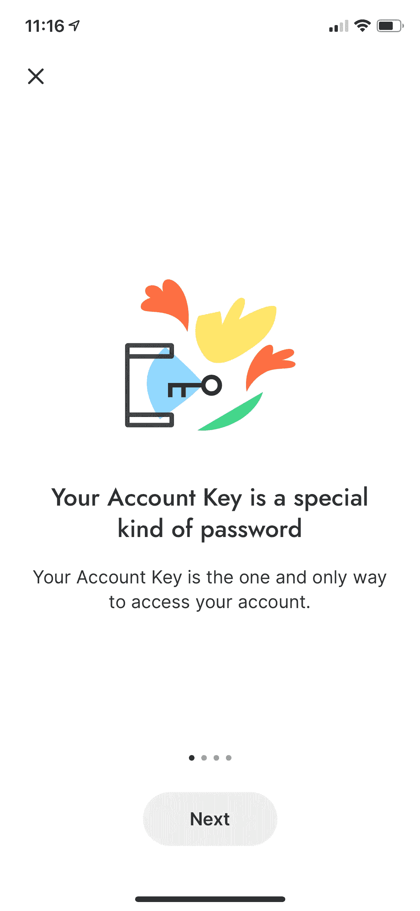

# 我们如何让 VivoPay 加密钱包变得超级易用

> 原文：<https://medium.com/coinmonks/how-we-made-vivopay-crypto-wallet-super-easy-to-use-c5f5faa53b70?source=collection_archive---------9----------------------->

在设计软件时，要让一个产品既安全又易用，通常会令人惊讶地困难。然而，这正是我们创建 VivoPay 时的想法，vivo pay 是为[和谐一号](https://www.harmony.one)区块链设计的一款新的加密钱包。我们看似矛盾的目标是:

1.  让它成为最安全的软件钱包
2.  让它像 Square Cash 或 Venmo 一样易于使用，即使是首次使用加密的用户也不例外
3.  添加对跨链定义的支持(在稍后阶段)
4.  通过可在钱包内运行的新型智能合约，为区块链带来隐私和可伸缩性(在稍后阶段)

在这篇博文中，我们将讨论如何让 VivoPay 变得超级易用。

# 关键问题

为了让 VivoPay 像 Square Cash 或 Venmo 一样易于使用，我们必须为首次使用加密的用户解决一个最大的障碍:密钥管理。在测试过程中，我们经常听到这样的问题:什么是密钥对？为什么我要写下这些乱七八糟的单词？恢复短语是什么？(如果您不熟悉这些术语，请参见 [VivoPay 密钥管理简介](/@ronaldmannak/vivopay-introduction-to-key-management-80e971459d68))。

我们不知道第一次使用密码的用户在完成设置他们的钱包之前会有多少比例，但我们怀疑这个比例非常高。CryptoKitties 的创造者 Bryce Bladon 估计，在成功购买 CryptoKitty 之前，大约 100 个潜在 CryptoKitties 用户中有 99 个会退出。诚然，钱包只是 CryptoKitties on-boarding 的许多步骤中的一步，从那以后钱包已经得到了改善，但要想让这种变化与非加密 on-boarding 相媲美，还有很长的路要走。

我们相信 VivoPay 在让首次加密用户更容易使用加密钱包方面迈出了一大步。我们是这样做的:

# 其他钱包如何解决备份问题

我们从观察其他钱包在登机时的处理方式开始。特别是钱包是如何备份钥匙的。他们使用了什么样的方法，是如何呈现给用户的？这是我们的发现:

*   [**信任钱包**](https://trustwallet.com) 是我们看到的最传统的钱包。它强迫用户写下一个 12 个字的找回短语“让你找回钱包”，但没有解释更多。这对于有经验的加密用户来说似乎很好，但是对于第一次使用加密的用户来说就不够了。

Trust Wallet

*   相比之下，Celo 的 [**Valora**](https://valoraapp.com) 可以让你在没有备份的情况下创建一个新钱包。Valora 会弹出窗口提醒用户备份私钥。如果用户点击弹出窗口，一系列信息页面会解释什么是恢复短语(“一种特殊的密码”)。这种方法更适合第一次使用加密的用户。然而，这个过程并不是完全没有摩擦的:用户需要理解信息页面，写下并安全地存储恢复短语是一个障碍。

Valora

*   [**比特币基地钱包**](https://wallet.coinbase.com) (那是交易所拥有的手机钱包 app，不是交易所本身)也允许用户创建一个没有备份的钱包，并提醒用户备份钱包，就像 Valora 一样。但与 Valora 相反，比特币基地钱包为用户提供了两种备份钱包的选择:要么写下恢复短语，要么将钱包备份在密码加密的文件中，存储在用户的个人云(如 iCloud 或 Google Drive)中。

Coinbase Wallet

*   ZenGo 是我们唯一没有使用恢复短语的钱包。事实上，ZenGo 是我们研究的唯一一个完全不在设备上存储私钥的钱包。事实上，私钥是永远不会生成的。这是怎么回事？在 ZenGo 中签署交易是多方计算(MPC)。两方计算的结果是交易的签名。双方分别是用户使用的 ZenGo 钱包和 ZenGo 服务器。如果你丢失了设备会怎么样？该解决方案是在用户的个人云(苹果 iCloud 或谷歌 Drive)上备份一个所谓的“解密密钥”，并使用生物识别技术进行加密。解密密钥本身是无用的，但是它可以用来(再次在 MPC 中)生成 MPC 的钱包部分。

ZenGo

# VivoPay 密钥管理

对于 VivoPay，我们选择使用以下入职和备份流程:

*   我们决定在设置时强制备份密钥(而不是允许用户在没有备份的情况下使用)。
*   上车时，用户有两种选择:*默认*或*高级*。默认设置适用于第一次使用加密的用户。备份将被密码加密并存储在 iCloud 中(类似于比特币基地钱包)。借助高级功能，用户可以使用传统的恢复阶段来备份钱包。
*   与比特币基地钱包不同，在用户选择将钱包保存在 iCloud 后，VivoPay 永远不会显示恢复短语。
*   相反，如果第一次使用 crypto 的用户准备“升级”到更安全的恢复短语备份，将创建一个新的 wallet，旧 wallet 中的所有资金将自动转移。这确保了新钱包尽可能的安全。

想看看我们的密钥管理解决方案并亲自体验 VivoPay 吗？[注册更新](https://vivopay.me)并在 VivoPay 可用时获得通知。

# 接下来去哪里？

*   阅读[我们如何创造了一个非常安全的加密钱包](/@ronaldmannak/how-we-created-an-insanely-secure-crypto-wallet-617917063a06)
*   阅读 [VivoPay 密钥管理简介](/@ronaldmannak/vivopay-introduction-to-key-management-80e971459d68)
*   阅读[vivo pay 如何利用 Secure Enclave 和 CryptoKit](/@ronaldmannak/how-vivopay-leveraged-the-secure-enclave-and-cryptokit-8f0adf865f99) 中的技术细节
*   了解 vivo pay[零知识支付系统](/@ronaldmannak/vivo-pay-a-zero-knowledge-payment-system-727997e4d25f)的未来
*   下载 [VivoPayEncryption 演示 app](https://github.com/VivoPay/VivoPayEncryption) (需要 iOS 14 和 Xcode 12)。
*   注册 [VivoPay 更新](https://vivopay.me)

感谢校对和反馈:

*   奥里埃尔·奥哈永

## 另外，阅读

*   最好的[密码交易机器人](/coinmonks/crypto-trading-bot-c2ffce8acb2a)
*   [密码本交易平台](/coinmonks/top-10-crypto-copy-trading-platforms-for-beginners-d0c37c7d698c)
*   最好的[加密税务软件](/coinmonks/best-crypto-tax-tool-for-my-money-72d4b430816b)
*   [最佳加密交易平台](/coinmonks/the-best-crypto-trading-platforms-in-2020-the-definitive-guide-updated-c72f8b874555)
*   最佳[加密贷款平台](/coinmonks/top-5-crypto-lending-platforms-in-2020-that-you-need-to-know-a1b675cec3fa)
*   [最佳区块链分析工具](https://bitquery.io/blog/best-blockchain-analysis-tools-and-software)
*   [加密套利](/coinmonks/crypto-arbitrage-guide-how-to-make-money-as-a-beginner-62bfe5c868f6)指南:新手如何赚钱
*   最佳[加密制图工具](/coinmonks/what-are-the-best-charting-platforms-for-cryptocurrency-trading-85aade584d80)
*   [莱杰 vs 特雷佐](/coinmonks/ledger-vs-trezor-best-hardware-wallet-to-secure-cryptocurrency-22c7a3fd391e)
*   了解比特币最好的[书籍有哪些？](/coinmonks/what-are-the-best-books-to-learn-bitcoin-409aeb9aff4b)
*   [3 商业评论](/coinmonks/3commas-review-an-excellent-crypto-trading-bot-2020-1313a58bec92)
*   [AAX 交易所审核](/coinmonks/aax-exchange-review-2021-67c5ea09330c) |推荐代码、交易费用、利弊
*   [德里比特评论](/coinmonks/deribit-review-options-fees-apis-and-testnet-2ca16c4bbdb2) |选项、费用、API 和 Testnet
*   [FTX 密码交易所评论](/coinmonks/ftx-crypto-exchange-review-53664ac1198f)
*   [n 零审核](/coinmonks/ngrave-zero-review-c465cf8307fc)
*   [Bybit 交换审查](/coinmonks/bybit-exchange-review-dbd570019b71)
*   [3Commas vs Cryptohopper](/coinmonks/cryptohopper-vs-3commas-vs-shrimpy-a2c16095b8fe)
*   最好的比特币[硬件钱包](/coinmonks/the-best-cryptocurrency-hardware-wallets-of-2020-e28b1c124069?source=friends_link&sk=324dd9ff8556ab578d71e7ad7658ad7c)
*   最佳 [monero 钱包](https://blog.coincodecap.com/best-monero-wallets)
*   [莱杰 nano s vs x](https://blog.coincodecap.com/ledger-nano-s-vs-x)
*   [Bitsgap vs 3 commas vs quad ency](https://blog.coincodecap.com/bitsgap-3commas-quadency)
*   [莱杰纳米 S vs 特雷佐 one vs 特雷佐 T vs 莱杰纳米 X](https://blog.coincodecap.com/ledger-nano-s-vs-trezor-one-ledger-nano-x-trezor-t)
*   [block fi vs Celsius](/coinmonks/blockfi-vs-celsius-vs-hodlnaut-8a1cc8c26630)vs Hodlnaut
*   Bitsgap 评论——一个轻松赚钱的加密交易机器人
*   为专业人士设计的加密交易机器人
*   [PrimeXBT 审查](/coinmonks/primexbt-review-88e0815be858) |杠杆交易、费用和交易
*   [埃利帕尔泰坦评论](/coinmonks/ellipal-titan-review-85e9071dd029)
*   [SecuX Stone 评论](https://blog.coincodecap.com/secux-stone-hardware-wallet-review)
*   [BlockFi 评论](/coinmonks/blockfi-review-53096053c097) |从您的密码中赚取高达 8.6%的利息