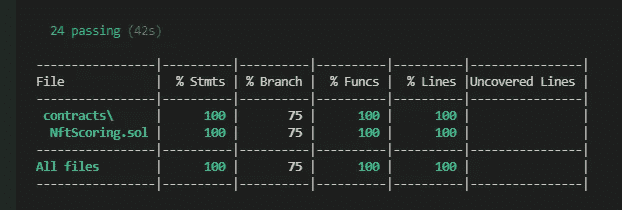
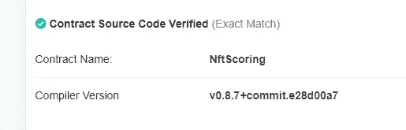
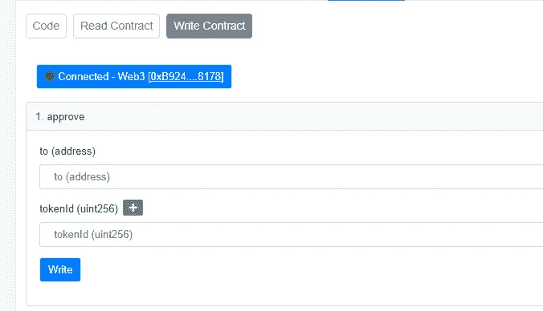

# 我们如何在一周内完成一份 NFT 合同

> 原文：<https://medium.com/coinmonks/how-we-wrote-an-nft-contract-in-one-week-fd822159d4cf?source=collection_archive---------8----------------------->

答几周前，我们推出了[nftscoring.com](http://nftscoring.com)，这是一款可以帮助你在 NFT 市场做出数据驱动型决策的工具。从一开始，我们就知道要确保增长，我们需要获得社区资金。幸运的是，NFT 是一个非常棒的众筹工具！在这里，我想与大家分享我们如何编写和部署我们的 NFT 合同，以及我们在这一过程中所学到的东西。

# 第一步

当创建 NFT 作为第一步时，你应该坐下来思考你的令牌应该如何操作。有一些属性是由 [ERC-721 标准](https://eips.ethereum.org/EIPS/eip-721)给出的，所有的 NFT 都必须遵循。此外，您可以通过添加一些自定义行为来扩展这个标准。记住这一点很重要，定制越多，产生错误代码的可能性就越大。你应该尽量简洁。

NFT Scoring Diamond Pass

我们想在我们的网站上创建一个 NFT 作为优质功能的通行证。此外，为了促进销售，我们决定分配一定数量的钻石通行证。作为这些钻石通行证的持有者，你将获得我们的一部分利润。不知道你是否会提前获得钻石或高级通行证；这是造币厂决定的。因此，除了 ERC-721 标准，我们还要求:

*   在链上存储关于钻石通行证的元数据——通常，所有元数据都在链外存储在 [IPFS](https://ipfs.io/) 上
*   在铸造过程中，随机决定铸造何种类型的通行证
*   实施正确的合同资金发放机制。

请特别注意最后一点。有一件事你几乎肯定要决定，那就是如何发放你合同中的钱。如果只有一个收件人，事情就简单多了。在我们的例子中，我们有多个接收者，所以逻辑更加复杂。但是由于它没有被 ERC-721 定义，在这两种情况下，你都需要自己实现它。

> 在开发自己的合同时，检查其他 NFT 的合同可能是一个极好的灵感来源。大多数知名项目都在 Ethersan 上提供他们的 NFT 源代码。[下面是我们合同](https://etherscan.io/address/0x67c7b3ebd8aa76ab2cae9681265b22d7aa88368e#code)的源代码举例。

# 编写代码

Solidity 是一种编程语言，用于在以太坊网络上创建契约。如果你的合同不需要任何非标准行为，你可以使用[这个工具](http://www.721.so)自动生成代码。您还可以使用[openzepelin](https://docs.openzeppelin.com/contracts/4.x/)库，这是契约开发的事实标准。它包括 ERC-721 的实现，以及大量其他有用的组件，随时可以使用。已经部署的另一个合同可能是一个很好的起点。您可以简单地从 Etherscan 复制源代码，因为它是开源的。。

> 如果你想开发一个逻辑更独特的合同，我强烈建议你阅读 Consensys 的[以太坊智能合同最佳实践](https://consensys.github.io/smart-contract-best-practices/)。这对我很有好处。

许多 ide 都支持可靠性编程。我们选择将 Visual Studio 代码与 Truffle 结合使用。很多 Solidity 开发的特性在 VS 代码中都有，包括[语法高亮](https://marketplace.visualstudio.com/items?itemName=JuanBlanco.solidity§)和[调试](https://marketplace.visualstudio.com/items?itemName=hosho.solidity-debugger)。使用 [Truffle](https://trufflesuite.com/) 和 [Ganache](https://trufflesuite.com/ganache) ，您可以运行本地测试网络以及部署到公共网络。

## 测试

由于对区块链的契约部署是不可逆的，并且代码是不可变的，因此避免部署错误的代码至关重要。我们创建了覆盖我们每一行代码的 truffle 单元测试。[这个 npm 包](https://medium.com/r?url=https%3A%2F%2Fwww.npmjs.com%2Fpackage%2Fsolidity-coverage)在可视化覆盖率方面非常有帮助。

## 随机性

如前所述，我们需要创建一个流程，在铸造过程中随机确定令牌是高级令牌还是钻石令牌。在区块链上实现随机性比在其他语言中要困难一些，因为代码必须以可预测的方式执行。

[Chainlink](https://chain.link/) 是向契约中添加随机元素的正确方法。主要思想是将操作分成两个事务，一个以对 chainlink 的请求结束，另一个以产生的随机数开始。因此，所有的区块链计算都是确定的。然而，我们发现这种技术非常不方便，经过深思熟虑，我们决定采取不同的路线。

如下面的代码所示，我们选择基于块元数据和哈希生成一个随机整数。请小心，因为这种策略可能会导致漏洞。想象一下，如果有人开发了一个使用和我们完全一样的随机函数的合同，会发生什么。他将能够访问相同的块元数据，评估随机函数，并且如果结果对他有利的话，调用我们契约上的 mint 方法(产生一个钻石通行证)。为了解决这个问题，我们决定停止铸造合同。

The random function uses block metadata and custom nonce, ensuring two subsequent calls will differ.

# 部署

一旦完成合同，就该部署了。虽然 truffle 可以用于部署，但我们发现 Remix 环境更加用户友好。在这里，您可以快速编译和部署您的合同。

> [指示](https://docs.soliditylang.org/en/v0.8.4/using-the-compiler.html#optimizer-options)你期望合同运行多少次的选项是 Solidity 中一项有趣的编译技术。编制者将根据这一估算，努力使合同期间的预计用气量最小化。

首先在一些测试网络上检查你的合同是一个好主意，在那里你可以获得一些免费的 ETH 并与之互动。如果一切顺利，就可以进行 mainnet 部署了。

除了激活完全不可撤销的东西的兴奋之外，mainnet 部署与部署到测试网络没有什么不同。你可能还想在天然气价格较低的时候签订合同，因为合同签订可能会非常紧迫——在[我们的例子](https://etherscan.io/tx/0x36f10190724a14e8fdceaf262ea5b112f8525437fd5fd8793ecf433ea7d64ec0)中，600 万天然气约 0.6 ETH。这个工具对于查找过去的平均油价非常有用。

## 确认

在部署期间，只有契约的构建版本(字节码)存储在区块链上。由于字节码不能被人类阅读，需要一种机制让每个人都能够验证你的合同内容。Etherscan 使验证您的源代码变得更加容易。它编译您的源代码，并检查生成的字节码是否与上传到区块链的匹配。如果成功，Etherscan 将发布提供的源代码以及验证代码合法性的消息。Remix web IDE 提供了一个方便的插件，可以自动完成这个过程。

## [计]元数据

虽然你的代码是完整的，你仍然必须将它链接到你昂贵的图片。您的每个令牌的元数据并不直接保存在区块链上。只有指向存储元数据(包括特征和图像)的网站的 URL 才会存储在区块链上。可以用许多不同的方式设置 URL:

1.令牌生成后，立即上传文件和信息，并为每个生成的 NFT 建立令牌的 URI。因为每个铸造的 NFT 需要一次交易，所以这种方法成本很高。

2.在您的 NFT 合同上设置 baseURI，并提前上传资产和元数据文件。使用这种方法，您必须确保接下来要创建的令牌 id 事先是未知的。在你的合同中，你几乎肯定需要使用一些随机性。

3.在合同中，创建一个临时 baseURI，然后在某一天将 baseURI 更改为指向公开的元数据。这可以说是最简单的技术；唯一的问题是，在随机生成元数据之前，您必须获得社区的信任。有这样的例子，项目创建者利用这一点，给自己分配不常见的令牌。

一个好的做法是将你的元数据上传到 [IPFS](https://ipfs.io/) ，我们已经通过 [Pinata](https://pinata.cloud/) 做到了这一点。

## 与合同交互

现在，是时候开始销售了！您可以使用 Remix IDE 与您部署的合同进行交流，或者在 Etherscan 上发现它并在那里使用它。这假设您已经完成了源代码验证过程。

Interacting with a contract on Etherscan

您需要为最终用户构建一个具有更加用户友好的布局的网页。在下一篇文章中，我将向你展示如何将你的网站链接到 web3。现在，快乐编码！

LFG！

[1]:在合同创建期间，仍然可以从合同中调用铸造函数，但是我们得出结论，这对我们没有风险。

[2]尽管如此，还是要格外警惕去改变你所需要的一切。

> 加入 Coinmonks [电报频道](https://t.me/coincodecap)和 [Youtube 频道](https://www.youtube.com/c/coinmonks/videos)了解加密交易和投资

## 另外，阅读

*   [币安期货交易](https://blog.coincodecap.com/binance-futures-trading)|[3 commas vs Mudrex vs eToro](https://blog.coincodecap.com/mudrex-3commas-etoro)
*   [在印度利用加密套利赚取被动收入](https://blog.coincodecap.com/crypto-arbitrage-in-india)
*   [德国最佳加密交易所](https://blog.coincodecap.com/crypto-exchanges-in-germany) | [WazirX P2P](https://blog.coincodecap.com/wazirx-p2p)
*   [如何购买 Monero](https://blog.coincodecap.com/buy-monero) | [IDEX 评论](https://blog.coincodecap.com/idex-review) | [BitKan 交易机器人](https://blog.coincodecap.com/bitkan-trading-bot)
*   如何在 Bitbns 上购买柴犬(SHIB)币？ | [币安](https://blog.coincodecap.com/binance-in-india)
*   [币安 vs 比特邮票](https://blog.coincodecap.com/binance-vs-bitstamp) | [比特熊猫 vs 比特币基地 vs Coinsbit](https://blog.coincodecap.com/bitpanda-coinbase-coinsbit)
*   [如何购买 Ripple (XRP)](https://blog.coincodecap.com/buy-ripple-india) | [非洲最好的加密交易所](https://blog.coincodecap.com/crypto-exchange-africa)
*   [非洲最佳加密交易所](https://blog.coincodecap.com/crypto-exchange-africa) | [胡交易所评论](https://blog.coincodecap.com/hoo-exchange-review)
*   [eToro vs robin hood](https://blog.coincodecap.com/etoro-robinhood)|[MoonXBT vs by bit vs Bityard](https://blog.coincodecap.com/bybit-bityard-moonxbt)
*   [Stormgain 回顾](https://blog.coincodecap.com/stormgain-review) | [Bexplus 回顾](https://blog.coincodecap.com/bexplus-review) | [币安 vs Bittrex](https://blog.coincodecap.com/binance-vs-bittrex)
*   [Bookmap 评论](https://blog.coincodecap.com/bookmap-review-2021-best-trading-software) | [美国 5 大最佳加密交易所](https://blog.coincodecap.com/crypto-exchange-usa)
*   [如何在 FTX 交易所交易期货](https://blog.coincodecap.com/ftx-futures-trading) | [OKEx vs 币安](https://blog.coincodecap.com/okex-vs-binance)
*   [如何在势不可挡的域名上购买域名？](https://blog.coincodecap.com/buy-domain-on-unstoppable-domains)
*   [印度的秘密税](https://blog.coincodecap.com/crypto-tax-india) | [altFINS 审查](https://blog.coincodecap.com/altfins-review) | [Prokey 审查](/coinmonks/prokey-review-26611173c13c)