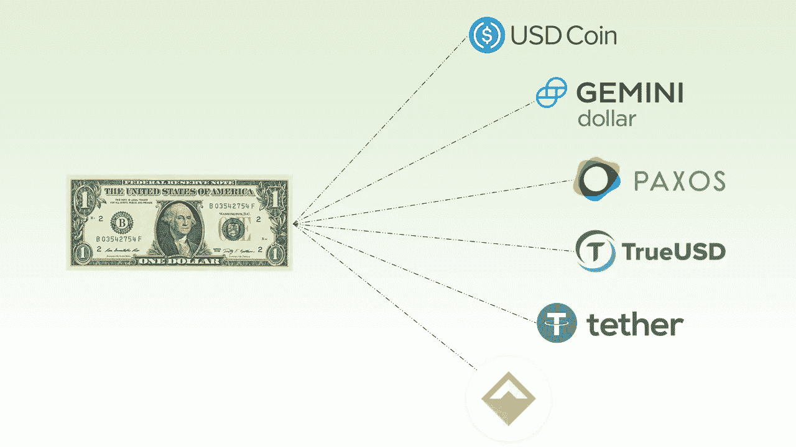
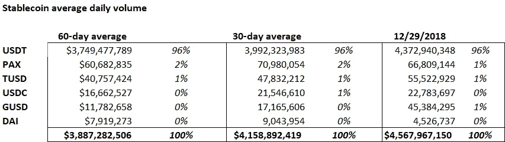
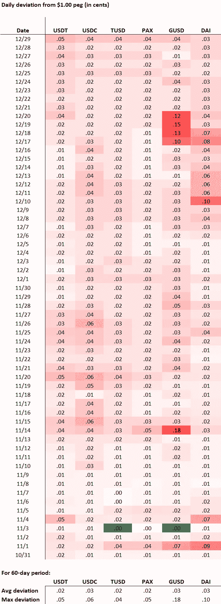
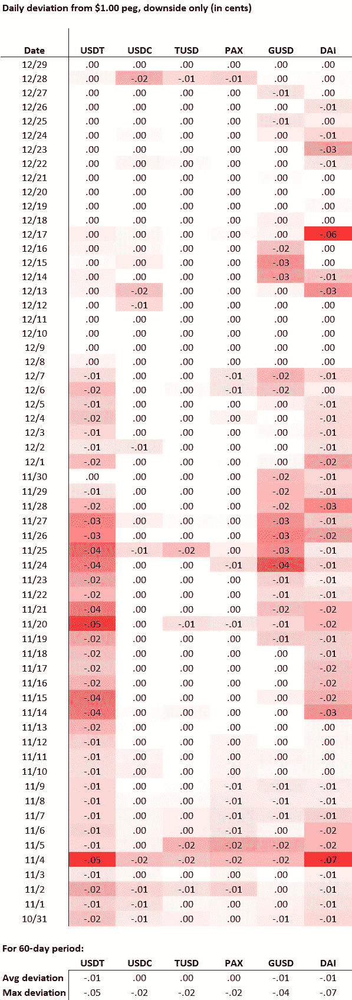
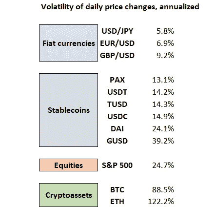
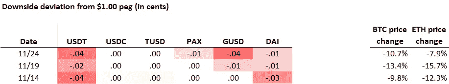
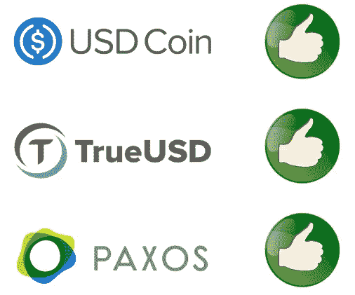

# 排名靠前的稳定度如何？定量分析

> 原文：<https://medium.com/coinmonks/how-well-do-the-top-stablecoins-perform-a-quantitative-analysis-c56d022719b?source=collection_archive---------0----------------------->

无论是臭名昭著的 Tether、菲亚特支持的新型 stablecoin，还是 Maker 等创新项目，区块链领域的几乎每个人都认识到安全可靠的 stablecoin 的价值和必要性。关于使用哪一种有很多争论，但让我们进行更深入的分析，看看哪种 stablecoin 实际上最擅长做它的工作，即保持稳定。

(我不会在 stablecoins 上重复另一篇介绍文章；如果你想快速了解它们的用法和历史，我推荐这篇来自[比特币杂志](https://bitcoinmagazine.com/articles/search-stability-overview-budding-stablecoin-ecosystem/)的优秀文章。

首先，本文分析的术语。为了进行比较，我选择了 6 种稳定币，其标准是它们与美元挂钩(1.00 美元)，目前有效，交易活跃:Tether()、USD Coin()、true USD()、Paxos Standard Token ( [PAX](https://coinmarketcap.com/currencies/paxos-standard-token/) )、Gemini Dollar()和 Dai ( [DAI](https://coinmarketcap.com/currencies/dai/) )。系绳不需要介绍；这是最古老的，也是最常用的稳定硬币，同时也是最有争议的。其他四家(USD Coin、TrueUSD、Paxos 和 Gemini Dollar)也是美元/菲亚特支持的 stablecoins，依靠“就像系绳一样，但不是骗局”的价值主张，增加了资产负债表和运营的透明度，并能够实际将代币兑换成美元。最后，我们有戴(戴)，卓越的加密资产抵押稳定币和做市商系统的一部分。

由于我们样本中的三个 stablecoins 仅在 2018 年 9 月和 10 月推出，我们的观察期将是 10 月 31 日至 12 月 29 日的 60 天。另外两种活跃的稳定币被排除在外，原因是缺乏流动性(bitUSD 的日交易量为 6K 美元，仅在与 BitShares 相关的交易所进行)，或者是因为在实践中它们没有发挥稳定币的作用(Steem 美元在观察期间的平均交易价格为 0.79 美元兑 1 美元，其波动性是这里分析的任何其他稳定币的 9 到 10 倍)。

这是我们样本中稳定的货币使用状态——过去 60 天、30 天以及观察期最后一天的平均日交易量。

显然，Tether 仍然是稳定的硬币交易量的最大份额，尽管对其资产负债表的质疑和 T2 司法部对其创始人是否利用 USDT 操纵 BTC 价格的调查。Tether 的优势也不仅仅是流动性/可用性的问题，因为所有 6 只 stablecoins 都在[至少一个交易量排名前十的交易所交易。](https://coinmarketcap.com/rankings/exchanges/)但是最广泛使用并不一定意味着最好，所以让我们看看竞争实际上是如何进行的。

# 哪种稳定币性能最好？

首先，这取决于你如何定义最佳。它是最接近 1 美元的稳定币吗？最常停留在 1 美元或以上的是稳定币吗？或者仅仅是表现出最小日常波动的稳定币，保持了它的名字？最后，在市场低迷时期，保值是最重要的，那么每种稳定币的表现如何？

# 指标 1:偏离 1.00 美元挂钩

第一种方法是查看过去 60 天中每种稳定币的最高价和最低价，并记录其与 1.00 美元挂钩的最大偏差。

> 偏差=最大值(高价-1.00 美元，低价-1.00 美元)

例如，在 12 月 28 日，TUSD 的交易价格最高为 1.02 美元，最低为 0.99 美元，因此当天的离差最大(1.02-1.00，1.00-0.99)或 0.02。下图用暗红色突出显示了更大的偏差。

每种稳定币的平均日偏差非常相似，从 1.00 美元挂钩的 0.02 美元到 0.03 美元。但我们真正开始看到的分离是最大偏差，其中 GUSD 在 60 天中的 5 天偏离 1.00 美元超过 0.10 美元，包括 11 月 14 日 0.18 美元的偏差。

**根据与 1.00 美元挂钩的偏差衡量的赢家:** USDT、派克斯、TUSD

**失败者:**、戴

虽然从学术意义上来说，偏离 1.00 美元可能是判断稳定币有效性的最佳方式，但现实是大多数持有稳定币的人对向上偏离没有问题！一个常见的用例是在下跌的市场中购买稳定的硬币，而目标只是保持价值——稳定硬币的任何上涨都只是一个不错的奖励。因此，考虑到这一点，对稳定货币有效性的一个更实际的判断可能是与 1.00 美元挂钩的*下行*偏差。

# 指标 2:与 1.00 美元挂钩的向下偏离

顾名思义，下行背离只是我们之前的度量，但只测量了低于 1.00 美元的背离*。*

> 下行偏差=如果价格低< $1.00, Low Price — $1.00

With that change, we see a quite different result:

Among the fiat stablecoins, it’s Tether that now shows the most risk to the downside, dropping as low as $0.945 on November 4th. What happened to our previous offender, GUSD? Turns out it never dropped below $0.95; all those $0.10+ deviations we saw were to the upside, and it traded as high as $1.18\. Among all stablecoins, in the past 60 days it was actually DAI that showed the most downside deviation, dropping to $0.931 on November 4th.

**以下行偏差衡量赢家:**派克斯、USDC、TUSD

【失败者:】戴、、

你可能已经注意到，6 个稳定的硬币中的任何一个的平均下跌偏差都不超过 0.01 美元。实际上，stablecoins 在 1.00 美元以上交易比在 1.00 美元以下交易更常见！就风险而言，这并不能告诉我们太多。通常只有当市场状况真正转坏时，稳定的货币才会难以维持其盯住汇率。稍后会详细介绍。

就打算用作货币的加密资产而言，最重要的衡量标准可能根本不是它与美元的交易有多接近，而是它的价格有多稳定。对于一个商人来说，无论汇率是多少，能够每天假定稳定的货币价值不变是至关重要的。这让我们想到:

# 指标 3:每日价格变化的波动性

我们将稳定硬币的波动率定义为观察期间每日价格变化的标准差，以年化为基础表示。

> *σ(*δ*P1…*δ*p60)x*ì365

为了便于理解，我还包括了同期主要货币对(欧元/美元、英镑/美元、美元/日元)、股票(标准普尔 500)和主要加密资产(BTC、瑞士法郎)的数据。

通过这种方法，所有稳定的硬币都比主要的加密资产稳定得多，波动性在 BTC 和 ETH 的 1/10 到 1/2 之间。虽然顶级稳定货币的波动性仍然高于法定货币对，但 9.2%到 13.1%并不是一个巨大的差距——随着进一步采用，我们可以很容易地看到稳定货币的波动性降低到主要法定货币对的波动性。

**以波动性衡量的赢家:**帕克斯、USDT、TUSD、USDC

失败者: GUSD

# 指标 4:低迷时期的市场相关性

让我们回到稳定的股票在市场崩溃时表现如何的问题上来。稳定的货币在平静或增长的市场中保持稳定是一回事，但大多数人在不确定或市场下跌时会转向稳定的货币。特别值得关注的是稳定的硬币价格与秘密市场的相关性，以及它们是否会与秘密市场同时贬值。下面是我们样本中加密市场 3 个最糟糕的日子的下跌背离图:

这是事情变得真正令人担忧的地方——11 月 24 日，BTC 下跌了近 11%,但 USDT 和 GUSD 也下跌了 4%,交易价格为 0.96 美元。如果市场下跌 30%,你持有的据称是无风险的稳定货币可能会贬值 12%。这种价格下降的相关性在风险资产中更为常见；你可能还记得 2008 年金融危机时，由于资产类别突然变得相关，债券、股票和房地产的多样化投资组合价值暴跌。但对于像稳定币这样的“避险”资产来说，这是灾难性的。

**在低迷时期根据市场相关性衡量的赢家:**派克斯、TUSD、USDC

【失败者:】、、戴

# 获胜者是…

严格根据我们的定量分析，**【USDC】****【TUSD】**和**派克斯**在经济低迷时期的背离、下跌背离、波动性和市场相关性分析中，都表现得相当不错。似乎这些新一代菲亚特支持的 stablecoins 在实际性能和对用户的透明度方面都比 Tether 有了实质性的改进。

尽管在这项分析中的表现不如指标，但戴也因迄今为止最成功的加密抵押稳定币而受到好评，尽管自 2017 年 12 月戴推出以来，ETH 的价格下跌了 90%,但他仍然保持了其在 ETH 抵押品中的价值。

# 质量因素

明确一点，这只是对量化表现的分析；为了准确判断最佳稳定硬币，还需要评估许多定性因素。对于法定支持的硬币，你需要判断发行者的交易对手/信用风险及其财务审计的可信度。同样值得一提的是，受监管的 stablecoins (PAX、USDC、TUSD 和 GUSD)似乎都有执法部门访问和冻结代币的后门，这是金融监管机构要求的，并且由项目团队完全披露。

就加密抵押硬币而言，智能合约总是存在一定程度的被黑客攻击或代码失灵的风险。还有一种可能性是，如果加密资产价格下跌太多太快，甚至一种过度抵押的稳定币也可能打破其挂钩。在戴的案例中,《京都议定书》在公开市场上印刷和出售的最后手段很有意思，因为它有效地稀释了“权益持有人”,但它只会在市场温和或逐步下跌时起作用。如果以太坊面临一场生存危机，导致戴及其 ETH 抵押品的价格灾难性下跌，没有人会急于购买代表 20 稳定币稳定性的 20 代币！这就像在 2008 年 3 月试图为贝尔斯登筹集一轮股权融资一样——你只会找到低价甩卖的买家。公平地说，对于 Maker 团队来说，他们即将推出由多种形式的抵押品支持的 DAI [，这应该有助于缓解这一问题，而且更普遍的是，随着加密波动性随着采用而降低，这一风险应该会消退。](/makerdao/the-code-is-ready-2aee2aa62e73)

另一个我没有充分提到的风险是稳定的货币持有集中在交易所的自然趋势，因为，很明显，那里是交易发生的地方。举个例子，73%的双子座美元目前似乎都存在火币控制的地址(这里显示的前三个地址是)。现在，您正在与发行实体(Gemini)和持有足够多稳定币以负面影响价格/稳定性的交易所(Huobi)的交易对手风险进行角力。Gemini 和 Huobi(据我所知)迄今为止都是加密领域的优秀演员，所以这并不意味着你应该自动警惕使用 Gemini Dollars，但它说明了集中任何硬币或令牌所有权的潜在风险。(关于这一点，有没有人有一份完整的外汇钱包清单，可以给我指一下？我很想进一步调查这件事……)

# 结论

无论你选择使用哪种稳定币，很高兴看到这么多新的稳定币产品，作为一种加密资产类别，它们无疑将继续发展和改进。理想情况下，我们将看到各种各样的产品，从高度监管的菲亚特支持的 stablecoins，到加密抵押的分散式 stablecoins，甚至是算法 stablecoins ( [Basis 可能因监管原因而倒闭](https://www.coindesk.com/basis-stablecoin-confirms-shutdown-blaming-regulatory-constraints)，但 Reserve 等其他产品即将推出)。我们希望一套可靠的 stablecoins 将使下一轮去中心化应用程序在 2019 年上市。

> 加入 Coinmonks [电报频道](https://t.me/coincodecap)和 [Youtube 频道](https://www.youtube.com/c/coinmonks/videos)获取每日[加密新闻](http://coincodecap.com/)

## 另外，阅读

*   [复制交易](/coinmonks/top-10-crypto-copy-trading-platforms-for-beginners-d0c37c7d698c) | [加密税务软件](/coinmonks/crypto-tax-software-ed4b4810e338)
*   [网格交易](https://coincodecap.com/grid-trading) | [加密硬件钱包](/coinmonks/the-best-cryptocurrency-hardware-wallets-of-2020-e28b1c124069)
*   [密码电报信号](http://Top 4 Telegram Channels for Crypto Traders) | [密码交易机器人](/coinmonks/crypto-trading-bot-c2ffce8acb2a)
*   [ko only 回顾](https://coincodecap.com/koinly-review) | [Binaryx 回顾](https://coincodecap.com/binaryx-review)|[Hodlnaut vs CakeDefi](https://coincodecap.com/hodlnaut-vs-cakedefi-vs-celsius)
*   [MoonXBT vs Bybit vs 币安](https://coincodecap.com/bybit-binance-moonxbt) | [硬件钱包](/coinmonks/hardware-wallets-dfa1211730c6)
*   [火币交易机器人](https://coincodecap.com/huobi-trading-bot) | [如何购买 ADA](https://coincodecap.com/buy-ada-cardano) | [Geco？一次审查](https://coincodecap.com/geco-one-review)
*   [币安 vs 比特邮票](https://coincodecap.com/binance-vs-bitstamp) | [比特熊猫 vs 比特币基地 vs Coinsbit](https://coincodecap.com/bitpanda-coinbase-coinsbit)
*   [如何购买 Ripple (XRP)](https://coincodecap.com/buy-ripple-india) | [非洲最好的加密交易所](https://coincodecap.com/crypto-exchange-africa)
*   [最佳加密交易所](/coinmonks/crypto-exchange-dd2f9d6f3769) | [最佳加密交易所](/coinmonks/bitcoin-exchange-in-india-7f1fe79715c9)
*   面向开发者的最佳加密 API
*   最佳[密码借贷平台](/coinmonks/top-5-crypto-lending-platforms-in-2020-that-you-need-to-know-a1b675cec3fa)
*   [杠杆代币的终极指南](/coinmonks/leveraged-token-3f5257808b22)