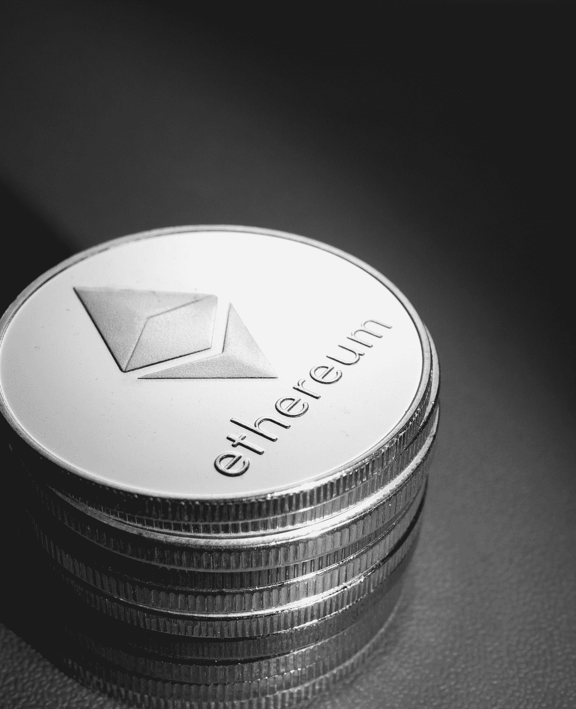

# 以太坊将如何随着 EIP 1559 的更新而发展？

> 原文：<https://medium.com/coinmonks/how-will-ethereum-develop-with-the-eip-1559-update-ec66b4db8706?source=collection_archive---------2----------------------->

Photo by [Jievani Weerasinghe](https://unsplash.com/@jievani?utm_source=medium&utm_medium=referral) on [Unsplash](https://unsplash.com?utm_source=medium&utm_medium=referral)

虽然以前的 hardforks 实施了相当无聊的变化，这些变化对其细节很重要，但对外行人来说非常深奥，伦敦提出了一个大规模的，期待已久的，全面变化的升级:EIP-1559。

我们已经在这篇文章和这篇文章中写过 EIP-1559。所以这里只是一个简单的要点。升级是一篮子的变化，其中大部分是…