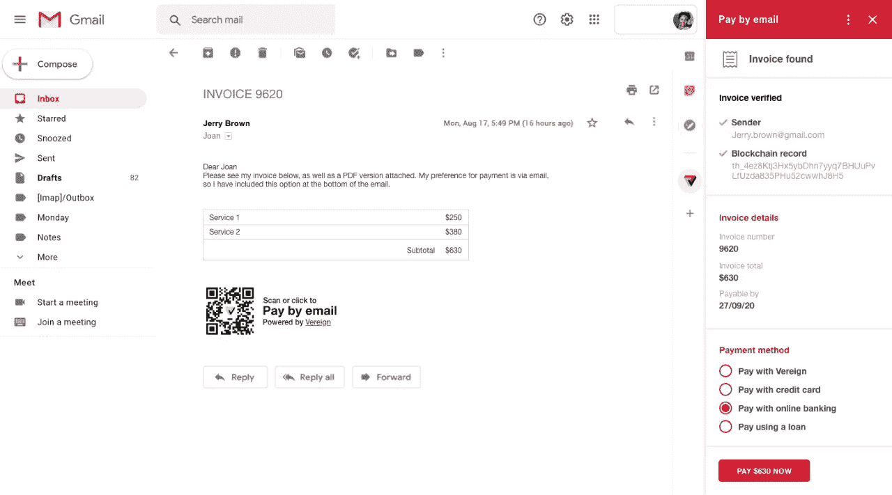

# 你将如何为 21 亿人建造分散的商业铁路？

> 原文：<https://medium.com/coinmonks/how-would-you-build-decentralised-business-rails-for-2-1-billion-people-c167802113d7?source=collection_archive---------6----------------------->

*根据 Glassnode 的数据，2021 年 1 月是比特币活动的最高时期***，拥有超过 2230 万个唯一地址。这是地址，不到 21 亿的 1%。那么，我们如何在不需要实体存在或依赖集中服务的情况下，将这一点纳入业务轨道——包括支付？答案是电子邮件。**

*电子邮件是世界上最大的持久通信网络。它拥有 40 亿用户，令所有社交网络和信使平台相形见绌。这也是唯一的选择，是联合的，分散的，点对点的和抵制审查的。这就是为什么电子邮件已经成为我们在线全球唯一标识符的事实上的标准。几乎所有的平台、社交网络、信使都建立在电子邮件的基础上，并依赖它作为帐户恢复的渠道。*

> **此外，它还是商业交流中最重要的渠道，使全球范围内的商业能够就合同进行谈判和达成一致，并协调合同的执行。**

*对于越来越多的公司来说，电子邮件也是开具发票和协调支付的首选渠道。电子邮件对当今大多数跨境贸易至关重要，它将新兴市场与成熟经济体联系在一起，并在贷款、资产管理、薪资和资金方面日益发挥重要作用。*

*对于一个单一的通信渠道来说，这是很有价值的，这也是电子邮件被认为是互联网的致命弱点的原因。91%的网络攻击都始于电子邮件。商业电子邮件妥协(BEC)——有时也被称为“首席执行官欺诈”——已经成为全球犯罪冠军，[报告 2019 年损失 260 亿美元](https://www.ic3.gov/Media/Y2019/PSA190910)。根据美国联邦调查局的数据，[在 2020 年](https://www.darkreading.com/attacks-breaches/fbi-business-email-compromise-cost-$18b-in-2020/d/d-id/1340452)上升了 69%,[IC3 报告](https://www.ic3.gov/Media/PDF/AnnualReport/2020_IC3Report.pdf)显示它比勒索软件造成了更多的损失。网络犯罪让非法毒贩巴勃罗·埃斯科巴或格里塞尔达的收入相形见绌，而电子邮件也是这一领域无可争议的冠军。*

*几十年来，认证机构(CAs)一直试图解决这个问题，导致了今天的局面。最近，人们发明了各种各样的技术来尝试解决这个问题，这些技术有着奇特的缩写，如 [DKIM、SPF 和 DMARC](https://www.csoonline.com/article/3254234/mastering-email-security-with-dmarc-spf-and-dkim.html) 。他们提供了一些救济，但很明显他们将无法阻止上涨的潮水。所有基于来源过滤、统计模型或机器学习和人工智能的方法都将永远难以应对电子邮件，因为它高度多样化，而且存在一种商业偏见，即要求在发送方面出错，而不是删除。*

# *区块链拯救世界*

*电子邮件需要一个分散的、点对点的安全级别，在每个电子邮件的级别上，在非中介化和分布式的信任模型之上。分布式账本，尤其是公共区块链，非常适合这种情况。*

> **答案就在* ***电子邮件的可验证凭证*** *中，这些凭证在消息创建期间在发送方被放在一起，并锚定在区块链上。它们的设计旨在保护隐私，允许每个中介和每个收件人以分散的点对点方式验证每封电子邮件的来源、路径和内容。**

*这种可验证的电子邮件凭证*

*   *允许发送者**证明**什么已经在何时发送给了谁；*
*   *允许发送方遵守法律要求，如**修订安全**；*
*   *允许中介验证路径上的每封电子邮件，并过滤掉有问题的邮件，零误报**；***
*   *允许收件人验证电子邮件的传入凭证，以**确定**哪个电子邮件可以信任；*
*   *允许交易的所有参与者以**法律确定性**验证和证明该交易已经发生及其内容。*

*可验证的凭据使电子邮件在传输实际价值的用例中值得信赖，包括合同、订单详情、发票和支付详情的认证交换。*

*它们也是允许将自我主权身份(SSI)添加到电子邮件的基本要求，这导致了区块链和电子邮件的[联姻](https://ggreve.medium.com/when-email-marries-the-blockchain-61e22b0917cc)，允许将任何类型设备上的每个电子邮件客户端转变为分散的支付网关。*

> *因此，如果可以标记，就可以通过电子邮件传输:防审查。分散的。点对点。世界上任何地方。*

# *但是 2021 年 21 亿？*

*以上所有都是瑞士 Cryptovalley 初创公司 [Vereign](https://vereign.com) 自 2017 年以来所做的大量深度技术工作。我们开始建立一个真正的自我主权身份，其重点不仅仅是交换凭证，我们还建立了原型，将 SSI 集成到 Gmail 和 Microsoft 365 中，并将其用于 LibreOffice Online 中的文档签名。*

*第二步，我们花了 2020 年的大部分时间来开发易于使用的可验证电子邮件凭证，并确保它们有能力扩展到全球电子邮件流量的水平，即每天 3200 亿封电子邮件。因为电子邮件中可验证凭证的表示很像一个数字印章，可以由自动化组件处理或扫描为 QR 码，我们将结果称为“海豹突击队主权”*

*[Vereign 海豹突击队](https://vereign.com/seal)在[微软 AppSource](https://appsource.microsoft.com/en-gb/product/office/WA200002457) 中适用于微软 365 和最新版本的 Outlook。它也可以作为谷歌 Chrome 浏览器和 Chromium 浏览器的 Gmail 扩展，如 Chrome 浏览器和 Vivaldi 浏览器。*

*Gmail 拥有大约 18 亿用户。微软 365 目前有超过 100 万家公司在使用它，并且增长迅速。当然，仍有许多 Outlook 的本地安装也可以立即安装海豹突击队版。*

> *综合来看，保守估计有 21 亿用户。*

*我们的下一步将是把海豹突击队与超级英雄钱包结合起来，超级英雄钱包是 T21 的令牌化和去中心化社交媒体网络的基本身份。这具有深远的意义，其中一些我已经在我最近关于比特币的系列文章中提到过。*

*ternity 一直以极具吸引力的价格提供非常好的交易速度和交易终结。以至于连微交易都变得可行了。但是如何让这样一个快节奏的连锁店安全运行呢？答案在最近的 [Iris hard fork](https://blog.aeternity.com/iris-hard-fork-receives-the-support-of-the-community-31228f1ebd82) 社区投票中给出，该投票引入了 Hyperchains。*

*超链允许任何实体链在比特币上贴上工作证明以保证自身安全。一旦社区链的硬分叉完成，互联网将像比特币一样安全，比特币是一万亿美元的资产。换句话说:比特币将为互联网的所有功能提供安全性，包括多签名钱包、对任何区块链钱包格式的原生支持、打包资产等等。*

> *这意味着不亚于一个具有比特币安全性、去中心化金融(DeFi)所需的所有能力、不可替代的代币(NFT)等的链条——通过代币化整合到一个社交网络中，并通过一个匿名、去中心化的入口为数十亿电子邮件用户轻松整合。*

*至于 Vereign，我们计划将其与我们在自我主权身份方面的工作相结合，这将在电子邮件的基础上实现增值用例。因此，很快就会有超过 21 亿人能够享受无摩擦的跨境支付和代币转账服务。*

*我们甚至想了想，对于可能涉及传统金融机构的发票开具和支付流程，这将会是什么样子:*

**

*An early UX mock-up for invoice & pay by email*

# *轮到你了*

*我们对这个可能的未来感到非常兴奋。我们希望你也是。因为我们希望得到你的帮助。你可以做几件事来帮忙:*

*安装 [Vereign 海豹突击队插件](https://vereign.com/seal/)，让它开着——并鼓励其他人也这样做。更多的用户意味着更多的反馈，更快的改进，将来会有更多的人自动获得令牌传输能力。*

*请联系 community.vereign.com，提供反馈，并帮助我们解决代币转账的细节问题。还有很多关于钱包整合的选项，我们希望在这些选项中做出正确的选择。*

*此外，我们一直在[寻找优秀的技术人员](https://www.vereign.com/category/careers/)，他们分享我们的愿景，并希望帮助我们实现它。如果你想成为其中的一员，请联系我们，希望我们能很快欢迎你加入我们的团队。*

*最后，请帮助我们传播这个词和这篇文章。🙏*

> *加入 Coinmonks [电报频道](https://t.me/coincodecap)和 [Youtube 频道](https://www.youtube.com/channel/UCbyDhTbOiKh2iUMKBi4-4Zg)了解加密交易和投资*

## *另外，阅读*

*   *[尤霍德勒 vs 考尼洛 vs 霍德诺特](/coinmonks/youhodler-vs-coinloan-vs-hodlnaut-b1050acde55a) | [Cryptohopper vs 哈斯博特](https://blog.coincodecap.com/cryptohopper-vs-haasbot)*
*   *[币安 vs 北海巨妖](https://blog.coincodecap.com/binance-vs-kraken) | [美元成本平均交易机器人](https://blog.coincodecap.com/pionex-dca-bot)*
*   *[如何在印度购买比特币？](/coinmonks/buy-bitcoin-in-india-feb50ddfef94) | [WazirX 评论](/coinmonks/wazirx-review-5c811b074f5b) | [BitMEX 评论](https://blog.coincodecap.com/bitmex-review)*
*   *[比特币主根](https://blog.coincodecap.com/bitcoin-taproot) | [Bitso 点评](https://blog.coincodecap.com/bitso-review) | [排名前 6 的比特币信用卡](/coinmonks/bitcoin-credit-card-bc8ab6f377c6)*
*   *[双子座 vs 比特币基地](https://blog.coincodecap.com/gemini-vs-coinbase) | [比特币基地 vs 北海巨妖](https://blog.coincodecap.com/kraken-vs-coinbase) | [硬币罐 vs 硬币点](https://blog.coincodecap.com/coinspot-vs-coinjar)*
*   *[印度密码交易所](/coinmonks/bitcoin-exchange-in-india-7f1fe79715c9) | [比特币储蓄账户](/coinmonks/bitcoin-savings-account-e65b13f92451) | [Paxful 审核](/coinmonks/paxful-review-4daf2354ab70)*
*   *[杠杆令牌](/coinmonks/leveraged-token-3f5257808b22) | [最佳加密交易所](/coinmonks/crypto-exchange-dd2f9d6f3769) | [AscendEX 评论](/coinmonks/ascendex-review-53e829cf75fa)*
*   *[印度的秘密税](https://blog.coincodecap.com/crypto-tax-india) | [altFINS 审查](https://blog.coincodecap.com/altfins-review) | [Prokey 审查](/coinmonks/prokey-review-26611173c13c)*
*   *[区块链 vs 比特币基地](https://blog.coincodecap.com/blockfi-vs-coinbase) | [比特坎评论](https://blog.coincodecap.com/bitkan-review) | [币安评论](/coinmonks/binance-review-ee10d3bf3b6e)*
*   *[Coldcard 评论](https://blog.coincodecap.com/coldcard-review) | [BOXtradEX 评论](https://blog.coincodecap.com/boxtradex-review)|[uni swap 指南](https://blog.coincodecap.com/uniswap)*
*   *[阿联酋 5 大最佳加密交易所](https://blog.coincodecap.com/best-crypto-exchanges-in-uae) | [SimpleSwap 评论](https://blog.coincodecap.com/simpleswap-review)*
*   *购买 Dogecoin 的 7 种最佳方式*
*   *[美国最佳加密交易机器人](https://blog.coincodecap.com/crypto-trading-bots-in-the-us) | [经常性评论](https://blog.coincodecap.com/changelly-review)*
*   *[在印度利用加密套利赚取被动收入](https://blog.coincodecap.com/crypto-arbitrage-in-india)*
*   *[德国最佳加密交易所](https://blog.coincodecap.com/crypto-exchanges-in-germany)*