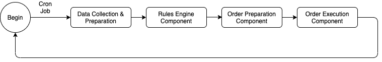

# 你如何建立一个算法交易系统

> 原文：<https://medium.com/coinmonks/how-you-can-build-an-automated-trading-system-12ac147be531?source=collection_archive---------1----------------------->

如今，算法交易或自动化交易越来越受欢迎。根据这篇[文章](https://www.businesswire.com/news/home/20190205005634/en/Global-Algorithmic-Trading-Market-Surpass-21685.53-Million#:~:text=Algorithmic%20trading%20is%20responsible%20for,of%20all%20U.S.%20equity%20trading.&text=In%202017%2C%20finance%20and%20insurance,the%20U.S.%20gross%20domestic%20product.)，算法交易约占美国全部股票交易的 60–73%。

我认为开发一个全天候交易的机器人会是一个有趣的附带项目。几周前，我开始从事这个项目，并创建了一个既交易加密货币又交易股票的机器人。我已经使用 Java Spring Boot、MySQL 和 AWS 开发了这个系统，但是我要讨论的设计是技术不可知的，并且可以在您选择的语言和数据库中实现。

# **目标**

这篇文章的目的是让你看一看基于技术指标的自动交易系统的一些关键部分。我将避免深入细节，坚持设计部分。

逻辑上，我们可以把一个自动交易系统分成 4 个主要部分。

1.  数据收集和准备。
2.  规则引擎。
3.  订单准备。
4.  订单执行。

这些组成部分中的每一个都有一套明确的职责。这种类型的设计将使我们的系统更加灵活和可伸缩。为了保持程序全天候运行，我使用了一个 cron 作业来执行这些组件。让我们来看一下这些组件。

# **1。数据收集&准备组件**

**职责**

*   从第三方 API 获取数据，并准备模型以提供给规则引擎。

**设计**

您可能已经知道，这个项目最大的挑战之一是数据源。如果您将此作为一个副业项目，您可能正在寻找可以免费或以最低成本为您提供数据的 API。我发现了几个可以免费提供价格行为和技术指标数据的 API(更多细节请参见参考资料部分)。

只要有可靠的数据源，这个组件的设计就相对简单。我的目标是专注于交易策略，并保持设计相对简单，所以我想要一个能够提供技术指标数据的 API。

您也可以选择使用来自 API 和技术分析库的原始价格行为数据来计算相同的指标。然而，这可能会在开发、测试和设计方面带来一系列完全不同的挑战。我建议你在开始开发之前做这个选择。

根据您选择的 API 和订阅计划，您可能能够执行批量查询来一次获得多个指标。从我的经验来看，设计你的 dto 和映射器来使用一个指标和多个指标可以节省你以后代码重构的大量时间。

**资源**

*   [Taapi](https://taapi.io/) —如果你想要低成本的实时加密技术指标数据。在写这篇文章的时候，他们的数据基于币安。在他们的免费计划中，你可以每分钟查询一次。如果您正在考虑构建一个复杂的系统，我会推荐他们的 Pro 计划，该计划允许批量查询。一口气得到多个指标，会让你的设计任务变得极其简单。
*   [AlphaVantage](https://www.alphavantage.co/) —针对股票和加密货币数据。如果你想把技术指标和基本面数据结合起来，这是一个很好的选择。然而，它们并不提供实时数据，最新的数据也落后一天。当你决定交易策略时，这个事实会派上用场。
*   [用于技术分析的 Java 库](https://github.com/ta4j/ta4j) —如果你想用原始数据计算技术指标，这是个不错的库。

# **2。规则引擎**

**责任**

*   在指标上应用一个或多个规则，做出买入或卖出的决定。

**设计**

作为一名软件开发人员，就编写可伸缩、可维护和干净的代码而言，设计和实现这一部分是一个挑战，也是一次很好的学习经历。

我们来讨论一个实际的例子。假设你想买一个资产，如果 RSI 在 40-70 之间，MACD 在信号线上方穿过。一个快速的解决方案是编写几个 if-else 块，然后继续前进。一周后，你想修改策略，决定抛出 100 日均线。现在，你必须添加第三个 if-else 来考虑 EMA。你有问题了！这可能会很快失去控制，在你知道之前，你会看到买卖规则上的一长串 if-else。每次你想修改你的决策过程时，你都会弄乱整个商业逻辑。我们还没有考虑给每个指标分配优先级。**经验教训:不要编写 if else 块来评估您的数据。它会回来缠着你。**

在寻找一些设计思路时，我看到了这篇著名的文章[我应该使用规则引擎吗？](https://martinfowler.com/bliki/RulesEngine.html)并意识到规则引擎可以高效地解决这一挑战。一个简单的规则引擎可以很容易地管理单一和复合规则(相对强弱指标-MACD-均线组合)，让你的决策过程更加灵活和可读。

以下是您可以使用规则引擎实现的一些关键行为。

*   为每个指标分配优先级。
*   创建复合规则。
*   实现规则监听器来监听规则执行事件。
*   使用数据库从规则中动态添加或删除指示器。

我创建了两套规则——**买入信号评估**(当你试图买入一项资产时)和**卖出信号评估**(当你试图卖出一项资产时)。您可以维护一个 SQL 表来存储给定资产的最近操作(购买或出售)。然后，如果您已经购买了资产，您可以触发卖出方规则，同样，如果您在最近的操作中已经卖出了资产，您可以触发买入方规则。

**资源**

*   [Java 规则引擎](https://github.com/j-easy/easy-rules)
*   [Python 规则引擎](https://pypi.org/project/durable-rules/)
*   [JSON 规则引擎](https://www.npmjs.com/package/json-rules-engine)

# **3。订单准备组件**

**责任**

*   根据规则引擎做出的决定准备买入或卖出订单。

**设计**

如果您在上一步中使用了规则引擎，我假设您已经实现了一个监听规则执行事件的监听器。大多数情况下，你的买入或卖出规则评估将返回错误/失败，你将无法继续这个过程的其余部分。然而，当您的规则评估为真条件时，您可能希望将控制权传递给队列中的下一个人——订单准备组件。我创建了两个独立的服务来分别处理购买订单准备和销售订单准备。您可以稍后添加止损和其他类型的订单服务。

**购买订单准备**

购买订单准备服务的主要职责是**确定您应该购买的数量。对于实际的交易，你会想要建立规则来确保你不会最终创造出不好的订单。糟糕的订单最终会被拒绝，你要么错过一个好的购买机会，要么留下你不想持有的资产。**

一个例子是确保你的投资不超过总投资组合的 x%,并始终确保你有足够的余额来购买资产。

我喜欢在 SQL 表中维护可用余额和资产比例分配，并相应地更新它。你也可以查询交易所，获取可用购买力。

**卖出订单准备**

销售订单准备服务的设计从一开始就非常简单。我们将出售给定资产的 100%的单位。你可以通过引入基于百分比的销售来使它变得更复杂。

# **4。订单执行组件**

**职责**:将准备好的订单放到交易所。

**设计**:好了，你已经完成了所有的艰苦工作，现在到了肾上腺素激增的部分，多巴胺释放成分——我们将在交易所下单。

一旦你准备好买入或卖出订单，你就可以通过 API 进入交易所实际下单。**大多数交易所都有一个“测试订单”端点，可以创建和验证新订单，但不会下单。我建议先做一个测试订单，如果一切顺利，就下实际订单。**币安和 Ally 拥有记录良好的 API，发布新订单相当简单。你可以在媒体上找到大量关于 Robinhood 集成的文章。

一旦下了订单，您会希望更新您的数据库来维护您自己的记录。这种记录还将帮助您确定当您的程序下次运行时，您是否应该运行购买资产或出售资产的规则。您可以使用 cron job 定期运行您的程序。

该组件的最后一个可选任务是向您自己发送一封包含所有订单详细信息的电子邮件通知。我觉得收到这封邮件是这个项目中最令人满意的部分之一。

# **结论**

在这篇文章中，我们看了一下自动交易系统的基本结构。在从事这样的项目时，您可以学到很多关于系统设计、设计模式、API 集成和许多其他软件开发概念的知识。在以后的文章中，我们将通过一些代码示例和数据库设计更深入地研究这些组件。

欢迎对你的设计想法发表评论。编码快乐！

## 另外，阅读

*   最好的[密码交易机器人](/coinmonks/crypto-trading-bot-c2ffce8acb2a)
*   [密码本交易平台](/coinmonks/top-10-crypto-copy-trading-platforms-for-beginners-d0c37c7d698c)
*   最好的[加密税务软件](/coinmonks/best-crypto-tax-tool-for-my-money-72d4b430816b)
*   [最佳加密交易平台](/coinmonks/the-best-crypto-trading-platforms-in-2020-the-definitive-guide-updated-c72f8b874555)
*   最佳[密码借贷平台](/coinmonks/top-5-crypto-lending-platforms-in-2020-that-you-need-to-know-a1b675cec3fa)
*   [最佳区块链分析工具](https://bitquery.io/blog/best-blockchain-analysis-tools-and-software)
*   [加密套利](/coinmonks/crypto-arbitrage-guide-how-to-make-money-as-a-beginner-62bfe5c868f6)指南:新手如何赚钱
*   最佳[加密制图工具](/coinmonks/what-are-the-best-charting-platforms-for-cryptocurrency-trading-85aade584d80)
*   [莱杰 vs 特雷佐](/coinmonks/ledger-vs-trezor-best-hardware-wallet-to-secure-cryptocurrency-22c7a3fd391e)
*   了解比特币的[最佳书籍有哪些？](/coinmonks/what-are-the-best-books-to-learn-bitcoin-409aeb9aff4b)
*   [3 商业评论](/coinmonks/3commas-review-an-excellent-crypto-trading-bot-2020-1313a58bec92)
*   [AAX 交易所评论](/coinmonks/aax-exchange-review-2021-67c5ea09330c) |推荐代码、交易费用、利弊
*   [Deribit 审查](/coinmonks/deribit-review-options-fees-apis-and-testnet-2ca16c4bbdb2) |选项、费用、API 和 Testnet
*   FTX 密码交易所评论
*   [n 零审核](/coinmonks/ngrave-zero-review-c465cf8307fc)
*   [Bybit 交换审查](/coinmonks/bybit-exchange-review-dbd570019b71)
*   [3Commas vs Cryptohopper](/coinmonks/cryptohopper-vs-3commas-vs-shrimpy-a2c16095b8fe)
*   最好的比特币[硬件钱包](/coinmonks/the-best-cryptocurrency-hardware-wallets-of-2020-e28b1c124069?source=friends_link&sk=324dd9ff8556ab578d71e7ad7658ad7c)
*   最佳 [monero 钱包](https://blog.coincodecap.com/best-monero-wallets)
*   [莱杰 nano s vs x](https://blog.coincodecap.com/ledger-nano-s-vs-x)
*   [bits gap vs 3 commas vs quad ency](https://blog.coincodecap.com/bitsgap-3commas-quadency)
*   [莱杰纳米 S vs 特雷佐 one vs 特雷佐 T vs 莱杰纳米 X](https://blog.coincodecap.com/ledger-nano-s-vs-trezor-one-ledger-nano-x-trezor-t)
*   [block fi vs Celsius](/coinmonks/blockfi-vs-celsius-vs-hodlnaut-8a1cc8c26630)vs Hodlnaut
*   [Bitsgap 评论](/coinmonks/bitsgap-review-a-crypto-trading-bot-that-makes-easy-money-a5d88a336df2)——一个轻松赚钱的加密交易机器人
*   [Quadency Review](/coinmonks/quadency-review-a-crypto-trading-automation-platform-3068eaa374e1) -专为专业人士打造的加密交易机器人
*   [PrimeXBT 审查](/coinmonks/primexbt-review-88e0815be858) |杠杆交易、费用和交易
*   [埃利帕尔泰坦评论](/coinmonks/ellipal-titan-review-85e9071dd029)
*   [SecuX Stone 评论](https://blog.coincodecap.com/secux-stone-hardware-wallet-review)
*   [BlockFi 评论](/coinmonks/blockfi-review-53096053c097) |赚取高达 8.6%的加密利息