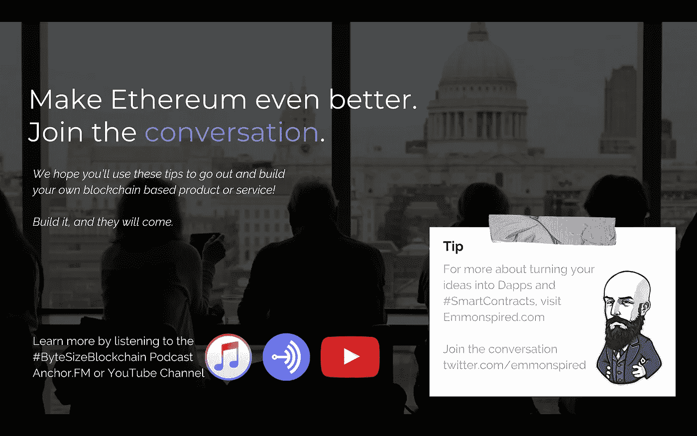

# # HowToBUIDL 系列(第 1 页，共 n 页)

> 原文：<https://medium.com/coinmonks/howtobuidl-series-1-of-n-bf51e248243d?source=collection_archive---------1----------------------->

## #BUIDL :: Dev 环境设置。这个系列是为那些寻找摆脱束缚的人而写的。一旦你知道如何制作钥匙，就没有理由呆在笼子里。

这一切都是从**# BUIDL**……开始的，它似乎已经像野火一样在[以太坊](https://www.ethereumfoundation.org)社区中流行开来。这是一部关于“HODL”迷因的戏剧，你可能很熟悉，但是是在富有成效的努力中。除非我们执行并建立增加采用的方法，否则这些加密的东西都不重要。

问题是，这很难开始。当人们来到这个空间，就有一个*压倒* *的信息量。* 你准备好下一步进入#以太坊#区块链教育了吗？不需要大学学历。不需要花几千块。你已经得到你想要的了。缺少的只是一个指南。在这篇文章结束时，你将有一个工作的开发环境，并为下一课做好准备，如何构建你的第一个以太坊智能合约。

Altered image from the Greatest Showman, 2017

**#HODL** 。这个术语是由一个醉汉[创造的](https://en.wikipedia.org/wiki/Hodl)他在互联网的一个论坛上大喊，当比特币刚刚下跌时，最好的办法就是持有。但是，这是鲁莽的，也是最糟糕的风险管理。后来，有人创造了一个“backronym”，让每个字母都代表“亲爱的生活坚持住”——但实际上，我们不要忘记 HODL 字面上是一个不会拼写 Hold 的醉汉的拼写错误。

建造者提出了一个术语来指代建造事物的行为。建造。这不是一个关于争论价格的帖子。 [**这是另一个关于创新和利用区块链技术帮助我们推动人类前进的帖子**](https://www.linkedin.com/pulse/build-legacy-tune-out-price-wars-dan-emmons/) ，因为那些疯狂到认为自己可以改变世界的人，就是那些改变世界的人。

谁能做到？**大家。**有什么隐情？很难。
什么时候能上手。现在。我需要在哪里学习？你的座位。
为什么？**永不相同。** **你可以活过来。**

借口一。"但是我被告知我需要一个学院学位."
自限信仰。你不想离开去演一个新角色吗？
你不需要花几千美元去 g *et 今天开始。*

**借口二。“我从来没有编码过任何东西。我不知道我在做什么。”** 你可能不明白。但你会的。你也可以分享你的知识。

有时，人们会将这个借口与不懂密码学或被数学公式和概念弄糊涂联系起来。不要气馁。为了开始# BUIDLing，你不需要成为一名数学专家或密码学家。

**借口三。“我甚至不知道是什么做的。”这是一个激发你好奇心的练习。研究。玩吧。要有创意。对过程有信心。辛戈。你会突然想到一个主意，迫不及待地想付诸实施。**

**借口四。“我听说密码正在降价。不是死了吗？”无论何时，当你听到人群为一个密码与另一个密码争论不休，就像这是一场体育赛事一样，你都应该往相反的方向跑。放弃城镇广场。放弃论坛。#BUIDL。**

**借口五。“这真的很难。”**
[我们的知识增长得越多，我们的无知就展现得越多](https://www.linkedin.com/pulse/why-blockchain-because-we-choose-go-moon-dan-emmons/)。即使是软件开发专家也在苦苦挣扎。但是，这是一个机会，让我们能够在一项新的努力、新的技术中处于领先地位，并参与到这个随着日益增长的技能需求而增长的秘密经济体系中。

**借口六。“如果我被卡住了怎么办？那就没意义了。”有许多可用的资源，通常是免费的。从 StackoverflowExchange 到 Gitter 聊天室的整个生态系统，全球各地的开发人员一天 24 小时都可以在这里找到，他们都忙于开发开源软件，并提供快速 Q &帮助他们跨越障碍。我们的知识增长得越多，我们的无知就展现得越多。**

**借口七。“是啊当然。为什么会有人帮我？”**

约翰·纳西解释开源软件在管理动态方面做得最好。亚当·斯密曾经说过，“最好的结果来自于团队中的每个人都做对自己最有利的事情”。不完整。最佳结果来自于团队中的每个人做对自己和团队最有利的事情。

N **现在我们没有借口了，
你已经准备好成为积极改变的力量。**

**我们开始吧。*可选*跳过此内容。** 了解什么是[区块链](/@dan.ryan.emmons/what-is-blockchain-3829efa1cfe7)。
了解[加密货币与代币](/@dan.ryan.emmons/explanation-of-cryptocurrency-vs-tokens-63e7822ea8f)的区别。
从[非技术角度](/@dan.ryan.emmons/ethereum-introduction-bbf7299cf1)了解以太坊 101。

> 就在此时此地。我提出了报价。我不想追你。我知道你看到了。你和我一起跑。我可以帮你解脱。从你的苦工和高墙中走出来。因此，用典型的*来换取多彩的*。如果疯狂，就活得疯狂一点。
> 你可以发挥它的理智，一个常规之王。或者你可以冒险一试。**
> 
> *但是我想我会让你来决定…*

*敬请期待本# HowToBUIDL 系列的下一集。*

**Dan Emmons 是*[*Emmonspired LLC*](http://www.emmonspired.com/)*的所有者，a* [*认证比特币专业人士*](http://cryptoconsortium.org/lookup/6f0d14) *，认证以太坊开发者，全栈开发者，加密货币项目顾问。他还是一个名为*[*# ByteSizeBlockchain*](https://www.youtube.com/watch?v=SVBZ7mdgGcA)*的 Youtube 频道和 iTunes 播客的创作者。**