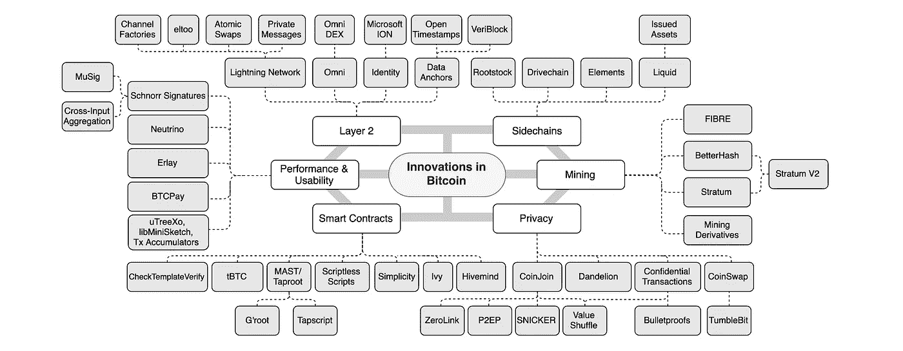
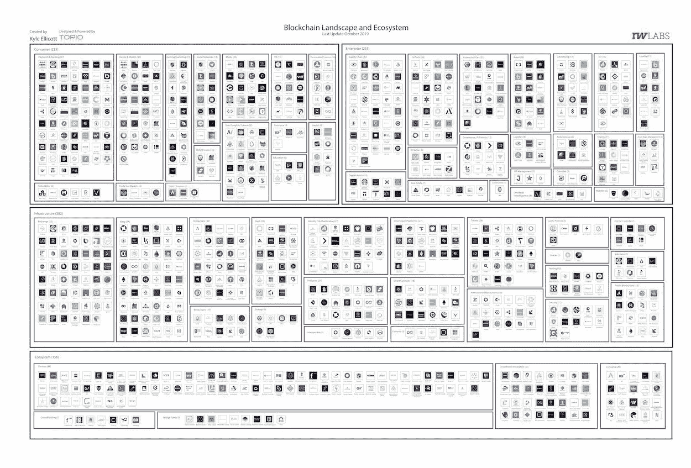

# 汇丰银行从纸到区块链/ EY 透露令牌化地址/杰克带比特币去非洲

> 原文：<https://medium.com/coinmonks/hsbc-goes-from-paper-to-blockchain-ey-reveals-tokenization-address-jack-takes-bitcoin-to-africa-78d96b8577a7?source=collection_archive---------1----------------------->

Photo by [Drew Graham](https://unsplash.com/@dizzyd718?utm_source=unsplash&utm_medium=referral&utm_content=creditCopyText) on [Unsplash](https://unsplash.com/s/photos/future?utm_source=unsplash&utm_medium=referral&utm_content=creditCopyText)

2019 年 12 月 3 日

*刚刚结束黑色星期五/网络星期一购物狂潮的本周版——****汇丰*** *全力以赴，宣布他们计划在 3 月前将价值 200 亿美元的资产转移到一个新的区块链托管平台。***在* ***以太*** *的公共区块链上揭示标记化地址。* ***推特****&****Square 的*** *CEO、* ***杰克·多西*** *，已经有了将目光投向比特币和技术的“未来”的打算* ***非洲*** *及其超过 12 亿人口。正式大家…* ***法兰西*** *将于 2020 年在 Q1 测试其央行数字货币(CBDC)。我们来看看比特币的* ***技术栈的创新，同时反思区块链的过去十年。****

**在 DApps 领域，我们正在讨论****【RSK】****为 dapp 开发者推出 20 万美元的资助计划，同时* ***炼金术*** *和****Dapper Labs****组队解决区块链的基础设施问题。DeFi 可能在蚕食 PoS security 和 Dapp.com 的 2019 年第三季度* ***Dapp 市场报告*** *。加上来自* ***波尔卡多*******海洋协议【Cosmo】*******【埃尔隆德】*******嘉手纳*** *和****arc block****。我们甚至在大量的研究(* [*Q3 2019 区块链格局*](https://www.topionetworks.com/events/5d79268b78e00230faba6f77) *) &书籍(关于* [*数字资产*](https://www.scribd.com/document/430637579/Current-Market-Overview-of-Digital-Assets)**[*企业区块链*](https://www.amazon.com/dp/B07Z3LJCHW/ref=cm_sw_r_tw_dp_U_x_C6iSDbACJJN2Z) *)以及对风险投资的见解(新基金！！)、基础设施、DApps、比特币、经济学、交易所和 Stablecoins。为了了解更多信息，让你跟上时代的步伐，这里有一张本周业内热门新闻的快照。*******

## *📈[汇丰将 200 亿美元从纸面转移到区块链，这是最大的金融部署之一](https://www.forbes.com/sites/darrynpollock/2019/11/29/hsbc-moves-20-billion-from-paper-to-blockchain-in-one-of-the-biggest-financial-deployments/#3951d36218cf)*

*全球最大的银行和金融服务机构之一汇丰银行(HSBC)计划在 3 月份之前将价值 200 亿美元的资产转移到一个新的区块链托管平台。这是对以前系统的巨大改进，因为汇丰平台将对私募的纸质记录进行数字化处理。新的汇丰平台名为 Digital Vault，将让投资者实时获得在私人市场上购买的证券记录。… [阅读更多内容](https://www.forbes.com/sites/darrynpollock/2019/11/29/hsbc-moves-20-billion-from-paper-to-blockchain-in-one-of-the-biggest-financial-deployments/#3951d36218cf)*

## *📖 [Blockchain to ‘save food industry $31 billion,’ new research says](https://www.cnbc.com/2019/11/27/blockchain-to-save-food-industry-31-billion-new-research-says.html)*

*According to the recent report published by Juniper Research that blockchain, along with “internet of things” trackers and sensors, would help to drive down costs for retailers. This would be achieved through the streamlining of supply chains, efficient food recall processes, and “simpler regulatory compliance.”…[read more](https://www.cnbc.com/2019/11/27/blockchain-to-save-food-industry-31-billion-new-research-says.html)*

## *📖 [EY Reveals Tokenization Addresses on Ethereum’s Public Blockchain](https://www.trustnodes.com/2019/12/01/ey-reveals-tokenization-addresses-on-ethereums-public-blockchain)*

*The smart contract addresses running on [ethereum](https://medium.com/u/d626b3859bc9?source=post_page-----78d96b8577a7--------------------------------)’s public blockchain to tokenize assets has revealed by Ernst & Young, a multinational professional services firm headquartered in London. The asset in question is a wine bottle, a Tattoo Bottle unique token with its ID connected to an ethereum address that owns the token and the rights to the bottle…[read more](https://www.trustnodes.com/2019/12/01/ey-reveals-tokenization-addresses-on-ethereums-public-blockchain)*

## *🇨🇳 [Will the China of tomorrow run on the technology behind bitcoin?](https://www.scmp.com/news/china/politics/article/3040132/will-china-tomorrow-run-technology-behind-bitcoin)*

*According to a report by Xinhua, Xi called for China to become a world leader and “rule maker” in the field, saying blockchain had applications in the financial, manufacturing and public sectors. Zhang Feng, a chief engineer at the Ministry of Industry and Information Technology, stated in his keynote speech at the event that China would seek to establish a national committee for blockchain standards and prioritize research into developing applications for it. Blockchain, a new technology most associated with cryptocurrencies like Bitcoin, looks set to play a significant role in China’s governance after receiving an endorsement by Chinese President Xi Jinping, observers say…[read more](https://www.scmp.com/news/china/politics/article/3040132/will-china-tomorrow-run-technology-behind-bitcoin)*

## *📖[主导 11 月的企业区块链新闻](https://www.forbes.com/sites/biserdimitrov/2019/12/02/enterprise-blockchain-news-that-dominated-november/#76d232fb6846)*

*随着摩根大通、汇丰银行和 Visa 宣布了他们在区块链的重要发展，银行和金融服务领域的区块链企业正在跨越 2019 年的鸿沟。摩根大通正利用区块链优化贷款审计和管理抵押品，而汇丰银行将利用区块链转移价值 200 亿美元的资产。Visa 还与区块链……[进一步加强其数据隐私解决方案阅读更多](https://www.forbes.com/sites/biserdimitrov/2019/12/02/enterprise-blockchain-news-that-dominated-november/#76d232fb6846)以及从 [Biser Dimitrov](https://medium.com/u/f91a4cb3fbb7?source=post_page-----78d96b8577a7--------------------------------) 了解更多*

## *📖[看看比特币的技术创新](/@LucasNuzzi/a-look-at-innovation-in-bitcoins-technology-stack-7edf877eab14)*

**

*[Source](/digitalassetresearch/a-look-at-innovation-in-bitcoins-technology-stack-7edf877eab14)*

*过去十年，比特币取得了长足的进步。相对于其软件的第一次迭代，当前实现的质量和可靠性已经显著提高。比特币还是老样子。就像宪法一样，定义其商业属性的核心共识规则(如算法通胀和硬编码供应)保持不变。这篇文章阐述了正在发生的创新和技术进步，如智能合同、采矿和隐私等……[阅读更多](/@LucasNuzzi/a-look-at-innovation-in-bitcoins-technology-stack-7edf877eab14)以及来自 [Lucas Nuzzi](https://medium.com/u/2c19dc50596c?source=post_page-----78d96b8577a7--------------------------------) 的更多信息*

## *📈[杰克·多西的“定义未来”计划将比特币带给 12 亿人](https://www.forbes.com/sites/billybambrough/2019/12/01/jack-dorseys-future-defining-plan-to-bring-bitcoin-to-12-billion-people/#196465d24f6f)*

*支付公司 [Square](https://medium.com/u/589d4400b6a4?source=post_page-----78d96b8577a7--------------------------------) 和 Twitter 的首席执行官杰克·多西计划将比特币和技术的“未来”放在非洲及其超过 12 亿的人口上。最近的一份报告显示，这些数据在一定程度上支持了多尔西的预期，即非洲将在比特币和加密货币方面领先。… [阅读更多](https://www.forbes.com/sites/billybambrough/2019/12/01/jack-dorseys-future-defining-plan-to-bring-bitcoin-to-12-billion-people/#196465d24f6f)*

**

*Come Join! [Edge Computing World](https://www.edgecomputingworld.com/)*

## *📈[法国将于 2020 年在 Q1 测试其中央银行数字货币:官方](https://cointelegraph.com/news/france-to-test-its-central-bank-digital-currency-in-q1-2020-official)*

*法国中央银行计划在 2020 年为金融机构试点央行数字货币(CBDC)。据法国金融出版物《回声报》12 月 4 日报道，法国银行行长弗朗索瓦·维勒罗伊·德·加尔豪宣布，银行将在 2020 年第一季度末开始测试数字欧元项目。法国银行[在推特上证实了](https://twitter.com/banquedefrance/status/1202217934560608256?s=20)这一消息，并指出这一消息是在由法国两大金融监管机构——法国审慎监管和决议局和金融市场管理局——联合主办的一次会议上发布的。… [阅读更多信息](https://cointelegraph.com/news/france-to-test-its-central-bank-digital-currency-in-q1-2020-official)*

# *本周阅读的研究:*

## *📖[区块链十年——2010-2020 年回顾](https://consensys.net/blog/news/the-decade-in-blockchain-2010-to-2020-in-review/)*

*2009 年 1 月 3 日，全球金融危机加速了全球经济不平等性的不断扩大，一个名叫中本聪的神秘人物推出了一种名为比特币的虚拟货币，这种货币位于他所谓的“工作链证明”的顶端随着 2009 年的结束，区块链的发展受到了限制。事实上，比特币网络上的第一笔交易发生在 2009 年 12 月。BitcoinTalk 论坛是区块链开发者的早期温床，于 11 月上线。区块链的生态系统仅限于少数技术专家和开发者，对他们已经启动的现象略知一二……[阅读更多](https://consensys.net/blog/news/the-decade-in-blockchain-2010-to-2020-in-review/)和更多[咨询公司](https://medium.com/u/6c7078bf7b01?source=post_page-----78d96b8577a7--------------------------------)*

# *本周的更多内容:*

*📖[网络安全报告:越来越多的在线攻击——密码学家](/@alfredoantonio.decandia/cybersecurity-report-increasing-number-of-online-attacks-the-cryptonomist-958cd1256cfe)阿尔弗雷多·德·坎迪亚*

*🇨🇳 [中国可能很快向证券代币发行敞开大门](https://cryptoslate.com/china-could-soon-open-the-doors-to-security-token-offerings-stos/)*

*📖[宇宙⚛️2019 年 11 月网络分析](/figment-networks/cosmos-️-november-2019-network-analysis-590bce4debca)作者[加文](https://medium.com/u/73e5a85339e3?source=post_page-----78d96b8577a7--------------------------------)*

*📖 [Modicum 让每个应用成为每个人的应用](/web3studio/modicum-makes-every-app-everyones-app-c8fa18484d1d)作者[约翰·沃伯特](https://medium.com/u/26a7c53cdfeb?source=post_page-----78d96b8577a7--------------------------------)*

*📖[嘉手纳公共区块链](/kadena-io/faq-for-kadenas-public-blockchain-173a41fb560b)常见问题解答 [Rebecca Rodriguez](https://medium.com/u/666bf2761d10?source=post_page-----78d96b8577a7--------------------------------)*

*📖[埃尔隆德验证员将包含在由](/elrondnetwork/elrond-validators-to-be-included-in-stake-capitals-service-offering-5c8b88665914) [Lucian Mincu](https://medium.com/u/f9e3aeb91126?source=post_page-----78d96b8577a7--------------------------------) 提供的股份资本服务中*

*🎄[加密圣诞礼物指南 2019](https://decrypt.co/11903/crypto-christmas-gift-guide-2019) 由[解密](https://medium.com/u/54b61e1b74da?source=post_page-----68bcdd528bfe----------------------)*

*💰[通过](/shapeshift-stories/discovering-defi-in-blockchain-tech-f018524d4e6f) [ShapeShift](https://medium.com/u/5ee4b8323e7a?source=post_page-----78d96b8577a7--------------------------------) 发现区块链技术中的 DeFi*

*💰[纽约州批准富达数字资产宪章](https://www.finextra.com/newsarticle/34811/new-york-state-grants-fidelity-digital-asset-charter)*

*📖[数字资产的当前市场概述](https://www.scribd.com/document/430637579/Current-Market-Overview-of-Digital-Assets)作者 [David Nage](https://medium.com/u/b23d2fb9948a?source=post_page-----b48e000a0f21----------------------)*

# *分散式应用程序手表*

## *📖EOS 面临 DApp 的强烈反对；归咎于其治理模式*

*EarnBet 最近从 EOSBet 更名而来，EOS bet 是最初的 EOS 游戏平台，旨在扩展到 EOS 生态系统之外，该公司表示，EOS mainnet 处于“可悲的状态”，网络拥塞和垃圾邮件严重，用户无法访问他们的 EOS 帐户。区块链支持的智能合同协议，eosio，是一个开发和托管分散应用的流行平台。… [阅读更多内容](https://eng.ambcrypto.com/eos-faces-backlash-from-dapp-blames-its-governance-model/)*

## *📖[比特币初创公司 RSK 为 dapp 开发者推出 20 万美元资助计划](https://decrypt.co/12704/bitcoin-startup-rsk-launches-200000-grant-program-for-dapp-developers)*

*比特币初创公司[根茎(RSK)](https://www.rsk.co/) 宣布将提供 20 万美元的赠款，资助基于比特币区块链的 DApps 的开发。自称为“第一个受比特币网络保护的智能合约平台”的 RSK 表示，它正在寻找开发者来推销任何有助于 RSK 生态系统的软件工具，比如“DApps 的浏览器内钱包，智能合约编译和部署工具链”，甚至是一个新的 RSK 改进提案。… [阅读更多](https://decrypt.co/12704/bitcoin-startup-rsk-launches-200000-grant-program-for-dapp-developers)*

## *📖【DeFi 如何蚕食 PoS 安全*

*链上贷款已经成为当今最受欢迎的分散金融(DeFi)应用，今年在 MakerDAO、Compound 和 dYdX 上发放的贷款[超过 6 亿美元。连锁贷款有可能打破传统的担保贷款。但它似乎可能做得更多:它可能还会破坏股权共识的证明……](https://loanscan.io/loans?interval=1y)[阅读更多](https://blog.oceanprotocol.com/data-tokens-2-fungible-composable-54b6e0d28293)和更多来自 [Haseeb Qureshi](https://medium.com/u/8bc4e5f8b505?source=post_page-----78d96b8577a7--------------------------------)*

## *📖 [Alchemy 和 Dapper Labs 联手解决区块链基础设施问题](/dapperlabs/alchemy-solved-the-technical-challenges-of-blockchain-infrastructure-for-dapper-labs-creator-of-faebba35e0e7)*

*Alchemy 和 Dapper Labs 合作解决区块链的基础设施问题。Alchemy 的核心产品允许 Dapper 每天向网络进行超过 700 万次查询，运行全球顶级的区块链 dApp，并提交超过 1200 笔 ETH 交易，包括超过 2800 万美元的销售额。… [阅读更多信息](/dapperlabs/alchemy-solved-the-technical-challenges-of-blockchain-infrastructure-for-dapper-labs-creator-of-faebba35e0e7)*

*📖下载 Brave 的人比你想象的要多*

*📖[揭秘分散身份第 1 部分](https://www.arcblock.io/en/post/2019/12/3/demystify-decentralized-identity)由 [ArcBlock](https://medium.com/u/24f0ce349daf?source=post_page-----78d96b8577a7--------------------------------)*

*📖[数据令牌 3:数据和分散金融(Data * DeFi)](https://blog.oceanprotocol.com/data-tokens-3-data-and-decentralized-finance-data-defi-d5c9a6e578b7) 作者 [Trent McConaghy](https://medium.com/u/f1cb98e196bc?source=post_page-----78d96b8577a7--------------------------------) & [海洋协议](https://medium.com/u/1e7ff6f6df18?source=post_page-----78d96b8577a7--------------------------------)*

*📖[波尔卡多特生态系统概述](http://polkaproject.com/)波尔卡多特*

*📖[Dapp.com 2019 年第三季度 Dapp 市场报告](https://www.dapp.com/article/dapp-com-q3-2019-dapp-market-report)作者[Dapp.com](https://medium.com/u/52849c27fcd5?source=post_page-----78d96b8577a7--------------------------------)*

# *📺收听:*

*本周，我收听了来自纽约证券交易所的 Nisa Amoils 的数字资产报告，毕马威美国公司的加密资产服务联席主管 Sal Ternullo 讨论了毕马威在加密资产领域、新数据、托管和税务服务方面的创新。*

*

[Full Episode](https://youtu.be/xt5KKqcu_oo)* 

> **👉下载最新* [*区块链用于基础设施景观*](https://www.topionetworks.com/events/5d79268b78e00230faba6f77) *Q3 2019 版**

**

*Q3 2019 Edition of the Blockchain for Infrastructure & Ecosystem Landscape*

*不想等到下周，[现在就订阅](http://click1.m.readwritelabs.com/xsdqkbbrgsdtqkmntpjlstcnkytvpvphsnhsqlvbrhhd_yfqbfcmslnskglmckvqv.html?source=post_page---------------------------)📥有关区块链、DApps 等的实时行业见解！*

**

> *[直接在您的收件箱中获得最佳软件交易](https://coincodecap.com/?utm_source=coinmonks)*

**