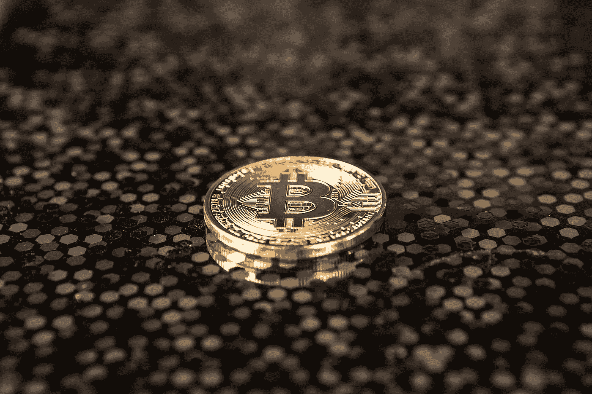
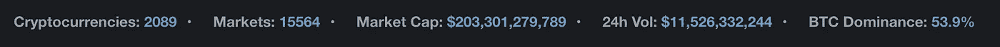
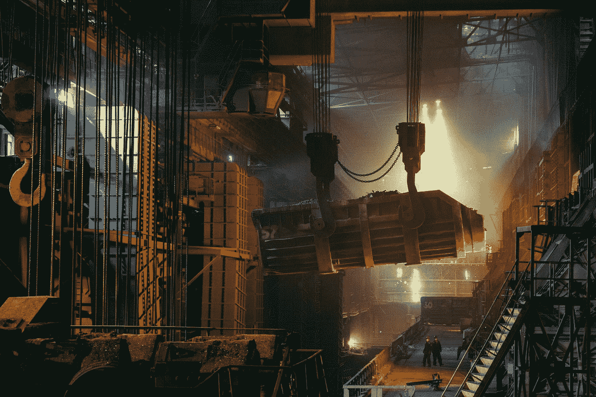
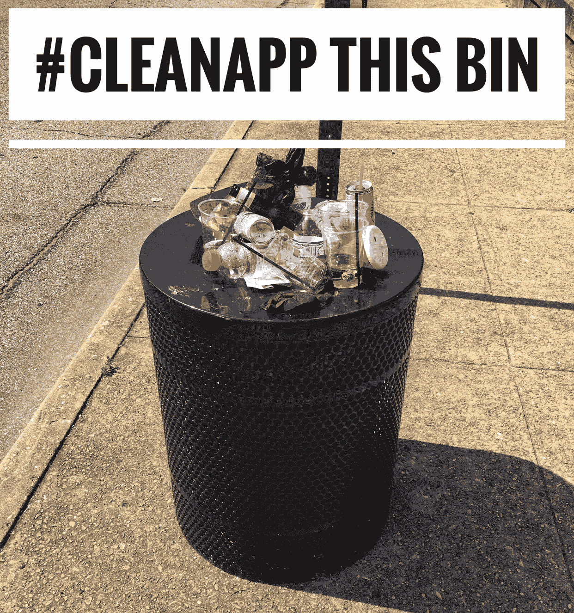
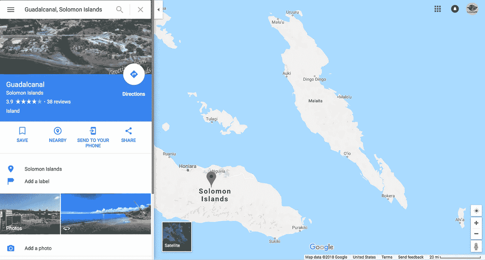

# 为什么#TrashHash 的价值超过了当前所有加密技术的总和

> 原文：<https://medium.com/coinmonks/https-medium-com-cleanapp-the-value-of-trashhash-69e331d86374?source=collection_archive---------3----------------------->

*(****2018 年 10 月 31 日更新*** *:这是来自 CoinMarketCap 的截屏，显示整个加密市场的美元估值约为 2000 亿美元，是沃尔玛市值的 70-75%。每隔几年，我们都会回到这个话题，所以请继续关注。)*

在我们宣布发布 [CleanApp 白皮书](/@cleanapp/cleanapp-whitepaper-bounty-5cbdace936d2)的故事中，我们做出了一个声明，我们怀疑这将引起加密社区的一些关注。以下是声明:

> 聚合的、优化的、流式资源位置数据不仅具有内在价值:*它比现有的任何其他加密货币、硬币或代币*更具有 ***内在价值****——包括 ETH 或 MIOTA 等平台代币。*

如果你一直在关注我们的工作，你会知道这些声明并不是煽动性的或攻击性的。我们是比特币、以太坊和其他所有我们用来支持我们论点的加密工具的忠实粉丝。我们试图用这种说法来探索核心假设和硬分析的常见盲点。这让每个人都过得更好。

这是我们对这一主张的支持。

“More CleanApp Reports lead to more CleanApp Response actions, producing higher recyclable yields.” -CleanApp:2020 (Photo by [Ant Rozetsky](https://unsplash.com/@rozetsky?utm_source=medium&utm_medium=referral))

# 什么是#垃圾哈希？

#TrashHash 是某种未来的"*toin*(*token*和/或 *coin* 和/或 *currency* 和/或等的占位符名称。)奖励给参与 CleanApp 流程不同方面的参与者。就是现在，@ litter coin([open litter map](https://medium.com/u/3a039f2a54d2?source=post_page-----69e331d86374--------------------------------))。com)是一种类型的#TrashHash 的工作原型，授予一种类型的 CleanApp 活动(报告垃圾位置)。

个人/公司可以通过以下活动获得#TrashHash(或#TrashCash 或#GoldKens，无论最终名称是什么):

(1) ***提交不同类型的事件报告*** (如废物、垃圾和危害的位置和程度)；

(2) ***对之前提交的报表进行验证&其他分析活动****；*

*(3)*通过清理(通过人工劳动，或任何形式的半自动或全自动事件响应，清理平台)来响应违规的对象和/或条件。**

# **#TrashHash 到底有多值钱？**

****

**It’s not enough to ask, “How much is this report worth?” The “worth” of this report depends on where this bin is located, when the photo was taken, and who wants to buy this data. The value of this CleanApp Report also goes up with every subsequent CleanApp Report that is chained on the genesis block, until such time that the bin is emptied. Then we start the transactional process again. Sound familiar? It should. That’s Blockchain 101\. -CleanApp**

**没有人能给一张垃圾桶或旧垃圾场的照片一个精确的价值，就像没有人能给一项专利或任何其他形式的财产一个精确的价值一样。商品只有通过交换才能获得价值。**

**但是我们可以相对地回答这个问题。例如，我们可以假设如下:**

> **一张旧垃圾场的最新地理标记照片比 1 BTC 更有内在价值，更有价值。**

**请注意，当我们说“内在价值”时，我们仍然在谈论某种市场交换。**

# **1 升币> 1 比特币？**

**这场对决乍一看可能很奇怪，但从理性经济学的角度来看，答案绝对是“是”。说明这一点的最好方法是想象你被困在一个荒岛上。**

****

**“Assume nobody is coming. It’s up to us.”**

**你在挨饿，赤身裸体，没有任何物质财产。你唯一拥有的是海难中幸存下来的大量现金。**

**在这个荒岛上，美元毫无用处，因为没有人可以兑换。没有商店。现在想象一个陌生人来到岸边，向你提出以下提议:**

> **作为你所有美元现金的交换，我会卖给你 1 个比特币(用印在一张纸上的必要散列表示)或 1 个垃圾币(用与印在一张纸上的垃圾币相关的事故报告的散列+ GPS 位置表示)。**

****

**假设没有其他技术或变量，答案就变得很清楚了。理性的你会拿走垃圾硬币，因为 GPS 坐标会给你一个潜在物质奖励的线索。**

**你不知道你是否能使用 GPS 坐标，你不知道 GPS 坐标是通向垃圾还是宝藏，但是你知道它们代表加密的地图坐标。你不知道你是否能够解密坐标，或者这些特定的坐标是否会带来有用的发现。然而，地图坐标本质上比代表比特币余额的加密哈希更有价值。**

**你在你的垃圾的 GPS 散列的末端找到隐藏的垃圾的几率可能非常低，但它们比比特币引导你找到你可能需要生存的资源的几率高 0%。**

# **1 升硬币> 1 ETH？**

**同一假设的一个更阴暗的版本有助于阐明这一点。你仍然在一个荒岛上，除了它是所罗门群岛乌拉瓦岛南部的一个小岛。**

****

**你仍然在挨饿，而你的周围都是警告你瓜达尔卡纳尔岛战役中的地雷和未爆弹药的标志，这场战役发生在 70 多年前你所在的地方。**

**你的一捆捆现金放在你的临时营地周围的手提箱里，同一个陌生人出现了:**

> **作为你所有现金的交换，我会卖给你 1 升或 1 升硬币，其中包含某个用户在世界某个地方制造的危险的 GPS 位置。**

**理智的你应该拿着垃圾硬币，因为你意识到在雷区踮着脚尖行走是多么令人抓狂。尽管垃圾硬币危险地图对你来说可能难以辨认，但它远比 ETH 散列更有价值，因为它包含有用的救生危险警告的可能性很小。**

**同样，您还会发现解密引擎(例如，工作的智能手机)和解密的坐标与您周围的危险相关的概率可能很小，但它们高于 ETH-hash 的 0%有用地理位置数据的概率。**

# **#从理论到实践**

**到目前为止，我们已经看到，在(1)完美信息(2)零摩擦(3)荒岛“市场”的想象领域中，#TrashHash 应该相对于类似菲亚特的加密更有价值**

**现在，让我们通过回到 CleanApp 流程核心的典型报告来进行一些真实世界的评估:**

****

**乍一看，这份 CleanApp 报告似乎没有什么内在价值。**

**然而，我们知道有某些变量开始借给这个意图+照片单位很多市场价值。事实上，一些变量可以赋予这样一张照片极高的价值，即使潜在的主题起初看起来平淡无奇或滞销。**

*   ****地点**:如果上面的 CleanApp 报告是从加利福尼亚州贝弗利山的 Rodeo Drive 发送的，那么它可能比来自[贝弗利(加拿大萨斯喀彻温省)](https://en.wikipedia.org/wiki/Beverley,_Saskatchewan)的用户同时发送的几乎相同的报告更“有价值”。**
*   ****用户评级**:由同行评审用户评级为 4.9*的报告者生成的 CleanApp 报告比由平均评级为 2.3*的报告者生成的类似 CleanApp 报告更“有价值”。**
*   ****紧急程度**:如果此 CleanApp 报告是按时间顺序排列的一系列报告中的一部分，表明负责清理此垃圾桶的一方失职，则此报告作为类似报告时间顺序的一部分，具有更高的价值。同样，如果此 CleanApp 报告是不相关用户在短时间内进行的一系列报告活动的一部分(比方说，在过去一小时内关于此垃圾箱的 1，483 份报告中的一份)，报告活动的突然增加可能表明一种紧急情况，这种情况可能在照片中不明显，但这种情况足够紧急，以至于仅在过去一小时内就有 1，483 人花时间报告了这种情况。**
*   ****构成** : CleanApp 报告通常是因为用户/市民注意到被投诉的对象/条件与周围环境(室内/室外)不一致，需要采取补救措施而生成的。通常，这是与材料成分数据一起完成的——这对 ML/AI 学习应用程序至关重要。像“Alexa，CleanApp 这些玻璃&塑料瓶随处可见”和“Google，CleanApp 这个牛奶洒在 7 号通道”这样的随意报道为解释底层图像报告提供了重要的元数据。**
*   ****时间**:一份报告可能没有多大价值，但在特定时间持续的报告上升可能会提供有价值的可操作数据，从而显著改善结果。**
*   ****丰富的材料**:clean app 报告指出了一个以前或废弃的垃圾场，可能会发现丰富的可回收材料，尤其是金属。相比之下，附带的 CleanApp 报告可能有助于定位危险化学品、放射性物质，甚至是弹药垃圾场。**
*   **标准化:机器现在非常擅长识别物体/图像，但仍然缺乏关于如何处理这些数据的基本情境意识/情境认知。某样东西是“垃圾”还是“不是垃圾”是一个极其复杂的社会本体论决定。人类每天都要做数百次这样的决定，通常没有停下来思考过。CleanApp 流数据允许机器学习和理解人类关于什么是“垃圾”或“非垃圾”、“危险”或“非危险”的规范性机器辅助风险缓解是 CleanApp 数据流当前和未来无可争议且非常有价值的用途。在这个阶段，教会机器人类与其生活环境的规范关系的最快方法是在全球范围内众包这些数据，这使我们能够解释浪费资源使用的广泛的文化方法。**

****

**Justin Beaver or Justin Bieber? “Not many people know this, but when I’m on tour, I like to map litter in my spare time because I care about a clean planet.” — CleanApp**

*   ****名人**:像上面由 Justin Beaver 在贝弗利山生成的 CleanApp 报告的值可能是 X；由贾斯汀比伯在[贝弗利(加拿大萨斯喀彻温)](https://en.wikipedia.org/wiki/Beverley,_Saskatchewan)同时生成的类似报告可能具有比 x 高几个数量级的值**
*   **[…]**

**给定 CleanApp 报告增加或减少价值的可能因素是无限的。因为这些变量同时起作用，一些变量可能会抵消另一些变量。一些变量可能会放大其他变量。一些变量可能会成为更大的变量活动的催化剂(例如，一位名人将她的 CleanApp 聚光灯指向特定的对象或危险，随后是粉丝报告行为)。**

> **这些变量在 silo 中很难研究，但通过回归分析非常容易理解。**

# **用户定义的#TrashHash 值**

**最初，偶尔使用 CleanApp 的用户可能并不关心他们的数据的各种分析或研究用途。但是，一旦 CleanAppers 开始看到他们对全球 CleanApp 分析的贡献的全部价值，我们预计用户的期望将围绕用户定义的数据共享机制凝聚起来。**

****

**“My data-privacy; my data-security settings; my data-sharing; my way.” -CleanApp**

**让用户做出困难的决定，将他们的数据发布到公共领域，在有归属或无归属的基础上，等等。伴随着成长的烦恼。但是，用户定义的隐私选择是解决有关上述不同变量的人工“市场定价”机制中无数盲点的唯一方法。**

**支持用户定义的#TrashHash 变量(仅发布/营销**个人清理者认为可以发布或营销的数据)会带来更令人满意的用户体验。这反过来提高了基础资源位置数据的价值。****

# **#垃圾散列是一种取之不尽的资源**

**大多数加密货币试图通过任意限制货币供应来人为控制通胀。“X 币在流通中*只有*35 亿 X 币！”“Y 代币永远不会&在数学上永远不会超过 120，000，000 个 Y 代币的发行商。”**

> **许多加密货币发行者限制发行量的原因是，从本质上讲，它们的货币充当了类似于法定货币的工具。它们没有内在价值。因此，人为的限制造成了人为的稀缺。**

**#TrashHash 颠覆了这个前提。它似乎是加密货币范式(按需印刷硬币的能力，从而稀释硬币的市场价值)中的一个缺陷，并将其转化为一种功能。**

****

**#TrashHash 与实际稀缺的物质资源挂钩。但它的核心价值并不与任何可立即识别的商品挂钩(不像许多区块链产权追踪计划)；相反，它的价值源于关系数据——一群人在特定时间、特定地点对特定对象或条件的处理方式。**

> **底层资源稀缺；但是人类与这些资源的关系的置换范围是无限的。#TrashHash 的核心价值主张是在给定时间内获取一组与特定对象/条件相关的估值。**

**#TrashHash 促进并记录市场交易，为商品和服务市场注入了前所未有的流动性。**

# **#垃圾散列反映了人类的行为**

**让#TrashCash 如此有价值的另一个关键方面是，它反映了人类的行为(被任何类型的浪费困扰，并向任何可能有能力对浪费采取任何行动的人报告)——而不是试图改变或修改人类的行为。**

**让#TrashCash 变得如此有价值的另一个关键方面是，在可预见的未来，人类行为似乎不太可能在物质方面发生改变。这表明对 CleanApp 报告实践的持续需求，以及对 CleanApp 响应流程的持续需求。**

**人们讨厌垃圾；人们爱钱。像@littercoin 这样的网站已经在交易上整合了这些利益。#TrashHash 将这一概念扩展到全球验证市场和全球响应市场。**

# **加密需要垃圾哈希，而不是相反**

**让#TrashCash 如此有价值的另一个关键方面是，CleanApp 是一个矛盾的平台。在报告者-验证者-响应者事务的最简单实施例中，整个系统可以自主运行，就像可伸缩的智能契约结构一样。**

> **平台矛盾性提供了对一种新的安全和数据共享范例的内部工作方式的独特一瞥。**

**换句话说，像@littercoin 这样的全球商品支持令牌不需要以太坊才能成功；相反，以太坊需要一个商品支持的令牌才能成功。**

**Littercoin 总是可以跳过平台，拥抱 IOTA 独特的计算模型，或另一个尚未发布的区块链平台。但是以太坊和其他 DLT 平台需要一个像@littercoin 这样的商品支持令牌来表明 DLT 不仅可以提供“T0”一些对社会有实际意义的东西，而且可以提供硬核[物质超效用](/@cleanapp/what-is-blockchain-hyperutility-ade850f3034d)。**