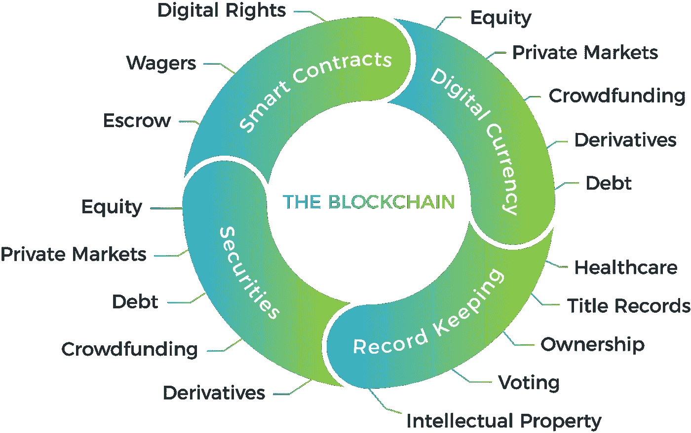

# 区块链将如何在商业世界创造新的机遇

> 原文：<https://medium.com/coinmonks/https-medium-com-dana-m-how-does-blockchain-create-wild-new-opportunities-in-the-business-world-d6da6e2311f3?source=collection_archive---------4----------------------->

今天有这么多关于区块链的谈论，可能连孩子都已经听说过了。这项技术是作为比特币加密货币的核心发明的，但现在我们正在观察企业如何将复杂的业务甚至整个分支机构转移到区块链。

除了没有中间人的加密金融交易外，分散式分类账还有许多其他应用。从安全的数据存储到产品真实性确认，不同行业的公司都可以从中受益。

# 什么是区块链？

区块链是分布式数字数据记录，它保持着持续增长的交易数量，每个交易都经过哈希处理并包含在单独的区块中。

包含事务的块形成了链，不能被改变或篡改。数据/交易一旦上传至分类账，将永久保存，不可更改或删除。

区块链是一个分散的网络，这意味着没有一个集中的机构来管理它。由于交易是在两个自主方之间直接进行的，它们不需要任何第三方来完成。

区块链代表不可转换和不可改变的数据记录，它提供数据安全，包括用户信息或数据通信，同时还使网络参与者能够检查和监控事务的执行。

在[有权限的区块链](https://www.investopedia.com/terms/p/permissioned-blockchains.asp)中，当然，访问权限是严格的，并且受到严格的管制，因为是打算供企业使用的。相反，其他技术类型旨在实现更高的透明度。

如你所见，有各种各样的特性构成了区块链的基础。当然，它还有其他的，其中最重要的是密码学、[、共识机制](https://www.investopedia.com/terms/c/consensus-mechanism-cryptocurrency.asp)和挖掘。没有他们，网络功能将是不可能的，或者是完全不同的。

# 区块链可以用在哪些行业？

虽然每个人都知道区块链在加密货币交易和消除中介中的应用，但其他一些应用实际上仍然鲜为人知。首先，看看下面的图片，显示了一些可以将该技术应用于各种目的的商业行业。

The image is taken from [this source](https://smartym.pro/blog/how-will-blockchain-innovate-a-business-world-8-industries-for-blockchain-implementation/)

令人印象深刻，不是吗？

## **1。医疗保健**

考虑实际的例子，医疗保健组织可以通过将区块链技术用作不可变的数据存储和数据交换系统来利用它的力量。

医疗保健组织可以构建一个安全的电子记录系统，用于存储和交流重要信息，并为用户提供最高级别的信任和可靠性。结果是改进了文档管理并最大限度地减少了文书工作。

据您所知，医疗保健和制药行业面临的最大挑战之一是药物盗窃和假冒。随着每一小块数据和每一个小活动(例如，用户登录)被记录在账本上，他们将获得解决它的能力。

## **2。数字版权**

此外，区块链解决方案可以帮助个人和公司保护他们的商标和数字权利。内容创作者、作者、音乐人和其他数字内容贡献者肯定会从这项技术应用中受益。

## **3。保险**

保险是另一个可以利用区块链解决方案的业务领域。更重要的是，区块链的使用是关键的保险技术趋势之一。家庭、财产、意外伤害保险和其他分支机构——区块链向所有人提供额外津贴。

例如，旅游保险是保险的一个广泛分支，面临着各种挑战。有了区块链，旅行社可以保护他们客户的航班不被延误或取消。

使用独立可信提供商的公开可用数据，当客户提出请求时，支付会自动进行。

## 4.安全性

目前，不同类型和行业的公司、政府甚至整个国家都在强烈担忧安全问题。

在安全领域，[区块链可以确保](https://smartym.pro/blog/ensuring-security-with-blockchain-technology-top-7-blockchain-applications/)最大限度地减少人为错误、安全交易和数据通信、防止供应链中的非法食品行为，等等。

## 5.众筹

你可能听说过以太坊区块链平台和智能合约，它们代表了带有条款的程序，这些条款被刻在代码行中。

作为自动执行的合同，它们有很大的前景来改变广泛的业务，并为各种行业带来创新的商业模式。众筹就是一个可见的例子。

像 Weifund 这样的项目旨在创造新的众筹机会。这个分散的平台为发起众筹活动提供了智能合同模板，但用户也可以在需要时实施自己的模板。

他们应用智能合同来消除中介，允许管理者与用户达成个人协议。智能合约的集成使系统参与者能够快速、安全地转移资金、数据和股票。

## 6.零售、电子、制药、供应链

对于奢侈品零售、电子产品、制药和供应链管理等行业而言，产品真实性确认和防伪至关重要。区块链也可以在这方面提供成功的帮助。

通过在商品上贴上特殊标签并记录在分布式分类账中，零售商可以确保产品的真实性，甚至让消费者可以随时查看。

反过来，客户被注册为他们的正式所有者，所有的变化都记录在数据库中。这种有用的商业模式的实施将允许零售公司建立客户信任，增加客户忠诚度，并防止欺诈和假冒。

# 最后的话

因此，区块链技术具有多种工业应用。它在不久前出现，将为不同类型的公司带来创新的商业模式。

除了信任、安全和透明，区块链还为许多优势打开了大门，帮助企业改善业务流程，解决各种重要任务和挑战。

> [在您的收件箱中直接获得最佳软件交易](https://coincodecap.com/?utm_source=coinmonks)

