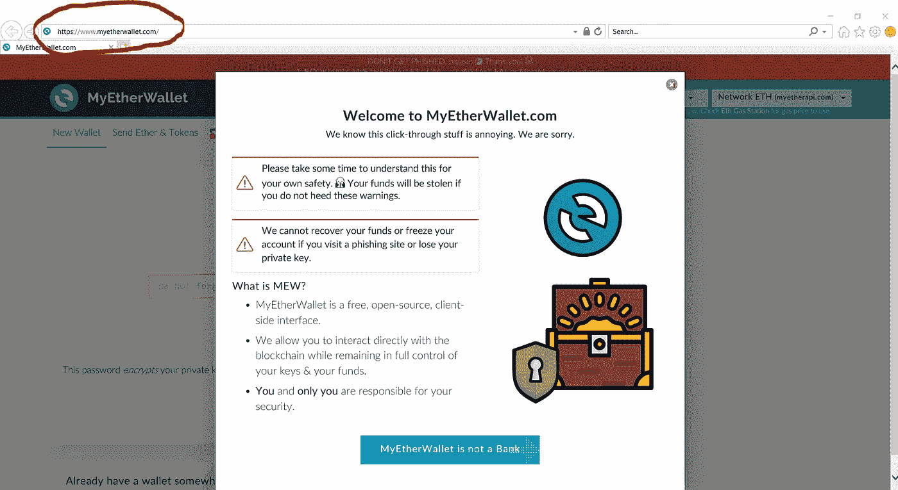
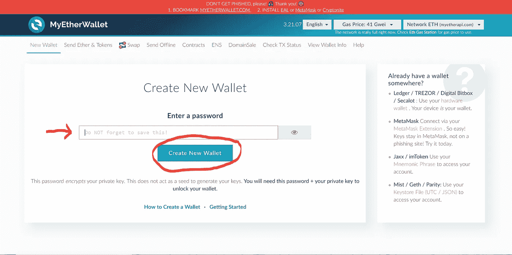
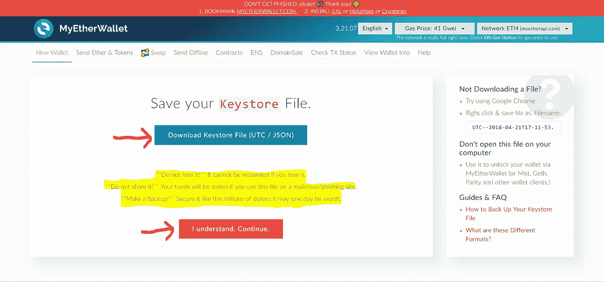
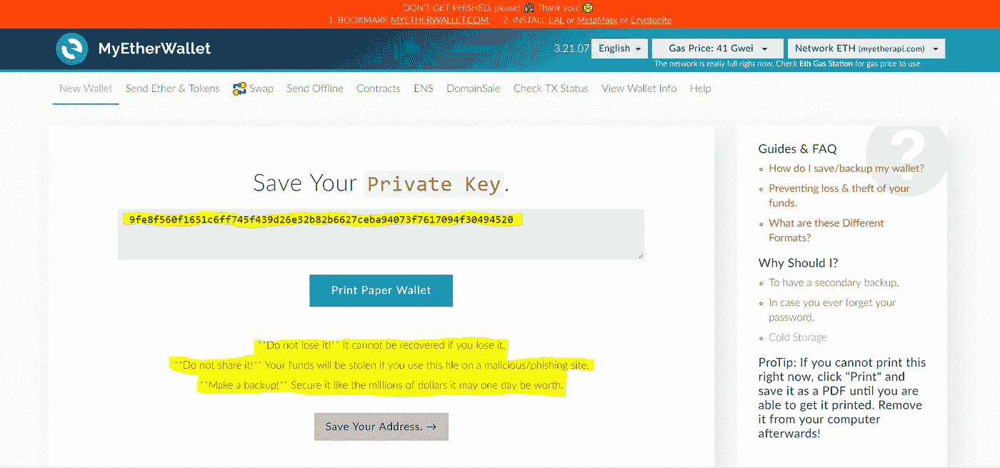
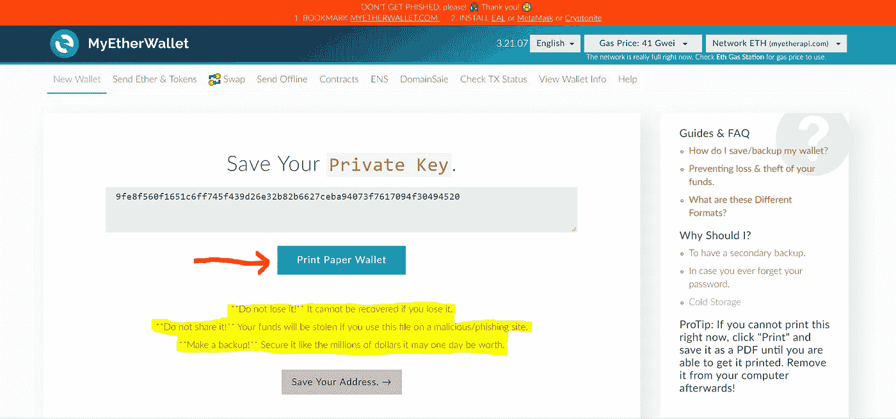
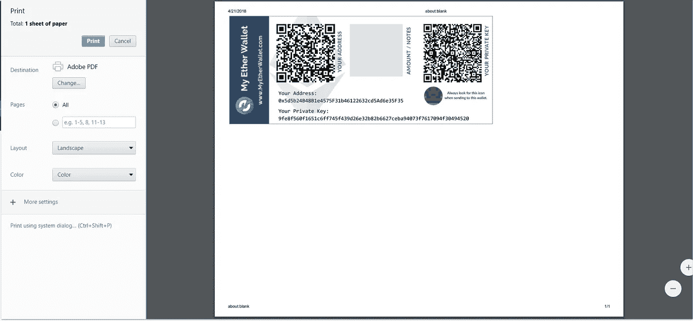

# MyEtherWallet 角。1-创建一个

> 原文：<https://medium.com/coinmonks/https-medium-com-jacqueline-kp-creating-a-myetherwallet-creating-one-pt-1-fcacf4a15b42?source=collection_archive---------0----------------------->

这是一个简单的分步指南，帮助你理解什么是我的钱包(MEW)以及如何创建一个。

当我向我的朋友、家人、同事和其他人介绍如何设置他们的第一个 MyEtherWallet (MEW)时，我注意到同样的问题出现了，所以我想用截图创建一个简单的分步指南来帮助你。

什么是 MyEtherWallet (MEW)？

这是一个免费、开源的客户端接口，用于生成以太坊(ETH)钱包和存储您的以太坊(ETH)和 ERC-20 令牌。

** *注意:对于那些不了解 ERC 的人来说，20 个代币没什么可怕的——我会单独写一篇关于它的文章*

**我的 ETH wallet(ETH)钱包和银行有什么区别？**

当你在银行开户时，你就自动加入了他们的系统。他们跟踪你所有的账户、个人信息和金钱。当银行向您提供服务时，会收取费用(例如，电汇费、银行汇票费、电子转账费等)。他们还决定了你可以汇多少钱，什么时候汇，汇到哪里——这样费用就可以累积。MyEtherWallet (MEW) **不是银行。**

拥有一个我的以太钱包(MEW)可以让你在任何时候移动你的以太坊(ETH)和 ERC-20 代币，并允许你决定你想要转移多少。这就是权力下放和区块链的要点。

**创建 MyEtherWallet (MEW)**

**第一步:拿一个 u 盘，把它插到你的电脑上**

**第二步:转到**[**https://www.myetherwallet.com/**](https://www.myetherwallet.com/)

**Note: Please take the time to read their small tutorial to protect yourself

**第三步:创建一个你会记住的密码**

a.点击“创建新钱包”

**第四步:下载你的** [**Keystore 文件**](/@julien.m./what-is-an-ethereum-keystore-file-86c8c5917b97)

**密钥库文件用于恢复或还原您的钱包。您还可以使用它来访问您的 MyEtherWallet (MEW ),我将在 [**MyEtherWallet Pt 中向您介绍。2—如何使用**](https://hackernoon.com/myetherwallet-pt-2-how-to-use-c65136802874)**

****

**a.将文件传输到您的 u 盘。该文件将类似于下图**

****

**b.点击“我明白。继续。”**

****注:我* ***高度*** *建议您备份您的密钥库文件:***

*   ***写下来并保留副本* ***只有你可以访问****——我见过几个人失去了他们所有的资金***
*   ***不要与任何人分享***

****第五步:保存你的“私钥”****

**私钥就像你用来访问银行账户的 PIN 码，确保只有你**才能访问它是很重要的。****

****

****第六步:点击“打印纸质钱包”****

****

**您将被带到如下图所示的附件。**

****

**** *注:我* ***高度*** *劝你:***

*   ***写下来并打印副本，只有你* *可以访问——我见过几个人因为没有备份他们的私钥而失去了所有的资金***
*   ***将文件保存在您的 USB 上***
*   ***不要与任何人分享***

**恭喜你。你已经创建了你的第一个 MyEtherWallet (MEW)，但是现在呢？阅读 [**MyEtherWallet Pt。2 —如何使用**](https://hackernoon.com/myetherwallet-pt-2-how-to-use-c65136802874) **，**这将向您展示如何访问和使用您的 MyEtherWallet (MEW)。**

*****重要******

**保护您自己并备份您的信息。你要对自己的安全负责。您会看到网络钓鱼者发布链接到一个看起来像是我的钱包的网站，试图窃取您的信息和金钱。**

*   **保管好您的私钥和密码。**
*   **如果您丢失了您的私钥或密码— **您将无法恢复它****
*   **如果您在钓鱼网站上输入您的私人密钥— **您的资金将被取走****
*   **对你的私人密钥和密码做一个备份。不要把它储存在你的电脑上。将其打印在一张纸上或保存到 USB 驱动器上。**
*   **将您的备份或 USB 驱动器存储在您记得的不同物理位置。**
*   **不要将你的私人密钥存储在任何平台上，例如:电子邮件、谷歌硬盘或其他云存储、手机或短信。如果您的帐户受到威胁，您的资金将会被盗。**

**如果您有任何其他问题，或者您希望我为您介绍具体步骤，请随时联系我。感谢阅读:)**

**邮箱:jacqueline@heyjkp.com
[LinkedIn](http://www.linkedin.com/in/heyjkp)
[Twitter](https://twitter.com/jacqueline_kp)
[insta gram](https://www.instagram.com/_heyjkp_)
[网站](http://heyjkp.com)**

**有用的来源:**

*   **什么是密钥库文件— [链接](/@julien.m./what-is-an-ethereum-keystore-file-86c8c5917b97)**
*   **我的钱包— [链接](https://www.myetherwallet.com/)**