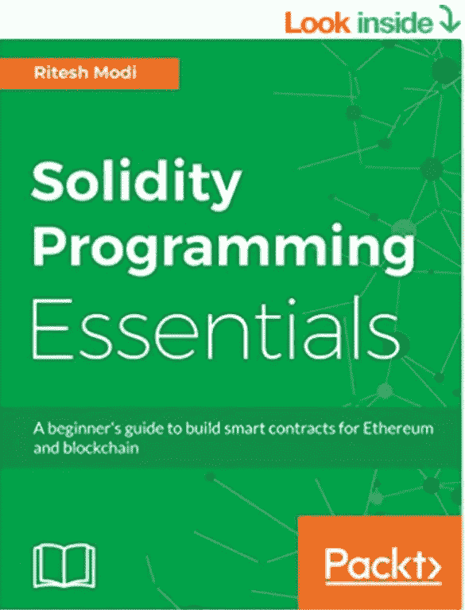

# 想从头学起扎实？？

> 原文：<https://medium.com/coinmonks/https-medium-com-ritesh-modi-solidity-5d8d2a30e778?source=collection_archive---------16----------------------->

嗯，你来对地方了！！

我从事区块链尤其是以太坊、智能合约和 Solidity 已经有一段时间了。作为区块链社区的活跃成员，我也就这些话题进行了多次聚会。作为这项练习的一部分，同时也是在指导基于区块链的初创企业时，我遇到了许多想从一开始就把可靠性作为一门语言来学习的人。据他们说，互联网上有关于 Solidity 的文本，但他们没有关于该语言的完整信息。

他们觉得使用 Solidity 写智能合同既不舒服也不自信。

我还看到了许多关于可靠性的智能合同的实现，这些实现并没有使用正确的实践。他们还缺乏能够优化天然气使用和签订可靠的智能合同的架构。我们都知道 bug 会使智能合同容易受到攻击，而且在合同之间迁移数据也是一场噩梦。

在这一努力中，我为正在或想要使用 Solidity 构建智能契约的开发人员和架构师编写了第一本专门关于 Solidity 的书。

**这本书会教你，**

*   固体和以太坊的基本概念
*   深入探究固体语言及其独特性
*   创建新帐户并将交易提交给区块链
*   详细了解完整的语言以编写智能合同
*   了解开发和部署智能合同的主要工具
*   使用异常处理和错误检查编写防御性代码
*   了解 Truffle 基础知识和调试过程

**这本书被分成以下几章。**

1.  区块链、以太坊和智能合约简介
2.  安装以太坊和 Solidity
3.  介绍坚固性
4.  全局变量和函数
5.  表达式和控制结构
6.  撰写智能合同
7.  函数、修饰符和回退
8.  异常、事件和日志记录
9.  块菌基础和单元测试
10.  调试合同

该书全球发售，可在亚马逊@ [购买 https://www . Amazon . com/Solidity-Programming-Essentials-初学者-区块链/dp/1788831381/](https://www.amazon.com/Solidity-Programming-Essentials-beginners-blockchain/dp/1788831381/)

我期待着您的来信，以及您学习可靠性和实施智能合同的旅程！

我将在下一篇文章中发布这本书的第一章。

敬请期待，快乐学习！