# 区块链、以太坊和智能合约简介—第 1 章

> 原文：<https://medium.com/coinmonks/https-medium-com-ritesh-modi-solidity-chapter1-63dfaff08a11?source=collection_archive---------0----------------------->

这十年见证了技术和计算生态系统的非凡发展。技术创新及其影响已经非常高了。从物联网到人工智能再到区块链。它们中的每一个都在多个行业中具有颠覆性的力量，区块链被称为当今最具颠覆性的技术之一。因此，区块链有可能改变当今几乎每个行业及其工作方式。由于区块链的优势和普及性，它的适用性已经开始出现，并且似乎将持续很长时间。区块链不是一项新技术，但它在过去几年里获得了巨大的发展势头。就分散和分布式应用程序而言，这是一个巨大的飞跃。它是关于对当前架构前景的思考和向不可变分布式数据库发展的策略。优势和许多，帮助组织接触到他们的利益相关者，而不需要任何中央权威和中介。

在第一章中，你将很快了解区块链和以太坊的基本概念。我还将讨论使区块链和以太坊工作的重要组件及其交互。它还将简要地涉及智能合同的主题以及如何使用 solidity 来创作它们。

值得注意的是，本章简要解释了重要的区块链和以太坊概念，用于编写可靠的可靠性合同。它没有详细解释概念，完整的书可以为此目的而写。由于以太坊是区块链的一种实现，所以在本书中它们可以互换使用。

本章将重点介绍

理解存储的区块链架构

理解块

了解交易

了解采矿

了解客户

了解密码学

气体

醚

发送交易

智能合同

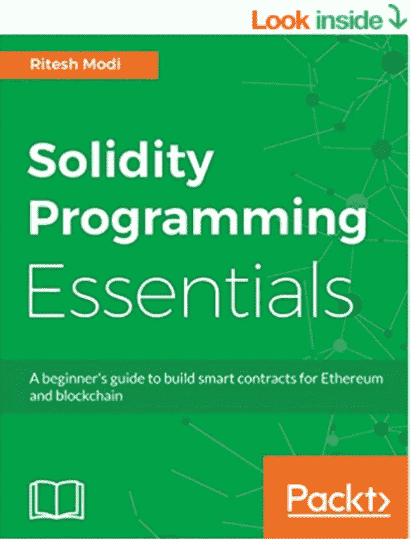

# **什么是区块链？**

区块链本质上是一个去中心化的分布式数据库或者账本。在定义区块链时，有一些非常重要的关键词，如去中心化、分布式、数据库和分类账。

简而言之，分散化意味着即使网络上的一台服务器或一组服务器崩溃或不可用，应用程序或服务仍然可用。服务或应用程序部署在网络上，没有服务器对数据和执行有绝对的控制权，而是每个服务器都有数据和执行逻辑的当前副本。

分布式意味着网络上的任何服务器或节点都直接或间接地连接到网络上的所有其他节点。服务器与其他服务器之间有多对多的连接，而不是一对一或一对多的连接。

数据库是指存储可在任何时间点访问的持久数据的位置。数据库允许存储和检索数据，并提供管理功能来有效地管理数据，如导出、导入、备份和恢复。

分类账是一个会计术语，可以认为是专门的数据存储和检索。想想银行提供的分类账。当与银行进行交易时，比如说汤姆在他的账户上存了 100 美元，银行就把这一信息作为贷项记入分类账。在未来的某个时间点，汤姆取出 25 美元。银行不会将现有条目和存储数据从 100 修改为 75。相反，它在同一分类账中又增加了一个分录，记为借方 25 美元。这意味着分类账是一个专门的数据库，不允许修改现有的数据。它允许创建和追加新交易，以修改分类帐中的当前余额。区块链是一个数据库，具有账本一样的特征。它允许较新的事务以仅附加模式存储，没有任何修改过去事务的范围。重要的是要理解，可以使用新事务修改现有数据，但不能修改过去的事务。100 美元余额可以通过执行新的借方或贷方交易随时修改，但是先前的交易不能修改。

区块链，顾名思义，就是一个区块链。区块链意味着将多个区块链接在一起，每个区块以一种不可能修改这些交易的方式存储交易。我们将在后面的部分讨论交易的存储以及如何在区块链中实现不变性。

不能改变和修改过去的交易使得区块链解决方案高度可信、透明和廉洁。

理解积木和它的链条只是区块链的一个方面是很重要的。还有其他重要概念，如采矿、矿工、共识和协议，它们与区块链一起工作，使区块链工作完美无缺。

以太坊是区块链的一种实现，允许在智能合约的帮助下扩展其功能。智能合同将在本书中详细讨论。

# 为什么选择区块链

以太坊的主要目标是接受来自账户的交易，更新它们的状态，并保持这个状态为当前状态，直到另一个交易再次更新它。在以太坊中，接受、执行和写入交易的整个过程可以分为两个阶段。以太坊接受交易的时间与交易执行并写入分类账的时间之间是分离的。这种解耦对于去中心化和分布式架构的预期工作非常重要。

区块链主要以三种不同的方式提供帮助

1.信任——区块链有助于创建分散的、由多人集体所有的应用程序。该组中的任何机构都无权更改或删除以前的交易。即使有人试图这样做，也不会被其他利益相关者接受。

2.自治——基于区块链的应用没有单一所有者。没有人控制区块链，但每个人都参与它的活动。这有助于创建不会被操纵或导致腐败的解决方案。

3.完整性—状态和事务受到加密保护，不能轻易修改。

4.中介——基于区块链的应用可以帮助从现有流程中移除中介。一般来说，有一个中央机构，如车辆登记、执照发放等，负责登记车辆和发放驾驶执照。如果没有基于区块链的系统，就没有中央机构，如果在区块链开采过程后发放许可证或注册车辆，这将在 epoch time-period 内保持事实，无需任何中央机构为其担保。

区块链在很大程度上依赖于加密技术，下一节将对其进行简要介绍。

# 密码系统

计算中主要有两种类型的加密技术:

## 对称加密和解密

对称加密指的是使用一个密钥进行加密和解密的过程。这意味着，如果多人希望使用这种加密形式交换消息，他们应该可以使用同一个密钥

## 不对称加密和解密

非对称加密是指使用两个密钥进行加密和解密的过程。任何密钥都可以用于加密和解密。用公钥加密的消息可以用私钥解密，用私钥加密的消息可以用公钥解密。让我们借助一个例子来理解这一点。汤姆用爱丽丝的公钥加密信息并发送给爱丽丝。Alice 可以使用她的私钥解密消息并从中提取内容。用 Alice 的公钥加密的消息只能由 Alice 解密，因为她只持有自己的私钥，没有其他人。这是非对称密钥的一般用例。在讨论数字签名时，我们将看到它的另一种用途。

# 散列法

哈希是将字符串数据转换为另一个固定长度字符串数据的过程，不可能从结果字符串数据中重新生成或识别原始数据。散列法确保即使输入数据的微小变化也会完全改变输出数据，并且没有人能够确定原始数据的变化。哈希的另一个重要特性是，不管输入字符串数据的大小，其输出的长度总是固定的。例如，对任意长度的输入使用 SHA256 哈希算法和函数将始终生成 256 位输出数据。当大量数据可以存储为 256 位输出数据时，这尤其有用。以太坊相当广泛地使用散列法。它散列所有的事务数据，散列多个事务散列以生成单个根事务散列，事实上以太坊中的块也表示为散列。

哈希的另一个重要特性是，从数学上来说，确定两个不同的输入字符串将输出相同的哈希是不可行的。类似地，不可能通过计算和数学方法从散列本身找到输入。

以太坊使用 SHA256 来满足它所有的散列需求。

下图显示了一个哈希示例。输入的 Ritesh Modi 生成一个散列“b 9 FDA 68 f 334232 a 4c 832 ff 355 AEF 9949 BF 3229 CD 2 f 9 be 8 dccf 95 c 8 ee 1 D2 C2 dbb”

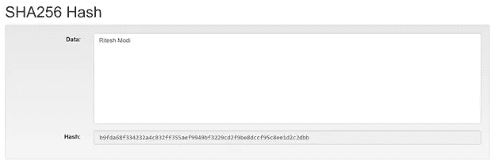

即使对输入进行很小的修改也会产生完全不同的散列。

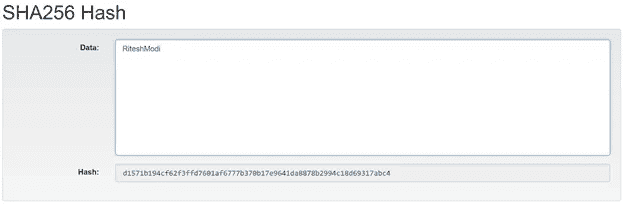

# 数字签名

前面，我们讨论了使用非对称密钥的加密技术。在数字签名的创建和验证中使用非对称密钥的一个重要用例。数字签名非常类似于个人在纸上的签名。与纸质签名类似，数字签名有助于识别个人身份。它还有助于确保消息在传输过程中不被篡改。让我们借助一个例子来理解数字签名。

爱丽丝想给汤姆发一条信息。Tom 如何识别并确保消息仅来自 Alice，并且消息在传输过程中没有被更改或篡改？Alice 将她想要发送给 Tom 的消息生成一个哈希，然后使用她的私钥(是的，私钥)对哈希进行加密，并将结果加密数据附加到原始消息中。

一旦结果消息到达 Tom，他就将消息分离成原始消息和密码数据。他使用 Alice 的公钥解密密码数据，并从中提取散列值。他进一步散列原始消息并比较两个散列。如果哈希相同，这意味着消息没有被篡改。它还确立了这样一个事实，即消息是由 Alice 发起的，因为只有她可以用她的私钥加密散列。

数字签名被资产或加密货币(如以太网)的所有者用来签署交易数据。

# 醚

以太是以太坊的货币。以太坊上的每一个修改状态的活动都要花费以太作为费用，成功生成并写入区块链的矿工也会得到以太的奖励。以太可以很容易地通过加密交换转换成美元或其他传统货币。

以太坊有一个公制的名称系统，作为以太的单位。乙醚的最小单位称为“微”。下面是一个名单命名的面额和他们的价值在魏。该信息可在[https://github . com/ether eum/web 3 . js/blob/0 . 15 . 0/lib/utils/utils . js # L40](https://github.com/ethereum/web3.js/blob/0.15.0/lib/utils/utils.js#L40)获得

《魏》:“一”

kwei': '1000 '，

阿达':' 1000 '，

女性:1000，

mwei': '1000000 '，

巴贝奇':' 1000000 '，

“微微醚”:“1000000”，

gwei': '1000000000 '，

香农:“1000000000”，

纳米醚':' 1000000000 '，

纳米':' 1000000000 '，

szabo': '100000000000 '，

“微醚”:“100000000000”，

微':' 100000000000 '，

芬尼':' 100000000000000 '，

毫乙醚':' 100000000000000 '，

'毫':' 100000000000000 '，

乙醚':' 100000000000000000 '，

kether': '100000000000000000000 '，

' grand': '100000000000000000000 '，

爱因斯坦:“1000000000000000000000”，

mether ':' 1000000000000000000000000 '，

'合计':' 1000000000000000000000000000 '，

系绳':' 1000000000000000000000000000000 '

# 气体

在上一节中，提到以太是作为任何改变以太坊状态的执行的费用支付的。乙醚在公共交易所交易，其价格每天都在波动。如果使用以太网来支付费用，那么使用相同服务的费用可能在某些天很高，而在其他天很低。人们会等待乙醚价格下跌来执行他们的交易。这对于以太坊这样的平台来说并不理想。天然气有助于缓解这个问题。气体是以太坊的内部货币。执行和资源利用成本在以太坊中以气体单位预先确定。这也被称为气体成本。还有天然气价格，当乙醚价格上涨时，天然气价格可以调整为较低的价格，当乙醚价格下降时，天然气价格可以调整为较高的价格。例如，调用合同中修改字符串的函数将花费预先确定的汽油，并且用户应该根据汽油来支付以确保该交易的顺利执行。

# 区块链和以太坊架构

区块链是由多个组件组成的架构，区块链的独特之处在于这些组件的功能和相互交互方式。一些重要的以太坊组件是以太坊虚拟机、矿工、区块、交易、共识算法、账户、智能合约、挖掘节点、以太和气体。我们将在本章中讨论每个组件。

区块链网络由属于矿工的多个节点和一些不采矿但有助于执行智能合同和交易的节点组成。这些被称为以太坊虚拟机。每个节点都与网络上的其他节点相连。这些节点使用对等协议相互通信。默认情况下，它们使用 30303 端口号相互通话。

每个矿工维护一个分类帐实例。分类帐包含链中的所有块。对于多个挖掘器，很可能每个挖掘器的分类帐实例都有不同的块。挖掘器持续同步它们的块，以确保每个挖掘器的分类帐实例与其他分类帐实例相同。

有关分类账、冻结和交易的详细信息将在本章的后续章节中详细讨论。

EVM 也有智能合约。智能合约通过将自定义业务功能写入以太坊来帮助扩展以太坊。这些智能合同可以作为事务的一部分来执行，它遵循前面讨论的挖掘过程。

一个在网络上有帐户的人可以发送一条消息，将以太网从他的帐户转移到另一个帐户，或者他可以发送一条消息来调用合同中的一个功能。以太坊不区分他们，只要考虑交易。交易必须用账户持有人的私钥进行数字签名。这是为了确保在验证交易和更改多个帐户的余额时可以确定发送者的身份。

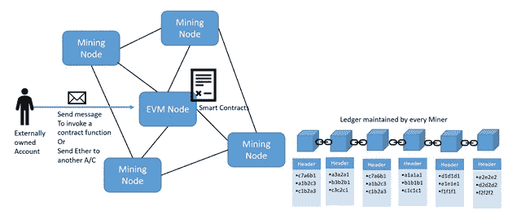

# 块与块之间有什么关系？

在区块链和以太坊中，每个区块都与另一个区块相关。两个块之间存在父子关系。一个父代只能有一个子代，一个子代可以有一个父代。这有助于在区块链中形成链条。模块将在本章的后面部分进行解释。在下一张图中，显示了三个块—块 51、块 52 和块 53。块 51 是块 52 的父块，块 52 是块 53 的父块。这种关系是通过将父块的散列存储在子块头中来建立的。块 52 在其头部存储块 51 的散列，块 53 在其头部存储块 52 的散列。因此，问题来了——谁是第一个块的父。以太坊有一个创世街区的概念，也被称为第一街区。当链第一次被启动时，该块被自动创建。你可以说一个链是从称为 Genesis 块的第一块开始的，这个块的形成是通过 Genesis.json 文件驱动的。下一章将展示如何在初始化区块链时使用 Genesis.json 文件创建第一个区块。

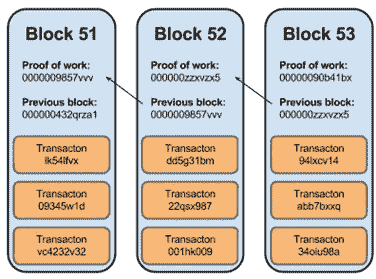

# 事务和块是如何相互关联的？

现在我们知道了块是相互关联的，您可能会有兴趣知道事务是如何与块关联的。以太坊在块内存储交易。每个块都有一个气体上限，每个事务在执行时都需要消耗一定量的气体。尚未写入分类帐的所有交易的累计气体不能超过区块气体限制。这确保了所有事务不会存储在单个块中。一旦达到气体极限，其他交易将从区块中移除，然后开始开采。

事务被散列并存储在块中。取两个事务的散列并进一步散列以生成另一个散列。这个过程最终从存储在块中的所有事务中提供一个散列。这个哈希称为事务 Merkle 根哈希，存储在块的头中。任何事务中的变化将导致其散列的变化，并最终导致根事务散列的变化。它将具有累积效应，因为块的散列将改变，并且子块必须改变他的散列，因为它存储其父散列。这有助于使事务不可变。这也显示在下一张图中。

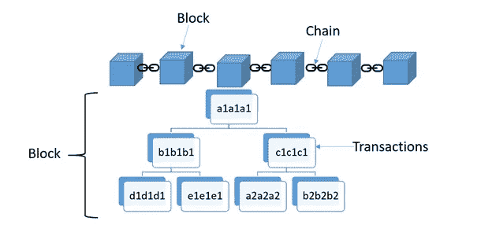

# 节点

以太坊有两种类型的节点。

以太坊虚拟机和

挖掘节点

需要注意的是，这种区分是为了澄清以太坊的概念。在大多数情况下，没有专用的 EVM 机器，而是所有节点充当矿工以及 EVM 节点。

# 以太坊虚拟机(EVM)

可以把 EVM 看作以太网的运行时。EVM 主要负责提供一个运行时，可以执行用智能合约编写的代码。It 可以访问客户(合同客户和外部客户)自己的存储数据。它无权访问分类账，但对当前交易的信息有限。

EVM 是以太坊中的执行组件。EVM 的目的是逐行执行智能合约中的代码。然而，当提交一个事务时，该事务并不立即执行，而是被汇集到一个事务池中。这些交易尚未执行，也尚未写入以太坊分类账。EVM 节点类似于挖掘节点，但是它们不进行挖掘。

# 挖掘节点

一个挖掘器负责将事务写入以太坊链。矿工的工作与会计的工作非常相似。与会计负责编写和维护分类账类似，矿工单独负责将交易写入以太坊分类账。一个矿工对将交易记录到分类账中感兴趣，是因为有相关的回报。矿工获得两种类型的奖励——向链中写入区块的奖励和区块中所有交易的累计天然气费。在一个区块链网络中通常有许多可用的挖掘器，每个都在尝试和竞争写事务。然而，只有一个矿工可以将该块写入分类帐，其余的矿工将不能写入当前块，并且使用质询来确定将写入该块的矿工。每个节点都面临挑战，每个矿工都试图利用自己的计算能力来解决这个难题。解出谜题的矿工首先将包含交易的块写入分类帐，并获得 5 以太作为奖励。每个挖掘节点维护其自己的以太坊分类帐实例，并且分类帐最终在所有挖掘者中是相同的。矿工的工作是确保他们的分类帐用最新的块更新。挖掘器或挖掘节点执行三个重要的功能。

使用事务挖掘或创建新的块，并将其写入以太坊分类帐

向其他矿工宣传并发送新开采的区块。

接受其他采矿者开采的新区块，并保持自己的分类帐实例最新

挖掘节点是指属于挖掘者的节点。这些节点是 EVM 所在网络的一部分。在某个时间点，挖掘器会创建一个新的块，从事务池中收集所有事务，并将它们添加到新创建的块中。最后，将该块添加到链中。还有一些额外的概念，如共识、在写区块之前解决目标难题，将在“挖掘如何工作”一节中解释。

# 采矿是如何工作的

这里解释的挖掘过程适用于网络上的每个矿工，并且每个矿工定期执行这里提到的任务。

矿工们总是期待着开采新的区块，同时也在积极听取来自其他矿工的新区块。如前所述，在某个时刻，挖掘器从事务池中收集所有事务。这个活动是所有矿工都做的。

挖掘器构造一个新的块，并将所有事务添加到其中。在添加这些事务之前，它将检查是否有任何事务尚未写入它可能从其他挖掘器接收的块中。如果是，它将丢弃那些事务。

矿工将添加自己的 coinbase 交易，以获得开采区块的奖励。

miner 的下一个任务是生成块头并执行以下任务。

挖掘器对块中的所有事务进行散列，这些散列被进一步成对组合以生成新的散列。该过程继续进行，直到块中的所有事务只有一个散列。该散列被称为根事务散列或默克尔根事务散列。该散列被添加到块头中。

挖掘器还识别前一个块的散列。前一个块将成为当前块的父块，其哈希也将添加到块头中。

miner 以类似的方式计算 State 和 Receipts 事务根散列，并将它们添加到块头中。

随机数和时间戳也被添加到块报头中。

挖掘过程开始时，挖掘者不断改变 nonce 值，并试图找到满足给定谜题答案的散列。需要记住的是，这里提到的所有事情都是由网络中的每个矿工执行的。

最终，其中一个矿工将能够解决这个难题，并向网络中的其他矿工公布。其他矿工将验证答案，如果发现正确，将进一步验证每笔交易，同时接受该块并将其附加到他们的分类帐实例中。

这整个过程也被称为工作证明，其中挖掘者提供证明，证明他已经在计算可以满足谜题解的最终答案。还有其他算法，如股权证明和权威证明，它们在本书中没有使用或讨论。

块标题及其内容如下图所示。

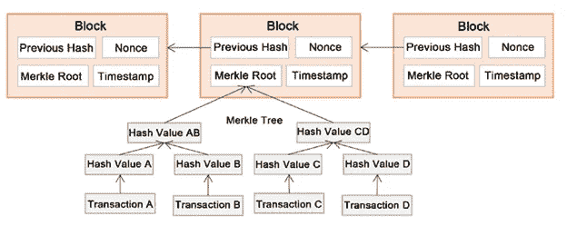

# 帐目

账户是以太坊生态系统的主要组成部分。它是以太坊希望在其分类帐中存储为交易的帐户之间的交互。以太坊支持两种类型的账户。每个帐户都有一个 balance 属性，该属性返回存储在其中的当前值。

# 外部拥有的账户

外部拥有的账户是以太坊上的人拥有的账户。以太坊里的账号不是用名字来指代的。当个人在以太坊上创建一个外部拥有的账户时，会生成一个公钥-私钥。私钥由个人安全保管，而公钥成为这个外部拥有的帐户的身份。这个公钥通常有 256 个字符，但是以太坊使用前 160 个字符来表示帐户的身份。

如果 Bob 在以太坊网络上创建了一个帐户——无论是私人的还是公共的，他将拥有自己的私钥，而他的公钥的前 160 个字符将成为他的身份。网络上的其他帐户可以向该帐户发送以太或其他基于以太的加密货币。

以太坊上的一个账户看起来就像这里显示的。

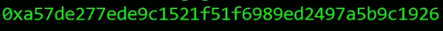

外部拥有的帐户可以在其余额中持有乙醚，并且没有与它们相关联的任何代码。这些账户中的这个像银行账户。他们可以使用其他外部拥有的帐户执行交易，也可以通过调用合同中的函数来执行交易。

# 合同账户

合同账户与外部拥有的账户非常相似。它们通过公共地址来识别。他们没有任何私钥。它们可以持有类似于外部拥有的账户，但是它们包含代码——由函数组成的智能合约的代码是状态变量。

# 交易

交易是买方和卖方、供应商和消费者或供应商和消费者之间的协议，即在现在或将来交换资产、产品或服务，以代替货币、加密货币或其他资产。以太坊帮助执行交易。以太坊中可以执行四种类型的交易。

1.乙醚从一个帐户转移到另一个帐户。帐户可以是外部拥有的帐户或合同帐户。以下是可能的情况

a.在交易中，一个外部拥有的账户向另一个外部拥有的账户汇款。

b.在交易中向合约账户汇款的外部拥有的账户。

c.一个合约账户在交易中向另一个合约账户汇款。

d.在交易中向外部拥有的账户汇款的合约账户

2.智能合约的部署—外部拥有的帐户可以使用以太坊虚拟机中的交易来部署合约。

3.使用或调用合同中的函数—执行合同中改变状态的函数被视为以太坊中的事务。如果执行一个函数不改变状态，它就不需要事务

事务有一些与之相关的重要属性。

**From** 账户属性表示发起交易的账户，代表准备发送气体或乙醚的账户。我们将在本章后面一节考虑与气体和以太有关的概念。From 帐户可以是外部拥有的帐户，也可以是合同帐户。

**到**账户财产指的是接受替代交换的乙醚或利益的账户。如果交易与合同部署相关，则 to 字段为空。它可以是外部拥有的帐户，也可以是合同帐户。

**值**指从一个账户转移到另一个账户的乙醚量。

**输入**指的是编译后的合同字节码，在 EVM 的合同部署过程中使用。它还用于存储与智能合约函数调用及其参数相关的数据。

这里显示了以太坊中调用合同函数的典型交易。请注意输入字段，其中包含对契约的函数调用及其参数。

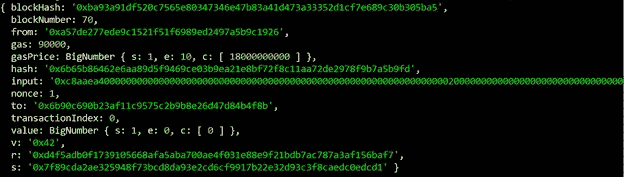

**Blockhash** 指该事务所属块的 hash。

**BlockNumber** 是该交易所属的块。

**气体**指执行该交易的发送方供应的气体量

**GasPrice** 指发送方愿意支付的每份汽油的价格，单位为魏(魏在乙醚相关章节中有解释)。天然气总量按天然气单位*天然气价格计算

**哈希**是指交易的哈希

**Nonce** 指发送方在当前交易之前进行的交易次数。

**TransactionIndex** 表示当前块中交易的序号

**值**指乙醚转移量，单位为微

**V、R 和 S** 与交易的数字签名和签署相关。

这里显示了以太坊中的一个典型交易，其中一个外部拥有的帐户向另一个外部拥有的帐户发送一些以太。请注意，这里没有使用输入字段。由于在交易中发送了 2 个乙醚，因此值字段在 Wei 中显示相应的值。

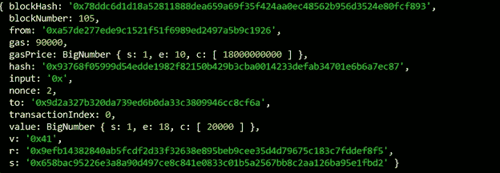

使用 web3 将以太网从一个外部拥有的帐户发送到另一个外部拥有的帐户的一种方法在这里显示，这将在本书的其余章节中详细介绍。

web . eth . send transaction({ from:web . eth . accounts[0]，to:" 0x 9 D2 a 327 b 320 da 739 ed 6 b 0 da 33 c 3809946 cc 8 cf 6a "，value: web.toWei(2，' ether')})

这里显示了以太坊中一个部署了合同的典型交易。

注意包含 contract 的字节码的输入字段。

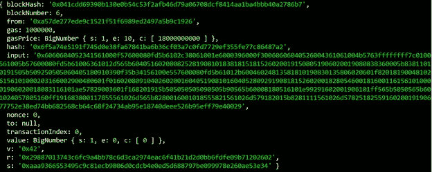

# 街区

方块是以太坊中的一个重要概念。块是事务容器。一个块包含多个事务。基于气体限制，每个区块具有不同的交易数量。气体限制将在后面的章节中详细解释。这些石块用链条连接在一起，形成了区块链。每个块都有一个父块，它在头中存储了父块的散列。只有第一个块(称为 Genesis 块)没有父块。

这里显示了以太坊中的典型块数据。

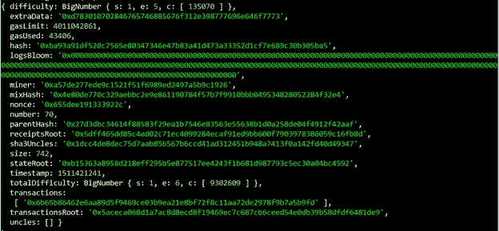

**难度**属性决定了给予该区块矿工的难题/挑战的复杂程度。

**气体极限**决定允许的最大气体。这有助于确定块中可以包含多少事务。

**GasUsed** 指的是该块执行所有事务所使用的实际气体。

**Hash** 指的是块的 Hash。

Nonce 指的是帮助解决挑战的数字。

**Miner** 属性是 Miner 的账户标识符，也称为 coinbase 或 Etherbase

**号**是该块在链上的序列号

**括号**指父块散列。

**ReceiptsRoot、StateRoot 和 transactionRoot** 是指挖掘过程中讨论的默克尔树。

**事务**指的是作为该模块一部分的事务数组。

**总难度**是指链到该块的总难度

# 端到端交易

有了对区块链和以太坊基本概念的理解，是时候了解一个完整的端到端交易以及它如何流经多个组件并存储在分类账中了。

在这个例子中，Sam 想给 Mark 寄几美元。Sam 生成包含 From、To、Value 字段的交易消息，并将其发送到以太网。交易不会立即写入分类帐，而是放在交易池中。

挖掘节点创建一个新的块，并从符合 Gas 限制标准的池中取出所有事务，并将它们添加到该块中。该活动由网络上的所有矿工完成。Sam 的交易也将是这一过程的一部分。

矿工们竞相解决摆在他们面前的挑战。获胜者是最先解决挑战的矿工。一段时间后(以太坊 10 秒)，其中一名矿工会宣布他已经找到了挑战的解决方案，他是赢家，应该将方块写入链中。获胜者将挑战解决方案连同新的区块一起发送给所有其他矿工。其余的挖掘者验证并确认该解决方案，一旦对该解决方案满意，他们就接受包含 Sam 的事务的新块，以添加到他们的分类帐实例中。这会在链上生成一个跨时间和空间持久存储的新块。在此期间，双方的账户都用新的余额更新。最后，数据块在网络中的每个节点上复制。

下一张图中也显示了相同的过程。

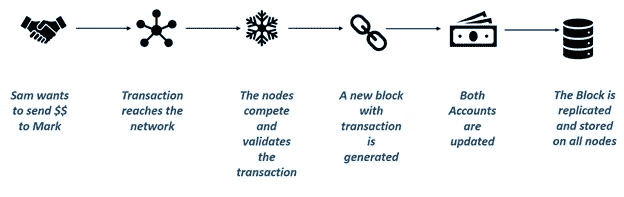

# 什么是合同

合同是约束双方或多方当事人的法律文件，双方同意立即或在未来执行交易。既然合同是法律文件，就由法律强制执行和实施。合同的例子有:一个人与保险公司签订合同，为他的健康投保；一个人从另一个人手中购买一块土地；一家公司向另一家公司出售其股份。

# 什么是智能合同

智能合约是在以太坊环境中实现、部署和执行的合约。智能合同是法律合同的数字化。智能合同在以太坊虚拟机中部署、存储和执行。智能合约可以存储数据。所存储的数据可用于记录信息、事实、关联、余额和实现现实世界合同的逻辑所需的任何其他信息。智能契约非常类似于面向对象的类。智能协定可以像面向对象的对象一样调用另一个智能协定来创建和使用另一个类的对象。把智能合约想象成一个由函数组成的小程序。您可以创建一个契约实例，并调用函数来查看和更新契约数据，同时执行一些逻辑

# 如何撰写智能合同

有多种智能合同创作工具，包括 Visual Studio。然而，开发智能合约最简单快捷的方法是使用一种基于浏览器的工具，称为 Remix。混音在[http://remix.ethereum.org](http://remix.ethereum.org)有售。Remix 是一个新名字，以前叫做 browser solidity。Remix 在浏览器上提供了一个丰富的集成开发环境，用于使用 solidity 语言编写的合同的创作、开发、部署和故障排除。所有与合同管理相关的活动(如创作、部署和故障排除)都可以在同一个环境中执行，而无需切换到其他窗口或标签。

由于 Remix 是在互联网上，并不是每个人都愿意创作他们的智能合同，Remix 是一个开源工具，可以从 https://github.com/ethereum/browser-solidity[的 GitHub 下载，并编译运行一个私人版本的 sing 浏览器。在本地运行 remix 的另一个优点是，它可以直接连接到本地专用链网络，否则用户将首先必须在在线 Remix 上创作联系人，然后将其复制到一个文件中，并手动编译和部署到专用网络。](https://github.com/ethereum/browser-solidity)

导航到 remix.ethereum.org，该网站将在浏览器中打开，默认合同如下图所示。此合同可以删除。删除这份合同，因为我们不会使用它。

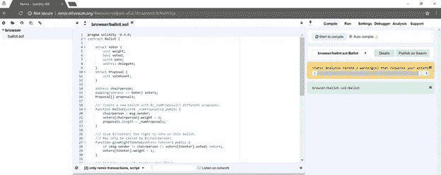

我们需要做的第一件事是通过从 Remix 左侧菜单栏中选择“+”来创建一个新合同。然后为扩展名为. sol 的新实体文件提供一个名称。将合同命名为“HelloWorld ”,然后单击 OK 继续。这将创建一个空白合同。

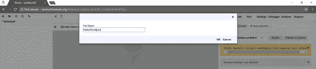

在空白创作窗格中键入以下代码，创建您的第一个合同。这份合同将在第三章中详细解释。现在，理解契约是使用 contract 关键字创建的就足够了，您可以声明全局状态变量和函数，契约是用。sol 文件扩展名。调用 GetHelloWorld 函数时，HelloWorld contracts 返回“HelloWorld”字符串。

*务实稳健的^0.4.18；*

*契约 HelloWorld*

*{*

*string private state variable = " Hello World "；*

*函数 gethello world()public view returns(string){*

*返回 stateVariable*

*}*

*}*

看看混音右边的动作窗口。它有几个选项卡—编译、运行、设置、调试器、分析和支持。操作选项卡有助于编译、部署、故障排除和调用合同。“编译”选项卡将合同编译成字节码——以太坊可以理解的代码。在您创作和编辑合同时，它会显示警告和错误。这些警告和错误需要认真对待，它们确实有助于创建可靠的合同。

运行选项卡是您除了撰写合同之外花费最多时间的地方。Remix 与浏览器中的以太坊运行时捆绑在一起。运行选项卡允许使用“Javascript VM”环境选项将合同部署到此运行时。“注入的 Web3”与 Mist 和 MetaMask 等工具一起使用，这些工具将在下一章中介绍，当在连接到专用网络的本地环境中使用 Remix 时，可以使用“Web3 提供者”。在本章的例子中，缺省值“Javascript VM”就足够了。其余的选项将在第 3 章中讨论。但是，重要的操作是部署合同，这可以使用“创建”按钮来完成。

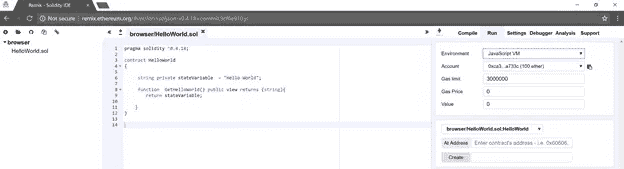

单击“创建”按钮将合同部署到浏览器以太坊运行时，这将在“创建”按钮下面列出合同中可用的所有功能。因为我们只有一个函数 GetHelloWorld，所以显示的是相同的内容。

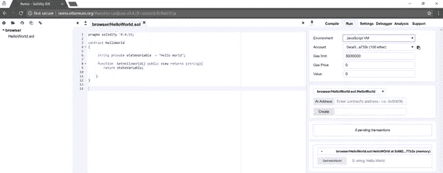

单击 GetHelloWorld 按钮调用并执行该函数。Remix 的下方窗格将显示执行的结果。

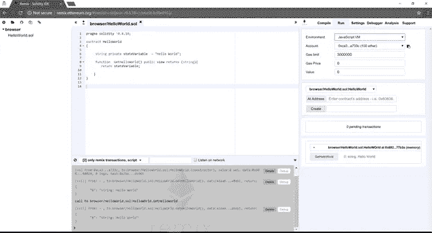

祝贺您，您已经创建、部署并执行了您的第一份合同中的一项功能。HelloWorld 契约的代码与本章一起提供，如果您对键入契约不感兴趣，可以在 Remix 中使用。

# 如何部署合同

Remix 使合同部署变得轻而易举，但它在幕后执行了许多步骤。理解部署契约的过程对于更好地控制部署过程总是很有用的。

第一步是汇编合同。编译是使用 solidity 编译器完成的。下一章将展示如何使用 solidity 编译器下载和编译合同。

编译器生成两个主要的工件

**ABI 定义和**

**合同字节码**

把 ABI(应用程序二进制接口)想象成一个由所有外部和公共函数声明以及它们的参数和返回类型组成的接口。ABI 定义了契约，任何想要调用任何契约函数的调用者都可以使用 ABI 来实现。

字节码代表契约，部署在以太坊生态系统中。部署期间需要字节码，调用契约中的函数需要 ABI。

使用 ABI 定义创建合同的新实例。

创建新的事务，该事务利用传入合同字节码的新的合同实例和适当数量的 gas 来执行事务。交易被挖掘后，在以太坊确定的地址可以获得合同。

现在，该契约被部署在以太坊虚拟机中，是时候调用该契约了。

使用新生成的地址，可以创建一个合同实例，并调用其功能。

# 摘要

这是这本书的第一章，我们已经讲了很多内容。本章介绍了区块链，更具体地说是以太坊。很好地理解区块链和以太坊如何工作的大背景将有助于理解和编写使用 solidity 的健壮、安全和经济高效的智能合同。本章介绍了区块链的基础知识，解释了什么是区块链，为什么区块链很重要，以及它如何帮助构建去中心化、分布式应用。以太坊的架构以及一些重要的概念，如交易、区块、气体、以太、账户、密码学和采矿，都被简单地讨论过。本章还简要介绍了智能合约的主题，使用 Remix 来创作智能合约，以及如何使用 Remix 本身来执行它们。我保持这一章的简短，因为这本书的其余部分将进一步解释这些概念，并允许你快速开发基于可靠性的智能合同。你会注意到这一章没有提到以太坊工具和实用程序。这就是我们将在下一章讨论的内容，直接进入并安装以太坊及其工具集。

> 加入 Coinmonks [电报频道](https://t.me/coincodecap)和 [Youtube 频道](https://www.youtube.com/c/coinmonks/videos)获取每日[加密新闻](http://coincodecap.com/)

## 另外，阅读

*   [复制交易](/coinmonks/top-10-crypto-copy-trading-platforms-for-beginners-d0c37c7d698c) | [加密税务软件](/coinmonks/crypto-tax-software-ed4b4810e338)
*   [电网交易](https://coincodecap.com/grid-trading) | [加密硬件钱包](/coinmonks/the-best-cryptocurrency-hardware-wallets-of-2020-e28b1c124069)
*   [密码电报信号](http://Top 4 Telegram Channels for Crypto Traders) | [密码交易机器人](/coinmonks/crypto-trading-bot-c2ffce8acb2a)
*   [ko only Review](https://coincodecap.com/koinly-review)|[Binaryx Review](https://coincodecap.com/binaryx-review)|[Hodlnaut vs CakeDefi](https://coincodecap.com/hodlnaut-vs-cakedefi-vs-celsius)
*   [MoonXBT vs Bybit vs 币安](https://coincodecap.com/bybit-binance-moonxbt) | [硬件钱包](/coinmonks/hardware-wallets-dfa1211730c6)
*   [火币交易机器人](https://coincodecap.com/huobi-trading-bot) | [如何收购 ADA](https://coincodecap.com/buy-ada-cardano) | [Geco？一次审查](https://coincodecap.com/geco-one-review)
*   [币安 vs 比特邮票](https://coincodecap.com/binance-vs-bitstamp) | [比特熊猫 vs 比特币基地 vs Coinsbit](https://coincodecap.com/bitpanda-coinbase-coinsbit)
*   [如何购买 Ripple (XRP)](https://coincodecap.com/buy-ripple-india) | [非洲最好的加密交易所](https://coincodecap.com/crypto-exchange-africa)
*   [最佳加密交易所](/coinmonks/crypto-exchange-dd2f9d6f3769) | [印度最佳加密交易所](/coinmonks/bitcoin-exchange-in-india-7f1fe79715c9)
*   [面向开发人员的最佳加密 API](/coinmonks/best-crypto-apis-for-developers-5efe3a597a9f)
*   最佳[密码借贷平台](/coinmonks/top-5-crypto-lending-platforms-in-2020-that-you-need-to-know-a1b675cec3fa)
*   [杠杆代币](/coinmonks/leveraged-token-3f5257808b22)终极指南