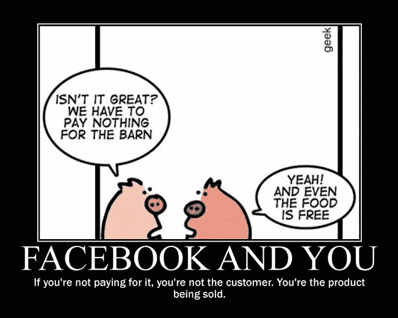
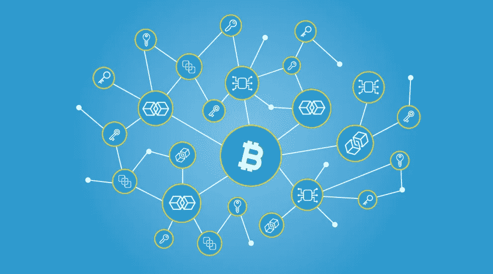
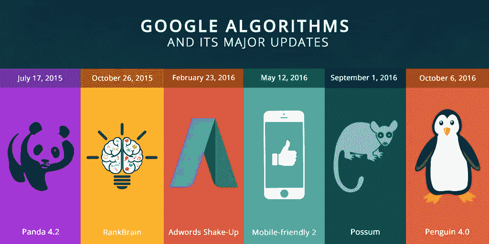

# Web 3.0 和现代互联网的先驱

> 原文：<https://medium.com/coinmonks/https-medium-com-shwetagupta-web3-0-262dc003aab7?source=collection_archive---------3----------------------->

Web 3.0 是技术和营销领域日益流行的词汇。每秒钟通过社交网络、博客、电子商务网站登录网络的用户数量是 [*以无与伦比的速度膨胀*](http://www.internetlivestats.com) 。

尽管有统计数据，web 必须足够灵活以保持数据的完整性。大量的数据是由社交媒体网站产生的，比如 YouTube、脸书、Twitter 等等。很难在存储和安全性之间取得平衡。

"*如果你不为产品付费，你就是产品*"

那么，这是怎么回事呢？

Web 3.0 是“智能互联网”，或者有人称之为“数据网络”。可视化结构有序的数据库。理想情况下，Web 3.0 应该已经迎来了 2015 年。尽管许多里程碑已经实现，这是相当了不起的，更多的扩展仍在进行中。在深入 web 3.0 之前，让我们先了解一下 web 1.0 和 web 2.0 的要点。

## 有 web1.0 这样的东西吗？

1991 年 8 月 6 日，一个由蒂姆·伯纳斯·李领导的 CERN 工程师团队推出了第一个网站*，可悲的是，你现在看到的是第一个网站 1992 年的翻版(查看源代码，并尝试用今天的 HTML 标签识别！).*

> *蒂姆·伯纳斯·李是万维网的发明者，他也将 web 1.0 作为“*只读*”Web 介绍给了世界。上世纪 90 年代的静态网站，加载时间太长。大声对千禧一代说，我们都经历过，并且非常熟悉浏览器窗口底部令人烦恼的蓝色条，它花了很长时间才加载。像素化的 8 位图形和原色方案。如果你能描绘出这个场景，那么瞧！你经历过 web 1.0。AOL、Alta Vista 这些术语对你来说可能也很熟悉。*

*如果你渴望时光倒流，体验 web 1.0，你可以用你最喜欢的 [*浏览器和你想要的*](http://oldweb.today/) 日期在 web 1.0 上冲浪。一些网站设法生存下来。 [*这个*](http://www.fogcam.org/) 是世界上最古老的网络摄像头，从 1994 年开始在三藩市直播，每 20 秒更新一次。这是一个 1996 年迈克尔·乔丹/鲁尼音乐混搭电影的网站。*

## *那么，Web 2.0 在哪里？*

*我们生活在 web2.0 时代。人们开始探索网络，让它变得更加动态，用户可以与网络互动。一个分享个人看法的开放平台。几乎无所不包。微博，分享和上传视频，高分辨率图像，音乐。一切都是通过增强的网络存储和带宽能力实现的。*

> *Berners Lee 将 web 2.0 称为“*读写 web* ”。搜索引擎随着复杂的网络爬行策略而发展。任何信息都可以通过 surface web 方便地共享和访问。这仍然只是传统搜索引擎可见信息的 0.004%。其余的构成了深层网络。*

*管理如此庞大、不可或缺的数据的安全性和存储已成为一项挑战。这标志着云存储的诞生。如今，网络已经成为老牌企业和初创企业的一项有利可图的投资，也是组织通过品牌、内容写作等方式接触大众的一项重要战略。*

## ***Web 3.0，我们到了吗？***

> *Berners Lee 称 web 3.0 为“*读写执行 web* ”。网页中的数据也能被计算机理解。一个更“人性化”的网络。我们正处于 web 3.0 的边缘。其中增强现实将通过使用 [*WebGL*](https://developer.mozilla.org/en-US/docs/Web/API/WebGL_API) 、全息照片渲染 3D 图像来重新定义电子商务和地理社交领域。Web 3.0 浏览器将成为学习我们搜索模式的个人助手。*

*我们来分解一下 web 3.0 的特性。*

**

*Decentralized Smart Web*

***语义网-** 今天，谷歌主要依靠基于关键词的搜索，而不是基于上下文。今天的搜索引擎缺乏相关的上下文数据分析。如果我们用谷歌搜索美洲狮这种动物，我们会看到美洲狮品牌，因为点击量更高。尽管你需要，谷歌首先呈现最受欢迎的结果。适用于所有用户的通用方法。*

> *Lee 介绍了使 web 更加直观的想法，开发者可以为他们的网页提供元数据描述，这样引擎就可以理解上下文，而不是依赖于关键字。网络上的零碎信息、图像、链接可以更好地关联和呈现。企业将使用本体给计算机提供描述所有这些对象及其属性所需的词汇。 *[* [*来源*](https://publications.drdo.gov.in/ojs/index.php/djlit/article/viewFile/863/364) *]* 我们可能面临的挑战将是链接数据的机制，而不是重写我们已经拥有的数据。*

*基于 [RDFa](https://rdfa.info/) 的脸书 [OpenGraph](https://developers.facebook.com/docs/sharing/opengraph) 协议。出版商可以包括标记，导致脸书连接不同网站的共同利益的用户。*

***人工智能-** 旅行比以前更容易了。我们有全球定位系统来导航。其估计延迟。然而，如果基于我们的目的地，我们可以被建议沿途的酒店以及天气和航班与我们出发和到达的时间一致，那就容易多了。*

> *看看智能网络。人工智能和人工智能将重新定义我们访问互联网的方式。从社交媒体获取的所有数据的优势有助于使网络更智能，并为其添加人类智能。人工智能以及物联网和增强现实将在旅游、电子商务、汽车等领域引发革命。各种基于人工智能的技术，如模糊集、粗糙集、神经网络、机器学习等。将有助于在智能分析领域实现 web 3.0。亚马逊和网飞已经采用人工智能来理解用户的偏好，并在此基础上给出建议。 [*Last.fm*](https://www.last.fm/) 建议相似偏好的音乐。他们强化持续学习机制。*

**

*谷歌算法 RankBrain 最近的更新引入了称为矢量的数学实体，增强了对语言语义的理解。Rank Brain 更新了蜂鸟搜索算法。*

***物联网-** 谈到智能互联网，物联网为让生活更舒适做出了巨大贡献。由人类完成的平凡任务将很快被智能设备取代。你冰箱里的食品杂货会提醒你股票在贬值，这已经不远了。用带有传感器的物理设备取代托管很快就成为可能。*

> *如今，物联网已经渗透到许多行业。从 [*智能门铃*](https://en.m.wikipedia.org/wiki/Smart_doorbell) 到 [*食品供应链管理*](https://www.foodlogistics.com/technology/article/20993391/iot-food-supply-chain) 。物联网在推动巨大产业的同时，也为家庭预留了空间。亚马逊 Echo、谷歌 Home、Wink 和飞利浦 Hue 已经铺好了进入我们家的路。*

*IIoT(工业物联网)应用包括智能灰尘、无人机等。*

***分权**—*

*今天，少数巨头拥有大多数用户数据，推动了各种集中化。每个人通过他们的感觉器官的独特感知，我们在网络上展示为图像、观点，这对于诱导聪明非常关键。这些数据非常昂贵，是高价值的商业商品。 [*比特币*](https://bitcoin.org/en/) 将区块链的革命性概念推向世界。*

**

****区块链引入去中心化控制****——它将个人的数据权利转移到他们手中，如果你想兑现你的感知，这将是你的选择。*[*block stack*](https://blockstack.org/)*是挑战 DNS 集中化的独特实现。**

*   ****取消中央控制点*** *—加密算法有助于取代第三方中介。对等体负责使用复杂的加密算法来维护网络的完整性。该系统完全处理信息的验证，而不是中央机构。**
*   ****安全****——雅虎至少在两起独立的数字盗窃案中成为目标，这些盗窃案影响了全球逾 10 亿用户的账户。人们已经为他们的服务泄露了数据。信任是区块链技术的关键要素。分布式分类账确保了交易的有效性，从而消除了对交易对手的需求。* [*平安共享全球*](http://www.safeshareinsurance.com/) *推出首个区块链基础保险解决方案。**
*   ****使用区块链确保数据隐私*** *—通过网络存储的数据的隐私由系统维护，无需任何人工干预。区块链是防篡改的。这些交易都有时间戳和数字签名，因此无法被操纵。大量复杂的加密算法确保了信息的完整性。**

*在审查制度下，像中国&巴基斯坦这样的国家一直处于监控之下，而朝鲜上网受到限制，Dapps 可以为社区驱动的应用提供解决方案。*

**

*分散式应用或 d Apps 标志着密钥登录和支付的转变。尽管 dapps 仍处于早期阶段，但它成功地吸引了技术人员和非技术人员的巨大兴趣。为了获得 dapps 的要点，我们需要了解区块链，这将在我接下来的文章中涉及。迄今为止最成功的 dapp 是由可爱的数字小猫*控制的。**

**值得一提的是:**

*   **[*【假人】*](https://golem.network/) 是一个令人惊叹的平台，在这里你可以通过出租电脑的闲置空间来赚取一些代币。**
*   **[*OpenBazaar*](https://www.openbazaar.org/) 是一个开源项目，为完全分散的市场中的电子商务交易开发协议。**
*   **[*微基金*](http://weifund.io/) 旨在提供以太坊生态系统上的众筹解决方案。**

**如今，登录和支付对 Dapp 构成了挑战。使用法定货币的人还不熟悉代币。我们需要一个安全的设备来接管身份契约的管理。**

**区块链带动了一波 Dao 和 ico。DAO 是一个**去中心化的自治组织** ( **DAO** )由 smart 契约中指定的规则驱动。 [*道*](https://en.wikipedia.org/wiki/The_DAO_(organization)) 是风险资本融资，而首次公开募股，通常也被称为 **ICO** ，是一种筹资机制，其中新项目出售其基础加密令牌，以换取比特币和以太。**

**分散、安全和智能的网络主宰着未来。Web 3.0 有潜力发掘比地平线上可见的更多的前景。十年前，你无法预订优步。克里斯·拉森(Chris Larsen)那时还不是亿万富翁。十年后，我们可能会走向光明的未来或者黑镜式的混乱。**

**我们已经开始了我们的冲刺。**