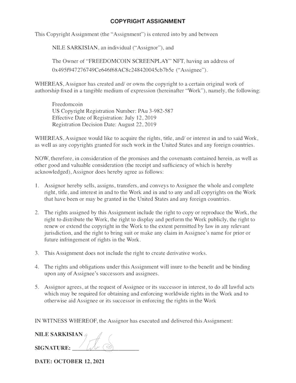

# 人类以 NFT 的身份向美国出售版权

> 原文：<https://medium.com/coinmonks/human-being-sells-us-copyright-as-nft-5681ab0dc179?source=collection_archive---------9----------------------->

是的，那个人就是我。

我确实用我的电影剧本“FREEDOMCOIN”的 2019 年美国版权创造了一个 NFT

然而！我这样做的事实对区块链社区产生了持久的影响，并且提出了某些法律问题，如果我可以这么说的话…我自己。

法治将会是可编程的吗？

可能性是绝对存在的。我遇到的最有前途的项目之一是 OpenLaw ( [openlaw.io](http://openlaw.io/) )。虽然这个项目仍在发展，但它的意义非同寻常。它提供了将区块链法典纳入普通法律协议的方法。

这意味着法律合同可以成为动态的，智能合同现在可以成为智能法律合同。整个区块链生态系统有可能成为法律强制执行。与区块链正在改革的许多行业类似，法律程序可以自动化，从而节省大量资金。此外，众所周知，借助区块链，以前从未想象过的用例正在我们眼前变成现实。

我的具体用例虽然很基本，但我认为它体现了智能法律契约的这些方面。我已经起草了一份我和拥有我剧本的 NFT 的人之间的法律协议。它只是简单地说，谁拥有 NFT，谁就拥有我的剧本的相关权利。我还没有卖掉它，所以 NFT 的主人还是我。然而，一旦出售，谁拥有 0x 495 f 947276749 ce 646 f 68 AC 8 c 248420045 CB 7 b 5 e(我的 NFT 合同的地址)，谁就基本上拥有我的剧本。我自己已经起草了协议，本着诚意，我看不出有任何理由对权利转让的合法性提出质疑。

这比链外转让权利有几个好处。首先，一次权利转让可以多次使用，其次，这些转让可以更快地处理。除了节省时间和纸张之外，这本身并不具有革命性，但它带来了第三个优势:稀缺性。通过用我的版权创建一个可证明是唯一的(不可替代的)令牌，我可以把它变成一种商品。当然，我可以在 Instagram 或其他任何地方抨击我正在出售的剧本，即使它不是 NFT 奖。但是，事实上，它已经事先保证可以转让，创造了商品的价值。它变成了一种投资，这就是 NFTs 的全部意义…只是我的有法律支持，但仍然。我觉得很酷。

检查一下:[https://opensea.io/collection/nilescreenplays](https://opensea.io/collection/nilescreenplays)。
阅读:[https://gateway . pinata . cloud/ipfs/qmddmjye 2h 56 yisvouyftnjbshaanrluof 8 lgnd 4 xfzzpw](https://gateway.pinata.cloud/ipfs/QmdDMJYE2h56YisvouYfTnjbSHAaNrLuoF8LgNd4XfZzpw)。
爱死了。

> 加入 Coinmonks [电报频道](https://t.me/coincodecap)和 [Youtube 频道](https://www.youtube.com/c/coinmonks/videos)了解加密交易和投资

## 也阅读

 [## 最佳加密交易所| 2021 年十大加密货币交易所

### ICON _ PLACEHOLDEREstimated 预计阅读时间:28 分钟加密货币交易所的加密交易需要知识…

blog.coincodecap.com](https://blog.coincodecap.com/crypto-exchange)  [## 2021 年 10 大最佳加密贷款平台| CoinCodeCap

### 当谈到加密货币贷款时，大量因素等同于良好的收入状况。此外，借款的一部分…

blog.coincodecap.com](https://blog.coincodecap.com/crypto-lending)  [## 2021 年最佳免费加密交易机器人

### 2021 年币安、比特币基地、库币和其他密码交易所的最佳密码交易机器人。四进制，位间隙…

medium.com](/coinmonks/crypto-trading-bot-c2ffce8acb2a)  [## 最佳 4 个加密交易信号电报通道

### 这是乏味的找到正确的加密交易信号提供商。因此，在本文中，我们将讨论最好的…

medium.com](/coinmonks/best-crypto-signals-telegram-5785cdbc4b2b)  [## BlockFi 评论 2021:利弊和利率| CoinCodeCap

### 今天，我们提出了一个全面的 BlockFi 评论，这是一个成立于 2017 年的加密贷款平台，拥有其…

blog.coincodecap.com](https://blog.coincodecap.com/blockfi-review)  [## 如何在印度购买比特币？2021 年购买比特币的 7 款最佳应用[手机版]

### 如何使用移动应用程序购买比特币印度

medium.com](/coinmonks/buy-bitcoin-in-india-feb50ddfef94)  [## 加密税务软件——五大最佳比特币税务计算器[2021]

### 不管你是刚接触加密还是已经在这个领域呆了一段时间，你都需要交税。

medium.com](/coinmonks/best-crypto-tax-tool-for-my-money-72d4b430816b)  [## 存储比特币的最佳加密硬件钱包[2021] | CoinCodeCap

### 保管您的数字资产很容易，但找到正确的存储方式却是一项繁琐的任务。在线钱包有一个风险…

blog.coincodecap.com](https://blog.coincodecap.com/best-hardware-wallet-bitcoin)