# 霍比保证金交易|完全指南[2021]

> 原文：<https://medium.com/coinmonks/huobi-margin-trading-b3b06cdc1519?source=collection_archive---------3----------------------->

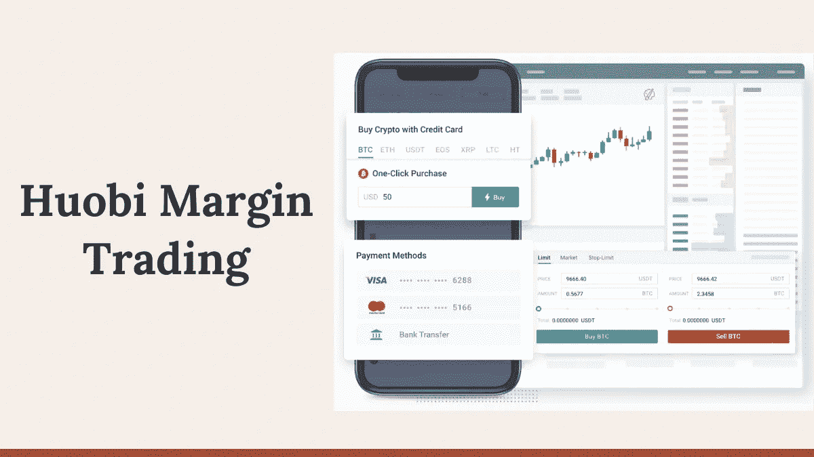

[**火币全球**](https://blog.coincodecap.com/go/huobi) 是[最受欢迎的交易平台之一](https://blog.coincodecap.com/crypto-exchange)；因此，很明显，你正因为这个原因而阅读这篇文章。所以在这篇文章中，我们将介绍[火币](https://blog.coincodecap.com/go/huobi) [保证金交易](https://blog.coincodecap.com/go/margin-trading)，并解释在[火币](https://blog.coincodecap.com/go/huobi)开始你的[保证金交易](https://blog.coincodecap.com/margin-trading)之旅之前你需要知道的一切。

# 摘要

*   [火币](https://blog.coincodecap.com/go/huobi)是最受欢迎的交易交易所之一，提供[保证金交易](https://blog.coincodecap.com/go/margin-trading)服务，以你的资本作为抵押。
*   你可以用三种不同的模式交易，交叉、隔离、C2C。
*   最大杠杆 **5x** 在[火币](https://blog.coincodecap.com/go/huobi)处。
*   交易所在[保证金](https://blog.coincodecap.com/margin-trading)交易[窗口](https://blog.coincodecap.com/margin-trading)中提供了许多功能，如触发指令、止损限价、风险等级指标等。
*   [火币](https://blog.coincodecap.com/go/huobi)向一级用户收取 0.098%的高额保证金利息。

# 什么是保证金交易？

如果能用你的固定资本获得额外的回报不是很好吗？这就是融资融券交易的用武之地。它允许你用你的资本作为抵押，并借入资金来开仓。

# 火币保证金交易是如何运作的？

在[活壁](https://www.huobi.com/en-us/c2c-margin/)处，特定模式的杠杆是固定的，不能改变；因此，您可以简单地选择您喜欢的方法并下订单。火币自动为您提供建仓所需资金。

# 现货交叉保证金交易

[Huobi cross margin trading](https://www.huobi.com/en-us/ladder-lending/cross-margin/) 允许您通过为所有未平仓头寸保留一个共享账户来防止平仓。假设你的一个仓位在亏损，另一个在盈利。那么盈利的一方可以弥补亏损，防止头寸被清算。

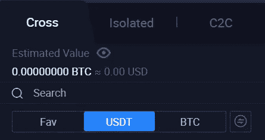

# 隔离保证金交易

[隔离保证金交易](https://www.huobi.com/en-us/ladder-lending/margin)增加你平仓的机会；然而，它确实减少了你的主账户进一步亏损的机会。它通过分别处理每个头寸的资本来做到这一点。

交叉和隔离保证金交易都有三种模式。

## 自动贷款

您可以选择自动贷款模式，而不是通过常规的贷款程序。 [**火币**](https://blog.coincodecap.com/go/huobi) 自动借给你你选择的开仓所需的资金。

## 自动还款

您可以手动偿还贷款金额，也可以选择自动偿还模式。现在你所有的收入将首先用于偿还你的贷款金额。

## 普通模式

普通模式只允许您开仓或平仓，您可以手动偿还贷款金额。

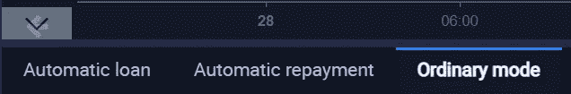

# 火币 C2C

你甚至可以把你的资产直接借给一个 [**火币**](https://blog.coincodecap.com/go/huobi) 用户，并获得金额利息。你可以通过使用 C2C 模式和做多或做空来做到这一点。[火币 C2C](https://www.huobi.com/en-us/c2c-margin/) 只提供普通方法，并且只能在 BTC/ USDT 交易。

# 霍比快速保证金

**火币为您提供快速保证金功能，因为您不必手动借款或还款。火币为你做到这一点，你所要做的就是从自动贷款或还款模式下单。**

**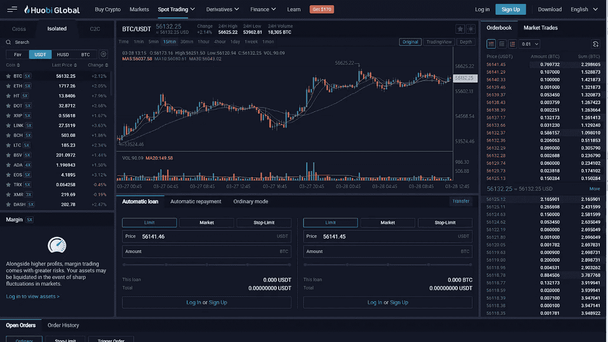**

# **火币提供的杠杆**

****允许你对一系列杠杆期权进行交易。在交叉交易和 C2C 保证金交易中，你可以获得 3 倍的杠杆。与此同时，在单独的保证金交易中，你可以获得 5 倍的杠杆。****

****使用更高的杠杆可以让你的回报增加几倍。然而，特定交易的风险随着杠杆的增加而增加。****

****例如，100 倍杠杆的多头头寸将在资产价值下跌 1%时平仓。相比之下，10 倍杠杆的交易需要减少 10%。****

# ****保证金交易窗口****

****[**火币**](https://blog.coincodecap.com/go/huobi) 已经尽力保持融资融券交易窗口的简单易用。让我们逐一看看融资融券交易窗口的所有要素:****

# ****蜡烛图****

****你在保证金交易窗口观察到的第一件事是蜡烛图。无论你是日内交易者还是长期交易者，你都可以查看多个时间段的蜡烛图。****

****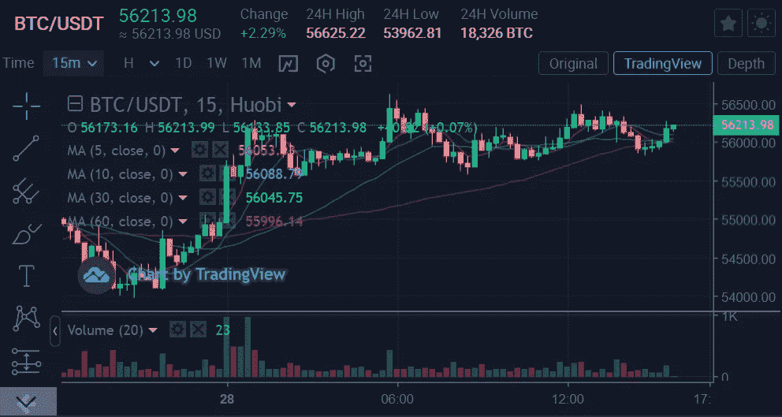****

****在 [**火币**](https://blog.coincodecap.com/go/huobi) 有不同的聊天方式:****

1.  ****原始交易图****
2.  ****[交易视图](https://blog.coincodecap.com/go/tradingview)图表****
3.  ****市场深度****

# ****订单簿****

****您可以使用订单簿来确定下达最大订单的资产的价格。你会在屏幕右侧找到订单簿。****

****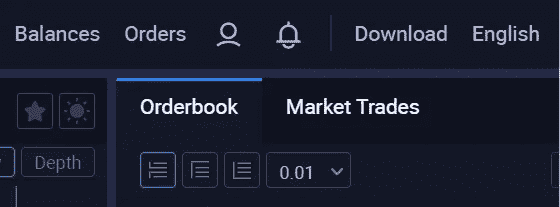****

# ****下订单的保证金交易标签****

****[**火币**](https://blog.coincodecap.com/go/huobi) 通过在一个标签中累积其所有保证金交易功能，使[保证金交易](https://blog.coincodecap.com/margin-trading)对您来说更加简单。这对日内交易者来说是最有帮助的，因为它节省了时间，你可以立即以你喜欢的价格开仓/平仓。其中一些特征如下:****

## ****限制****

****您可以通过选择限价订单模式，以预先确定的价格下单。你只要输入限价，下单就行了。一旦市场达到该价格，您的订单将被执行。****

## ****市场****

****在 [**火币**](https://blog.coincodecap.com/go/huobi) 也可以通过选择行情模式实时下单。这是最有用的时候，有一个突然的波动，这样，你可以利用市场波动获得一些回报。****

****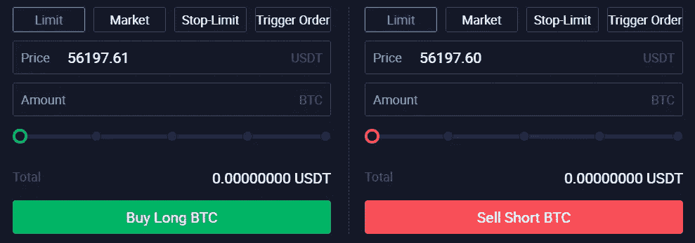****

## ****停止限制****

****你可以使用限价止蚀单来降低风险。这些允许你为执行一个订单设定一个价格，同时保持一个风险限额，低于这个限额订单将被关闭。****

## ****触发顺序****

****触发可以让你暂时不用屏幕。因为您可以设置触发价格，当达到该价格时，订单会自动触发。当订单被触发时，交易所将自动将您的头寸转换为限价订单。要了解更多关于触发指令的信息，点击这里。****

## ****贷款/偿还按钮****

****如果您不希望自动借款或还款，您可以选择手动模式。烛台图形下方有一个贷款和偿还按钮，允许您选择贷款并手动偿还金额。****

********

## ****转移按钮？****

****还款按钮旁边的转账按钮允许您在不访问基金部分的情况下转账您的 Huobi 保证金账户中的资金。您可以点击它，输入您希望分享的金额，然后按确认按钮。****

# ****如何在火币做多？****

****做多意味着预测市场会上涨。你可以通过在上面的栏里输入所有的细节来做多，或者点击绿色的按钮。****

****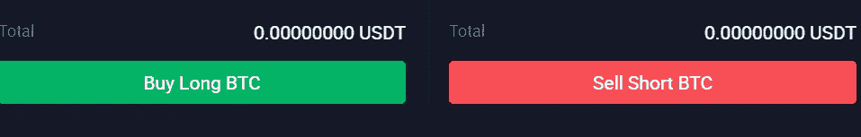****

# ****如何在火币做空？****

****做空意味着以更高的价格出售资产，然后再以更低的价格买入，以获得可观的回报。您可以通过在“卖空 BTC”或红色按钮上方的栏中输入所有详细信息来做空。****

# ****风险率是多少？****

****风险率是由利率变化或市场横盘造成的损失。您可以在屏幕左侧看到您的风险率百分比。如果你的风险率低于 110%，那么你的头寸将被自动平仓。****

****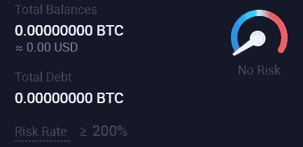****

## ****风险限额指标****

****您将在屏幕右侧看到一个风险等级指示器。此仪表显示您在特定位置的风险级别，红色表示最高风险，蓝色表示低风险或无风险。****

# ****火币费****

****最高 0.2%的做市商/收款商费用和最高 0.0980%的保证金利率。您可以在下表中观察普通用户的分层保证金利率。****

****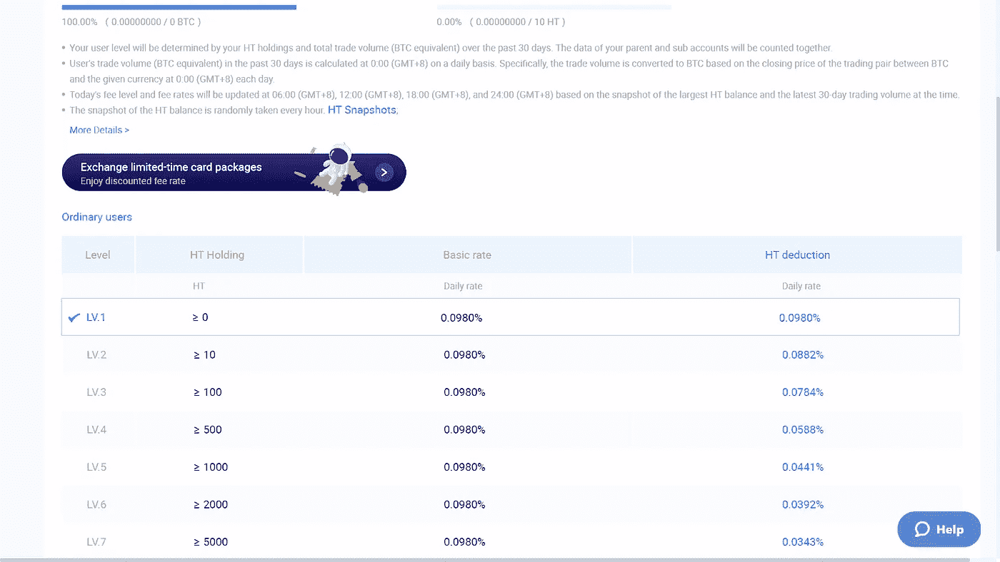****

****要了解整个现货交易费用，[点击这里](https://www.huobi.com/en-us/fee/?feeType=trading)。另外，[点击此处](https://www.huobi.com/en-us/fee/?feeType=margin)查看保证金利率的整体分层结构。****

****如果您希望使用 HT holdings 或费用扣除积分卡扣除费用，您可以通过[点击此处](https://www.huobi.com/en-us/fee/?feeType=trading)启用这些选项。****

# ****如何使用火币保证金交易？****

****Huobi Global 是最受欢迎的加密交易平台之一，也许这就是你在这里的原因。现在，您可以在火币网开始保证金交易，只需依次执行以下步骤:****

# ****如何在火币报名？****

****在 [**Huobi**](https://blog.coincodecap.com/go/huobi) 进行保证金交易的第一步是创建一个账户:****

1.  ****访问[火币环球](https://blog.coincodecap.com/go/huobi)官网。****
2.  ****现在点击注册，并输入您的电子邮件和密码。****
3.  ****输入发送到您的电子邮件的代码，并完成验证。****

********

# ****如何在火币存资金？****

****现在，要开立您的第一个头寸，您需要将资金存入您的**货币**账户。您可以按照以下步骤来完成:****

1.  ****登录你的 [**活币账户**](https://blog.coincodecap.com/go/huobi) ，然后悬停在表头的余额上。****
2.  ****现在点击保证金账户，然后选择你的首选账户。****
3.  ****现在，点击存款。****
4.  ****火币会通过邮件把存款地址发给你，并显示在屏幕上。****
5.  ****确保两个地址相同。****
6.  ****现在转移资金。也可以扫描二维码，存入资金。****

****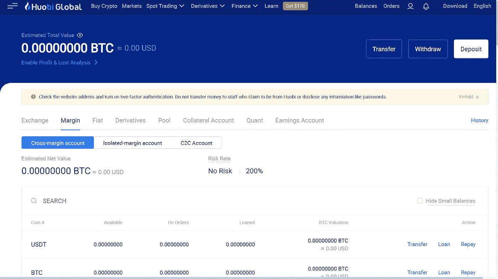****

# ****如何在火币下单融资融券交易？****

****由于您的保证金帐户中现在有资金，您只需访问保证金选项卡并按照以下步骤操作:****

1.  ****在主屏幕上，将鼠标悬停在现货交易上，然后单击保证金。****
2.  ****现在从交叉、隔离和 C2C 中选择你喜欢的交易模式。****
3.  ****向下滚动并输入交易详情。****
4.  ****点击买入 BTC 多头或卖出 BTC 空头。****

****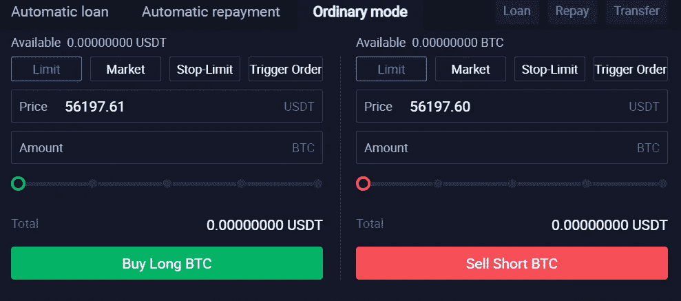****

# ****如何在火币回笼资金？****

****现在，当你收集了一些回报，然后你可以提取硬币到你的外部钱包。 [**火币**](https://blog.coincodecap.com/go/huobi) 也支持菲亚特撤单；因此，您可以直接将资金存入您的银行账户，为此，您可以遵循以下步骤:****

1.  ****首先，将鼠标悬停在余额上，然后单击保证金账户。****
2.  ****其次，在下一个窗口中，单击“撤回”按钮。****
3.  ****现在，从加密或法定提款中选择。****
4.  ****然后输入您的加密取款的钱包地址。****
5.  ****最后，输入您的银行详细信息和您希望提取的金额。****

****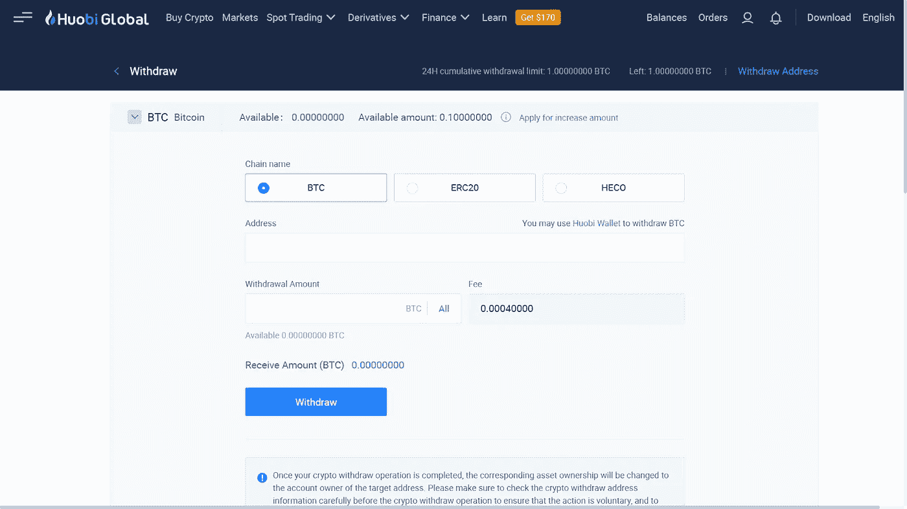****

****你会学到很多其他的东西，比如保证金交易的风险，保证金交易是如何运作的，保证金的维持等等。，通过阅读我们关于[保证金交易](https://blog.coincodecap.com/margin-trading)的博客。****

# ****人民币保证金交易的利与弊****

****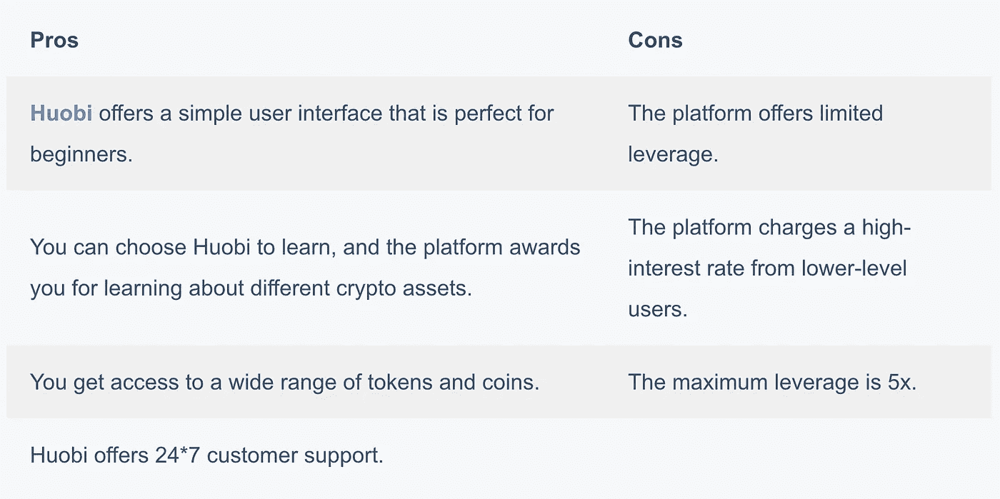****

# ****霍比保证金交易:结论****

****[**火币环球**](https://blog.coincodecap.com/go/huobi) 在全球范围内提供有竞争力的保证金交易服务。与其他平台相比，该交易所提供的杠杆较低，但这可以防止 noob 交易者遭受超出他们承受能力的损失。您可以在 Huobi global 轻松注册并开始您的保证金交易之旅。****

# ****常见问题****

******火币是什么？******

****Huobi Global 是一个提供加密和期货交易服务的交易平台。火币网还提供数字借贷服务和 T2 交易机器人 T3。****

******火币环球安全吗？******

****Huobi Global 是市场上最好的加密交易平台之一；因此，他们的安全级别是优质的。该平台甚至通过了许多第三方安全测试。****

******火币总部在哪里？******

****火币环球诞生于中国，目前在香港、韩国、日本和美国运营。****

*   ****[2021 年五大加密保证金交易交易所|保证金交易](https://blog.coincodecap.com/crypto-margin-trading-exchanges)****
*   ****[Pionex 评论—被动交易者的简单交易机器人](https://blog.coincodecap.com/pionex-review-exchange-with-crypto-trading-bot)****
*   ****[最佳加密交易所| 2021 年十大加密货币交易所](https://blog.coincodecap.com/crypto-exchange)****
*   ****[Bybit 保证金交易指南 2021](https://blog.coincodecap.com/bybit-margin-trading)****
*   ****什么是融资融券交易？保证金交易是如何运作的？2021 年****

> ****加入 coin monks[Telegram group](https://t.me/joinchat/EPmjKpNYwRMsBI4p)学习加密交易和投资****

## ****另外，阅读****

*   ****[什么是保证金交易](https://blog.coincodecap.com/margin-trading)****
*   ****最好的[密码交易机器人](/coinmonks/crypto-trading-bot-c2ffce8acb2a) | [网格交易](https://blog.coincodecap.com/grid-trading)****
*   ****[3 商业评论](/coinmonks/3commas-review-an-excellent-crypto-trading-bot-2020-1313a58bec92) | [Pionex 评论](/coinmonks/pionex-review-exchange-with-crypto-trading-bot-1e459d0191ea) | [Coinrule 评论](/coinmonks/coinrule-review-2021-a-beginner-friendly-crypto-trading-bot-daf0504848ba)****
*   ****[AAX 交易所评论](/coinmonks/aax-exchange-review-2021-67c5ea09330c) | [德里比特评论](/coinmonks/deribit-review-options-fees-apis-and-testnet-2ca16c4bbdb2) | [FTX 交易所评论](/coinmonks/ftx-crypto-exchange-review-53664ac1198f)****
*   ****[n 零复习](/coinmonks/ngrave-zero-review-c465cf8307fc) | [Phemex 复习](/coinmonks/phemex-review-4cfba0b49e28) | [PrimeXBT 复习](/coinmonks/primexbt-review-88e0815be858)****
*   ****[Bybit Exchange 审查](/coinmonks/bybit-exchange-review-dbd570019b71) | [Bityard 审查](/coinmonks/bityard-review-7d104239be35) | [CoinSpot 审查](https://blog.coincodecap.com/coinspot-review)****
*   ****[3 commas vs crypto hopper](/coinmonks/3commas-vs-pionex-vs-cryptohopper-best-crypto-bot-6a98d2baa203)|[赚取加密利息](/coinmonks/earn-crypto-interest-b10b810fdda3)****
*   ****最好的比特币[硬件钱包](/coinmonks/the-best-cryptocurrency-hardware-wallets-of-2020-e28b1c124069?source=friends_link&sk=324dd9ff8556ab578d71e7ad7658ad7c) | [BitBox02 回顾](/coinmonks/bitbox02-review-your-swiss-bitcoin-hardware-wallet-c36c88fff29)****
*   ****[莱杰 vs n rave](/coinmonks/ledger-vs-ngrave-zero-7e40f0c1d694)|[莱杰 nano s vs x](/coinmonks/ledger-nano-s-vs-x-battery-hardware-price-storage-59a6663fe3b0)****
*   ****[密码本交易平台](/coinmonks/top-10-crypto-copy-trading-platforms-for-beginners-d0c37c7d698c)****
*   ****[CoinLoan 审核](/coinmonks/coinloan-review-18128b9badc4) | [YouHodler 审核](/coinmonks/youhodler-4-easy-ways-to-make-money-98969b9689f2) | [BlockFi 审核](/coinmonks/blockfi-review-53096053c097)****
*   ****最好的[加密税务软件](/coinmonks/best-crypto-tax-tool-for-my-money-72d4b430816b) | [硬币追踪评论](/coinmonks/cointracking-review-a-reliable-cryptocurrency-tax-software-5114e3eb5737)****
*   ****最佳[加密借贷平台](/coinmonks/top-5-crypto-lending-platforms-in-2020-that-you-need-to-know-a1b675cec3fa) | [杠杆代币](/coinmonks/leveraged-token-3f5257808b22)****
*   ****[BlockFi vs Celsius](/coinmonks/blockfi-vs-celsius-vs-hodlnaut-8a1cc8c26630)|[Hodlnaut 回顾](/coinmonks/hodlnaut-review-best-way-to-hodl-is-to-earn-interest-on-your-bitcoin-6658a8c19edf)****
*   ****[Bitsgap 审核](/coinmonks/bitsgap-review-a-crypto-trading-bot-that-makes-easy-money-a5d88a336df2) | [Quadency 审核](/coinmonks/quadency-review-a-crypto-trading-automation-platform-3068eaa374e1) | [Bitbns 审核](/coinmonks/bitbns-review-38256a07e161)****
*   ****[埃利帕尔泰坦评论](/coinmonks/ellipal-titan-review-85e9071dd029) | [赛克斯斯通评论](/coinmonks/secux-stone-hardware-wallet-review-15-discount-coupon-2020-7577032faa6e)****
*   ****[本地比特币审核](/coinmonks/localbitcoins-review-6cc001c6ed56) | [加密货币储蓄账户](https://blog.coincodecap.com/cryptocurrency-savings-accounts)****
*   ****最佳[区块链分析](https://bitquery.io/blog/best-blockchain-analysis-tools-and-software)工具| [赚比特币](/coinmonks/earn-bitcoin-6e8bd3c592d9)****
*   ****[加密套利](/coinmonks/crypto-arbitrage-guide-how-to-make-money-as-a-beginner-62bfe5c868f6)指南| [如何做空比特币](/coinmonks/how-to-short-bitcoin-568a2d0b4ae5)****
*   ****最佳[加密制图工具](/coinmonks/what-are-the-best-charting-platforms-for-cryptocurrency-trading-85aade584d80) | [最佳加密交易所](/coinmonks/crypto-exchange-dd2f9d6f3769)****
*   ****[如何在印度购买比特币？](/coinmonks/buy-bitcoin-in-india-feb50ddfef94) | [WazirX 评论](/coinmonks/wazirx-review-5c811b074f5b)****
*   ****[印度比特币交易所](/coinmonks/bitcoin-exchange-in-india-7f1fe79715c9) | [比特币储蓄账户](/coinmonks/bitcoin-savings-account-e65b13f92451)****
*   ****[CoinDCX 评论](/coinmonks/coindcx-review-8444db3621a2) | [加密保证金交易交易所](https://blog.coincodecap.com/crypto-margin-trading-exchanges)****

> ****[在您的收件箱中直接获得最佳软件交易](/coinmonks/newsletters/coinmonks)****

********

*****原为 2021 年 3 月 29 日在*[*https://blog.coincodecap.com*](https://blog.coincodecap.com/huobi-margin-trading)*发布。*****