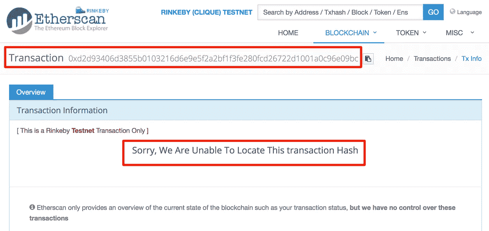

# 超分类帐、以太坊和法定随机数管理

> 原文：<https://medium.com/coinmonks/hyperledger-and-ethereum-nonce-management-890029d481b?source=collection_archive---------0----------------------->

“Matrix movie still” by [Markus Spiske](https://unsplash.com/@markusspiske?utm_source=medium&utm_medium=referral) on [Unsplash](https://unsplash.com?utm_source=medium&utm_medium=referral)

# 什么是现时？

nonce 是一个任意的， ***唯一的*** 数，用来防止重放攻击。包括随机数在内的整个交易都用发送者的私钥进行了加密签名，从而向挖掘者证明交易的发送者拥有私钥。

# 为什么随机数需要是唯一的？

随机数的唯一性可以防止重放攻击。一个简单的重放攻击的例子是，如果你发送 3 ETH 到 ACME 公司购买火箭动力的滚轴溜冰鞋。然后，ACME Corp 的销售人员通过[中间人攻击](https://en.wikipedia.org/wiki/Man-in-the-middle_attack)拦截你的交易，并将相同的第三次 ETH 交易广播 5 次，试图从你那里获得 500%的 ETH。nonce 将**防止**这种情况，因为 5 个事务中只有 1 个将被挖掘。

# 矿工如何知道 nonce 是否是唯一的？

这是底层架构变得真正有趣的地方。如果矿工需要跟踪每个账户地址曾经使用过的每个随机数，那么这将占用大量的存储空间。另外，**超级分类帐结构**和**超级分类帐锯齿**实际上确实存储了**随机**随机数，**但是**它们通过将使用的散列与当前有效证书相关联来缓解存储问题。这样，他们可以在颁发新证书时清除所有随机数。参见下面 [**Hyperledger 锯齿 Python SDK**](https://sawtooth.hyperledger.org/docs/core/releases/1.0.1/app_developers_guide/python_sdk.html) 中的随机 nonce 示例代码。

以太坊和 Quorum 不需要存储随机数，因为它们不是随机的。随机数是来自发送地址的事务计数。这完全消除了存储随机数**的需要，并且**消除了 [**双花费**](https://en.wikipedia.org/wiki/Double-spending) 的任何可能性。这些优势带来了一系列新的问题，因为随机数必须是连续的，不能跳过数字。参见下面的[**web 3 Python SDK**](https://web3py.readthedocs.io/en/stable/index.html)示例代码。

# 以太坊的现时问题

当我们试图在短时间内从同一个地址发送几笔交易时，问题就出现了。在[**web 3 Python SDK**](https://web3py.readthedocs.io/en/stable/index.html)**中，我们调用 **getTransactionCount** 方法来获取下一个 nonce，但该方法是通过 IPC、Websockets 或 HTTP 从我们的提供者获取计数(我使用 [Infura](https://infura.io/) 作为 HTTP 的提供者)。提供者计数更新得不是很快。即使当我们用 block _ identifier = '**pending**'调用 **getTransactionCount** 时，我们仍然得到默认的 block_identifier=' **最新的**计数。block_identifier 设置为“待定”的调用仍然返回“最新”计数，这是一个[已知问题](https://github.com/ethereum/go-ethereum/issues/2880)。当我尝试使用来自 **getTransactionCount** 方法的 nonce 发送多个事务时，问题如下所示。它们都使用 nonce **121** ，所以我们的脚本引发了一个错误，只有第一个事务通过。**

****

# **nonce 事务管理器解决方案**

**我使用 [**Redis**](https://redis.io/) 重写了相同的 python 脚本，以存储当前 nonce 并通过我的 python 脚本增加 nonce，不再依赖于我们的提供者的 **getTransactionCount** 方法。您可以看到，它在不到 5 秒的时间内发送了 10 个事务，没有任何问题。注意**getTransactionCount**nonce**保持在 151，但是我们没有问题，因为我们的 Redis nonce 正确地递增。****

********

# ****托管随机数问题****

****如果我们由于一个错误而跳过了一个随机数，那么之后的所有事务都将被排队，但不会被处理*(有时会被丢弃)*，直到被跳过的随机数被使用。我在 Redis CLI 上将 nonce 计数增加 1，然后对 5 个事务运行相同的 python 脚本。****

********

****您可以在下面看到，以“96e09bc”结尾的第一个事务在 Etherscan 上甚至没有显示为“pending”。****

********

****现在，我们运行 nonce 161，它得到处理，但之前的 5 个事务已被丢弃，因此我们将再次运行最后 5 个事务。我以前也见过排队的事务自己处理，就在跳过的 nonce 被处理之后。****

************************

# ****重复交易记录？****

****我重试了 nonce 162，以表明您通常会通过提供者从 SDK 获得一个“nonce 太低”的错误，但即使您不这样做，也只有 1 个具有该 nonce 的事务会得到处理。如果您在多个事务中使用相同的 nonce，就没有必要担心重复。****

********

# ****结论****

****无论你是在**企业**环境中使用 Hyperledger、Ethereum 还是 Quorum，随机数管理系统都是必须的。我在这篇文章中的简单 Redis 演示说明了基本概念，但没有涵盖使用单个地址的多个客户端，在这种情况下，您可能希望使用 **Redis 分布式锁定**，如 [**Redlock**](https://redis.io/topics/distlock) 。****

****虽然我不是区块链项目的顾问，但我一直在研究一个**企业事务管理系统**，该系统将包括事务跟踪、分析、警报，甚至自动**随机数**重置和重试。****

****你觉得这篇文章怎么样？如果你喜欢它或者学到了什么，请留下你的掌声！ [DarkBlock.io](https://darkblock.io/) 是一家区块链企业发展公司，我们一直在接纳新客户。通过 [sheffield@darkblock.io](mailto:sheffield@darkblock.io) 联系我或访问我们的网站 [DarkBlock.io](https://darkblock.io/) ！****

> ****[直接在您的收件箱中获得最佳软件交易](https://coincodecap.com/?utm_source=coinmonks)****

********