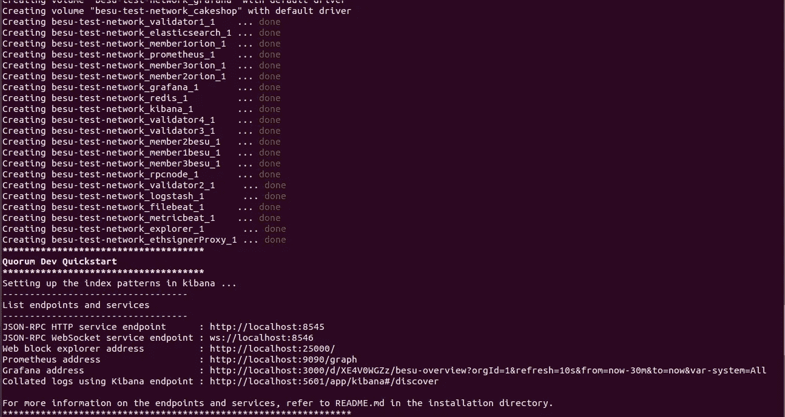

# Hyperledger Besu —入门:第 2 部分

> 原文：<https://medium.com/coinmonks/hyperledger-besu-getting-started-part-2-a5388f14462b?source=collection_archive---------2----------------------->

这是 Hyperledger Besu 实现的第 2 部分。在 [**第 1 部分**](https://adityaajoshi.medium.com/getting-started-with-hyperledger-besu-6657598ebcfe) 我们讨论了各种特性，共识机制可用。


# **概述**

在本教程中，我们将学习如何设置您的 Hyperledger Besu 网络，并在 Besu 网络上部署您的智能合同。这篇文章是为那些深入研究区块链并想开始使用 Hyperledger Besu 的开发人员准备的。

> [**在 Hyperledger 上查看我的课程 Besu**](http://bit.ly/hyperledger-besu-masterclass)

Hyperledger Besu 是一个以太坊客户端，旨在为公共和私人许可的网络用例提供企业友好的服务。它还可以在 Rinkeby、Ropsten 和 gorli 等测试网络上运行。Hyperledger Besu 包括多个共识算法，包括 PoW 和 PoA (IBFT、IBFT 2.0、以太哈希和 Clique)。它的综合许可方案是专门为在财团环境中使用而设计的。

任何企业级框架都需要专业知识才能工作。如果你是一个新手，你会发现自己很难解决一些小问题。这就是为什么尽早开始并以自己的方式练习是很重要的。

我们将设置以下组件

1.  3 个 Besu 节点
2.  3 个 Orion 节点(用于私人交易)
3.  4 个验证器节点
4.  文件殴打+麋鹿(弹性，Logstash，和基巴纳)
5.  交易签名人
6.  格拉夫纳和普罗米修斯
7.  块浏览器

# 方法

Besu 执行以下共识协议:

*   工作证明
*   [小团体](https://besu.hyperledger.org/en/stable/HowTo/Configure/Consensus-Protocols/Clique/)(权威证明)
*   [IBFT 2.0](https://besu.hyperledger.org/en/stable/HowTo/Configure/Consensus-Protocols/IBFT/) (权威证明)
*   [法定 IBFT 1.0](https://besu.hyperledger.org/en/stable/HowTo/Configure/Consensus-Protocols/QuorumIBFT/) (授权证明)。

在这次演示中，我们将使用 IBFT 2.0。genesis 文件中的`config`属性指定了链的一致协议。您可以在[库](https://github.com/adityajoshi12/hyperledger-besu/)的`config/besu`目录中找到 genesis 文件。截至目前，besu 对 Clique 和 IBFT 2.0 都有很好的支持，可以根据自己的需求随意选择共识机制。要改变共识，只需在`.env`文件中更新它。

# 先决条件

1.  码头工人
2.  docker-撰写
3.  元遮罩(chrome 扩展)

# 履行

我们将实施由三个节点组成的 besu 网络，并将部署用 solidity 编写的智能合同。我们将进行交易并查询智能合同。除此之外，我们还将有 Block explorer、Grafana dashboard 来查看网络指标。我们将部署一个智能联系人，并在浏览器上访问它。

1.  克隆存储库

```
git clone [https://github.com/adityajoshi12/hyperledger-besu](https://github.com/adityajoshi12/hyperledger-besu).git
```

2.要启动网络，你所要做的就是运行这个脚本文件。

```
./run.sh
```



一旦该过程完成，您将会看到与此类似的内容。

3.部署智能合同并运行 dapp

```
cd dapps/pet-shop
./run_dapp.sh
```

该脚本将克隆宠物店示例存储库并安装 truffle，然后它将在我们的 besu 网络上部署联系人，如果一切顺利，您将得到如下输出


4.部署智能合同后，我们可以在`[http://localhost:3001/](http://localhost:3001/)`访问应用程序。它会要求您将 metamask 与应用程序连接起来。请在元掩码中导入私钥`0xc87509a1c067bbde78beb793e6fa76530b6382a4c0241e5e4a9ec0a0f44dc0d3`以访问应用程序。

当您将 metamask 与 besu 网络连接时，使用`[http://localhost:8545](http://localhost:8545)`作为 RPC 端点，使用`2018`作为 chainId。


当你点击“采用”按钮时，它将进行一次交易，你的元掩码将弹出以确认交易。


您可以在`http://localhost:3000`访问 grafana 仪表板，查看网络指标。并且块浏览器处于`[http://localhost:25000](http://localhost:3000)`

本文到此为止。您可以在这里找到[库的链接](https://github.com/adityajoshi12/hyperledger-besu)。在接下来的第 3 部分中，我们将使用 NodeJs SDK 部署、处理和查询契约。此外，我们将实现 Hyperledger Besu 的隐私功能。我们将在以后的文章中探讨 GraphQL 对 besu 的支持。

如果你觉得这篇文章很有帮助，请点击拍手按钮，并跟随我阅读更多这样的信息丰富的文章。

你可以在 [Linkedin](https://linkedin.com/in/adityajoshi12) 上找到我或者在 [GitHub](https://github.com/adityajoshi12) 上跟踪我？如果这对你来说太社交化了，如果你想和我讨论技术，就给 adityaprakashjoshi1@gmail.com 发封邮件。

