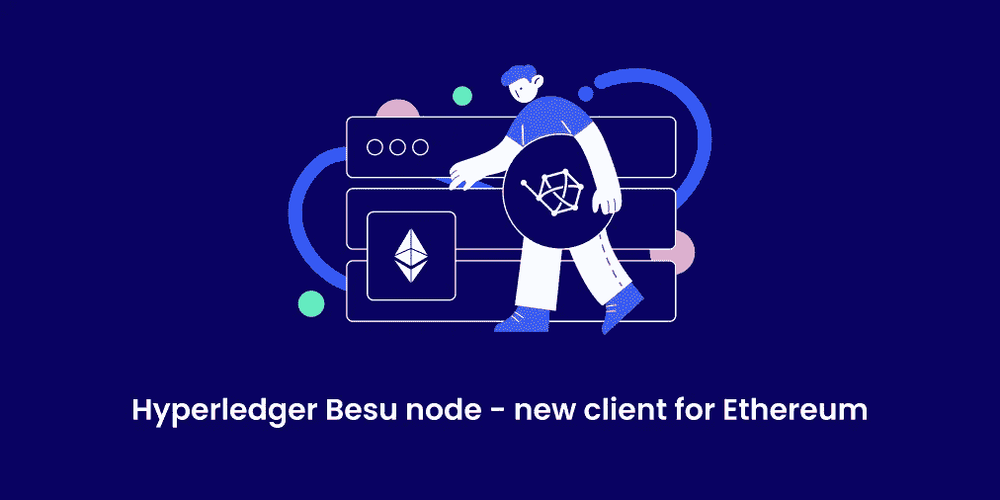

# Hyperledger Besu 节点—以太坊的新客户端

> 原文：<https://medium.com/coinmonks/hyperledger-besu-node-new-client-for-ethereum-6b2904ebd140?source=collection_archive---------2----------------------->

节点构成了区块链网络的主干。分布式分类帐的稳健性和工作能力取决于多个独立管理和地理上部署的完整节点的存在。验证器验证事务并帮助扩展网络上的块。任何使用以太坊网络的服务从 Dapps 到矿池甚至交换都依赖于节点的基础设施。

# 什么是 Hyperledger Besu？

2019 年，Hyperledger Besu 成为第一个与公共网络兼容的区块链客户端，是 Hyperledger 基金会的一个项目。它被定位为开放开发和部署的平台。OpenEthereum(以前的 Parity-Ethereum)和 Multi-Geth 为所有 ETC 节点运营商提供了切换到新客户端的机会。

Hyperledger Besu 是在 Apache 2.0 许可下开发的开源以太坊客户端，用 Java 编写，以前称为 Pantheon。该节点可以在公共 ETH 网络、专用允许网络以及 Rinkeby、Ropsten 和 gli 上运行。Node 基于几种共识算法工作，包括[工作证明(PoW)](https://getblock.io/blog/proof-of-work-vs-proof-of-stake-whats-the-difference) 。基于信誉的 PoA 和 IBFT 验证器。

# 什么是以太坊客户端？

以太坊客户端是实现[以太坊协议](https://getblock.io/nodes/eth)的软件。Hyperledger Besu 是他的几个客户之一。
客户包括:

*   用于在以太坊区块链上处理事务的运行时环境；
*   存储与交易执行相关的数据；
*   对等(P2P)网络，用于与网络上的其他以太坊节点通信以进行状态同步；
*   面向应用开发者的 API(区块链互动)。

# 基本特征

Besu 可用于开发需要在专用网络上进行安全和高性能事务处理的企业应用程序。 [Besu](https://getblock.io/nodes/besu) 基于模块化架构，相对容易扩展以添加新功能。

例如，签名钱包是一个独立的组件，它通过 HTTP 与主组件进行交互。如果有必要，可以根据 HTTP API 的设计用另一个实现来替换它。钱包组件可以扩展附加功能，甚至不需要接触部分代码。

Hyperledger Besu API 支持以太坊特有的功能，例如:

*   [智能合约](https://getblock.io/blog/what-are-the-smart-contracts-and-how-they-work)的开发；
*   以太坊采矿；
*   开发分散应用程序(DApp)。

# Hyperledger 基本功能

以太坊虚拟机(EVM)最大限度地兼容图灵虚拟机，允许 Besu 通过以太坊区块链上的交易部署和执行智能合约。

Besu 节点实现了几个共识算法(PoA 和 PoW ),涉及块的验证、事务和新块的形成。

Hyperledger Besu 使用 RocksDB 键值数据库在本地持久化链数据。

**监控**。Besu 使用 Prometheus 方法或 debug_metrics JSON-RPC API 帮助您监控节点性能。跟踪工具:EthStats 网络监视器和块资源管理器。

**保密**。Besu Private Transaction Manager 不允许其他方访问交易内容、发送方和参与方列表。

Besu 是一个有权限的网络。仅允许选定的节点和帐户参与，批准网络上的帐户和/或节点。以太坊主网上的 [Besu](https://getblock.io/nodes/besu) 客户端与其他客户端上运行的其他节点兼容。对于二等兵区块链来说，只有贝苏会在公司内部工作。

# 运行 Hyperledger Besu 节点的好处

## 为参与者运行节点的主要好处是:

*   在本地机器上分析区块链数据，不需要远程调用。据密码专家称，Besu 比它的同类产品更稳定。Hyperledger 产品通常会得到公司和开发人员的积极评价，而其他公司开发的大多数类似客户端却并非如此。
*   从您信任的节点发送事务。
*   如果您正在开发您的分散式应用程序或服务，拥有您的节点是有益的。

## 对于生态系统:

*   以太坊网络的进一步去中心化使得每个人都能够访问更多的区块链历史。
*   更少的时间延迟。

# 硬件和软件要求

Besu 有两种类型—完整节点和归档节点。完整节点保持区块链的当前状态，不能为网络提供所有数据请求。在他们的帮助下，您可以检查当前余额，签署和发送交易，并查看当前的 DApp 数据。

存档节点存储关于每个帐户的中间状态的信息。该节点具有与完整节点相同的功能，并且可以访问过去期间的数据。

要运行完整的 Hyperledger Besu 节点，您需要启用快速同步(— sync-mode = FAST)，默认情况下它会启用修剪。
技术设备:至少需要 4 GB 的 RAM 和 750 GB 的硬盘空间。操作系统硬盘必须是 SSD 或 NVMe，以保持链同步所需的速度。

对于 MainNet 上的 Besu，归档节点需要更多的磁盘空间，大约 3 TB。要运行归档节点，需要完全同步(— sync-mode = FULL)，默认情况下禁用修剪。

在软件要求方面，Hyperledger Besu 运行在 Linux、macOS 和 Windows 上。

在几个主机上运行完整的 Besu 节点是可能的。对于多个参与者来说，最常见的选择是在本地设备—服务器上运行。

云服务完全兼容 Besu: AWS、Azure 和其他服务器解决方案提供商。在云服务中工作的优势之一是易于设置，以及远程启动和停止服务的能力。

*最初发布于 2020 年 12 月 18 日*[*https://get block . io*](https://getblock.io/blog/hyperledger-besu-node-new-client-for-ethereum)*。*