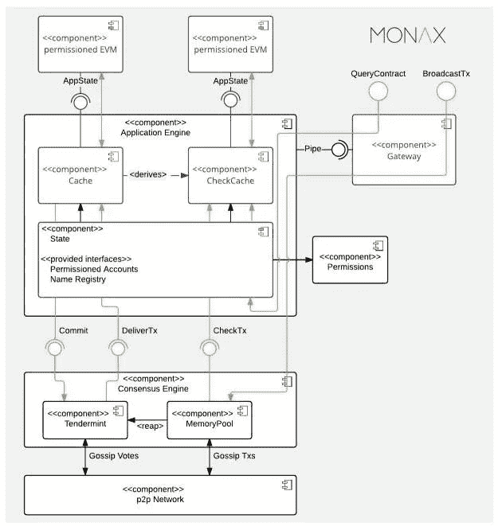

# Hyperledger Burrow v0.19.0

> 原文：<https://medium.com/coinmonks/hyperledger-burrow-v0-19-0-633a143a5047?source=collection_archive---------7----------------------->

[由 Monax 和 Intel 联合提出的 Hyperledger Burrow](https://www.hyperledger.org/projects/hyperledger-burrow) 于 2017 年 4 月被技术指导委员会接受进入 Hyperledger 孵化器。Burrow，自 2014 年以来被称为 ErisDB，是由 Monax 创建的，正如 Burrow 继续使用的 [Tendermint](https://github.com/tendermint/tendermint) 共识引擎一样。ErisDB 在成为 Hyperledger 项目的一部分时更改了名称和许可证，成为唯一一个获得 Apache 许可的以太坊虚拟机实现。

陋居的目的是在企业网络中实现智能契约(通常用 [Solidity](https://github.com/ethereum/solidity) 编写)。陋居是一个节点(客户端)，它在与以太坊虚拟机(EVM)兼容的授权区块链上执行智能合约。

EVM 可以被视为一台大型分散式计算机，包含数百万个被称为“帐户”的对象，这些对象具有维护内部数据库、执行代码和相互通信的能力。EVM 运行一个图灵完全软件。

Burrow 作为一个节点由三个主要组件构建而成:共识引擎、许可以太坊虚拟机和 rpc 网关(远程过程调用)。

Burrow Architecture. Source: [Hyperledger](https://www.hyperledger.org/wp-content/uploads/2017/06/HIP_Burrowv2.pdf)

更具体地说，钻地包括:

*   共识引擎(Consensus Engine):使用拜占庭容错 Tendermint 协议对交易进行排序和最终确定。Tendermint 协议通过一组已知的验证器提供高事务性能，并防止区块链分叉。
*   **应用区块链接口** ( [ABCI](https://github.com/tendermint/abci) ):该接口使事务能够以任何编程语言处理。ABCI 允许共识引擎独立于智能合同的实现。
*   **智能合同应用**:方便复杂业务逻辑的集成。按照共识引擎最终确定事务的顺序，对事务进行验证并将其应用于应用程序的状态。在给定帐户上调用智能合约代码的事务将触发该帐户的代码在被许可的虚拟机中的执行。
*   **许可的以太坊虚拟机**:该虚拟机是根据以太坊的操作代码规范构建的，并确保授予适当的权限。权限是通过安全的本机函数应用的，并且是所有智能协定代码的基础。
*   **应用程序二进制接口** (ABI):交易需要以区块链节点可以处理的二进制格式制定。当前的工具提供编译、实现和链接 solidity 智能合约的功能，并制定交易以在链上调用智能合约。
*   **API 网关**:网关为系统集成和用户界面提供接口。Burrow 支持 REST 和 JSON-RPC 终端，客户可以通过广播事务或查询应用程序的当前状态，与区块链网络和应用程序状态进行交互。Websocket 通信(双向通信通道)允许您订阅事件，这尤其有价值，因为共识引擎和智能合约应用程序可以在大约一秒的一个时间段内交付明确的最终交易结果。

更多关于超账钻地的信息可以在 https://github.com/hyperledger/burrow[的](https://github.com/hyperledger/burrow)找到

*一台完整的图灵机就是一台可以模拟任何其他机器的机器。例如，如果你有两台机器，一台是图灵完全的，另一台不是，你需要它们执行你以前没有经验的新任务，你将不得不以两种不同的方式去做。对于不完整的图灵机，您将需要加载和安装一组新的代码，以赋予机器执行所需任务的能力。对于完整的图灵机，你只需要提供机器的指令(例如“实现目标 x，不违反规则 a、b 或 c”)，机器就会让你参考它以前存在的代码库，并会适当地安排自己执行必要的任务。*

*在分布式计算中，远程过程调用(RPC)是指计算机程序使一个过程(子例程)在不同的地址空间(通常在共享网络上的另一台计算机上)执行，该过程被编码为如同普通(本地)过程调用一样，而无需程序员显式编码远程交互的细节。(* [*维基百科*](https://en.wikipedia.org/wiki/Remote_procedure_call) *)。*

*在计算机软件中，应用二进制接口(ABI)是两个二进制程序模块之间的接口；通常，这些模块中的一个是库或操作系统工具，另一个是用户正在运行的程序。(***)。**